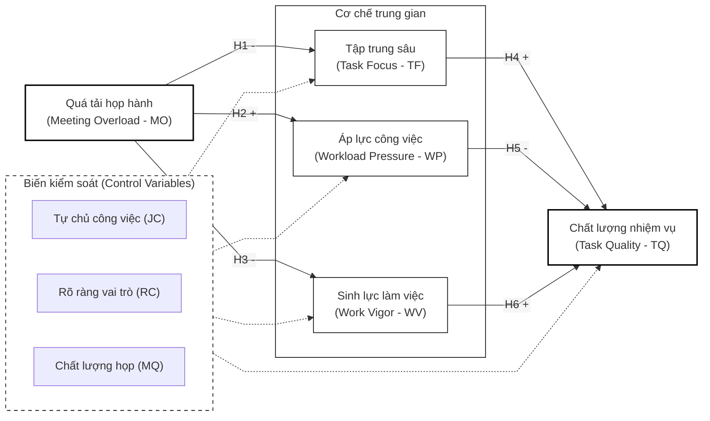

# 3. MỤC TIÊU VÀ NỘI DUNG NGHIÊN CỨU

## 3.1. Mục tiêu nghiên cứu
1.  **Hệ thống hóa cơ sở lý luận** về quá tải họp hành (meeting overload) và cơ chế chuyển hóa nguồn lực nhận thức, tâm lý, thể chất của người lao động dưới lăng kính Lý thuyết COR.
2.  **Xây dựng và kiểm định mô hình cấu trúc** đánh giá tác động của quá tải họp hành đến Chất lượng hoàn thành nhiệm vụ chuyên môn của người lao động văn phòng.
3.  **Làm rõ vai trò trung gian** của Khả năng tập trung sâu (Task Focus), Áp lực công việc cảm nhận (Perceived Workload Pressure), và Sinh lực làm việc (Work Vigor).
4.  **Đề xuất các hàm ý quản trị thực tiễn** giúp các tổ chức tái cấu trúc hệ thống họp hành hiệu quả, bảo vệ nguồn lực nhân sự và tối ưu hóa hiệu suất cá nhân.

## 3.2. Mô hình nghiên cứu và Hệ thống giả thuyết

### 3.2.1. Mô hình nghiên cứu đề xuất (S-O-R Framework)
Mô hình nghiên cứu được xây dựng dựa trên khung thuyết Kích thích - Cơ thể - Phản hồi (Stimulus-Organism-Response - S-O-R) tích hợp sâu với Lý thuyết Bảo tồn Nguồn lực (COR):
*   **Kích thích (Stimulus - S):** Quá tải họp hành (Meeting Overload - MO) đóng vai trò tác nhân kích thích tiêu cực từ môi trường tổ chức.
*   **Cơ thể (Organism - O):** Đại diện cho các trạng thái biến đổi nội tại về nguồn lực của người lao động bao gồm: Khả năng tập trung sâu (Task Focus - TF - Nguồn lực nhận thức), Áp lực công việc cảm nhận (Workload Pressure - WP - Nguồn lực tâm lý), và Sinh lực làm việc (Work Vigor - WV - Nguồn lực thể chất/động lực).
*   **Phản hồi (Response - R):** Chất lượng hoàn thành nhiệm vụ chuyên môn (Task Quality - TQ) là kết quả hành vi đầu ra.
*   **Biến kiểm soát (Control Variables):** Quyền tự chủ công việc (Job Control - JC), Sự rõ ràng về vai trò (Role Clarity - RC), và Chất lượng cuộc họp (Meeting Quality - MQ).

*Hình 1. Mô hình lý thuyết đề xuất tích hợp các biến kiểm soát.*

### 3.2.2. Hệ thống giả thuyết nghiên cứu (Research Hypotheses)

**Giả thuyết H1 (-):** Tình trạng quá tải họp hành (MO) tác động tiêu cực đến Khả năng tập trung sâu (TF) của người lao động.

**Giả thuyết H2 (+):** Tình trạng quá tải họp hành (MO) tác động tích cực đến Áp lực công việc cảm nhận (WP) của người lao động.

**Giả thuyết H3 (-):** Tình trạng quá tải họp hành (MO) tác động tiêu cực đến Sinh lực làm việc (WV) của người lao động.

**Giả thuyết H4 (+):** Khả năng tập trung sâu (TF) tác động tích cực đến Chất lượng hoàn thành nhiệm vụ (TQ) của người lao động.

**Giả thuyết H5 (-):** Áp lực công việc cảm nhận (WP) tác động tiêu cực đến Chất lượng hoàn thành nhiệm vụ (TQ) của người lao động.

**Giả thuyết H6 (+):** Sinh lực làm việc (WV) tác động tích cực đến Chất lượng hoàn thành nhiệm vụ (TQ) của người lao động.

**Giả thuyết H7 (Trung gian):** Các biến số trạng thái nguồn lực (TF, WP, WV) đóng vai trò trung gian truyền dẫn tác động tiêu cực từ Quá tải họp hành (MO) đến Chất lượng hoàn thành nhiệm vụ (TQ).
*   *Giả thuyết H7a:* TF đóng vai trò trung gian trong mối quan hệ giữa MO và TQ.
*   *Giả thuyết H7b:* WP đóng vai trò trung gian trong mối quan hệ giữa MO và TQ.
*   *Giả thuyết H7c:* WV đóng vai trò trung gian trong mối quan hệ giữa MO và TQ.

---

## 3.3. Phương pháp nghiên cứu (Research Methodology)

Luận án áp dụng thiết kế nghiên cứu hỗn hợp (Mixed-methods Design) kết hợp định tính và định lượng, được chia thành các giai đoạn cụ thể nhằm đảm bảo tính chặt chẽ tối đa về phương pháp luận:

### 3.3.1. Giai đoạn Nghiên cứu Định tính & Quy trình Việt hóa Thang đo (Scale Adaptation)
Nhằm Việt hóa và chuẩn hóa các thang đo quốc tế phù hợp với văn hóa họp hành tại các doanh nghiệp Việt Nam, nghiên cứu áp dụng quy trình dịch thuật và đánh giá chuyên gia nghiêm ngặt:
1.  **Quy trình Dịch thuật song song (Forward-Backward Translation):** Bảng hỏi gốc tiếng Anh được dịch độc lập sang tiếng Việt bởi 2 dịch giả am hiểu chuyên môn (Forward Translation). Bản dịch tiếng Việt sau đó được 2 dịch giả độc lập khác dịch ngược lại tiếng Anh (Backward Translation) để đối chiếu, đảm bảo không có sự sai lệch về nghĩa học thuật.
2.  **Đánh giá của Hội đồng Chuyên gia (Expert Panel):** Một hội đồng gồm 5 chuyên gia (3 tiến sĩ Quản trị nguồn nhân lực, 2 chuyên gia tư vấn doanh nghiệp) tiến hành thẩm định nội dung bảng hỏi. Các chuyên gia đánh giá từng biến quan sát theo thang đo 4 điểm về mức độ liên quan. Chỉ số Hiệu lực nội dung (Content Validity Index - CVI) được tính toán; các biến quan sát có chỉ số CVI $\ge 0.80$ mới được giữ lại.
3.  **Khảo sát Pilot (Pilot Study):** Tiến hành khảo sát thử nghiệm trên mẫu quy mô nhỏ ($n = 80$ đến $100$ nhân viên văn phòng). Dữ liệu pilot được sử dụng để đánh giá độ tin cậy sơ bộ (Cronbach's Alpha) và thực hiện phân tích nhân tố khám phá (EFA) nhằm kiểm tra cấu trúc thang đo trước khi triển khai thu thập dữ liệu diện rộng.

### 3.3.2. Giai đoạn Nghiên cứu Định lượng & Tính toán Cỡ mẫu
*   **Thiết kế khảo sát:** Khảo sát phi xác suất thuận tiện kết hợp phân lớp (quota sampling) theo loại hình doanh nghiệp và chức vụ tại Việt Nam.
*   **Tính toán Công suất cỡ mẫu (G*Power):** NCS đã thực hiện tính toán công suất mẫu bằng phần mềm G*Power 3.1.9.7. Thiết lập cấu hình kiểm định: kiểm định F-tests (Multiple Linear Regression), với kích thước hiệu ứng trung bình-nhỏ ($f^2 = 0.02$), mức ý nghĩa $\alpha = 0.05$, công suất mong muốn (Power) $= 0.85$. Với tối đa 6 biến dự báo tác động đồng thời vào biến kết quả (gồm 3 biến chính và 3 biến kiểm soát), phần mềm chỉ ra cỡ mẫu tối thiểu bắt buộc là **$N = 355$**. Do đó, mục tiêu thu thập **$N = 450$ đến $500$ mẫu** khảo sát hợp lệ của luận án là hoàn toàn vượt trội, đạt công suất thống kê rất cao (Power $> 0.90$).

### 3.3.3. Biện pháp kiểm soát và xử lý Sai lệch do cùng Phương pháp (Common Method Bias - CMB)
Do toàn bộ dữ liệu được thu thập bằng phương pháp tự báo cáo (self-reported) của người lao động tại một thời điểm, nguy cơ xuất hiện CMB là rất lớn. Luận án thiết lập các chốt chặn procedural và statistical nghiêm ngặt:
*   **Biện pháp quy trình (Procedural Remedies):** 
    1.  *Thiết kế bảng hỏi phân tách thời gian (Time-lagged design):* Khảo sát được thực hiện qua 2 giai đoạn cách nhau 2 tuần. Đợt 1 thu thập dữ liệu về biến độc lập (MO) và biến kiểm soát (JC, RC, MQ). Đợt 2 thu thập các biến trung gian (TF, WP, WV) và biến phụ thuộc (TQ).
    2.  *Trộn câu hỏi và ẩn danh:* Thứ tự các biến quan sát được xáo trộn ngẫu nhiên. Phần hướng dẫn cam kết bảo mật tuyệt đối thông tin cá nhân và nhấn mạnh không có câu trả lời “đúng” hay “sai” nhằm giảm thiểu bias mong muốn xã hội (social desirability bias).
*   **Biện pháp thống kê (Statistical Remedies):**
    1.  *Kiểm định Harman's Single-Factor:* Kiểm tra xem một nhân tố duy nhất có giải thích phần lớn phương sai hay không (ngưỡng an toàn là $< 50\%$).
    2.  *Kiểm định Đa cộng tuyến toàn diện (Full Collinearity VIF):* Theo Kock (2015), tất cả các hệ số VIF của mô hình cấu trúc chạy qua phân tích đa cộng tuyến toàn diện phải đạt giá trị $< 3.3$ để chứng minh mô hình không bị ảnh hưởng bởi CMB.
    3.  *Biến đánh dấu (Marker Variable):* Đưa thêm một biến quan sát hoàn toàn không liên quan đến mô hình lý thuyết (ví dụ: thái độ đối với thời tiết) để kiểm tra mức độ nhiễu hệ thống.

---

## 3.4. Thao tác hóa biến số và Thang đo (Measurement Scales)

Các khái niệm nghiên cứu được đo lường bằng các thang đo Likert 5 điểm (1: Hoàn toàn phản đối, 5: Hoàn toàn đồng ý) được bản địa hóa và chuẩn hóa học thuật:

1.  **Quá tải họp hành (MO):** Đo lường bằng 5 biến quan sát trích từ thang đo của Rogelberg et al. (2010) (ví dụ: *“Số lượng cuộc họp tôi phải tham gia cản trở việc hoàn thành các nhiệm vụ cốt lõi của tôi”*).
2.  **Tập trung sâu (Task Focus - TF):** Để đo lường khả năng duy trì tập trung cao độ, tránh sự rời rạc nhận thức do họp hành, nghiên cứu sử dụng 4 biến quan sát thích ứng từ cấu phần "Hấp thụ" (Absorption) thuộc thang đo Trạng thái Flow tại công việc của Bakker (2008) (ví dụ: *“Khi làm việc chuyên môn độc lập, tôi hoàn toàn đắm chìm và duy trì sự chú ý liên tục không bị ngắt quãng”*).
3.  **Áp lực công việc cảm nhận (WP):** Đo lường bằng 4 biến quan sát kế thừa từ thang đo áp lực công việc của Karasek (1979) (ví dụ: *“Tôi liên tục phải làm việc dưới áp lực thời gian cao do bị phân tán bởi các hoạt động phối hợp”*).
4.  **Sinh lực làm việc (Work Vigor - WV):** Để phản ánh chính xác nguồn lực thể chất và động lực mà không bị lẫn lộn với khái niệm Work Engagement tổng thể, nghiên cứu sử dụng 5 biến quan sát thích ứng từ Thang đo Sinh lực Shirom-Melamed (SMVM) (ví dụ: *“Tôi cảm thấy dồi dào năng lượng thể chất và nhận thức nhạy bén trong giờ làm việc”*).
5.  **Chất lượng hoàn thành nhiệm vụ (TQ):** Đo lường bằng 4 biến quan sát đánh giá chất lượng đầu ra công việc chuyên môn dựa trên thang đo hiệu suất thực hiện nhiệm vụ (Task Performance) của Williams & Anderson (1991).
6.  **Biến kiểm soát:** *Job Control* (3 items, Karasek, 1979); *Role Clarity* (3 items, Rizzo et al., 1970); *Meeting Quality* (4 items, Rogelberg et al., 2006).

---

## 3.5. Quy trình Phân tích Số liệu & Phân tích Độ nhạy (Sensitivity Analysis)

Dữ liệu sẽ được làm sạch và phân tích bằng công cụ **PLS-SEM** (Partial Least Squares Structural Equation Modeling) trên phần mềm SmartPLS 4/seminr. Quy trình kiểm định thống kê tuân thủ nghiêm ngặt hai giai đoạn của Hair et al. (2022):

### 3.5.1. Đánh giá Mô hình Đo lường (Measurement Model Evaluation)
*   **Độ tin cậy nhất quán nội tại:** Kiểm chứng qua hệ số Cronbach's Alpha và Composite Reliability (CR) $\ge 0.70$.
*   **Giá trị hội tụ:** Hệ số tải nhân tố (Outer loadings) $\ge 0.70$ và Phương sai trung bình trích xuất (AVE) $\ge 0.50$.
*   **Giá trị phân biệt:** Kiểm định qua chỉ số tỷ lệ dị biệt - đơn lượng (Heterotrait-Monotrait Ratio - HTMT < 0.85) và so sánh căn bậc hai AVE với hệ số tương quan (Tiêu chuẩn Fornell-Larcker).

### 3.5.2. Đánh giá Mô hình Cấu trúc (Structural Model Evaluation) & Loại trừ Tương quan ngược
*   **Đa cộng tuyến:** Hệ số phóng đại phương sai (VIF < 3.3).
*   **Kiểm định Giả thuyết:** Sử dụng kỹ thuật Bootstrapping 5.000 mẫu lặp để xác định các hệ số đường dẫn ($\beta$), $t$-value và mức ý nghĩa $p$-value.
*   **Phân tích Độ nhạy & Mô hình thay thế (Sensitivity Analysis):**
    1.  *Mô hình trung gian song song vs. nối tiếp:* Mô hình đề xuất chính thức giả định 3 biến trung gian tác động song song (Parallel Mediation). Tuy nhiên, để thực hiện phân tích độ nhạy, NCS sẽ lập trình chạy kiểm định một mô hình thay thế dạng nối tiếp (Serial Mediation Chain): **Meeting Overload $\rightarrow$ Task Focus $\rightarrow$ Work Vigor $\rightarrow$ Task Quality** nhằm đánh giá liệu có tồn tại cơ chế suy giảm tài nguyên nối tiếp hay không.
    2.  *Giải quyết Tương quan ngược:* Để kiểm chứng giả định của người phản biện về việc nhân sự yếu kém (TQ thấp) bị gọi đi họp nhiều (MO cao), NCS sẽ chạy mô hình cấu trúc đảo ngược ($TQ \rightarrow MO$). Sử dụng chỉ số $f^2$ và so sánh các tiêu chí thông tin AIC, BIC để chứng minh khoa học rằng mô hình đề xuất ($MO \rightarrow TQ$) có độ giải thích và tính hợp lý lý thuyết vượt trội hơn hẳn so với mô hình đảo ngược.

---

## 3.6. Đạo đức nghiên cứu và Bảo mật dữ liệu (Research Ethics)

Nhằm đảm bảo nghiên cứu tuân thủ đầy đủ các chuẩn mực đạo đức khoa học quốc tế, các cam kết sau được thực hiện nghiêm chỉnh:
1.  **Phê duyệt đạo đức:** Đề cương nghiên cứu sẽ được nộp xin phê duyệt từ Hội đồng Đạo đức Nghiên cứu (IRB) của trường đại học trước khi tiến hành khảo sát.
2.  **Sự đồng ý tham gia (Informed Consent):** Bảng hỏi khảo sát bắt đầu bằng một Phiếu đồng ý tham gia nghiên cứu. Người tham gia được giải thích rõ về mục đích nghiên cứu, tính tự nguyện, và có quyền rút lui khỏi khảo sát bất kỳ lúc nào mà không phải chịu bất kỳ hậu quả nào.
3.  **Ẩn danh và Mã hóa dữ liệu:** Toàn bộ dữ liệu thu thập không yêu cầu điền thông tin định danh cá nhân nhạy cảm (như Tên, Số điện thoại, Email cá nhân). Dữ liệu sau khi tải về sẽ được gán mã định danh ngẫu nhiên (e.g., Respondent_001).
4.  **Lưu trữ an toàn:** File dữ liệu sạch được mã hóa bằng mật khẩu mạnh và chỉ được lưu trữ trên bộ nhớ đám mây nội bộ có phân quyền của NCS. Dữ liệu chỉ phục vụ mục đích nghiên cứu học thuật của luận án và sẽ được tiêu hủy an toàn sau 5 năm kể từ ngày công bố luận án.
