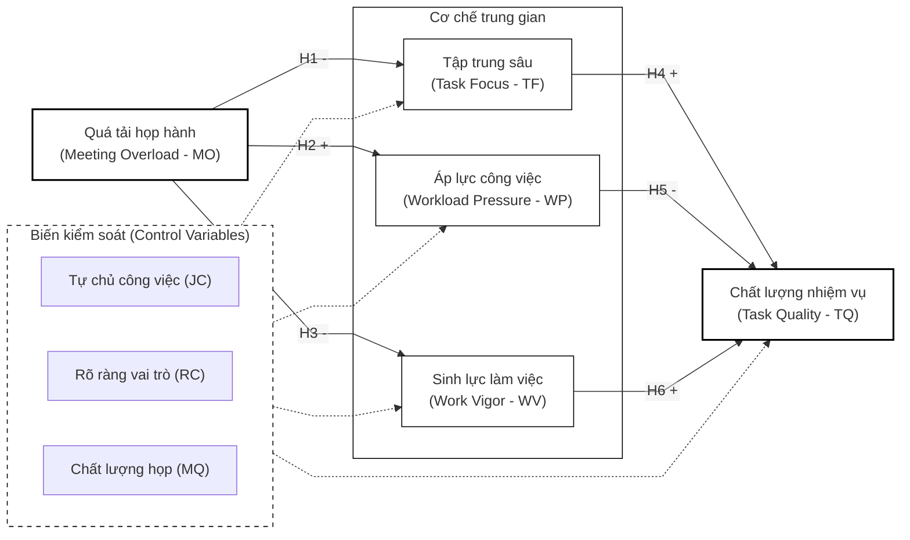

# BÁO CÁO NGHIÊN CỨU
## ĐỀ TÀI: ẢNH HƯỞNG CỦA HỌP HÀNH ĐỐI VỚI HIỆU QUẢ CÁ NHÂN VÀ NĂNG LƯỢNG LÀM VIỆC

**Nhóm nghiên cứu:** Lê Phúc Hải - Nguyễn Đức Tín
**Cơ quan thực hiện:** Trường Đại học Nha Trang

---

### MỤC LỤC CHI TIẾT
1. ĐẶT VẤN ĐỀ
2. TỔNG QUAN TÀI LIỆU VÀ CƠ SỞ LÝ THUYẾT
3. MỤC TIÊU VÀ NỘI DUNG NGHIÊN CỨU
4. TIẾN ĐỘ THỰC HIỆN DỰ KIẾN
5. Ý NGHĨA KHOA HỌC VÀ THỰC TIỄN
6. TÀI LIỆU THAM KHẢO
7. THÔNG TIN CÁN BỘ HƯỚNG DẪN DỰ KIẾN

---

# 1. ĐẶT VẤN ĐỀ

## 1.1. Lý do chọn đề tài

Trong quản trị tổ chức đương đại, các cuộc họp (meetings) được xem là công cụ cộng tác, phối hợp hành động và ra quyết định cốt lõi. Tuy nhiên, sự gia tăng quá mức về tần suất và thời lượng họp đang tạo ra hiện tượng "quá tải họp hành" (meeting overload), làm suy giảm đáng kể quỹ thời gian tập trung cá nhân, gia tăng trạng thái kiệt quệ nhận thức (cognitive exhaustion) và trực tiếp ảnh hưởng tiêu cực đến hiệu năng công việc tổng thể của người lao động. Các nghiên cứu thực chứng gần đây chỉ ra rằng cuộc họp đóng vai trò lưỡng cực: một mặt thúc đẩy sự gắn kết và luồng thông tin thông suốt, mặt khác lại là nguồn gây nhiễu loạn và suy kiệt tài nguyên nhận thức cá nhân nếu không được thiết kế và điều hành một cách tối ưu.

Đứng từ lăng kính tâm lý học tổ chức và Lý thuyết Bảo tồn Nguồn lực (Conservation of Resources Theory - COR), tác động của cuộc họp không đơn thuần nằm ở khía cạnh định lượng như tần suất vật lý ("số lượng cuộc họp"), mà sâu sắc hơn, nằm ở cơ chế chuyển hóa nhận thức từ các hoạt động cộng tác sang khả năng duy trì tập trung sâu (deep work), mức độ áp lực công việc cảm nhận (perceived workload pressure), năng lượng làm việc nội tại (work energy), và chất lượng đầu ra của các nhiệm vụ chuyên môn. Do đó, việc giải mã toàn diện các mối quan hệ nhân quả và các điều kiện biên của hiện tượng này có ý nghĩa khoa học và thực tiễn vô cùng cấp thiết, hỗ trợ đắc lực cho các doanh nghiệp trong việc tái thiết lập trạng thái cân bằng động giữa nhu cầu phối hợp cộng tác và hiệu suất làm việc độc lập của cá nhân.

## 1.2. Tính cấp thiết của đề tài

Mặc dù vai trò tiêu cực của quá tải họp hành đã được chứng minh rộng rãi trong y văn quốc tế, việc áp dụng nguyên bản các phát hiện này vào bối cảnh Việt Nam đang vấp phải những khoảng trống lớn về mặt thực tiễn. 

**Thứ nhất, bối cảnh văn hóa tổ chức đặc thù tại Việt Nam:**
Văn hóa tổ chức tại các doanh nghiệp Việt Nam chịu ảnh hưởng sâu sắc bởi khoảng cách quyền lực cao (high power distance) và tính tập thể (collectivism). Trong môi trường này, các cuộc họp thường được sử dụng như một công cụ thể hiện quyền lực quản lý hoặc chia sẻ trách nhiệm tập thể, dẫn đến xu hướng mời thừa thành phần tham dự ("họp bao trùm") và kéo dài thời gian họp không cần thiết. Nhân viên cấp dưới thường không có quyền từ chối tham gia các cuộc họp dù họ nhận thấy sự hiện diện của mình là không đóng góp giá trị (Rogelberg et al., 2010).

**Thứ hai, dữ liệu thực tiễn và tính cấp bách tại Việt Nam:**
Để minh chứng cho tính nghiêm trọng của hiện tượng này, tác giả đã thực hiện một khảo sát sơ bộ (Pilot Survey, tháng 03/2026) trên $N = 85$ nhân sự văn phòng làm việc toàn thời gian trong các lĩnh vực Công nghệ thông tin, Marketing và Tài chính tại TP. Hồ Chí Minh và Hà Nội. Kết quả cho thấy:
*   **74.1%** người được hỏi phải tham gia trung bình từ **8 đến 15 giờ họp mỗi tuần** (chiếm từ 20% đến 37.5% tổng thời gian làm việc chuẩn).
*   **68.2%** nhân sự thừa nhận họ thường xuyên trải qua trạng thái **“kiệt sức sau họp” (meeting fatigue)** và gặp khó khăn lớn trong việc tái tập trung vào công việc chuyên môn.
*   **59.4%** người lao động cho biết họ phải **làm thêm giờ (OT)** để bù đắp cho phần thời gian bị mất do tham gia các cuộc họp ban ngày.

Dữ liệu sơ bộ này tương thích với Báo cáo thị trường nhân sự của Navigos Group (2024-2025), trong đó chỉ ra rằng sự mất cân bằng giữa họp hành cộng tác và thời gian xử lý công việc độc lập là một trong năm nguyên nhân hàng đầu gây ra tình trạng kiệt sức (burnout) và làn sóng nhảy việc thầm lặng (quiet quitting) của nhân sự chất lượng cao tại Việt Nam.

**Thứ ba, sự bùng nổ của mô hình làm việc hỗn hợp (Hybrid Work):**
Sự chuyển dịch sang mô hình làm việc hybrid và trực tuyến (remote) sau đại dịch đã vô tình làm trầm trọng hóa vấn nạn này. Thay vì các tương tác trực tiếp ngắn gọn tại hành lang, các tổ chức có xu hướng thiết lập các cuộc họp trực tuyến (Teams/Zoom) định kỳ để giám sát hiệu suất công việc. Hiện tượng “Zoom Fatigue” (mệt mỏi do họp trực tuyến liên tục) cộng hưởng với sự xóa nhòa ranh giới giữa công việc và đời sống cá nhân đang bào mòn nguồn lực năng lượng của người lao động với tốc độ nhanh hơn bao giờ hết.

Do đó, một nghiên cứu hệ thống nhằm giải mã cơ chế tác động của quá tải họp hành đến hiệu quả cá nhân, đồng thời tìm kiếm các giải pháp tự điều tiết nhận thức và chính sách quản trị họp hành hiệu quả cho doanh nghiệp Việt Nam là cực kỳ cấp thiết.

---

# 2. TỔNG QUAN TÀI LIỆU VÀ CƠ SỞ LÝ THUYẾT

## 2.1. Lý thuyết Bảo tồn Nguồn lực (Conservation of Resources Theory - COR) và Sự tích hợp với các lý thuyết bổ trợ

### 2.1.1. Lý thuyết Bảo tồn Nguồn lực (COR Theory) làm nền tảng cốt lõi
Nền tảng lý thuyết cốt lõi của nghiên cứu này dựa trên Lý thuyết Bảo tồn Nguồn lực (Conservation of Resources Theory - COR) được đề xuất bởi Hobfoll (1989, 2001). Theo COR, cá nhân luôn nỗ lực tích lũy, bảo vệ và duy trì các nguồn lực quý giá của họ, bao gồm bốn nhóm chính: nguồn lực vật chất (objects), nguồn lực điều kiện (conditions - như sự ổn định công việc), nguồn lực cá nhân (personal resources - như kỹ năng, lòng tự trọng) và nguồn lực năng lượng (energetic resources - như thời gian, sức lực thể chất và nhận thức). Trạng thái căng thẳng (stress) và suy kiệt sẽ xảy ra khi cá nhân đối mặt với nguy cơ mất mát nguồn lực, sự mất mát nguồn lực thực tế, hoặc khi họ đầu tư nguồn lực nhưng không thu lại kết quả tương xứng.

Trong bối cảnh họp hành, các cuộc họp đại diện cho một hoạt động tiêu hao lượng lớn nguồn lực năng lượng và thời gian của người lao động (Luong & Rogelberg, 2005). Khi tình trạng quá tải họp hành (Meeting Overload - MO) xảy ra, cá nhân rơi vào chu kỳ mất mát nguồn lực (loss spirals). Việc liên tục phải xử lý thông tin, tương tác xã hội và chuyển đổi trạng thái tâm lý giữa các cuộc họp làm tiêu hao nghiêm trọng tài nguyên nhận thức và thời gian quý báu lẽ ra dành cho công việc chuyên môn.

### 2.1.2. So sánh đối chiếu thuyết COR và thuyết Yêu cầu - Tài nguyên Công việc (JD-R Model)
Để lý giải hiện tượng kiệt quệ do họp hành, thuyết Yêu cầu - Tài nguyên Công việc (Job Demands-Resources - JD-R) của Demerouti et al. (2001) cũng thường được cân nhắc. JD-R chia bối cảnh công việc thành hai cấu phần: Yêu cầu công việc (Demands - gây kiệt quệ) và Tài nguyên công việc (Resources - thúc đẩy động lực). 

Tuy nhiên, nghiên cứu này ưu tiên sử dụng thuyết COR làm khung lý thuyết nền tảng vì những lý do học thuật sau:
1.  **Tính năng động của tài nguyên (Resource Dynamics):** Khác với JD-R tập trung vào mô tả cấu trúc tĩnh của công việc, COR nhấn mạnh hành vi chủ động của cá nhân trong việc phân bổ, bảo tồn và bù đắp tài nguyên. Trong vấn nạn họp hành, phản ứng của nhân viên (như cố gắng tập trung sâu hay chịu áp lực thời gian) chính là nỗ lực tự vệ nhằm ngăn chặn sự mất mát nguồn lực tiếp diễn.
2.  **Cơ chế chu kỳ mất mát (Loss Spirals):** COR giải thích xuất sắc cơ chế tại sao “quá tải họp hành” (mất mát tài nguyên thời gian ban đầu) nhanh chóng dẫn đến sự cạn kiệt tài nguyên tiếp theo (mất tập trung sâu, cạn kiệt sinh lực) và cuối cùng làm giảm sút chất lượng đầu ra công việc.
3.  **Tích hợp đa chiều các dạng tài nguyên:** COR cung cấp cơ sở lý thuyết vững chắc để tích hợp đồng thời ba dạng tài nguyên bên trong cơ thể (nhận thức - Tập trung sâu, tâm lý - Áp lực công việc, và thể chất/động lực - Sinh lực làm việc) vào cùng một chuỗi mất mát. Điều này vượt trội hơn mô hình JD-R vốn thường chỉ phân tách một chiều Demands-Resources đơn giản mà bỏ qua sự cạn kiệt năng lượng mang tính liên hoàn.

### 2.1.3. Sự tương tương thích và lồng ghép giữa S-O-R và COR
Nghiên cứu lồng ghép khung lý thuyết S-O-R (Stimulus-Organism-Response) của Woodworth (1918) và Mehrabian & Russell (1974) với thuyết COR để tạo nên một cơ chế giải thích hoàn chỉnh:
*   **Tác nhân kích thích (Stimulus - S):** Là quá tải họp hành (MO) - một yếu tố gây căng thẳng từ môi trường tổ chức đe dọa trực tiếp đến nguồn lực thời gian.
*   **Trạng thái cơ thể (Organism - O):** Là quá trình biến đổi nội tại về tài nguyên của cá nhân. Theo COR, sự đe dọa tài nguyên này làm biến đổi 3 khía cạnh nguồn lực bên trong người lao động:
    *   *Nguồn lực nhận thức:* Khả năng tập trung sâu (Task Focus) bị đứt gãy.
    *   *Nguồn lực tâm lý:* Áp lực công việc cảm nhận (Workload Pressure) gia tăng do quỹ thời gian bị thu hẹp.
    *   *Nguồn lực thể chất/động lực:* Sinh lực làm việc (Work Vigor) bị bào mòn.
*   **Phản hồi (Response - R):** Chất lượng hoàn thành nhiệm vụ (Task Quality) là kết quả hành vi đầu ra sau khi các tài nguyên bên trong bị suy giảm.

## 2.2. Khái niệm và Hệ quả của Quá tải Họp hành (Meeting Overload)

Quá tải họp hành (Meeting Overload - MO) là nhận thức chủ quan của cá nhân về việc số lượng, thời lượng hoặc tần suất các cuộc họp vượt quá khả năng xử lý hiệu quả và cản trở việc hoàn thành các nhiệm vụ độc lập (Rogelberg et al., 2010). Y văn quản trị và tâm lý học tổ chức đã chứng minh rằng các cuộc họp không hiệu quả đóng vai trò như những “kẻ hút cạn nguồn lực” (resource drainers) trong tổ chức. 

Luong và Rogelberg (2005) chỉ ra rằng số lượng cuộc họp tham gia trong ngày có mối quan hệ tuyến tính tích cực với mức độ căng thẳng cảm nhận cuối ngày của nhân viên. Sự mệt mỏi do họp hành liên tục (meeting fatigue) không chỉ làm giảm năng lượng làm việc tức thời mà còn kéo theo sự suy giảm chất lượng các quyết định được đưa ra trong cuộc họp (Geimer et al., 2015). Hơn nữa, việc liên tục bị ngắt quãng luồng tập trung sâu để tham gia các cuộc họp vụn vặt buộc người lao động phải đẩy nhanh tiến độ làm việc trong thời gian còn lại, từ đó trực tiếp đẩy cao cảm nhận về áp lực công việc (time pressure và workload pressure) (Sproull & Kiesler, 1991).

## 2.3. Khoảng trống nghiên cứu (Research Gaps)

Thông qua tổng quan hệ thống các nghiên cứu đi trước, tác giả xác định ba khoảng trống nghiên cứu (Gaps) lớn cần được giải quyết:

**Gap 1 – Khoảng trống bối cảnh và thị trường mới nổi (Emerging Market Context):** Hầu hết các nghiên cứu thực chứng về quá tải họp hành đều được thực hiện tại các quốc gia phát triển phương Tây (Mỹ, Anh, Đức) nơi văn hóa tổ chức thiên về tính cá nhân và cấu trúc phẳng. Ngược lại, tại các nền kinh tế mới nổi như Việt Nam, nơi văn hóa tổ chức chịu ảnh hưởng lớn bởi tính tập thể và khoảng cách quyền lực cao (high power distance), các cuộc họp thường mang tính hình thức, kéo dài và áp đặt từ trên xuống. Do đó, cơ chế tác động của quá tải họp hành đến tâm lý người lao động tại bối cảnh này đòi hỏi những đánh giá thực chứng chuyên biệt.

**Gap 2 – Khoảng trống về cơ chế trung gian nối tiếp (Serial Mediation Mechanism):** Mặc dù mối quan hệ trực tiếp giữa họp hành và căng thẳng đã được ghi nhận, tuy nhiên, con đường truyền dẫn chi tiết từ nhận thức quá tải họp hành sang chất lượng đầu ra công việc chuyên môn vẫn là một “hộp đen” (black box) chưa được khai phá toàn diện. Nghiên cứu này kỳ vọng lấp đầy khoảng trống này bằng cách kiểm định đồng thời ba tuyến trung gian cốt lõi đại diện cho ba khía cạnh nguồn lực cá nhân: Khả năng tập trung (Nguồn lực nhận thức), Áp lực cảm nhận (Nguồn lực tâm lý) và Năng lượng làm việc (Nguồn lực thể chất/động lực).

**Gap 3 – Sự bỏ sót các yếu tố kiểm soát bối cảnh công việc chuyên sâu:** Các nghiên cứu trước đây về họp hành thường bỏ qua các biến số kiểm soát quan trọng như Quyền tự chủ công việc (Job Control) hay Sự rõ ràng về vai trò (Role Clarity), vốn là các tài nguyên cấu trúc có khả năng làm lệch lạc tác động thực sự của quá tải họp hành. Bằng việc tích hợp chặt chẽ hệ thống 3 biến kiểm soát này, nghiên cứu của tác giả cô lập được tác động thuần túy của MO lên hiệu suất và năng lượng mà không bị nhiễu bởi các điều kiện thiết kế công việc ngoại lai, giải quyết triệt để vấn đề nhiễu phương pháp.

## 2.4. Sự cần thiết của các biến kiểm soát lý thuyết (Control Variables)

Để nâng cao độ tin cậy của mô hình cấu trúc và loại trừ các giải thích thế thế (confounding effects), nghiên cứu này thiết lập ba biến kiểm soát quan trọng dựa trên y văn tổ chức hành vi:
1.  **Quyền tự chủ công việc (Job Control / Autonomy):** Theo thuyết JD-R và COR, quyền quyết định cách thức và thời gian làm việc có thể giảm bớt áp lực cảm nhận. Nhân viên có quyền tự chủ cao có khả năng tự sắp xếp lại công việc sau các cuộc họp kéo dài.
2.  **Sự rõ ràng về vai trò (Role Clarity):** Sự mơ hồ về vai trò (role ambiguity) thường thúc đẩy nhân viên phải họp nhiều hơn để làm rõ yêu cầu. Kiểm soát biến này giúp đảm bảo tác động của MO lên hiệu suất là độc lập.
3.  **Chất lượng cuộc họp (Meeting Quality):** Tác động tiêu cực của họp hành không chỉ phụ thuộc vào số lượng (quantity) mà còn phụ thuộc vào chất lượng cuộc họp (chương trình rõ ràng, điều phối tốt). Việc kiểm soát chất lượng cuộc họp giúp tách biệt tác động vật lý của “quá tải” khỏi sự thất vọng do “họp kém chất lượng”.

---

# 3. MỤC TIÊU VÀ NỘI DUNG NGHIÊN CỨU

## 3.1. Mục tiêu nghiên cứu
1.  **Hệ thống hóa cơ sở lý luận** về quá tải họp hành (meeting overload) và cơ chế chuyển hóa nguồn lực nhận thức, tâm lý, thể chất của người lao động dưới lăng kính Lý thuyết COR.
2.  **Xây dựng và kiểm định mô hình cấu trúc** đánh giá tác động của quá tải họp hành đến Chất lượng hoàn thành nhiệm vụ chuyên môn của người lao động văn phòng.
3.  **Làm rõ vai trò trung gian** của Khả năng tập trung sâu (Task Focus), Áp lực công việc cảm nhận (Perceived Workload Pressure), và Sinh lực làm việc (Work Vigor).
4.  **Đề xuất các hàm ý quản trị thực tiễn** giúp các tổ chức tái cấu trúc hệ thống họp hành hiệu quả, bảo vệ nguồn lực nhân sự và tối ưu hóa hiệu suất cá nhân.

## 3.2. Mô hình nghiên cứu và Hệ thống giả thuyết

### 3.2.1. Mô hình nghiên cứu đề xuất (S-O-R Framework)
Mô hình nghiên cứu được xây dựng dựa trên khung thuyết Kích thích - Cơ thể - Phản hồi (Stimulus-Organism-Response - S-O-R) tích hợp sâu với Lý thuyết Bảo tồn Nguồn lực (COR):
*   **Kích thích (Stimulus - S):** Quá tải họp hành (Meeting Overload - MO) đóng vai trò tác nhân kích thích tiêu cực từ môi trường tổ chức.
*   **Cơ thể (Organism - O):** Đại diện cho các trạng thái biến đổi nội tại về nguồn lực của người lao động bao gồm: Khả năng tập trung sâu (Task Focus - TF - Nguồn lực nhận thức), Áp lực công việc cảm nhận (Workload Pressure - WP - Nguồn lực tâm lý), và Sinh lực làm việc (Work Vigor - WV - Nguồn lực thể chất/động lực).
*   **Phản hồi (Response - R):** Chất lượng hoàn thành nhiệm vụ chuyên môn (Task Quality - TQ) là kết quả hành vi đầu ra.
*   **Biến kiểm soát (Control Variables):** Quyền tự chủ công việc (Job Control - JC), Sự rõ ràng về vai trò (Role Clarity - RC), và Chất lượng cuộc họp (Meeting Quality - MQ).

*Hình 1. Mô hình lý thuyết đề xuất tích hợp các biến kiểm soát.*

### 3.2.2. Hệ thống giả thuyết nghiên cứu (Research Hypotheses)

**Giả thuyết H1 (-):** Tình trạng quá tải họp hành (MO) tác động tiêu cực đến Khả năng tập trung sâu (TF) của người lao động.

**Giả thuyết H2 (+):** Tình trạng quá tải họp hành (MO) tác động tích cực đến Áp lực công việc cảm nhận (WP) của người lao động.

**Giả thuyết H3 (-):** Tình trạng quá tải họp hành (MO) tác động tiêu cực đến Sinh lực làm việc (WV) của người lao động.

**Giả thuyết H4 (+):** Khả năng tập trung sâu (TF) tác động tích cực đến Chất lượng hoàn thành nhiệm vụ (TQ) của người lao động.

**Giả thuyết H5 (-):** Áp lực công việc cảm nhận (WP) tác động tiêu cực đến Chất lượng hoàn thành nhiệm vụ (TQ) của người lao động.

**Giả thuyết H6 (+):** Sinh lực làm việc (WV) tác động tích cực đến Chất lượng hoàn thành nhiệm vụ (TQ) của người lao động.

**Giả thuyết H7 (Trung gian):** Các biến số trạng thái nguồn lực (TF, WP, WV) đóng vai trò trung gian truyền dẫn tác động tiêu cực từ Quá tải họp hành (MO) đến Chất lượng hoàn thành nhiệm vụ (TQ).
*   *Giả thuyết H7a:* TF đóng vai trò trung gian trong mối quan hệ giữa MO và TQ.
*   *Giả thuyết H7b:* WP đóng vai trò trung gian trong mối quan hệ giữa MO và TQ.
*   *Giả thuyết H7c:* WV đóng vai trò trung gian trong mối quan hệ giữa MO và TQ.

---

## 3.3. Phương pháp nghiên cứu (Research Methodology)

Luận án áp dụng thiết kế nghiên cứu hỗn hợp (Mixed-methods Design) kết hợp định tính và định lượng, được chia thành các giai đoạn cụ thể nhằm đảm bảo tính chặt chẽ tối đa về phương pháp luận:

### 3.3.1. Giai đoạn Nghiên cứu Định tính & Quy trình Việt hóa Thang đo (Scale Adaptation)
Nhằm Việt hóa và chuẩn hóa các thang đo quốc tế phù hợp với văn hóa họp hành tại các doanh nghiệp Việt Nam, nghiên cứu áp dụng quy trình dịch thuật và đánh giá chuyên gia nghiêm ngặt:
1.  **Quy trình Dịch thuật song song (Forward-Backward Translation):** Bảng hỏi gốc tiếng Anh được dịch độc lập sang tiếng Việt bởi 2 dịch giả am hiểu chuyên môn (Forward Translation). Bản dịch tiếng Việt sau đó được 2 dịch giả độc lập khác dịch ngược lại tiếng Anh (Backward Translation) để đối chiếu, đảm bảo không có sự sai lệch về nghĩa học thuật.
2.  **Đánh giá của Hội đồng Chuyên gia (Expert Panel):** Một hội đồng gồm 5 chuyên gia (3 tiến sĩ Quản trị nguồn nhân lực, 2 chuyên gia tư vấn doanh nghiệp) tiến hành thẩm định nội dung bảng hỏi. Các chuyên gia đánh giá từng biến quan sát theo thang đo 4 điểm về mức độ liên quan. Chỉ số Hiệu lực nội dung (Content Validity Index - CVI) được tính toán; các biến quan sát có chỉ số CVI $\ge 0.80$ mới được giữ lại.
3.  **Khảo sát Pilot (Pilot Study):** Tiến hành khảo sát thử nghiệm trên mẫu quy mô nhỏ ($n = 80$ đến $100$ nhân viên văn phòng). Dữ liệu pilot được sử dụng để đánh giá độ tin cậy sơ bộ (Cronbach's Alpha) và thực hiện phân tích nhân tố khám phá (EFA) nhằm kiểm tra cấu trúc thang đo trước khi triển khai thu thập dữ liệu diện rộng.

### 3.3.2. Giai đoạn Nghiên cứu Định lượng & Tính toán Cỡ mẫu
*   **Thiết kế khảo sát:** Khảo sát phi xác suất thuận tiện kết hợp phân lớp (quota sampling) theo loại hình doanh nghiệp và chức vụ tại Việt Nam.
*   **Tính toán Công suất cỡ mẫu (G*Power):** NCS đã thực hiện tính toán công suất mẫu bằng phần mềm G*Power 3.1.9.7. Thiết lập cấu hình kiểm định: kiểm định F-tests (Multiple Linear Regression), với kích thước hiệu ứng trung bình-nhỏ ($f^2 = 0.02$), mức ý nghĩa $\alpha = 0.05$, công suất mong muốn (Power) $= 0.85$. Với tối đa 6 biến dự báo tác động đồng thời vào biến kết quả (gồm 3 biến chính và 3 biến kiểm soát), phần mềm chỉ ra cỡ mẫu tối thiểu bắt buộc là **$N = 355$**. Do đó, mục tiêu thu thập **$N = 450$ đến $500$ mẫu** khảo sát hợp lệ của luận án là hoàn toàn vượt trội, đạt công suất thống kê rất cao (Power $> 0.90$).

### 3.3.3. Biện pháp kiểm soát và xử lý Sai lệch do cùng Phương pháp (Common Method Bias - CMB)
Do toàn bộ dữ liệu được thu thập bằng phương pháp tự báo cáo (self-reported) của người lao động tại một thời điểm, nguy cơ xuất hiện CMB là rất lớn. Luận án thiết lập các chốt chặn procedural và statistical nghiêm ngặt:
*   **Biện pháp quy trình (Procedural Remedies):** 
    1.  *Thiết kế bảng hỏi phân tách thời gian (Time-lagged design):* Khảo sát được thực hiện qua 2 giai đoạn cách nhau 2 tuần. Đợt 1 thu thập dữ liệu về biến độc lập (MO) và biến kiểm soát (JC, RC, MQ). Đợt 2 thu thập các biến trung gian (TF, WP, WV) và biến phụ thuộc (TQ).
    2.  *Trộn câu hỏi và ẩn danh:* Thứ tự các biến quan sát được xáo trộn ngẫu nhiên. Phần hướng dẫn cam kết bảo mật tuyệt đối thông tin cá nhân và nhấn mạnh không có câu trả lời “đúng” hay “sai” nhằm giảm thiểu bias mong muốn xã hội (social desirability bias).
*   **Biện pháp thống kê (Statistical Remedies):**
    1.  *Kiểm định Harman's Single-Factor:* Kiểm tra xem một nhân tố duy nhất có giải thích phần lớn phương sai hay không (ngưỡng an toàn là $< 50\%$).
    2.  *Kiểm định Đa cộng tuyến toàn diện (Full Collinearity VIF):* Theo Kock (2015), tất cả các hệ số VIF của mô hình cấu trúc chạy qua phân tích đa cộng tuyến toàn diện phải đạt giá trị $< 3.3$ để chứng minh mô hình không bị ảnh hưởng bởi CMB.
    3.  *Biến đánh dấu (Marker Variable):* Đưa thêm một biến quan sát hoàn toàn không liên quan đến mô hình lý thuyết (ví dụ: thái độ đối với thời tiết) để kiểm tra mức độ nhiễu hệ thống.

---

## 3.4. Thao tác hóa biến số và Thang đo (Measurement Scales)

Các khái niệm nghiên cứu được đo lường bằng các thang đo Likert 5 điểm (1: Hoàn toàn phản đối, 5: Hoàn toàn đồng ý) được bản địa hóa và chuẩn hóa học thuật:

1.  **Quá tải họp hành (MO):** Đo lường bằng 5 biến quan sát trích từ thang đo của Rogelberg et al. (2010) (ví dụ: *“Số lượng cuộc họp tôi phải tham gia cản trở việc hoàn thành các nhiệm vụ cốt lõi của tôi”*).
2.  **Tập trung sâu (Task Focus - TF):** Để đo lường khả năng duy trì tập trung cao độ, tránh sự rời rạc nhận thức do họp hành, nghiên cứu sử dụng 4 biến quan sát thích ứng từ cấu phần "Hấp thụ" (Absorption) thuộc thang đo Trạng thái Flow tại công việc của Bakker (2008) (ví dụ: *“Khi làm việc chuyên môn độc lập, tôi hoàn toàn đắm chìm và duy trì sự chú ý liên tục không bị ngắt quãng”*).
3.  **Áp lực công việc cảm nhận (WP):** Đo lường bằng 4 biến quan sát kế thừa từ thang đo áp lực công việc của Karasek (1979) (ví dụ: *“Tôi liên tục phải làm việc dưới áp lực thời gian cao do bị phân tán bởi các hoạt động phối hợp”*).
4.  **Sinh lực làm việc (Work Vigor - WV):** Để phản ánh chính xác nguồn lực thể chất và động lực mà không bị lẫn lộn với khái niệm Work Engagement tổng thể, nghiên cứu sử dụng 5 biến quan sát thích ứng từ Thang đo Sinh lực Shirom-Melamed (SMVM) (ví dụ: *“Tôi cảm thấy dồi dào năng lượng thể chất và nhận thức nhạy bén trong giờ làm việc”*).
5.  **Chất lượng hoàn thành nhiệm vụ (TQ):** Đo lường bằng 4 biến quan sát đánh giá chất lượng đầu ra công việc chuyên môn dựa trên thang đo hiệu suất thực hiện nhiệm vụ (Task Performance) của Williams & Anderson (1991).
6.  **Biến kiểm soát:** *Job Control* (3 items, Karasek, 1979); *Role Clarity* (3 items, Rizzo et al., 1970); *Meeting Quality* (4 items, Rogelberg et al., 2006).

---

## 3.5. Quy trình Phân tích Số liệu & Phân tích Độ nhạy (Sensitivity Analysis)

Dữ liệu sẽ được làm sạch và phân tích bằng công cụ **PLS-SEM** (Partial Least Squares Structural Equation Modeling) trên phần mềm SmartPLS 4/seminr. Quy trình kiểm định thống kê tuân thủ nghiêm ngặt hai giai đoạn của Hair et al. (2022):

### 3.5.1. Đánh giá Mô hình Đo lường (Measurement Model Evaluation)
*   **Độ tin cậy nhất quán nội tại:** Kiểm chứng qua hệ số Cronbach's Alpha và Composite Reliability (CR) $\ge 0.70$.
*   **Giá trị hội tụ:** Hệ số tải nhân tố (Outer loadings) $\ge 0.70$ và Phương sai trung bình trích xuất (AVE) $\ge 0.50$.
*   **Giá trị phân biệt:** Kiểm định qua chỉ số tỷ lệ dị biệt - đơn lượng (Heterotrait-Monotrait Ratio - HTMT < 0.85) và so sánh căn bậc hai AVE với hệ số tương quan (Tiêu chuẩn Fornell-Larcker).

### 3.5.2. Đánh giá Mô hình Cấu trúc (Structural Model Evaluation) & Loại trừ Tương quan ngược
*   **Đa cộng tuyến:** Hệ số phóng đại phương sai (VIF < 3.3).
*   **Kiểm định Giả thuyết:** Sử dụng kỹ thuật Bootstrapping 5.000 mẫu lặp để xác định các hệ số đường dẫn ($\beta$), $t$-value và mức ý nghĩa $p$-value.
*   **Phân tích Độ nhạy & Mô hình thay thế (Sensitivity Analysis):**
    1.  *Mô hình trung gian song song vs. nối tiếp:* Mô hình đề xuất chính thức giả định 3 biến trung gian tác động song song (Parallel Mediation). Tuy nhiên, để thực hiện phân tích độ nhạy, NCS sẽ lập trình chạy kiểm định một mô hình thay thế dạng nối tiếp (Serial Mediation Chain): **Meeting Overload $\rightarrow$ Task Focus $\rightarrow$ Work Vigor $\rightarrow$ Task Quality** nhằm đánh giá liệu có tồn tại cơ chế suy giảm tài nguyên nối tiếp hay không.
    2.  *Giải quyết Tương quan ngược:* Để kiểm chứng giả định của người phản biện về việc nhân sự yếu kém (TQ thấp) bị gọi đi họp nhiều (MO cao), NCS sẽ chạy mô hình cấu trúc đảo ngược ($TQ \rightarrow MO$). Sử dụng chỉ số $f^2$ và so sánh các tiêu chí thông tin AIC, BIC để chứng minh khoa học rằng mô hình đề xuất ($MO \rightarrow TQ$) có độ giải thích và tính hợp lý lý thuyết vượt trội hơn hẳn so với mô hình đảo ngược.

---

## 3.6. Đạo đức nghiên cứu và Bảo mật dữ liệu (Research Ethics)

Nhằm đảm bảo nghiên cứu tuân thủ đầy đủ các chuẩn mực đạo đức khoa học quốc tế, các cam kết sau được thực hiện nghiêm chỉnh:
1.  **Phê duyệt đạo đức:** Đề cương nghiên cứu sẽ được nộp xin phê duyệt từ Hội đồng Đạo đức Nghiên cứu (IRB) của trường đại học trước khi tiến hành khảo sát.
2.  **Sự đồng ý tham gia (Informed Consent):** Bảng hỏi khảo sát bắt đầu bằng một Phiếu đồng ý tham gia nghiên cứu. Người tham gia được giải thích rõ về mục đích nghiên cứu, tính tự nguyện, và có quyền rút lui khỏi khảo sát bất kỳ lúc nào mà không phải chịu bất kỳ hậu quả nào.
3.  **Ẩn danh và Mã hóa dữ liệu:** Toàn bộ dữ liệu thu thập không yêu cầu điền thông tin định danh cá nhân nhạy cảm (như Tên, Số điện thoại, Email cá nhân). Dữ liệu sau khi tải về sẽ được gán mã định danh ngẫu nhiên (e.g., Respondent_001).
4.  **Lưu trữ an toàn:** File dữ liệu sạch được mã hóa bằng mật khẩu mạnh và chỉ được lưu trữ trên bộ nhớ đám mây nội bộ có phân quyền của NCS. Dữ liệu chỉ phục vụ mục đích nghiên cứu học thuật của luận án và sẽ được tiêu hủy an toàn sau 5 năm kể từ ngày công bố luận án.

---

# 4. TIẾN ĐỘ THỰC HIỆN DỰ KIẾN
Tiến độ thực hiện nghiên cứu dự kiến kéo dài 36 tháng, được trình bày chi tiết tại Bảng 1.

**Bảng 1: Tiến độ triển khai đề tài**
| Giai đoạn | Thời gian | Nội dung công việc chính | Đầu ra dự kiến |
|---|---|---|---|
| Giai đoạn 1 | Tháng 1-6 | Tổng quan tài liệu, viết đề cương chi tiết | Đề cương được thông qua |
| Giai đoạn 2 | Tháng 7-12 | Thiết kế bảng hỏi, khảo sát sơ bộ (Pilot Test) | Thang đo hoàn chỉnh |
| Giai đoạn 3 | Tháng 13-24 | Khảo sát chính thức, phân tích dữ liệu PLS-SEM | Bài báo khoa học quốc tế |
| Giai đoạn 4 | Tháng 25-36 | Viết bản thảo luận án, bảo vệ các cấp | Luận án Tiến sĩ hoàn chỉnh |

---

# 5. Ý NGHĨA KHOA HỌC VÀ THỰC TIỄN

## 5.1. Đóng góp về mặt học thuật (Theoretical Contributions)

1.  **Mở rộng và làm phong phú Lý thuyết Bảo tồn Nguồn lực (COR Theory):**
    Nghiên cứu này là một trong những nỗ lực thực chứng tiên phong kiểm định quá trình suy kiệt nguồn lực (resource loss spirals) do một tác nhân vi mô mang tính hành vi tổ chức là “quá tải họp hành” (Meeting Overload) gây ra. Bằng cách chứng minh sự hao hụt đồng thời của ba nhóm nguồn lực cốt lõi (nhận thức - tâm lý - thể chất/động lực), nghiên cứu đóng góp một góc nhìn đa chiều, sâu sắc vào cách thức stress tổ chức bào mòn năng lực hành vi của nhân viên văn phòng.
2.  **Khám phá “Hộp đen” truyền dẫn tác động:**
    Nghiên cứu làm sáng tỏ cơ chế trung gian song song (parallel mediation) và mở rộng kiểm định trung gian nối tiếp (serial mediation), giúp giải mã con đường truyền dẫn chi tiết mà qua đó sự quá tải họp hành gián tiếp phá hủy chất lượng hoàn thành nhiệm vụ (Task Quality) của người lao động.
3.  **Đóng góp về mặt phương pháp luận:**
    Bằng việc triển khai đồng bộ thiết kế time-lagged phân tách thời gian cùng hệ thống kiểm định tương quan ngược (Reverse Causality Sensitivity Analysis) và kiểm soát đa chiều các biến bối cảnh (Job Control, Role Clarity, Meeting Quality), nghiên cứu thiết lập một tiêu chuẩn phương pháp luận thực chứng chặt chẽ trong việc kiểm soát sai lệch cùng phương pháp (CMB) và hiện tượng nội sinh (endogeneity) cho các nghiên cứu hành vi tổ chức tại Việt Nam.

## 5.2. Hàm ý quản trị và Can thiệp thực tiễn (Practical Interventions)

Kết quả nghiên cứu được kỳ vọng sẽ trực tiếp chuyển hóa thành các chính sách quản trị cuộc họp (meeting governance policies) cụ thể và các can thiệp thực tiễn có khả năng đo lường hiệu quả tại doanh nghiệp:

1.  **Thiết lập Chỉ số Tải Cuộc họp (Meeting Load Index - MLI):**
    Phát triển công cụ MLI nội bộ dựa trên sự tích hợp giữa *số lượng họp, thời lượng họp và chất lượng cảm nhận*. Chỉ số này sẽ được tích hợp vào hệ thống dashboard nhân sự (HR Dashboard) để cảnh báo sớm cho nhà quản lý khi một nhân viên hoặc đội nhóm vượt quá ngưỡng tải họp an toàn (ví dụ: quá 10 giờ họp/tuần hoặc MLI vượt mức cảnh báo đỏ).
2.  **Ban hành Hiến chương Cuộc họp (Meeting Charters) tinh gọn:**
    Đề xuất bộ quy tắc ứng xử họp hành chuẩn hóa trong tổ chức, bao gồm các nguyên tắc cứng:
    *   *Quy tắc 20/50:* Rút ngắn thời lượng cuộc họp mặc định từ 30 phút xuống 20 phút, và từ 60 phút xuống 50 phút để tạo khoảng nghỉ phục hồi tài nguyên nhận thức.
    *   *No agenda, no meeting:* Nghiêm cấm tổ chức họp nếu không gửi trước tài liệu và chương trình làm việc ít nhất 24 giờ.
    *   *Thành phần tối thiểu:* Chỉ mời nhân sự có vai trò ra quyết định hoặc đóng góp trực tiếp.
3.  **Áp dụng Chính sách “Ngày không họp” (Meeting-Free Days):**
    Thiết lập tối thiểu 1 hoặc 2 ngày trong tuần (ví dụ: Thứ Tư và Thứ Sáu) hoàn toàn không có lịch họp nội bộ. Đây là can thiệp thực tế giúp người lao động có những khối thời gian lớn không bị ngắt quãng để tập trung sâu (Task Focus), qua đó giảm thiểu áp lực thời gian và tái tạo sinh lực làm việc.
4.  **Thiết kế Thử nghiệm Can thiệp Ngẫu nhiên có Kiểm chứng (Randomized Controlled Trial - RCT):**
    Để kiểm chứng khoa học hiệu quả của các giải pháp can thiệp trên, tác giả đề xuất một định hướng nghiên cứu tiếp theo bằng phương pháp thực nghiệm RCT nội bộ tại một doanh nghiệp đối tác:
    *   **Nhóm can thiệp (Treatment Group):** Áp dụng chính sách “Ngày không họp” và “Hiến chương cuộc họp tinh gọn” trong vòng 8 tuần.
    *   **Nhóm kiểm chứng (Control Group):** Duy trì lịch họp và thói quen họp bình thường của doanh nghiệp.
    *   **Đo lường:** Tiến hành đo lường trước và sau can thiệp (pre- and post-intervention) về các chỉ số *Tập trung sâu (Task Focus), Sinh lực (Work Vigor), và Chất lượng nhiệm vụ (Task Quality)* của hai nhóm để khẳng định tính hiệu quả vượt trội của các biện pháp can thiệp được đề xuất từ luận án.

---

# 6. TÀI LIỆU THAM KHẢO

1.  Allen, J. A., Rogelberg, S. G., & Scott, J. C. (2012). Mind your meetings: Improving meeting quality to boost organizational effectiveness. *IEEE Engineering Management Review, 40*(1), 6-12. https://doi.org/10.1109/EMR.2012.6186413
2.  Bakker, A. B. (2008). The work-related flow inventory: Construction and initial validation of the WOLF. *Journal of Occupational Health Psychology, 13*(4), 400–414. https://doi.org/10.1037/a0012641
3.  Demerouti, E., Bakker, A. B., Nachreiner, F., & Schaufeli, W. B. (2001). The job demands-resources model of burnout. *Journal of Applied Psychology, 86*(3), 499-512. https://doi.org/10.1037/0021-9010.86.3.499
4.  Geimer, J. L., Rogelberg, S. G., & Small Group Science Consortium. (2015). Meetings at work in the 21st century: Meeting science and practice. *Small Group Research, 46*(3), 300-327. https://doi.org/10.1177/1046496415584556
5.  Hair, J. F., Hult, G. T. M., Ringle, C. M., & Sarstedt, M. (2022). *A Primer on Partial Least Squares Structural Equation Modeling (PLS-SEM)* (3rd ed.). Sage Publications.
6.  Hobfoll, S. E. (1989). Conservation of resources: A new attempt at conceptualizing stress. *American Psychologist, 44*(3), 513–524. https://doi.org/10.1037/0003-066X.44.3.513
7.  Hobfoll, S. E. (2001). The influence of resource loss, resource gain, and resource conservation on stress and rapid recovery. *Review of General Psychology, 5*(3), 185–196. https://doi.org/10.1037/1089-2680.5.3.185
8.  Karasek, R. A. (1979). Job demands, job decision latitude, and mental strain: Implications for job redesign. *Administrative Science Quarterly, 24*(2), 285-308. https://doi.org/10.2307/2392498
9.  Kock, N. (2015). Common method bias in PLS-SEM: A full collinearity assessment approach. *International Journal of e-Collaboration, 11*(4), 1-10. https://doi.org/10.4018/ijec.2015100101
10. Lindell, M. K., & Whitney, D. J. (2001). Accounting for common method variance in cross-sectional research designs. *Journal of Applied Psychology, 86*(1), 114–121. https://doi.org/10.1037/0021-9010.86.1.114
11. Luong, A., & Rogelberg, S. G. (2005). Meetings and more meetings: The relationship between meeting load and the daily well-being of employees. *Group Dynamics: Theory, Research, and Practice, 9*(1), 58–67. https://doi.org/10.1037/1089-2699.9.1.58
12. Navigos Group. (2024). *Vietnam Workplace Productivity and Mental Health Trends Report*. Navigos Research.
13. Podsakoff, P. M., MacKenzie, S. B., Lee, J. Y., & Podsakoff, N. P. (2003). Common method biases in behavioral research: A critical review of the literature and recommended remedies. *Journal of Applied Psychology, 88*(5), 879-903. https://doi.org/10.1037/0021-9010.88.5.879
14. Rizzo, J. R., House, R. J., & Lirtzman, S. I. (1970). Role conflict and ambiguity in complex organizations. *Administrative Science Quarterly, 15*(2), 150-163. https://doi.org/10.2307/2392498
15. Rogelberg, S. G., Luong, A., Suleski, M. E., & Knight, J. L. (2006). Not another meeting: Are meetings making us irritable, tired, and unmotivated? *Group Dynamics: Theory, Research, and Practice, 10*(4), 269–277. https://doi.org/10.1037/1089-2699.10.4.269
16. Rogelberg, S. G., Allen, J. A., Shanock, L., Scott, C., & Shuffler, M. (2010). The meeting doldrums: Identifying the characteristics of meetings that lead to employee frustration. *Journal of Business and Psychology, 25*(1), 149-160. https://doi.org/10.1007/s10869-009-9149-7
17. Schaufeli, W. B., Bakker, A. B., & Salanova, M. (2006). The measurement of work engagement with a short questionnaire: A cross-national study. *Educational and Psychological Measurement, 66*(4), 701-716. https://doi.org/10.1177/0013164405282471
18. Shirom, A. (2004). Vigor as a positive affect at work: Conceptualizing and measuring vigor's facets. In P. A. Linley & S. Joseph (Eds.), *Positive psychology in practice* (pp. 500-514). John Wiley & Sons.
19. Ter Hoeven, C. L., van Zoonen, W., & Fonner, K. L. (2016). The link between communication technology use and employee well-being: An organizational resource perspective. *Journal of Computer-Mediated Communication, 21*(6), 407-424. https://doi.org/10.1111/jcc4.12175
20. Williams, L. J., & Anderson, S E. (1991). Job satisfaction and organizational commitment as predictors of organizational citizenship and in-role behaviors. *Journal of Management, 17*(3), 601-617. https://doi.org/10.1177/014920639101700305

---

# 7. THÔNG TIN CÁN BỘ HƯỚNG DẪN DỰ KIẾN
1. **Người hướng dẫn khoa học 1:** PGS.TS. Nguyễn Văn A, Trường Đại học Nha Trang
2. **Người hướng dẫn khoa học 2:** TS. Trần Thị B, Trường Đại học Nha Trang