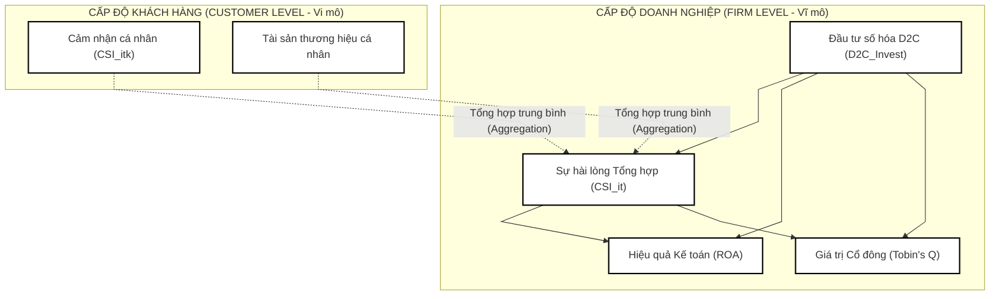

## 5. PHƯƠNG PHÁP NGHIÊN CỨU

Luận án sử dụng thiết kế Đa nguồn dữ liệu liên kết Tiếp thị - Tài chính (Marketing-Finance Interface) nhằm giải quyết bài toán trách nhiệm giải trình tiếp thị. Thiết kế này tích hợp thông tin từ 3 nghiên cứu độc lập để tạo lập hệ thống kiểm chứng vĩ mô - vi mô toàn diện.

### 5.1. Sơ đồ liên kết dữ liệu vĩ mô - vi mô (Macro-Micro Linkage Flowchart)

*Hình 3. Mô hình lý thuyết truyền dẫn Tiếp thị - Tài chính đa cấp độ*

---

### 5.2. Nghiên cứu 1: Định tính và Phân tích nội dung (Phía Cung)
*   **Mục tiêu:** Thiết lập khung đo lường thực tế cho mức độ đầu tư số hóa kênh D2C của doanh nghiệp và kiểm chứng các nhân tố tác động trong bối cảnh Việt Nam.
*   **Phương pháp:** Kết hợp phỏng vấn sâu bán cấu trúc ($n = 15$ CMO, CFO, Giám đốc kênh thương mại điện tử) và **Phân tích nội dung (Content Analysis)** dựa trên Báo cáo thường niên, Báo cáo phát triển bề vững của doanh nghiệp.
*   **Chỉ số hóa D2C (D2C Digitalization Intensity Index):** Để khắc phục các sai số đo lường từ việc sử dụng các chỉ số tài chính chung chung (như chi phí bán hàng có thể bao gồm nhiều chi phí phi kỹ thuật số), nghiên cứu xây dựng chỉ số mã hóa (Coded Index) từ 1 đến 5 để đánh giá mức độ số hóa kênh D2C của doanh nghiệp qua từng năm dựa trên phương pháp phân tích nội dung văn bản:
    *   *Mức 1 (Truyền thống):* Chưa có kênh D2C số hóa, phân phối hoàn toàn qua các trung gian bán buôn/bán lẻ truyền thống.
    *   *Mức 2 (Tiếp cận cơ bản):* Có website/fanpage giới thiệu sản phẩm và thương hiệu nhưng chưa tích hợp tính năng giao dịch trực tuyến.
    *   *Mức 3 (Giao dịch đơn kênh):* Vận hành kênh bán hàng trực tuyến D2C (Website/App riêng hoặc Gian hàng chính hãng trên sàn TMĐT) nhưng dữ liệu và chuỗi cung ứng vận hành độc lập, thủ công.
    *   *Mức 4 (Đa kênh tích hợp - Omnichannel):* Triển khai mô hình Omnichannel, đồng bộ hóa tồn kho và đơn hàng giữa các kênh trực tuyến và trực tiếp, tích hợp một phần hệ thống CRM.
    *   *Mức 5 (Số hóa toàn diện & Cá nhân hóa):* Vận hành hệ thống D2C thông minh dựa trên nền tảng dữ liệu khách hàng tập trung (CDP - Customer Data Platform), cá nhân hóa trải nghiệm khách hàng theo thời gian thực (Real-time personalization), tự động hóa logistics và chăm sóc khách hàng.
*   **Đầu ra:** Bảng điểm chỉ số số hóa D2C ($\text{D2C\_Invest}_{it}$) của các doanh nghiệp trong mẫu nghiên cứu giai đoạn 2018 - 2025.

---

### 5.3. Nghiên cứu 2: Định lượng khách hàng (Survey & Aggregation)
*   **Quy mô mẫu:** Khảo sát người tiêu dùng trực tuyến và trực tiếp ($N = 500$) có kinh nghiệm mua hàng của 75 doanh nghiệp FMCG và Bán lẻ mục tiêu.
*   **Nội dung đo lường:** Sự hài lòng (CSI - 3 quan sát của ACSI) và Tài sản thương hiệu (Brand Equity - Yoo & Donthu, 2001) bằng thang đo Likert 7 điểm.
*   **Quy trình tổng hợp (Aggregation):** Để đưa dữ liệu khách hàng (vi mô) về cấp độ doanh nghiệp (vĩ mô), điểm số của từng cá nhân được tính trung bình theo công thức:

$$\text{CSI}_{it} = \frac{1}{N_{it}} \sum_{k=1}^{N_{it}} \text{CSI}_{itk}$$

*(Trong đó, $\text{CSI}_{it}$ là điểm hài lòng tổng hợp của doanh nghiệp $i$ tại năm $t$; $N_{it}$ là số lượng đáp viên đánh giá doanh nghiệp $i$ tại năm $t$; $\text{CSI}_{itk}$ là điểm hài lòng của đáp viên $k$ dành cho doanh nghiệp $i$)*.

---

### 5.4. Nghiên cứu 3: Kinh tế lượng Doanh nghiệp (Panel Data)
Nghiên cứu 3 sử dụng dữ liệu bảng (Panel Data) của 75 doanh nghiệp FMCG và bán lẻ (bao gồm cả các doanh nghiệp niêm yết, doanh nghiệp chưa niêm yết lớn và doanh nghiệp FDI) giai đoạn 2018 - 2025 (tổng số quan sát tối đa $N \times T = 600$).

#### 5.4.1. Hệ phương trình hồi quy Kinh tế lượng
Để giảm thiểu vấn đề nhân quả ngược (reverse causality), tất cả các biến tác động độc lập và trung gian cấp doanh nghiệp đều được đưa vào mô hình dưới dạng trễ một chu kỳ ($t-1$). Để đánh giá vai trò điều tiết của đặc tính sản phẩm (trải nghiệm/hedonic so với tiện ích/utilitarian), nghiên cứu tích hợp biến tương tác $\text{D2C\_Invest}_{i,t-1} \times \text{Hedonic}_i$. Luận án kiểm định cơ chế truyền dẫn qua hệ 3 phương trình đồng thời:

**Phương trình 1: Tác động của D2C đến Sự hài lòng tổng hợp (CSI)**
$$\text{CSI}_{it} = \alpha_0 + \alpha_1 \text{D2C\_Invest}_{i,t-1} + \alpha_2 \text{Size}_{it} + \alpha_3 \text{Lev}_{it} + \alpha_4 \text{Adv}_{it} + \eta_i + \epsilon_{it}$$

**Phương trình 2: Tác động truyền dẫn lên hiệu quả kế toán (ROA) với biến điều tiết**
$$\text{ROA}_{it} = \beta_0 + \beta_1 \text{CSI}_{i,t-1} + \beta_2 \text{D2C\_Invest}_{i,t-1} + \beta_3 (\text{D2C\_Invest}_{i,t-1} \times \text{Hedonic}_i) + \beta_4 \text{Size}_{it} + \beta_5 \text{Lev}_{it} + \beta_6 \text{SG}_{it} + \eta_i + \mu_{it}$$

**Phương trình 3: Tác động truyền dẫn lên giá trị thị trường của cổ đông (Tobin's Q) với biến điều tiết**
$$\text{Tobin's Q}_{it} = \gamma_0 + \gamma_1 \text{CSI}_{i,t-1} + \gamma_2 \text{D2C\_Invest}_{i,t-1} + \gamma_3 (\text{D2C\_Invest}_{i,t-1} \times \text{Hedonic}_i) + \gamma_4 \text{Size}_{it} + \gamma_5 \text{Lev}_{it} + \gamma_6 \text{SG}_{it} + \eta_i + v_{it}$$

#### Định nghĩa chi tiết các biến số trong mô hình:
1.  **Biến phụ thuộc:**
    *   $\text{Tobin's Q}_{it}$: Giá trị thị trường của doanh nghiệp $i$ năm $t$, đo bằng tỷ số giữa (Giá trị vốn hóa + Nợ phải trả) trên Tổng tài sản.
    *   $\text{ROA}_{it}$: Tỷ suất sinh lời trên tổng tài sản của doanh nghiệp $i$ năm $t$.
2.  **Biến trung gian trễ:**
    *   $\text{CSI}_{i,t-1}$: Chỉ số hài lòng khách hàng tổng hợp trễ 1 năm của doanh nghiệp $i$ (kết quả trích xuất trễ từ Nghiên cứu 2).
3.  **Biến độc lập trễ:**
    *   $\text{D2C\_Invest}_{i,t-1}$: Chỉ số đầu tư số hóa kênh D2C trễ 1 năm của doanh nghiệp $i$ (xác định qua chỉ số mã hóa từ phân tích nội dung Báo cáo thường niên).
4.  **Biến điều tiết bất biến theo thời gian:**
    *   $\text{Hedonic}_i$: Biến giả (dummy variable) nhận giá trị 1 nếu doanh nghiệp kinh doanh nhóm hàng mang thiên hướng cảm xúc/trải nghiệm (Hedonic - ví dụ: trang sức PNJ, bia Sabeco) và nhận giá trị 0 nếu kinh doanh nhóm hàng mang thiên hướng tiện ích/chức năng (Utilitarian - ví dụ: sữa Vinamilk, đường Quảng Ngãi, hệ thống bán lẻ nhu yếu phẩm).
    *   $\text{D2C\_Invest}_{i,t-1} \times \text{Hedonic}_i$: Biến tương tác nhân quả để đánh giá sự khác biệt về hiệu quả đầu tư số hóa D2C giữa hai nhóm sản phẩm.
5.  **Biến kiểm soát (Control Variables):**
    *   $\text{Size}_{it}$: Quy mô doanh nghiệp, đo bằng logarit tự nhiên của Tổng tài sản ($\ln(\text{Total Assets})$).
    *   $\text{Lev}_{it}$: Đòn bẩy tài chính, tỷ lệ Tổng nợ / Tổng tài sản.
    *   $\text{SG}_{it}$: Tốc độ tăng trưởng doanh thu (Sales Growth) so với năm trước.
    *   $\text{Adv}_{it}$: Cường độ quảng cáo, đo bằng chi phí quảng cáo / Tổng doanh thu.
    *   $\eta_i$: Sai số đặc trưng bất biến theo thời gian của từng doanh nghiệp (Firm-specific fixed effect).
    *   $\epsilon_{it}, \mu_{it}, v_{it}$: Sai số ngẫu nhiên.

---

### 5.5. Kiểm soát sai lệch nội sinh, bẫy triệt tiêu biến Fixed Effects và kỹ thuật ước lượng nâng cao
Mối quan hệ Tiếp thị - Tài chính luôn đối mặt với vấn đề nội sinh (Endogeneity) do biến bị bỏ sót (omitted variables) hoặc tự chọn lựa mẫu. Do số lượng doanh nghiệp FMCG và bán lẻ trong mẫu nghiên cứu tương đối giới hạn ($N \approx 75$), việc sử dụng ước lượng System-GMM là không phù hợp vì dễ gây ra lỗi bùng nổ biến công cụ (Instrument Proliferation - Roodman, 2009) và sai lệch mẫu nhỏ.

Để giải quyết triệt để các thách thức về kinh tế lượng, luận án kết hợp đồng thời ba giải pháp tiên tiến trên nền tảng lập trình R:
1.  **Sử dụng biến độc lập trễ một chu kỳ ($t-1$):** Cấu trúc trễ thời gian tự động loại bỏ khả năng nhân quả ngược từ hiệu quả tài chính ở năm $t$ tác động ngược lại quyết định đầu tư tiếp thị ở năm $t-1$.
2.  **Phương pháp Gaussian Copula (Park & Gupta, 2012):** Đây là kỹ thuật kiểm soát nội sinh không cần biến công cụ (Instrument-free), được khuyến nghị mạnh mẽ trong các nghiên cứu Marketing hàng đầu (ví dụ: Hult et al., 2018). Quy trình thực hiện trên R:
    *   Xác định các biến trễ có khả năng bị nội sinh ($\text{CSI}_{i,t-1}$, $\text{D2C\_Invest}_{i,t-1}$).
    *   Tính toán phân phối thực nghiệm của các biến này để tạo ra các thuật ngữ Copula ($C^*$).
    *   Đưa các thuật ngữ Copula này vào mô hình hồi quy để kiểm soát và hấp thụ hoàn toàn sai lệch nội sinh.
3.  **Xử lý bẫy triệt tiêu biến bất biến trong mô hình Tác động cố định (Fixed Effects Collinearity Trap):**
    *   *Thách thức:* Đặc tính sản phẩm ($\text{Hedonic}_i$) và chỉ số hài lòng khách hàng tổng hợp ($\text{CSI}_{i}$) (nếu giả định ổn định trong ngắn hạn) là các biến bất biến theo thời gian. Trong mô hình Fixed Effects thông thường, các biến này sẽ bị triệt tiêu hoàn toàn (dropped) do hiện tượng cộng tuyến hoàn hảo với các tác động cố định doanh nghiệp $\eta_i$.
    *   *Mô hình Hybrid (Between-Within) (Allison, 2009):* Tiến hành phân tách các biến biến động thành thành phần trong nhóm (within) và thành phần trung bình nhóm (between). Ước lượng Hybrid Model trên R (bằng các gói như `lme4` hay `plm`) cho phép giữ lại và ước lượng trực tiếp ảnh hưởng của các biến bất biến (như đặc tính sản phẩm $\text{Hedonic}_i$) mà vẫn kiểm soát được các đặc điểm không quan sát được của doanh nghiệp tương đương với FE truyền thống.
    *   *Ước lượng Hausman-Taylor (1981):* Sử dụng cấu trúc dữ liệu bảng để tạo ra các biến công cụ nội bộ từ các biến biến đổi theo thời gian để xử lý nội sinh. Phương pháp này cho phép ước lượng nhất quán các biến bất biến theo thời gian (như đặc tính sản phẩm, hoặc chỉ số hài lòng khách hàng) mà không cần biến công cụ ngoài. Luận án sẽ so sánh kết quả giữa mô hình FE chuẩn, Hybrid Model và Hausman-Taylor để đảm bảo tính vững chãi của kết quả (robustness checks).
