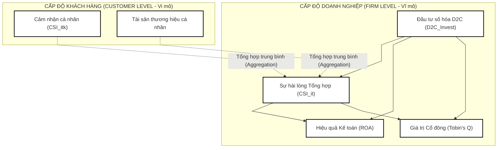

# ĐỀ CƯƠNG NGHIÊN CỨU LUẬN ÁN TIẾN SĨ

**Tên đề tài dự kiến:**
*   **Tiếng Việt:** Tác động của số hóa kênh phân phối trực tiếp (D2C) đến giá trị cổ đông và hiệu quả tài chính của các doanh nghiệp hàng tiêu dùng nhanh và bán lẻ tại Việt Nam: Vai trò trung gian của Tài sản thương hiệu và Sự hài lòng khách hàng.
*   **Tiếng Anh:** The Impact of Direct-to-Consumer (D2C) Channel Digitalization on Shareholder Value and Financial Performance of FMCG and Retail Firms in Vietnam: The Mediating Roles of Brand Equity and Customer Satisfaction.

**Chuyên ngành đào tạo:** Quản trị Kinh doanh
**Mã chuyên ngành:** 9340101
**Nghiên cứu sinh:** Lê Phúc Hải
**Cơ sở đào tạo:** Trường Đại học Tôn Đức Thắng

---

## TÓM TẮT NGHIÊN CỨU

Trong kỷ nguyên số, việc đầu tư hàng triệu USD vào kênh phân phối trực tiếp đến người tiêu dùng (Direct-to-Consumer - D2C) đặt ra yêu cầu cấp bách về trách nhiệm giải trình tiếp thị (Marketing Accountability). CFO và Hội đồng quản trị đòi hỏi phải thấy được tác động thực tế của các quyết định số hóa kênh bán hàng lên kết quả tài chính và giá trị cổ đông dài hạn. Luận án này được thiết kế theo Khung năng suất tiếp thị liên kết Tiếp thị - Tài chính (Marketing-Finance Interface) nhằm kiểm định thực chứng xem liệu đầu tư số hóa kênh D2C có thúc đẩy hiệu quả tài chính kế toán (ROA) và giá trị thị trường của doanh nghiệp (Tobin's Q) thông qua vai trò truyền dẫn trung gian của tài sản tiếp thị vô hình (Sự hài lòng khách hàng - CSI và Tài sản thương hiệu).

Nghiên cứu được triển khai thông qua thiết kế hỗn hợp đa nguồn dữ liệu (Multi-Source Triangulation Design) chia làm 3 nghiên cứu thành phần:
1.  **Nghiên cứu 1 (Định tính chuyên gia, n = 15):** Phỏng vấn sâu các CMO/CEO ngành FMCG và Bán lẻ tại Việt Nam để khám phá quy mô, chiến lược đầu tư kênh D2C và xây dựng khung lý thuyết liên kết.
2.  **Nghiên cứu 2 (Định lượng tiêu dùng, N = 500):** Khảo sát người tiêu dùng để đo lường CSI và Tài sản thương hiệu đối với các thương hiệu mục tiêu. Điểm số cá nhân sau đó được **tổng hợp (aggregate)** thành điểm số cấp doanh nghiệp (firm-level assets).
3.  **Nghiên cứu 3 (Kinh tế lượng Doanh nghiệp):** Thu thập dữ liệu bảng (Panel Data) giai đoạn 2018 - 2025 từ 75 doanh nghiệp FMCG và bán lẻ (bao gồm doanh nghiệp niêm yết, FDI và chưa niêm yết lớn) tại Việt Nam. Sử dụng các mô hình hồi quy dữ liệu bảng nâng cao (Fixed Effects, Hybrid Model, Hausman-Taylor) kết hợp kiểm soát nội sinh bằng Gaussian Copula trên phần mềm R.

Kết quả nghiên cứu kỳ vọng đóng góp quan trọng vào y văn quản trị chiến lược kênh phân phối và giao diện tiếp thị - tài chính tại các thị trường mới nổi, đồng thời cung cấp công cụ định lượng hỗ trợ các nhà quản lý trong việc tối ưu hóa hiệu năng đầu tư công nghệ số.

---

## 1. TÍNH CẤP THIẾT VÀ BỐI CẢNH NHẬN THỨC CỦA ĐỀ TÀI

### 1.1. Bối cảnh thực tiễn và Bài toán Trách nhiệm giải trình Tiếp thị (Marketing Accountability)
Trong bối cảnh kỷ nguyên số và sự cạnh tranh khốc liệt tại thị trường Việt Nam, các doanh nghiệp hàng tiêu dùng nhanh (FMCG) và bán lẻ lớn (như Vinamilk, Masan, Sabeco, Thế Giới Di Động, FPT Retail, PNJ) đang đầu tư hàng triệu USD để phát triển hệ thống phân phối trực tiếp đến người tiêu dùng (Direct-to-Consumer - D2C) thông qua các nền tảng thương mại điện tử, ứng dụng chính hãng (App) và hệ thống quản trị dữ liệu khách hàng (CRM/CDP). Mục tiêu của chiến lược này là tạo ra trải nghiệm mua sắm trực tiếp, bỏ qua trung gian và cá nhân hóa tương tác với người tiêu dùng.

Tuy nhiên, các khoản đầu tư công nghệ và chuyển đổi số này đang đối mặt với áp lực lớn từ Hội đồng quản trị và các giám đốc tài chính (CFO) về **Trách nhiệm giải trình Tiếp thị (Marketing Accountability)**. Doanh nghiệp cần câu trả lời rõ ràng: *Liệu việc đổ ngân sách lớn vào số hóa D2C có thực sự chuyển hóa thành giá trị tài chính thực tế, lợi nhuận kế toán (ROA) và giá trị thị trường của doanh nghiệp (chỉ số Tobin's Q) hay không?*

Về mặt lý thuyết, giao diện Tiếp thị - Tài chính (Marketing-Finance Interface) lập luận rằng các khoản đầu tư tiếp thị số hóa sẽ tạo ra các tài sản thị trường vô hình (Market-based Intangible Assets) – cụ thể là **Sự hài lòng khách hàng (CSI)** và **Tài sản thương hiệu (Brand Equity)**. Các tài sản này sau đó hoạt động như những biến truyền dẫn giúp giảm thiểu rủi ro dòng tiền, tăng doanh số và cuối cùng tối ưu hóa giá trị cổ đông dài hạn (Rust et al., 2004). 

Mặc dù vậy, tại một thị trường mới nổi với độ bất định cao và hành vi khách hàng thay đổi nhanh chóng như Việt Nam, cơ chế truyền dẫn từ "Đầu tư số hóa D2C" $\rightarrow$ "Tài sản khách hàng vô hình" $\rightarrow$ "Giá trị doanh nghiệp trên thị trường chứng khoán" vẫn là một hộp đen (black box) chưa được khai phá trọn vẹn bằng thực chứng định lượng.

---

### 1.2. Khoảng trống nghiên cứu của luận án (Research Gaps)
Luận án Tiến sĩ này tập trung giải quyết bốn khoảng trống lý thuyết và phương pháp luận cốt lõi sau:

1.  **Khoảng trống lý thuyết về Giao diện Tiếp thị - Tài chính (Marketing-Finance Interface):** Phần lớn nghiên cứu tiếp thị truyền thống (ở cấp độ luận văn Thạc sĩ) chỉ dừng lại ở việc đo lường CSI ở cấp độ vi mô (người tiêu dùng cá nhân) mà không chứng minh được giá trị kinh tế vĩ mô của nó đối với tổ chức. Luận án này lấp đầy khoảng trống bằng cách liên kết trực tiếp dữ liệu cảm nhận người dùng với kết quả tài chính trên Báo cáo tài chính doanh nghiệp.
2.  **Khoảng trống cơ chế truyền dẫn trực tiếp và gián tiếp của D2C:** Y văn chưa làm rõ liệu số hóa D2C tác động đến giá trị doanh nghiệp chủ yếu qua con đường trực tiếp (tiết giảm chi phí giao dịch, tăng biên lợi nhuận) hay con đường gián tiếp (tích lũy tài sản thương hiệu và sự hài lòng khách hàng).
3.  **Sự thiếu hụt thiết kế đa nguồn dữ liệu tích hợp (Multi-Source Triangulation):** Hầu hết các nghiên cứu tài chính chỉ dùng dữ liệu thứ cấp, còn các nghiên cứu marketing chỉ dùng dữ liệu khảo sát sơ cấp. Việc thiếu vắng một nghiên cứu tích hợp đa nguồn (Phỏng vấn sâu chuyên gia + Dữ liệu bảng tài chính niêm yết + Khảo sát người tiêu dùng tổng hợp) làm giảm tính thuyết phục và độ tin cậy của các kết luận.
4.  **Vấn đề sai lệch nội sinh (Endogeneity Bias) trong quản trị kênh:** Các nghiên cứu về mối quan hệ tiếp thị - hiệu quả tài chính thường bị đe dọa bởi tính nội sinh (do các yếu tố không quan sát được tác động đồng thời đến cả chi phí tiếp thị và lợi nhuận, hoặc do quan hệ nhân quả ngược). Luận án này giải quyết triệt để vấn đề này bằng cách áp dụng mô hình hồi quy dữ liệu bảng Fixed Effects kết hợp kiểm soát nội sinh bằng thuật toán Gaussian Copula (không cần biến công cụ) và các mô hình Hybrid (Between-Within) / Hausman-Taylor để xử lý các biến bất biến.

---

### 1.3. Lĩnh vực nghiên cứu và Đối tượng nghiên cứu
*   **Lĩnh vực:** Quản trị Kinh doanh, chuyên sâu vào **Quản trị Tiếp thị chiến lược** (Strategic Marketing Management), **Giao diện Tiếp thị - Tài chính** (Marketing-Finance Interface) và **Quản trị Kênh phân phối số hóa** (Digital Channel Management).
*   **Đối tượng nghiên cứu:** Mối quan hệ tương tác giữa đầu tư số hóa D2C, tài sản thương hiệu vô hình (CSI, Brand Equity) và hiệu quả tài chính doanh nghiệp (ROA, Tobin's Q) của các doanh nghiệp FMCG và Bán lẻ (bao gồm cả niêm yết, FDI và chưa niêm yết lớn) tại Việt Nam.

---

## 2. CƠ SỞ LÝ THUYẾT VÀ TỔNG QUAN TÀI LIỆU

### 2.1. Giao diện Tiếp thị - Tài chính (Marketing-Finance Interface)
Trong nhiều thập kỷ, tiếp thị và tài chính hoạt động như hai thái cực độc lập trong doanh nghiệp. Tuy nhiên, xu hướng nghiên cứu hiện đại từ những năm 2000 đã thúc đẩy giao diện Tiếp thị - Tài chính (Srivastava et al., 1998; Anderson et al., 2004). Khung lý thuyết này lập luận rằng các quyết định đầu tư tiếp thị (như phát triển kênh D2C) không phải là chi phí ngắn hạn (expenses) mà là các hoạt động tích lũy tài sản thị trường vô hình (Market-based Intangible Assets). 

Tài sản tiếp thị vô hình cốt lõi bao gồm:
*   **Sự hài lòng khách hàng (CSI):** Phản ánh chất lượng mối quan hệ và mức độ đáp ứng kỳ vọng của khách hàng.
*   **Tài sản thương hiệu (Brand Equity):** Phản ánh sức mạnh nhận diện, uy tín và lòng trung thành đối với nhãn hiệu.

Theo Edeling & Fischer (2016), các tài sản vô hình này giúp nâng cao hiệu quả tài chính thông qua ba cơ chế: (1) Tăng cường dòng tiền (Cash Flow Acceleration), (2) Giảm thiểu rủi ro dòng tiền (Cash Flow Risk Reduction), và (3) Kéo dài thời gian sinh lời của dòng tiền. Hiệu quả này cuối cùng được phản ánh trên hai nhóm chỉ số tài chính: nhóm chỉ số kế toán (ROA, ROE) và nhóm chỉ số thị trường chứng khoán (Tobin's Q - đại diện cho giá trị cổ đông).

---

### 2.2. Thuyết Năng lực động (Dynamic Capabilities Theory)
Thuyết Năng lực động (Teece, Pisano, & Shuen, 1997) giải thích cách thức doanh nghiệp tích hợp, xây dựng và tái định hình các năng lực bên trong và bên ngoài để thích ứng với môi trường thay đổi nhanh chóng. Trong kỷ nguyên thương mại số, **Năng lực số hóa kênh phân phối D2C (D2C Digitalization Capability)** được xem là một năng lực động cốt lõi. 

Thông qua D2C, doanh nghiệp phát triển các năng lực:
*   *Cảm nhận cơ hội (Sensing):* Trực tiếp thu thập dữ liệu hành vi người tiêu dùng thời gian thực mà không qua trung gian.
*   *Nắm bắt cơ hội (Seizing):* Cá nhân hóa ưu đãi, chăm sóc khách hàng và phản hồi khiếu nại ngay lập tức.
*   *Tái định hình tài sản (Transforming):* Tối ưu hóa danh mục sản phẩm và chuyển đổi cấu trúc kênh phân phối linh hoạt.
Năng lực động này là tiền đề trực tiếp để tích lũy tài sản khách hàng và tạo dựng vị thế cạnh tranh bền vững của doanh nghiệp.

---

### 2.3. Khung Năng suất Tiếp thị (Marketing Productivity Model)
Khung năng suất tiếp thị (Rust et al., 2004) mô tả chuỗi giá trị truyền dẫn từ hành động tiếp thị đến giá trị cổ đông:

$$\text{Đầu tư số hóa D2C} \longrightarrow \text{Tài sản khách hàng (CSI, Brand Equity)} \longrightarrow \text{Hành vi khách hàng (Mua lại, eWOM)} \longrightarrow \text{Hiệu quả Tài chính (ROA, Tobin's Q)}$$

Mô hình này chỉ ra rằng đầu tư số hóa D2C không tác động ngay lập tức đến kết quả tài chính mà phải đi qua "cầu nối" trung gian là thái độ và nhận thức của khách hàng. Nếu doanh nghiệp đầu tư số hóa D2C nhưng không cải thiện được CSI hoặc Brand chất lượng cảm nhận, dòng vốn đầu tư sẽ bị lãng phí và không thể tạo ra giá trị tài chính.

---

### 2.4. Đặc thù ngành FMCG và Bán lẻ tại Việt Nam
*   **Ngành FMCG:** Vốn dĩ có cấu trúc kênh gián tiếp nặng nề. Việc chuyển dịch D2C buộc các hãng (như Vinamilk, Masan) phải tự xây dựng năng lực hậu cần chặng cuối (last-mile delivery) và quản trị người tiêu dùng trực tiếp - điều họ chưa từng làm trước đây. Điều này tạo ra chi phí đầu tư ban đầu cực lớn (relational drag).
*   **Ngành Bán lẻ (Retailers):** Bản chất đã có sẵn tương tác trực tiếp với khách hàng tại cửa hàng vật lý. Số hóa D2C (như MWG, FRT phát triển e-commerce) thực chất là sự chuyển dịch Omnichannel nhằm tối ưu hóa chi phí vận hành và tăng tần suất mua sắm của tệp khách hàng sẵn có.

---

### 2.5. Khoảng trống nghiên cứu (Research Gaps) của Luận án
Luận án Tiến sĩ này tập trung giải quyết các khoảng trống lý luận lớn:
*   **Gap 1 (Thiếu hụt nghiên cứu tích hợp vĩ mô - vi mô):** Y văn Việt Nam thiếu vắng các mô hình liên kết trực tiếp giữa khảo sát tiêu dùng (CSI) và số liệu báo cáo tài chính kiểm toán của các công ty niêm yết.
*   **Gap 2 (Cơ chế tác động trực tiếp và gián tiếp):** Các nghiên cứu hiện tại chưa phân tách rõ mức độ đóng góp của kênh D2C qua con đường tối ưu hóa chi phí vận hành (đường trực tiếp) và con đường nâng cao giá trị tài sản khách hàng vô hình (đường gián tiếp).
*   **Gap 3 (Vấn đề nội sinh và triệt tiêu biến trong đánh giá hiệu quả tiếp thị):** Chưa có nghiên cứu kênh phân phối nào tại Việt Nam áp dụng mô hình Fixed Effects kết hợp Gaussian Copula, Hybrid Model và ước lượng Hausman-Taylor để xử lý triệt để sai lệch nội sinh cũng như bẫy triệt tiêu biến bất biến theo thời gian của doanh nghiệp.

---

## 3. MỤC ĐÍCH VÀ CÂU HỎI NGHIÊN CỨU

### 3.1. Mục tiêu tổng quát
Giải mã cơ chế tác động của số hóa kênh phân phối trực tiếp (D2C) đến giá trị cổ đông (chỉ số Tobin's Q) và hiệu quả tài chính kế toán (chỉ số ROA) của các doanh nghiệp hàng tiêu dùng nhanh (FMCG) và bán lẻ (bao gồm doanh nghiệp niêm yết, FDI và chưa niêm yết lớn) tại Việt Nam, làm rõ vai trò trung gian truyền dẫn của các tài sản tiếp thị vô hình (Sự hài lòng khách hàng - CSI và Tài sản thương hiệu) thông qua phương pháp đa nguồn dữ liệu tích hợp.

---

### 3.2. Mục tiêu cụ thể
Luận án được triển khai qua chuỗi 3 nghiên cứu thành phần với các mục tiêu cụ thể sau:
1.  **Nghiên cứu 1 (Định tính chuyên gia và Phân tích nội dung):** Phỏng vấn sâu 15 - 20 CMO/CEO ngành FMCG và Bán lẻ tại Việt Nam và Phân tích nội dung Báo cáo thường niên nhằm khám phá bản chất chiến lược, xây dựng chỉ số chấm điểm mức độ số hóa D2C và thiết lập khung lý thuyết liên kết Tiếp thị - Tài chính.
2.  **Nghiên cứu 2 (Định lượng người tiêu dùng):** Khảo sát diện rộng người tiêu dùng ($N = 500$) để đo lường và đánh giá chỉ số hài lòng khách hàng (CSI) và tài sản thương hiệu của các doanh nghiệp mục tiêu, sau đó thực hiện **tổng hợp (aggregation)** dữ liệu lên cấp độ doanh nghiệp (firm-level).
3.  **Nghiên cứu 3 (Kinh tế lượng doanh nghiệp):** Thu thập dữ liệu tài chính bảng (Panel Data) giai đoạn 2018 - 2025 từ 75 doanh nghiệp FMCG và bán lẻ (bao gồm doanh nghiệp niêm yết, FDI và chưa niêm yết lớn). Áp dụng các mô hình hồi quy dữ liệu bảng nâng cao (Fixed Effects, Hybrid Model, Hausman-Taylor) kết hợp kiểm soát nội sinh bằng Gaussian Copula trên phần mềm R để đánh giá đường dẫn tác động trực tiếp và gián tiếp (qua trung gian CSI/Tài sản thương hiệu) của số hóa D2C lên Tobin's Q và ROA.
4.  **Hàm ý quản trị:** Đề xuất một khung giải pháp định lượng giúp các doanh nghiệp FMCG và Bán lẻ Việt Nam tối ưu hóa việc phân bổ ngân sách số hóa kênh, chứng minh giá trị kinh tế của bộ phận tiếp thị trước cổ đông.

---

### 3.3. Câu hỏi nghiên cứu
1.  **Câu hỏi cho Nghiên cứu 1:** Các nhà quản trị tiếp thị và kênh phân phối định nghĩa, triển khai và đo lường chi phí đầu tư số hóa D2C trong ngành FMCG và Bán lẻ Việt Nam như thế nào?
2.  **Câu hỏi cho Nghiên cứu 2:** Chỉ số CSI và Tài sản thương hiệu của các doanh nghiệp mục tiêu dưới cảm nhận của người tiêu dùng đạt giá trị bao nhiêu và có sự phân hóa thế nào giữa các thương hiệu?
3.  **Câu hỏi cho Nghiên cứu 3:** Số hóa kênh D2C tác động trực tiếp và gián tiếp (thông qua CSI và Tài sản thương hiệu) đến Tobin's Q và ROA của các doanh nghiệp FMCG và bán lẻ (bao gồm doanh nghiệp niêm yết, FDI và chưa niêm yết lớn) tại Việt Nam như thế nào? Các mô hình hồi quy dữ liệu bảng nâng cao trên R kiểm soát sai lệch nội sinh chỉ ra các hệ số tác động $\beta$ thực tế là bao nhiêu?

---

## 4. ĐỐI TƯỢNG VÀ PHẠM VI NGHIÊN CỨU

### 4.1. Đối tượng và khách thể nghiên cứu
*   **Đối tượng nghiên cứu:** Cơ chế tác động của số hóa kênh D2C đến giá trị cổ đông (Tobin's Q) và hiệu quả tài chính kế toán (ROA) của các doanh nghiệp FMCG và Bán lẻ, thông qua vai trò trung gian truyền dẫn của tài sản thương hiệu vô hình (CSI, Brand Equity).
*   **Khách thể nghiên cứu (Cấp độ Tổ chức - Phía cung):** Các doanh nghiệp thuộc ngành Hàng tiêu dùng nhanh (FMCG) và Bán lẻ đang hoạt động tại Việt Nam có triển khai số hóa kênh D2C hoặc thương mại điện tử. Để đảm bảo lực thống kê (statistical power) cho các ước lượng, khách thể nghiên cứu được mở rộng bao gồm cả:
    1.  Các doanh nghiệp niêm yết trên thị trường chứng khoán Việt Nam (sàn HOSE và HNX) (ví dụ: Vinamilk, Masan, Sabeco, Kido, Thế Giới Di Động, FPT Retail, PNJ, Digiworld...).
    2.  Các doanh nghiệp FDI và doanh nghiệp lớn chưa niêm yết trong ngành FMCG và bán lẻ tại Việt Nam (ví dụ: Unilever Việt Nam, Coca-Cola Việt Nam, Suntory PepsiCo, Lotte Mart, Central Retail, Aeon Việt Nam...).
*   **Khách thể nghiên cứu (Cấp độ Cá nhân - Phía cầu):** Người tiêu dùng từ 18 tuổi trở lên tại Việt Nam có hành vi mua sắm và tương tác với các kênh phân phối của các doanh nghiệp mục tiêu nêu trên.

---

### 4.2. Phạm vi nghiên cứu
*   **Phạm vi không gian:**
    *   *Dữ liệu tài chính thứ cấp:* Toàn quốc (thu thập báo cáo tài chính kiểm toán và báo cáo thuế của các công ty niêm yết và chưa niêm yết lớn thông qua các cổng dữ liệu quốc gia và các đơn vị cung cấp dữ liệu uy tín như VIRAC, Vietnam Credit).
    *   *Dữ liệu khảo sát sơ cấp:* Tập trung thu thập tại hai trung tâm kinh tế và tiêu dùng lớn nhất Việt Nam là Thành phố Hồ Chí Minh và Hà Nội.
*   **Phạm vi thời gian:**
    *   *Dữ liệu bảng tài chính (Panel Data):* Giai đoạn 8 năm từ năm 2018 đến hết năm 2025.
    *   *Dữ liệu khảo sát và phỏng vấn:* Triển khai thu thập và phân tích từ năm 2026 đến năm 2027.
*   **Phạm vi lý thuyết:** Giới hạn trong lý thuyết Giao diện Tiếp thị - Tài chính (Marketing-Finance Interface), Thuyết Năng lực động (Dynamic Capabilities Theory) và Khung năng suất tiếp thị. Nghiên cứu tập trung vào các biến số tài chính (Tobin's Q, ROA, quy mô doanh nghiệp, đòn bẩy tài chính, tốc độ tăng trưởng doanh thu) và các biến số tiếp thị vô hình (CSI, Tài sản thương hiệu, mức độ đầu tư số hóa D2C, đặc tính sản phẩm).

---

## 5. PHƯƠNG PHÁP NGHIÊN CỨU

Luận án sử dụng thiết kế Đa nguồn dữ liệu liên kết Tiếp thị - Tài chính (Marketing-Finance Interface) nhằm giải quyết bài toán trách nhiệm giải trình tiếp thị. Thiết kế này tích hợp thông tin từ 3 nghiên cứu độc lập để tạo lập hệ thống kiểm chứng vĩ mô - vi mô toàn diện.

### 5.1. Sơ đồ liên kết dữ liệu vĩ mô - vi mô (Macro-Micro Linkage Flowchart)

*Hình 3. Mô hình lý thuyết truyền dẫn Tiếp thị - Tài chính đa cấp độ*

---

### 5.2. Nghiên cứu 1: Định tính và Phân tích nội dung (Phía Cung)
*   **Mục tiêu:** Thiết lập khung đo lường thực tế cho mức độ đầu tư số hóa kênh D2C của doanh nghiệp và kiểm chứng các nhân tố tác động trong bối cảnh Việt Nam.
*   **Phương pháp:** Kết hợp phỏng vấn sâu bán cấu trúc ($n = 15$ CMO, CFO, Giám đốc kênh thương mại điện tử) và **Phân tích nội dung (Content Analysis)** dựa trên Báo cáo thường niên, Báo cáo phát triển bề vững của doanh nghiệp.
*   **Chỉ số hóa D2C (D2C Digitalization Intensity Index):** Để khắc phục các sai số đo lường từ việc sử dụng các chỉ số tài chính chung chung (như chi phí bán hàng có thể bao gồm nhiều chi phí phi kỹ thuật số), nghiên cứu xây dựng chỉ số mã hóa (Coded Index) từ 1 đến 5 để đánh giá mức độ số hóa kênh D2C của doanh nghiệp qua từng năm dựa trên phương pháp phân tích nội dung văn bản:
    *   *Mức 1 (Truyền thống):* Chưa có kênh D2C số hóa, phân phối hoàn toàn qua các trung gian bán buôn/bán lẻ truyền thống.
    *   *Mức 2 (Tiếp cận cơ bản):* Có website/fanpage giới thiệu sản phẩm và thương hiệu nhưng chưa tích hợp tính năng giao dịch trực tuyến.
    *   *Mức 3 (Giao dịch đơn kênh):* Vận hành kênh bán hàng trực tuyến D2C (Website/App riêng hoặc Gian hàng chính hãng trên sàn TMĐT) nhưng dữ liệu và chuỗi cung ứng vận hành độc lập, thủ công.
    *   *Mức 4 (Đa kênh tích hợp - Omnichannel):* Triển khai mô hình Omnichannel, đồng bộ hóa tồn kho và đơn hàng giữa các kênh trực tuyến và trực tiếp, tích hợp một phần hệ thống CRM.
    *   *Mức 5 (Số hóa toàn diện & Cá nhân hóa):* Vận hành hệ thống D2C thông minh dựa trên nền tảng dữ liệu khách hàng tập trung (CDP - Customer Data Platform), cá nhân hóa trải nghiệm khách hàng theo thời gian thực (Real-time personalization), tự động hóa logistics và chăm sóc khách hàng.
*   **Đầu ra:** Bảng điểm chỉ số số hóa D2C ($\text{D2C\_Invest}_{it}$) của các doanh nghiệp trong mẫu nghiên cứu giai đoạn 2018 - 2025.

---

### 5.3. Nghiên cứu 2: Định lượng khách hàng (Survey & Aggregation)
*   **Quy mô mẫu:** Khảo sát người tiêu dùng trực tuyến và trực tiếp ($N = 500$) có kinh nghiệm mua hàng của 75 doanh nghiệp FMCG và Bán lẻ mục tiêu.
*   **Nội dung đo lường:** Sự hài lòng (CSI - 3 quan sát của ACSI) và Tài sản thương hiệu (Brand Equity - Yoo & Donthu, 2001) bằng thang đo Likert 7 điểm.
*   **Quy trình tổng hợp (Aggregation):** Để đưa dữ liệu khách hàng (vi mô) về cấp độ doanh nghiệp (vĩ mô), điểm số của từng cá nhân được tính trung bình theo công thức:

$$\text{CSI}_{it} = \frac{1}{N_{it}} \sum_{k=1}^{N_{it}} \text{CSI}_{itk}$$

*(Trong đó, $\text{CSI}_{it}$ là điểm hài lòng tổng hợp của doanh nghiệp $i$ tại năm $t$; $N_{it}$ là số lượng đáp viên đánh giá doanh nghiệp $i$ tại năm $t$; $\text{CSI}_{itk}$ là điểm hài lòng của đáp viên $k$ dành cho doanh nghiệp $i$)*.

---

### 5.4. Nghiên cứu 3: Kinh tế lượng Doanh nghiệp (Panel Data)
Nghiên cứu 3 sử dụng dữ liệu bảng (Panel Data) của 75 doanh nghiệp FMCG và bán lẻ (bao gồm cả các doanh nghiệp niêm yết, doanh nghiệp chưa niêm yết lớn và doanh nghiệp FDI) giai đoạn 2018 - 2025 (tổng số quan sát tối đa $N \times T = 600$).

#### 5.4.1. Hệ phương trình hồi quy Kinh tế lượng
Để giảm thiểu vấn đề nhân quả ngược (reverse causality), tất cả các biến tác động độc lập và trung gian cấp doanh nghiệp đều được đưa vào mô hình dưới dạng trễ một chu kỳ ($t-1$). Để đánh giá vai trò điều tiết của đặc tính sản phẩm (trải nghiệm/hedonic so với tiện ích/utilitarian), nghiên cứu tích hợp biến tương tác $\text{D2C\_Invest}_{i,t-1} \times \text{Hedonic}_i$. Luận án kiểm định cơ chế truyền dẫn qua hệ 3 phương trình đồng thời:

**Phương trình 1: Tác động của D2C đến Sự hài lòng tổng hợp (CSI)**
$$\text{CSI}_{it} = \alpha_0 + \alpha_1 \text{D2C\_Invest}_{i,t-1} + \alpha_2 \text{Size}_{it} + \alpha_3 \text{Lev}_{it} + \alpha_4 \text{Adv}_{it} + \eta_i + \epsilon_{it}$$

**Phương trình 2: Tác động truyền dẫn lên hiệu quả kế toán (ROA) với biến điều tiết**
$$\text{ROA}_{it} = \beta_0 + \beta_1 \text{CSI}_{i,t-1} + \beta_2 \text{D2C\_Invest}_{i,t-1} + \beta_3 (\text{D2C\_Invest}_{i,t-1} \times \text{Hedonic}_i) + \beta_4 \text{Size}_{it} + \beta_5 \text{Lev}_{it} + \beta_6 \text{SG}_{it} + \eta_i + \mu_{it}$$

**Phương trình 3: Tác động truyền dẫn lên giá trị thị trường của cổ đông (Tobin's Q) với biến điều tiết**
$$\text{Tobin's Q}_{it} = \gamma_0 + \gamma_1 \text{CSI}_{i,t-1} + \gamma_2 \text{D2C\_Invest}_{i,t-1} + \gamma_3 (\text{D2C\_Invest}_{i,t-1} \times \text{Hedonic}_i) + \gamma_4 \text{Size}_{it} + \gamma_5 \text{Lev}_{it} + \gamma_6 \text{SG}_{it} + \eta_i + v_{it}$$

#### Định nghĩa chi tiết các biến số trong mô hình:
1.  **Biến phụ thuộc:**
    *   $\text{Tobin's Q}_{it}$: Giá trị thị trường của doanh nghiệp $i$ năm $t$, đo bằng tỷ số giữa (Giá trị vốn hóa + Nợ phải trả) trên Tổng tài sản.
    *   $\text{ROA}_{it}$: Tỷ suất sinh lời trên tổng tài sản của doanh nghiệp $i$ năm $t$.
2.  **Biến trung gian trễ:**
    *   $\text{CSI}_{i,t-1}$: Chỉ số hài lòng khách hàng tổng hợp trễ 1 năm của doanh nghiệp $i$ (kết quả trích xuất trễ từ Nghiên cứu 2).
3.  **Biến độc lập trễ:**
    *   $\text{D2C\_Invest}_{i,t-1}$: Chỉ số đầu tư số hóa kênh D2C trễ 1 năm của doanh nghiệp $i$ (xác định qua chỉ số mã hóa từ phân tích nội dung Báo cáo thường niên).
4.  **Biến điều tiết bất biến theo thời gian:**
    *   $\text{Hedonic}_i$: Biến giả (dummy variable) nhận giá trị 1 nếu doanh nghiệp kinh doanh nhóm hàng mang thiên hướng cảm xúc/trải nghiệm (Hedonic - ví dụ: trang sức PNJ, bia Sabeco) và nhận giá trị 0 nếu kinh doanh nhóm hàng mang thiên hướng tiện ích/chức năng (Utilitarian - ví dụ: sữa Vinamilk, đường Quảng Ngãi, hệ thống bán lẻ nhu yếu phẩm).
    *   $\text{D2C\_Invest}_{i,t-1} \times \text{Hedonic}_i$: Biến tương tác nhân quả để đánh giá sự khác biệt về hiệu quả đầu tư số hóa D2C giữa hai nhóm sản phẩm.
5.  **Biến kiểm soát (Control Variables):**
    *   $\text{Size}_{it}$: Quy mô doanh nghiệp, đo bằng logarit tự nhiên của Tổng tài sản ($\ln(\text{Total Assets})$).
    *   $\text{Lev}_{it}$: Đòn bẩy tài chính, tỷ lệ Tổng nợ / Tổng tài sản.
    *   $\text{SG}_{it}$: Tốc độ tăng trưởng doanh thu (Sales Growth) so với năm trước.
    *   $\text{Adv}_{it}$: Cường độ quảng cáo, đo bằng chi phí quảng cáo / Tổng doanh thu.
    *   $\eta_i$: Sai số đặc trưng bất biến theo thời gian của từng doanh nghiệp (Firm-specific fixed effect).
    *   $\epsilon_{it}, \mu_{it}, v_{it}$: Sai số ngẫu nhiên.

---

### 5.5. Kiểm soát sai lệch nội sinh, bẫy triệt tiêu biến Fixed Effects và kỹ thuật ước lượng nâng cao
Mối quan hệ Tiếp thị - Tài chính luôn đối mặt với vấn đề nội sinh (Endogeneity) do biến bị bỏ sót (omitted variables) hoặc tự chọn lựa mẫu. Do số lượng doanh nghiệp FMCG và bán lẻ trong mẫu nghiên cứu tương đối giới hạn ($N \approx 75$), việc sử dụng ước lượng System-GMM là không phù hợp vì dễ gây ra lỗi bùng nổ biến công cụ (Instrument Proliferation - Roodman, 2009) và sai lệch mẫu nhỏ.

Để giải quyết triệt để các thách thức về kinh tế lượng, luận án kết hợp đồng thời ba giải pháp tiên tiến trên nền tảng lập trình R:
1.  **Sử dụng biến độc lập trễ một chu kỳ ($t-1$):** Cấu trúc trễ thời gian tự động loại bỏ khả năng nhân quả ngược từ hiệu quả tài chính ở năm $t$ tác động ngược lại quyết định đầu tư tiếp thị ở năm $t-1$.
2.  **Phương pháp Gaussian Copula (Park & Gupta, 2012):** Đây là kỹ thuật kiểm soát nội sinh không cần biến công cụ (Instrument-free), được khuyến nghị mạnh mẽ trong các nghiên cứu Marketing hàng đầu (ví dụ: Hult et al., 2018). Quy trình thực hiện trên R:
    *   Xác định các biến trễ có khả năng bị nội sinh ($\text{CSI}_{i,t-1}$, $\text{D2C\_Invest}_{i,t-1}$).
    *   Tính toán phân phối thực nghiệm của các biến này để tạo ra các thuật ngữ Copula ($C^*$).
    *   Đưa các thuật ngữ Copula này vào mô hình hồi quy để kiểm soát và hấp thụ hoàn toàn sai lệch nội sinh.
3.  **Xử lý bẫy triệt tiêu biến bất biến trong mô hình Tác động cố định (Fixed Effects Collinearity Trap):**
    *   *Thách thức:* Đặc tính sản phẩm ($\text{Hedonic}_i$) và chỉ số hài lòng khách hàng tổng hợp ($\text{CSI}_{i}$) (nếu giả định ổn định trong ngắn hạn) là các biến bất biến theo thời gian. Trong mô hình Fixed Effects thông thường, các biến này sẽ bị triệt tiêu hoàn toàn (dropped) do hiện tượng cộng tuyến hoàn hảo với các tác động cố định doanh nghiệp $\eta_i$.
    *   *Mô hình Hybrid (Between-Within) (Allison, 2009):* Tiến hành phân tách các biến biến động thành thành phần trong nhóm (within) và thành phần trung bình nhóm (between). Ước lượng Hybrid Model trên R (bằng các gói như `lme4` hay `plm`) cho phép giữ lại và ước lượng trực tiếp ảnh hưởng của các biến bất biến (như đặc tính sản phẩm $\text{Hedonic}_i$) mà vẫn kiểm soát được các đặc điểm không quan sát được của doanh nghiệp tương đương với FE truyền thống.
    *   *Ước lượng Hausman-Taylor (1981):* Sử dụng cấu trúc dữ liệu bảng để tạo ra các biến công cụ nội bộ từ các biến biến đổi theo thời gian để xử lý nội sinh. Phương pháp này cho phép ước lượng nhất quán các biến bất biến theo thời gian (như đặc tính sản phẩm, hoặc chỉ số hài lòng khách hàng) mà không cần biến công cụ ngoài. Luận án sẽ so sánh kết quả giữa mô hình FE chuẩn, Hybrid Model và Hausman-Taylor để đảm bảo tính vững chãi của kết quả (robustness checks).

---

## 6. KẾ HOẠCH NGHIÊN CỨU (CỤ THỂ MỖI 06 THÁNG)
Toàn bộ tiến trình được thiết kế trong 36 tháng, lồng ghép chặt chẽ giữa học tập lý thuyết chuyên sâu, thu thập dữ liệu đa nguồn (thứ cấp tài chính và sơ cấp khảo sát) và chạy các mô hình kinh tế lượng trên R.

**Bảng 2: Dự kiến kế hoạch học tập và nghiên cứu toàn khóa**
| STT | Nội dung công việc và Nhiệm vụ | Thời gian thực hiện | Kết quả dự kiến |
|---|---|---|---|
| 1 | Học các học phần Tiến sĩ; Hoàn thiện Tổng quan tài liệu về Giao diện Tiếp thị - Tài chính; **Triển khai Nghiên cứu 1 (Định tính chuyên gia)**: Phỏng vấn sâu n = 15 chuyên gia để xây dựng thang đo chi phí D2C. | Tháng 1 - Tháng 6 | Hoàn thành tín chỉ bắt buộc; Đề cương chi tiết được duyệt; Dự thảo thang đo chi phí số hóa D2C. |
| 2 | Triển khai **Nghiên cứu 2 (Định lượng tiêu dùng)**: Khảo sát N = 500 khách hàng đánh giá các thương hiệu mục tiêu; Đồng thời thu thập dữ liệu tài chính thứ cấp và chấm điểm phân tích nội dung của 75 doanh nghiệp (2018 - 2025). | Tháng 7 - Tháng 12 | Tập dữ liệu khảo sát sạch N = 500; Bảng dữ liệu tài chính thứ cấp; Viết và đăng 01 bài báo Hội thảo khoa học. |
| 3 | Thực hiện tổng hợp dữ liệu khảo sát lên cấp doanh nghiệp; Chạy các mô hình hồi quy dữ liệu bảng nâng cao (Fixed Effects, Hybrid Model, Hausman-Taylor) kết hợp kiểm soát nội sinh bằng Gaussian Copula trên phần mềm R; Nộp bài báo quốc tế số 1 (Scopus/ISI Q1/Q2). | Tháng 13 - Tháng 18 | Báo cáo kết quả phân tích kinh tế lượng hoàn chỉnh; Bản thảo bài báo số 1 đã gửi tạp chí. |
| 4 | Báo cáo Chuyên đề Tiến sĩ 1 & 2; Trình bày kết quả tại Seminar cấp Khoa; Nhận xét phản biện và chỉnh sửa bài báo quốc tế số 1. | Tháng 19 - Tháng 24 | Đạt yêu cầu Chuyên đề 1 & 2; Nhận thư chấp nhận đăng bài (Acceptance Letter) của tạp chí Scopus/ISI số 1. |
| 5 | Báo cáo Chuyên đề Tiến sĩ 3; Gửi bài báo số 2 (Tạp chí uy tín thuộc danh mục HĐGS ngành công nhận hoặc tạp chí Scopus thứ hai); Hoàn thành 80% bản thảo Luận án Tiến sĩ. | Tháng 25 - Tháng 30 | Hoàn thành Chuyên đề 3; Dự thảo luận án hoàn thiện. |
| 6 | Trình bày chuyên đề tại Seminar cấp Bộ môn; Chỉnh sửa luận án theo góp ý; Thực hiện các thủ tục phản biện kín và bảo vệ Luận án Tiến sĩ cấp Cơ sở & cấp Trường. | Tháng 31 - Tháng 36 | Bảo vệ thành công Luận án Tiến sĩ ngành Quản trị Kinh doanh (chuyên sâu Marketing-Finance). |

---

## 7. MỤC TIÊU VÀ MONG MUỐN ĐẠT ĐƯỢC KHI ĐĂNG KÝ TUYỂN SINH
- **Nâng tầm năng lực nghiên cứu liên ngành Tiếp thị - Tài chính:** Chuyển dịch từ việc áp dụng các lý thuyết marketing hành vi đơn thuần sang giao diện Tiếp thị - Tài chính (Marketing-Finance Interface), làm chủ các phương pháp kinh tế lượng dữ liệu bảng (Panel Data) nâng cao (Fixed Effects, Hybrid Model, Hausman-Taylor) và kiểm soát nội sinh bằng Gaussian Copula để đánh giá giá trị cổ đông dài hạn.
- **Giải quyết bài toán thực tiễn của doanh nghiệp:** Cung cấp cho các doanh nghiệp FMCG và Bán lẻ tại Việt Nam một khung định giá định lượng khoa học và thực tế, giúp chứng minh tác động của chi phí đầu tư số hóa kênh D2C lên hiệu quả kinh doanh kế toán và giá trị thị trường của doanh nghiệp, thiết lập tiếng nói chung giữa CMO và CFO.
- **Đóng góp y văn toàn cầu từ thị trường mới nổi:** Đưa các bằng chứng thực nghiệm về hiệu năng năng suất tiếp thị tại Việt Nam vào bản đồ nghiên cứu quản trị tiếp thị chiến lược trên các tạp chí quốc tế thuộc danh mục Scopus/ISI.

---

## 8. LÝ DO CHỌN ĐẠI HỌC TÔN ĐỨC THẮNG LÀM CƠ SỞ ĐÀO TẠO
- **Môi trường nghiên cứu định lượng chuẩn mực:** Trường Đại học Tôn Đức Thắng (TDTU) là một trong những đơn vị đào tạo hàng đầu Việt Nam thúc đẩy các nghiên cứu định lượng chuẩn mực quốc tế trong lĩnh vực Quản trị Kinh doanh. Sự hỗ trợ từ các chuyên gia giàu kinh nghiệm về kinh tế lượng dữ liệu bảng (Panel Data), các mô hình bảng nâng cao (Hybrid Model, Hausman-Taylor) và kiểm soát nội sinh (Gaussian Copula) là điểm tựa vững chắc cho phương pháp nghiên cứu liên ngành của đề án.
- **Tiêu chuẩn học thuật quốc tế minh bạch:** Môi trường nghiên cứu liêm chính, khắt khe và hệ thống tài nguyên thư viện chuẩn mực quốc tế của TDTU cung cấp nguồn cảm hứng và động lực lớn lao để hoàn thành luận án với chất lượng cao nhất, đáp ứng các yêu cầu công bố khoa học quốc tế khắt khe trên các tạp chí thuộc danh mục Scopus/ISI.

---

## 9. KINH NGHIỆM VỀ NGHIÊN CỨU, THỰC TẾ, HOẠT ĐỘNG XÃ HỘI VÀ NGOẠI KHÓA

Nghiên cứu sinh có nền tảng đào tạo liên ngành giữa Công nghệ Thông tin và Quản trị Kinh doanh, cùng với 15 năm kinh nghiệm làm việc thực tiễn tại các tập đoàn FMCG đa quốc gia và tập đoàn công nghệ lớn. Những kinh nghiệm này cung cấp một bệ phóng thực tiễn và kỹ năng phân tích định lượng vững chắc để thực hiện thành công đề tài nghiên cứu liên ngành Tiếp thị - Tài chính này. Cụ thể:

**9.1. Nền tảng học vấn**
- **Cử nhân Công nghệ Thông tin (2012):** Cung cấp kiến thức nền tảng về cấu trúc dữ liệu, thuật toán và tư duy lập trình khoa học máy tính. Đây là cơ sở cốt lõi giúp nghiên cứu sinh hiểu sâu sắc về kiến trúc vận hành của các kênh số hóa D2C và quản trị cơ sở dữ liệu khách hàng.
- **Cử nhân Quản trị Kinh doanh (2015):** Cung cấp kiến thức nền tảng về quản trị kênh phân phối, tài chính doanh nghiệp và các nguyên lý marketing căn bản.
- **Thạc sĩ Quản trị Kinh doanh - MBA (2020):** Trang bị tư duy quản trị chiến lược, phân tích dữ liệu kinh doanh và ra quyết định dựa trên các bằng chứng thực nghiệm và mô hình định lượng.

**9.2. Kinh nghiệm thực tiễn (15 năm)**
- **Kinh nghiệm chuyên môn tại các doanh nghiệp FMCG hàng đầu:** Từng đảm nhiệm các vị trí quản lý hệ thống thông tin và phân tích dữ liệu thương mại tại Coca-Cola và Mondelez Kinh Đô. Quá trình này giúp nghiên cứu sinh tích lũy kinh nghiệm thực tế sâu sắc về cơ cấu kênh phân phối, chi phí bán hàng, chi phí xúc tiến thương mại và bài toán mâu thuẫn kênh khi triển khai D2C.
- **Kinh nghiệm quản lý dữ liệu và chuyển đổi số:** Hiện đảm nhiệm vị trí Head of Engineering tại Tập đoàn CJ Việt Nam, trực tiếp quản lý bộ phận Dữ liệu Kinh doanh Thông minh (Business Intelligence) và các dự án chuyển đổi số thương mại. Công việc này giúp nghiên cứu sinh tiếp cận trực tiếp với việc thiết lập và tối ưu hóa ngân sách đầu tư công nghệ số.
- **Phát triển công cụ phân tích định lượng:** Là nhà sáng lập (Founder) của hệ thống ncskit.org, một nền tảng phân tích khoa học định lượng hỗ trợ các phương pháp thống kê nâng cao dựa trên ngôn ngữ lập trình R. Nền tảng này hỗ trợ tính toán các mô hình kinh tế lượng học thuật (như dữ liệu bảng Panel Data), cung cấp kinh nghiệm lập trình thống kê cần thiết để chạy các mô hình Fixed Effects, Hybrid Model, Hausman-Taylor và Gaussian Copula trong luận án.

**9.3. Đánh giá sự phù hợp với đề tài nghiên cứu**
Sự kết hợp giữa năng lực kỹ thuật số và kiến thức quản trị kinh doanh thực tiễn giúp nghiên cứu sinh có lợi thế vượt trội khi tiếp cận đề tài này:
1. **Làm chủ kỹ thuật phân tích Kinh tế lượng:** Khả năng lập trình R vững vàng giúp nghiên cứu sinh tự tin làm chủ phần mềm R để tự viết mã (scripting) chạy hồi quy dữ liệu bảng, ước lượng các mô hình bảng nâng cao (Hybrid, Hausman-Taylor) và kiểm soát nội sinh bằng Gaussian Copula một cách chuẩn xác mà không gặp rào cản kỹ thuật.
2. **Kinh nghiệm thực tiễn sâu sắc:** Hiểu rõ cách thức doanh nghiệp FMCG vận hành kênh D2C và phân bổ chi phí, giúp thiết lập các biến số độc lập và biến kiểm soát trong mô hình tài chính sát với thực tế quản trị doanh nghiệp.

---

## 10. DỰ KIẾN VIỆC LÀM VÀ CÁC NGHIÊN CỨU TIẾP THEO SAU KHI TỐT NGHIỆP
- **Định hướng nghề nghiệp:** Tiếp tục kết hợp nghiên cứu khoa học và giảng dạy chuyên sâu về Marketing chiến lược, Giao diện Tiếp thị - Tài chính và Kinh tế lượng ứng dụng tại các trường đại học uy tín; đồng thời đảm nhận vai trò Cố vấn chiến lược định lượng, đo lường năng suất tiếp thị và hiệu năng kênh phân phối cho các doanh nghiệp lớn tại Việt Nam.
- **Định hướng mở rộng nghiên cứu (Post-doc):**
  1. **Marketing-Finance Interface trong ngành dịch vụ:** Mở rộng mô hình nghiên cứu sang các ngành dịch vụ có chi phí chuyển đổi cao và dữ liệu tài chính phức tạp hơn như Ngân hàng thương mại, Bảo hiểm và Công nghệ tài chính (Fintech).
  2. **Phát triển công cụ phân tích kinh tế lượng:** Nghiên cứu và tích hợp các thuật toán kinh tế lượng dữ liệu bảng nâng cao (như hồi quy phân vị dữ liệu bảng - Panel Quantile Regression, hoặc hồi quy phi tham số) vào hệ thống phân tích định lượng mở `ncskit.org` nhằm hỗ trợ cộng đồng nghiên cứu sinh Việt Nam trong việc giải quyết các bài toán nội sinh phức tạp.

---

## 11. ĐỀ XUẤT NGƯỜI HƯỚNG DẪN
Để đảm bảo tính liên ngành chặt chẽ giữa quản trị tiếp thị và tài chính doanh nghiệp, Nghiên cứu sinh đề xuất mô hình 02 giảng viên hướng dẫn:
1. **Người hướng dẫn khoa học 1 (Chuyên môn Marketing chiến lược / Quản trị Kênh):** PGS. TS. [Tên Thầy/Cô tại TDTU] (Phụ trách định hướng lý thuyết marketing chiến lược, thiết lập mối liên kết vĩ mô - vi mô và bảo chứng học thuật).
2. **Người hướng dẫn khoa học 2 (Chuyên môn Kinh tế lượng / Tài chính doanh nghiệp):** TS. [Tên Thầy/Cô chuyên sâu về Tài chính hoặc Kinh tế lượng] (Hỗ trợ kỹ thuật xử lý dữ liệu bảng Panel Data, thiết lập các phương trình hồi quy nâng cao và kiểm soát sai lệch nội sinh bằng Gaussian Copula cũng như các mô hình Hybrid Model / Hausman-Taylor).

---

## 12. TÀI LIỆU THAM KHẢO
*(Trình bày theo chuẩn APA 7th Edition)*

1. Anderson, E. W., Fornell, C., & Mazvancheryl, S. K. (2004). Customer satisfaction and shareholder value. *Journal of Marketing*, 68(4), 172-185. https://doi.org/10.1509/jmkg.68.4.172.42723
2. Anderson, E. W., Fornell, C., & Rust, R. T. (1997). Customer satisfaction, productivity, and profitability: Differences between goods and services. *Marketing Science*, 16(2), 129-145. https://doi.org/10.1287/mksc.16.2.129
3. Arellano, M., & Bond, S. (1991). Some tests of specification for panel data: Monte Carlo evidence and an application to employment equations. *The Review of Economic Studies*, 58(2), 277-297. https://doi.org/10.2307/2297968
4. Blundell, R., & Bond, S. (1998). Initial conditions and moment restrictions in dynamic panel data models. *Journal of Econometrics*, 87(1), 115-143. https://doi.org/10.1016/S0304-4076(98)00009-8
5. DeLone, W. H., & McLean, E. R. (2003). The DeLone and McLean model of information systems success: A ten-year update. *Journal of Management Information Systems*, 19(4), 9-30. https://doi.org/10.1080/07421222.2003.11045748
6. Edeling, A., & Fischer, M. (2016). Marketing's impact on firm value: Generalizations from a meta-analysis. *Journal of Marketing Research*, 53(4), 515-534. https://doi.org/10.1509/jmr.14.0205
7. Fornell, C. (1992). A national customer satisfaction barometer: The Swedish experience. *Journal of Marketing*, 56(1), 6-21. https://doi.org/10.1177/002224299205600103
8. Fornell, C., Johnson, M. D., Anderson, E. W., Cha, J., & Bryant, B. E. (1996). The American Customer Satisfaction Index: Nature, purpose, and findings. *Journal of Marketing*, 60(4), 7-18. https://doi.org/10.2307/1251898
9. Gielens, K., & Steenkamp, J. B. E. (2019). Branding in the digital age: Innovation, interaction, and internationalization. *Journal of International Marketing*, 27(4), 3-12. https://doi.org/10.1177/1069031X19882193
10. Hult, G. T. M., Hair, J. F., Proksch, D., Sarstedt, M., Pinkwart, A., & Ringle, C. M. (2018). Addressing endogeneity in international marketing applications of partial least squares structural equation modeling. *Journal of International Marketing*, 26(3), 1-21. https://doi.org/10.1509/jim.17.0056
11. Kantar Worldpanel. (2025). *Vietnam FMCG Monitor FY 2024*. Kantar.
12. McKinsey & Company. (2023). *The new faces of the Vietnamese consumer*. McKinsey.
13. Morgan, R. M., & Hunt, S. D. (1994). The commitment-trust theory of relationship marketing. *Journal of Marketing*, 58(3), 20-38. https://doi.org/10.1177/002224299405800302
14. Oliver, R. L. (1980). A cognitive model of the antecedents and consequences of satisfaction decisions. *Journal of Marketing Research*, 17(4), 460-469. https://doi.org/10.1177/002224378001700405
15. Roodman, D. (2009). How to do xtabond2: An introduction to difference and system GMM in Stata. *The Stata Journal*, 9(1), 86-136. https://doi.org/10.1177/1536867X0900900106
16. Rust, R. T., Ambler, T., Carpenter, G. S., Kumar, V., & Srivastava, R. K. (2004). Measuring marketing productivity: Current knowledge and future directions. *Journal of Marketing*, 68(4), 76-89. https://doi.org/10.1509/jmkg.68.4.76.42721
17. Spence, M. (1973). Job market signaling. *The Quarterly Journal of Economics*, 87(3), 355-374. https://doi.org/10.2307/1882010
18. Srivastava, R. K., Shervani, T. A., & Fahey, L. (1998). Market-based assets and shareholder value: A framework for analysis. *Journal of Marketing*, 62(1), 2-18. https://doi.org/10.2307/1251800
19. Teece, D. J., Pisano, G., & Shuen, A. (1997). Dynamic capabilities and strategic management. *Strategic Management Journal*, 18(7), 509-533. https://doi.org/10.1002/(SICI)1097-0266(199708)18:7<509::AID-SMJ882>3.0.CO;2-Z
20. Verhoef, P. C., Kannan, P. K., & Inman, J. J. (2015). From multi-channel to omni-channel retailing: Introduction to the special issue on multi-channel retailing. *Journal of Retailing*, 91(2), 174-181. https://doi.org/10.1016/j.jretai.2015.02.005
21. Webb, K. L., & Hogan, J. E. (2002). Hybrid channel conflict: Causes and effects on channel performance. *Journal of Business & Industrial Marketing*, 17(5), 338-356. https://doi.org/10.1108/08858620210438883
22. Yan, R., Pei, Z., & Ghose, S. (2019). Direct selling vs. indirect selling: The marketing strategies of FMCG manufacturers. *Journal of Retailing and Consumer Services*, 49, 124-133. https://doi.org/10.1016/j.jretconser.2019.03.012
23. Yoo, B., & Donthu, N. (2001). Developing and validating a multidimensional consumer-based brand equity scale. *Journal of Business Research*, 52(1), 1-14. https://doi.org/10.1016/S0148-2963(99)00098-3
24. Zeithaml, V. A., Berry, L. L., & Parasuraman, A. (1996). The behavioral consequences of service quality. *Journal of Marketing*, 60(2), 31-46. https://doi.org/10.2307/1251929
25. Allison, P. D. (2009). *Fixed effects regression models*. SAGE Publications. https://doi.org/10.4135/9781412993869
26. Hausman, J. A., & Taylor, W. E. (1981). Panel data and unobservable individual effects. *Econometrica*, 49(6), 1377-1398. https://doi.org/10.2307/1911406
27. Park, S., & Gupta, S. (2012). Handling endogenous regressors with copulas. *Marketing Science*, 31(4), 567-586. https://doi.org/10.1287/mksc.1120.0718