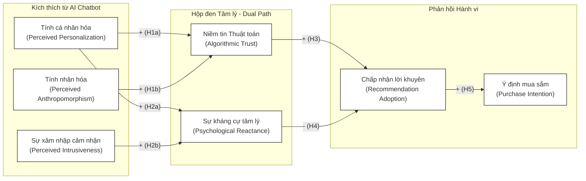

# ĐỀ CƯƠNG DỰ TUYỂN TRÌNH ĐỘ TIẾN SĨ

**Tên đề tài dự kiến:** Tác động của tương tác AI Chatbot đến hành vi mua sắm thiết bị điện tử của người tiêu dùng thế hệ Z: Phân tích cơ chế tác động kép giữa Niềm tin thuật toán và Sự kháng cự tâm lý
**Định hướng nghiên cứu:** Ứng dụng Trí tuệ nhân tạo (AI) trong Hành vi Người tiêu dùng
**Chuyên ngành:** Quản trị Kinh doanh
**Mã số:** 9340101
**Tên người dự tuyển:** Nguyễn Cường Thịnh
**Cơ quan công tác:** ...

---

## 1. LÝ DO CHỌN ĐỀ TÀI VÀ SỰ CẤP THIẾT CỦA NGHIÊN CỨU
### 1.1. Bối cảnh thực tiễn tại thị trường bán lẻ thiết bị điện tử Việt Nam
Thị trường bán lẻ thiết bị điện tử tại Việt Nam đang trải qua một giai đoạn chuyển đổi số toàn diện và bùng nổ mạnh mẽ, được thúc đẩy bởi sự hội tụ của công nghệ di động, dữ liệu lớn (Big Data) và năng lực tính toán đám mây. Cùng với sự chuyển dịch về mặt hạ tầng công nghệ, sự thay đổi sâu sắc về cơ cấu nhân khẩu học đã và đang định hình lại hoàn toàn luật chơi của thị trường bán lẻ truyền thống. Hiện nay, Thế hệ Z (Gen Z - những người sinh từ năm 1997 đến 2012) đang nổi lên như một lực lượng tiêu dùng mang tính quyết định, không chỉ về sức mua hiện tại mà còn là tệp khách hàng chiến lược định hình toàn bộ hệ sinh thái thương mại điện tử trong thập kỷ tới (Dimock, 2019). Khác với các thế hệ trước (như Millennials hay Gen X), Gen Z được các học giả mệnh danh là những "bản địa số" (Digital Natives) thực thụ. Họ lớn lên cùng Internet, màn hình cảm ứng và kết nối không dây mọi lúc mọi nơi (Prensky, 2001; Turner, 2015). Hành vi tiêu dùng của nhóm này đặc trưng bởi sự thiếu kiên nhẫn đối với các dịch vụ chậm trễ: họ không chỉ khao khát tốc độ phản hồi tức thì mà còn đòi hỏi mức độ cá nhân hóa (Personalization) cực kỳ cao trong mọi điểm chạm trải nghiệm (customer touchpoints) (Awad & Krishnan, 2006; Zhang et al., 2014). 

Nhằm đáp ứng những tiêu chuẩn ngày càng khắt khe này, các chuỗi bán lẻ điện máy hàng đầu tại Việt Nam (điển hình như Thế Giới Di Động, FPT Shop, CellphoneS, Phong Vũ) và các nền tảng thương mại điện tử (Shopee, Lazada, Tiki) đang chạy đua vũ trang trong việc tích hợp Trí tuệ nhân tạo đàm thoại (Conversational AI) và các Trợ lý ảo (AI Chatbots) được trợ lực bởi các Mô hình ngôn ngữ lớn (Large Language Models - LLM). Đối với những sản phẩm tiêu dùng mang tính liên kết cao (high-involvement products) và đòi hỏi mức độ rủi ro tài chính lớn như Laptop, Máy tính bảng hay PC nguyên bộ, người tiêu dùng không thể chỉ ra quyết định dựa trên cảm tính. Quá trình mua sắm đòi hỏi sự so sánh phức tạp về hàng chục thông số kỹ thuật (CPU, RAM, GPU, Tản nhiệt, Màn hình, Thời lượng pin). Trong bối cảnh đó, vai trò tư vấn cấu hình, phân tích nhu cầu và so sánh hiệu năng của AI Chatbot trở thành một lợi thế cạnh tranh cốt lõi. AI có khả năng xử lý lượng dữ liệu khổng lồ trong tích tắc để đưa ra các gợi ý chính xác, vượt xa năng lực của một nhân viên tư vấn con người (Chung et al., 2020; McLean & Osei-Frimpong, 2019; Moriuchi, 2019).

### 1.2. Khoảng trống lý thuyết (Theoretical Gaps) và Nghịch lý hành vi
Mặc dù AI Chatbot mang lại những giá trị to lớn về mặt tối ưu hóa chi phí vận hành và tăng cường hiệu suất chuyển đổi đơn hàng, việc ứng dụng công nghệ thông minh này trong tư vấn bán hàng lại làm nảy sinh một nghịch lý tâm lý học sâu sắc đối với người tiêu dùng. Sự phức tạp trong giao tiếp giữa người và máy tạo ra những tác động hành vi đa chiều chưa được giải quyết triệt để trong y văn.

Một mặt, các đặc tính thiết kế tinh vi của AI như tính cá nhân hóa (Perceived Personalization) và tính nhân hóa (Perceived Anthropomorphism) giúp xây dựng một trạng thái tâm lý tích cực gọi là Niềm tin thuật toán (Algorithmic Trust) (Waytz et al., 2014; Castelo et al., 2019). Khách hàng, đặc biệt là giới trẻ am hiểu công nghệ, ngày càng có xu hướng tin tưởng rằng các quyết định của AI là hoàn toàn dựa trên dữ liệu khách quan, phân tích định lượng chính xác mà không bị chi phối bởi các yếu tố thiên vị, áp lực KPI hay hoa hồng doanh số – những nhược điểm cố hữu của nhân viên tư vấn con người. Hiện tượng chuyển dịch niềm tin từ chuyên gia con người sang hệ thống máy tính này được các học giả đương đại định nghĩa là "Sự đánh giá cao thuật toán" (Algorithm Appreciation) (Logg et al., 2019). Khi niềm tin thuật toán được thiết lập, nó đóng vai trò là chất xúc tác mạnh mẽ thúc đẩy ý định mua hàng. Đây được gọi là "Mặt sáng" (The Bright Side) của ứng dụng AI trong thương mại điện tử.

Tuy nhiên, "Mặt tối" (The Dark Side) của AI đang dần hiện rã và trở thành mối đe dọa tiềm tàng đối với các thương hiệu bán lẻ. Khi hệ thống AI khai thác quá sâu dữ liệu lịch sử duyệt web để cá nhân hóa, hoặc đưa ra những đề xuất mang tính ép buộc (ví dụ: liên tục hiển thị bộ đếm lùi, sử dụng từ ngữ thao túng tâm lý để ép buộc khách hàng chốt ngay một dòng máy tính cụ thể nhằm tối ưu hóa biên lợi nhuận của nhà phân phối), nó vô tình vượt qua lằn ranh mỏng manh của quyền riêng tư và sự tự quyết. Theo Lý thuyết Kháng cự tâm lý (Psychological Reactance Theory - PRT) được giới thiệu bởi Brehm (1966), bản chất con người luôn khao khát duy trì quyền tự do lựa chọn (freedom of choice). Khi người tiêu dùng cảm thấy không gian tự quyết này bị thu hẹp hoặc bị đe dọa bởi một thế lực ngoại sinh (trong trường hợp này là thuật toán AI), họ sẽ ngay lập tức nảy sinh một trạng thái căng thẳng tâm lý sâu sắc. Phản ứng tức thì là việc hình thành trạng thái "Sự kháng cự tâm lý" (Psychological Reactance) - một động lực thúc đẩy họ thực hiện các hành vi chống đối, né tránh lời khuyên, tẩy chay sản phẩm hoặc có thái độ thù địch với hệ thống để khôi phục lại cảm giác tự do (Clee & Wicklund, 1980; Dillard & Shen, 2005; White et al., 2008).

Sự giằng xé nội tâm giữa "Niềm tin thuật toán" (một trạng thái hướng tới việc đón nhận công nghệ) và "Sự kháng cự tâm lý" (một bản năng bảo vệ tự do cá nhân) khi đối mặt với một thực thể AI quá thông minh tạo ra một vùng trũng lý thuyết khổng lồ. Hầu hết các mô hình nghiên cứu về hành vi chấp nhận công nghệ truyền thống như Mô hình Chấp nhận Công nghệ TAM (Davis, 1989) hay Thuyết Hợp nhất Chấp nhận và Sử dụng Công nghệ UTAUT (Venkatesh et al., 2003) chỉ tiếp cận theo hướng "Chủ nghĩa thực chứng công nghệ" (Technology Positivism). Các mô hình này mặc định xem AI là một công cụ mang tính "Hữu ích" (Usefulness) và "Dễ sử dụng" (Ease of Use), mà bỏ qua hoàn toàn cơ chế phản kháng phòng vệ tự nhiên của con người khi tương tác với những cỗ máy có khả năng thao túng tâm lý (Gefen et al., 2003; Luo et al., 2019; Pelau et al., 2021). 

### 1.3. Tính cấp thiết của đề tài
Từ những phân tích thực tiễn và lý luận nêu trên, việc nghiên cứu cơ chế tác động đa chiều của AI Chatbot đối với người tiêu dùng là yêu cầu mang tính cấp bách. Đề tài *"Tác động của tương tác AI Chatbot đến hành vi mua sắm thiết bị điện tử của người tiêu dùng thế hệ Z: Phân tích cơ chế tác động kép giữa Niềm tin thuật toán và Sự kháng cự tâm lý"* được đề xuất thực hiện nhằm giải quyết trực diện nghịch lý này. Đề tài không chỉ lấp đầy khoảng trống học thuật về việc tích hợp hai luồng lý thuyết trái ngược nhau (Chấp nhận và Phản kháng), mà còn mang tính ứng dụng thực tiễn sống còn. Kết quả của luận án sẽ cung cấp cơ sở khoa học để các doanh nghiệp bán lẻ thiết bị điện tử (như Thế Giới Di Động, FPT Shop) tinh chỉnh "mức độ thông minh", "giới hạn nhân hóa" và "sự can thiệp" của thuật toán để tối ưu hóa quyết định mua hàng của Gen Z, mà không vô tình tạo ra sự phản tác dụng (backfire effect).

---

## 2. TỔNG QUAN TÌNH HÌNH NGHIÊN CỨU VÀ CƠ SỞ LÝ LUẬN
### 2.1. Tổng quan các luồng nghiên cứu trước đây
#### 2.1.1. Luồng nghiên cứu về Chấp nhận công nghệ AI và Tính nhân hóa (Anthropomorphism)
Trong hơn một thập kỷ qua, khi AI bắt đầu thâm nhập sâu vào mọi khía cạnh của đời sống, giới học thuật đã tiến hành hàng loạt nghiên cứu thực chứng để giải thích tại sao con người lại chấp nhận, yêu thích hoặc từ chối tương tác với máy móc. Nền tảng của các nghiên cứu hành vi này gắn liền với khái niệm "Tính nhân hóa" (Anthropomorphism). Theo định nghĩa của Waytz et al. (2014), nhân hóa là xu hướng tâm lý của con người trong việc gán các đặc điểm, tính cách, cảm xúc và ý định của con người cho các thực thể phi nhân loại.

Trong bối cảnh tương tác với AI Chatbot, tính nhân hóa được thể hiện qua thiết kế giao diện (avatar có khuôn mặt người), ngôn ngữ tự nhiên (Natural Language Processing), cách xưng hô (gọi tên khách hàng), và khả năng thể hiện sự đồng cảm (empathy) (Pelau et al., 2021). Các nghiên cứu nền tảng đã khẳng định rằng: khi AI được thiết kế có mức độ nhân hóa cao, nó sẽ kích hoạt "vùng não xã hội" của con người. Điều này làm giảm đáng kể cảm giác xa lạ, phá vỡ các rào cản phòng vệ tâm lý ban đầu và gia tăng chất lượng dịch vụ cảm nhận (Service Quality Perception). Điển hình, nghiên cứu của Chung et al. (2020) trên lĩnh vực bán lẻ xa xỉ, hay nghiên cứu của Moriuchi (2019) đối với trợ lý ảo bằng giọng nói (Voice Assistants) đều xác nhận rằng tính nhân hóa là chìa khóa để tạo ra sự hài lòng và lòng trung thành.

Tuy nhiên, giới hạn lớn nhất của luồng nghiên cứu chủ lưu này là cái nhìn quá lạc quan và phiến diện về AI. Các tác giả thường mặc định sử dụng Mô hình TAM (Davis, 1989), xem AI như một "công cụ thụ động" thuần túy chờ người dùng ra lệnh, thay vì nhìn nhận nó như một "tác nhân chủ động" (Active Agent) có khả năng thao túng thông tin và định hướng quyết định. Hơn nữa, việc lạm dụng tính nhân hóa có thể dẫn đến hiệu ứng "Thung lũng kỳ lạ" (Uncanny Valley) – nơi sự giống người thái quá của máy móc lại gây ra cảm giác rùng rợn và nghi ngờ (Mori, 1970).

#### 2.1.2. Sự dịch chuyển từ Algorithm Aversion sang Algorithm Appreciation
Một luồng nghiên cứu khác cực kỳ quan trọng trong khoa học quyết định (Decision Science) tập trung vào mức độ tin cậy của con người đối với các thuật toán định lượng. Khởi thủy, các học giả như Dietvorst et al. (2015) từng giới thiệu khái niệm "Ác cảm thuật toán" (Algorithm Aversion), chỉ ra một hiện tượng thú vị: con người thường khắt khe với máy móc hơn đồng loại. Khi máy tính mắc lỗi (dù chỉ là lỗi nhỏ), niềm tin của con người sụt giảm nghiêm trọng và rất khó khôi phục, trong khi họ lại dễ dàng tha thứ cho những sai lầm tương tự của chuyên gia con người.

Thế nhưng, sự tiến hóa vượt bậc của Deep Learning và sức mạnh của các mô hình như ChatGPT đã làm đảo lộn hoàn toàn quy luật này trong những năm gần đây. Một bước ngoặt lý thuyết đã xuất hiện thông qua nghiên cứu đột phá của Logg et al. (2019). Các tác giả này phát hiện ra hiện tượng "Sự đánh giá cao thuật toán" (Algorithm Appreciation). Trong các thí nghiệm, họ chứng minh rằng đối với các nhiệm vụ mang tính logic cao, đòi hỏi phân tích hàng ngàn dữ liệu cùng lúc (như dự báo tài chính, hoặc so sánh cấu hình thiết bị điện tử phức tạp), con người hiện đại lại thích dựa vào các gợi ý định lượng từ máy tính hơn cả chuyên gia con người. Khái niệm "Niềm tin thuật toán" (Algorithmic Trust) ra đời từ đó, đại diện cho một trạng thái nhận thức tin cậy vào tính khách quan và năng lực xử lý vô hạn của máy móc (Castelo et al., 2019). Dù vậy, cơ chế hình thành niềm tin thuật toán trong một bối cảnh mua sắm tự nguyện mang tính thương mại (như mua laptop sinh viên) tại các nước đang phát triển như Việt Nam vẫn là một vùng đất chưa được khai phá.

#### 2.1.3. Sự trỗi dậy của Lý thuyết Kháng cự tâm lý (PRT) trong môi trường số
Trong khi luồng nghiên cứu về TAM và Niềm tin tập trung vào mặt tích cực, thì Lý thuyết Kháng cự tâm lý (Psychological Reactance Theory - PRT) đại diện cho mặt tối của hành vi tương tác (Brehm, 1966). Ban đầu, PRT được sử dụng trong tâm lý học xã hội và truyền thông sức khỏe để giải thích lý do tại sao các chiến dịch cấm hút thuốc bằng những hình ảnh quá kinh dị thường phản tác dụng (Dillard & Shen, 2005). Theo PRT, khi một cá nhân cảm nhận rằng một quyền tự do cụ thể của họ bị đe dọa (freedom threat), họ sẽ trải qua một trạng thái kích thích cảm xúc tiêu cực gọi là kháng cự (reactance). Trạng thái này thúc đẩy cá nhân cố gắng khôi phục quyền tự do đã mất bằng cách thực hiện các hành vi chống đối trực tiếp (thực hiện chính hành vi bị cấm) hoặc gián tiếp (tẩy chay nguồn phát đi thông điệp) (Clee & Wicklund, 1980; Hong & Faedda, 1996).

Gần đây, PRT đang được hồi sinh mạnh mẽ trong kỷ nguyên kỹ thuật số để giải mã "Nghịch lý cá nhân hóa - quyền riêng tư" (Privacy Paradox) (Awad & Krishnan, 2006; Barth & de Jong, 2017). Trong hệ sinh thái thương mại điện tử, các thuật toán AI liên tục thu thập dấu chân kỹ thuật số (digital footprint) để đưa ra các khuyến nghị siêu cá nhân hóa (Hyper-personalization). Khi hệ thống đưa ra các gợi ý quá chính xác (đến mức đáng sợ) và liên tục thúc ép mua hàng, nó kích hoạt "Sự xâm nhập cảm nhận" (Perceived Intrusiveness). Chẳng hạn, một AI Chatbot nhắn: "Anh Thịnh ơi, hệ thống biết anh vừa xem dòng Laptop Gaming này 3 lần hôm qua. Kho chỉ còn 1 chiếc, anh phải chốt ngay trong 5 phút tới!". Sự can thiệp thô bạo này đánh thức bản năng phòng vệ. Dưới lăng kính của PRT, khách hàng không còn đánh giá lời khuyên dựa trên chất lượng sản phẩm, mà quyết định từ chối mua chỉ để chứng minh quyền kiểm soát của mình. Họ cảm thấy bị biến thành một mục tiêu bị thao túng hơn là một khách hàng được phục vụ (White et al., 2008; Tucker, 2014).

**Bảng 2.1: Ma trận tổng hợp các nghiên cứu trọng điểm và Khoảng trống nghiên cứu**

| Tác giả (Năm) | Khung lý thuyết / Phương pháp | Bối cảnh / Lĩnh vực | Phát hiện chính đóng góp | Khoảng trống / Hạn chế chưa giải quyết |
|---|---|---|---|---|
| **Awad & Krishnan (2006)** | Privacy Paradox, Khảo sát | Thương mại điện tử (Web tĩnh) | Tìm ra nghịch lý giữa mong muốn cá nhân hóa và nỗi lo sợ mất quyền riêng tư. | Chỉ nghiên cứu trên nền tảng web tĩnh và email, chưa đánh giá AI Chatbot hội thoại thời gian thực. |
| **Dietvorst et al. (2015)** | Algorithm Aversion (Thực nghiệm) | Dự báo định lượng chung | Con người mất niềm tin vào thuật toán nhanh hơn con người khi máy móc mắc lỗi. | Kết quả bị đảo ngược bởi công nghệ LLM hiện đại, chưa giải thích được bối cảnh hiện tại. |
| **Logg et al. (2019)** | Algorithm Appreciation (Thực nghiệm) | Quyết định đầu tư & định lượng | Con người thích tin vào lời khuyên của thuật toán hơn chuyên gia khi cần xử lý dữ liệu phức tạp. | Bỏ qua hoàn toàn biến số về "Sự kháng cự" khi thuật toán có tính chất ép buộc người dùng mua hàng. |
| **Luo et al. (2019)** | Field Experiment | Bán hàng qua điện thoại (AI Voice) | Phát hiện "Sự kiện lộ tẩy" (Machine disclosure) làm giảm sâu tỷ lệ chốt sales của bot. | Trọng tâm là Voice AI (Giọng nói), chưa xây dựng được mô hình cơ chế tâm lý phân đôi song song. |
| **Pelau et al. (2021)** | PLS-SEM | Dịch vụ khách hàng (Chung) | Anthropomorphism làm tăng mức độ tương tác, sự đồng cảm và sự hài lòng. | Bỏ qua các tác động tiêu cực của tính nhân hóa và tính xâm nhập cảm nhận (Perceived Intrusiveness). |
| **White et al. (2008)** | Psychological Reactance (Thực nghiệm) | Marketing trực tiếp (Email) | Cá nhân hóa cao (nhắc đến thông tin nhạy cảm) dẫn đến phản kháng mạnh mẽ. | Chưa ứng dụng PRT vào các tác nhân thông minh (Intelligent Agents) có khả năng tương tác hai chiều. |

### 2.2. Khung phân tích lý thuyết tích hợp (Theoretical Framework)
Đứng trước bức tranh phân mảnh của các luồng nghiên cứu trên, luận án này đề xuất một Khung lý thuyết tích hợp (Integrated Framework) giữa Khung S-O-R và Lý thuyết Kháng cự tâm lý (PRT).

#### 2.2.1. Khung S-O-R (Stimulus - Organism - Response)
Mô hình S-O-R của Mehrabian & Russell (1974) cung cấp lăng kính chủ đạo để theo dõi quá trình biến đổi tâm lý học của khách hàng. Khác với mô hình hộp đen của Chủ nghĩa hành vi (Behaviorism) chỉ quan tâm đến S (Kích thích) và R (Phản hồi), mô hình S-O-R cho phép bóc tách chi tiết hệ thống não bộ phức tạp:
*   **Stimulus (Kích thích ngoại sinh - S):** Là các điểm chạm giao tiếp của AI Chatbot mà khách hàng tiếp nhận. Trong phạm vi nghiên cứu, các kích thích này bao gồm: Mức độ Nhân hóa (Perceived Anthropomorphism), Mức độ Cá nhân hóa (Perceived Personalization), và Sự xâm nhập cảm nhận (Perceived Intrusiveness) phát sinh từ các kịch bản tương tác.
*   **Organism (Tổ chức nội tại - O):** Là hộp đen tâm lý. Tại đây, nghiên cứu mạnh dạn đề xuất hai luồng phản ứng diễn ra đồng thời: Luồng nhận thức - tình cảm hướng tới công nghệ (Niềm tin thuật toán - Algorithmic Trust) và Luồng kích động - phòng vệ (Sự kháng cự tâm lý - Psychological Reactance).
*   **Response (Phản hồi hành vi - R):** Là các quyết định hành động cuối cùng mang ý nghĩa kinh tế, bao gồm việc Chấp nhận lời khuyên của AI (Recommendation Adoption) và cao hơn là Ý định mua sắm (Purchase Intention).

#### 2.2.2. Sự giao thoa hình thành Cơ chế tác động kép (Dual-path Mechanism)
Sự giao thoa và tích hợp S-O-R với PRT chính là điểm nhấn học thuật (Theoretical Contribution) quan trọng nhất của luận án. Nó lý giải cơ chế "Con dao hai lưỡi": Tại sao một tính năng như "Cá nhân hóa" (Personalization) lại tồn tại tính chất hai mặt (Dual-effect)? Một mặt, cá nhân hóa hợp lý giúp người dùng tiết kiệm công sức tìm kiếm, gia tăng Niềm tin. Nhưng ở một cực khác, nếu cá nhân hóa đi kèm với tần suất cao và thu thập quá mức cần thiết, nó ngay lập tức đánh thức Sự kháng cự tâm lý. Việc mô hình hóa song song sự tồn tại của Trust và Reactance sẽ phản ánh chính xác nhất diễn biến nội tâm phức tạp của khách hàng Gen Z.

---

## 3. MỤC TIÊU VÀ CÂU HỎI NGHIÊN CỨU
### 3.1. Mục tiêu tổng quát
Xây dựng và kiểm định mô hình tác động kép (Dual-path model) nhằm giải thích cách thức các đặc điểm thiết kế tương tác của AI Chatbot (nhân hóa, cá nhân hóa, sự xâm nhập) ảnh hưởng đến ý định mua sắm thiết bị điện tử của người tiêu dùng Gen Z thông qua hai cơ chế tâm lý hoạt động đối lập: Niềm tin thuật toán (Algorithmic Trust) và Sự kháng cự tâm lý (Psychological Reactance).

### 3.2. Mục tiêu cụ thể
1.  **Mục tiêu 1:** Nhận diện và lượng hóa sức mạnh tác động của các đặc tính kích thích từ AI Chatbot (Tính cá nhân hóa, Tính nhân hóa, Sự xâm nhập cảm nhận) đến trạng thái tâm lý bên trong của người tiêu dùng trong bối cảnh mua sắm hàng hóa giá trị cao.
2.  **Mục tiêu 2:** Kiểm định thực nghiệm vai trò trung gian tích cực của "Niềm tin thuật toán" và vai trò trung gian tiêu cực (cản trở) của "Sự kháng cự tâm lý" đối với hành vi chấp nhận lời khuyên (Recommendation Adoption) và ý định mua sắm cuối cùng (Purchase Intention).
3.  **Mục tiêu 3:** Phân tích, đánh giá tính chất hai mặt (Dual-effect) của yếu tố "Tính cá nhân hóa" để kiểm chứng ranh giới nơi sự thấu hiểu công nghệ chuyển hóa thành sự xâm phạm quyền riêng tư.
4.  **Mục tiêu 4:** Từ kết quả định lượng, đề xuất các hàm ý quản trị (Managerial Implications) thực chiến giúp các nhà quản trị bán lẻ (CX/UI Designers, Marketing Managers) thiết kế các hệ thống AI Chatbot tối ưu hóa tỷ lệ chuyển đổi mà không vô tình tạo ra sự phẫn nộ từ khách hàng.

### 3.3. Câu hỏi nghiên cứu
Để đạt được các mục tiêu trên, luận án tập trung trả lời 3 nhóm câu hỏi cốt lõi:
1. Các kích thích giao tiếp từ giao diện AI Chatbot (Mức độ nhân hóa, Cá nhân hóa, Tính xâm nhập) có tác động như thế nào đến sự hình thành Niềm tin thuật toán và Sự kháng cự tâm lý ở phân khúc khách hàng Gen Z?
2. Liệu có thực sự tồn tại một cơ chế trung gian kép (Dual-mediation) trong não bộ người tiêu dùng, nơi Niềm tin thuật toán thúc đẩy mạnh mẽ, nhưng đồng thời Sự kháng cự tâm lý lại kìm hãm việc chấp nhận lời khuyên của AI?
3. Điểm bùng phát (tipping point) của Tính cá nhân hóa là ở đâu, để nó không đánh thức sự kháng cự tâm lý của khách hàng?

---

## 4. PHẠM VI VÀ ĐỐI TƯỢNG NGHIÊN CỨU
### 4.1. Phạm vi nghiên cứu
*   **Về không gian:** Khảo sát thực địa và tiến hành thực nghiệm (experiment) thông qua các nền tảng trực tuyến tập trung tại khu vực TP. Hồ Chí Minh. Lý do chọn địa bàn này vì TP.HCM là trung tâm kinh tế - công nghệ lớn nhất cả nước, nơi có cơ sở hạ tầng bán lẻ số phát triển nhất và tập trung tệp khách hàng Gen Z có khả năng chi trả cao, sẵn sàng ứng dụng các công nghệ mới.
*   **Về thời gian:** Dữ liệu nghiên cứu bao gồm định tính và định lượng dự kiến được thu thập và xử lý tập trung trong giai đoạn từ quý III/2026 đến quý IV/2027.
*   **Về nội dung (Ngữ cảnh):** Đề tài giới hạn việc phân tích trong môi trường tương tác dựa trên văn bản tự nhiên (Text-based / LLM-based AI Chatbot), không nghiên cứu các trợ lý giọng nói (Voice Assistants). Ngành hàng được chọn là thiết bị điện tử cá nhân mang tính phức tạp (Laptop, Máy tính bảng, PC).

### 4.2. Đối tượng và Khách thể nghiên cứu
*   **Đối tượng nghiên cứu:** Bản chất cơ chế tác động tâm lý (Niềm tin và Sự kháng cự) và sự thay đổi trong Hành vi mua sắm khi chịu sự can thiệp của hệ thống AI Chatbot.
*   **Khách thể nghiên cứu (Đối tượng khảo sát):** Người tiêu dùng thuộc thế hệ Z (sinh năm 1997 - 2012), hiện đang sinh sống, học tập và làm việc tại TP.HCM. Đặc biệt là những người đã từng có trải nghiệm hoặc có nhu cầu nhận tư vấn thiết bị điện tử trong 6 tháng gần nhất.

---

## 5. PHƯƠNG PHÁP VÀ THIẾT KẾ NGHIÊN CỨU
### 5.1. Mô hình nghiên cứu đề xuất và Phát triển Giả thuyết
**Sơ đồ Mô hình nghiên cứu tác động kép (Dual-path Framework):**

*Hình 1. Mô hình nghiên cứu tích hợp lý thuyết S-O-R và PRT.*

**Phát triển và Biện luận Giả thuyết Nghiên cứu:**
*   **H1a & H1b (Hình thành Niềm tin thuật toán):** Dựa trên lý thuyết về Sự đánh giá cao thuật toán (Logg et al., 2019) và nghiên cứu của Waytz et al. (2014), khi AI sở hữu tính năng cá nhân hóa xuất sắc (PP), nó chứng minh năng lực hiểu biết vượt trội về khách hàng. Đồng thời, tính nhân hóa (PA) (ngôn ngữ thân thiện, gọi tên) giúp thu hẹp khoảng cách tâm lý, làm cho thuật toán trở nên ít đáng sợ hơn. Sự kết hợp này củng cố mạnh mẽ niềm tin của con người vào trí tuệ nhân tạo. Do đó, luận án đề xuất Tính cá nhân hóa (H1a) và Tính nhân hóa (H1b) tác động cùng chiều (+) đến Niềm tin thuật toán (AT).
*   **H2a & H2b (Kích hoạt Sự kháng cự tâm lý):** Đây là các giả thuyết cốt lõi ứng dụng lý thuyết PRT (Brehm, 1966). H2a đại diện cho tính chất "hai mặt" (dual-effect) của cá nhân hóa: khi mức độ cá nhân hóa quá sâu, khách hàng sẽ cảm giác bị theo dõi (surveillance anxiety), đánh thức sự kháng cự phòng vệ. Thêm vào đó, sự xâm nhập cảm nhận (PI) từ các thông điệp thúc ép, chèo kéo của AI sẽ là mồi lửa thổi bùng trạng thái tâm lý tiêu cực. Do đó, luận án kỳ vọng Tính cá nhân hóa (H2a) và Sự xâm nhập cảm nhận (H2b) có tác động cùng chiều (+) làm gia tăng Sự kháng cự tâm lý (AR).
*   **H3 & H4 (Cơ chế Trung gian đối lập):** Về mặt kết quả hành vi, hai luồng cảm xúc này sẽ cạnh tranh quyết liệt. Niềm tin thuật toán sẽ là bệ phóng tác động cùng chiều (+) (H3) thúc đẩy việc khách hàng nghe theo tư vấn (Recommendation Adoption - RA) (Gefen et al., 2003). Ngược lại, những khách hàng rơi vào trạng thái kháng cự sẽ tìm cách lấy lại tự do bằng cách cố tình làm ngược lại gợi ý, dẫn đến Sự kháng cự tâm lý tác động ngược chiều (-) (H4) đến việc Chấp nhận lời khuyên (RA) (Dillard & Shen, 2005).
*   **H5 (Hành vi Mua sắm):** Theo quy luật nhân quả truyền thống của hành vi người tiêu dùng (Venkatesh et al., 2003), một khi khách hàng đã bị thuyết phục và chấp nhận lời khuyên công nghệ, rào cản tài chính sẽ bị phá vỡ. Việc Chấp nhận lời khuyên (RA) có tác động cùng chiều (+) và trực tiếp đến Ý định mua sắm thiết bị điện tử (PUR).

### 5.2. Cách tiếp cận và Thiết kế nghiên cứu
Nhằm đảm bảo mức độ chặt chẽ tối đa (academic rigor), luận án áp dụng phương pháp **Nghiên cứu Hỗn hợp (Mixed-methods)**. Quá trình này được chia thành hai giai đoạn nối tiếp theo logic Khám phá - Kiểm định:

#### Bước 1: Nghiên cứu định tính (Khám phá và Thẩm định)
*   **Phương pháp:** Thảo luận nhóm tập trung (Focus Group) và Phỏng vấn sâu chuyên gia (In-depth interviews).
*   **Hội đồng chuyên gia (n = 12):** Được tuyển chọn gắt gao. Trong đó có 06 Quản lý cấp cao tại các chuỗi bán lẻ (FPT Shop, Thế Giới Di Động, Phong Vũ) để cung cấp góc nhìn thực tiễn về cách AI đang vận hành. Và 06 Tiến sĩ học thuật chuyên ngành Marketing số / Data Science để đảm bảo tính khoa học.
*   **Mục tiêu:** Hiệu chỉnh (refine) từ ngữ của các thang đo (được dịch từ tiếng Anh) để phù hợp với bối cảnh văn hóa Việt Nam. Quan trọng hơn, chuyên gia sẽ thẩm định và phê duyệt các kịch bản Mockup AI dùng cho thực nghiệm ở Bước 2, đảm bảo chúng trông giống thật nhất có thể.

#### Bước 2: Thiết kế Thực nghiệm (Experimental Design)
Khác với các nghiên cứu khảo sát cắt ngang truyền thống (cross-sectional surveys) thường mang nhiều yếu tố nhiễu (noise) do phụ thuộc vào trí nhớ chủ quan của đáp viên, nghiên cứu này sử dụng phương pháp **Thực nghiệm dựa trên kịch bản (Scenario-based Factorial Experiment 2×2)**. Thiết kế này giúp cô lập hoàn toàn các yếu tố ngoại lai (ví dụ: ghét nhãn hiệu Apple hay Dell từ trước).

| Thiết kế Yếu tố | Mức 1 (Mức độ Cao) | Mức 2 (Mức độ Thấp) |
|---|---|---|
| **Nhân hóa & Cá nhân hóa (PA & PP)** | Avatar có hình người, xưng "Em", gọi tên khách, phân tích lịch sử tìm kiếm. | Avatar dạng icon máy tính, xưng "Hệ thống", trả lời chung chung theo template. |
| **Sự xâm nhập / Ép buộc (PI)** | Đếm ngược thời gian (Urgency), Pop-up ép chốt đơn 1 dòng máy duy nhất. | Liệt kê 3 mẫu laptop, để khách hàng tự do suy nghĩ mà không hối thúc. |

Người tham gia sẽ được phân bổ ngẫu nhiên (random assignment) vào 1 trong 4 nhóm kịch bản (Mockup giao diện Chat của nền tảng giả định "TechZone"). Sau khi tương tác (đọc kịch bản chat mô phỏng), họ tiến hành trả lời bảng hỏi.

#### Bước 3: Thu thập và Lấy mẫu dữ liệu
*   **Mẫu:** Lấy mẫu phi xác suất có mục đích (Purposive Sampling). Đáp viên phải vượt qua câu hỏi gạn lọc (screening questions): Đảm bảo thuộc nhóm tuổi Gen Z, sống tại đô thị, và đang có nhu cầu hoặc am hiểu về mua sắm thiết bị cá nhân.
*   **Kích thước mẫu:** Dự kiến thu thập n = 400 - 500 phiếu hợp lệ. Quy mô này là vượt trội và rất an toàn cho phân tích SEM, đồng thời cung cấp đủ cỡ mẫu cho mỗi ô kịch bản thực nghiệm (ít nhất 100 mẫu/ô) để thực hiện Phân tích Đa nhóm (MGA).

#### Bước 4: Phương pháp Phân tích Dữ liệu (PLS-SEM)
Nghiên cứu sử dụng kỹ thuật **Mô hình Phương trình cấu trúc bình phương tối thiểu riêng phần (PLS-SEM)** thông qua phần mềm **SmartPLS 4**. PLS-SEM được ưu tiên lựa chọn thay vì CB-SEM (AMOS) vì những lý do học thuật sau:
1. PLS-SEM có ưu thế tuyệt đối khi phân tích các mô hình dự báo hành vi (prediction-oriented) có chứa cấu trúc trung gian phức tạp (như Dual-mediation path).
2. Không bị ràng buộc quá khắt khe về giả định phân phối chuẩn của dữ liệu (Hair et al., 2022).
Quy trình thực hiện chuẩn 4 bước:
1.  **Đánh giá Outer Model (Mô hình đo lường):** Đảm bảo độ tin cậy nhất quán (Cronbach’s Alpha ≥ 0.7, CR ≥ 0.7), giá trị hội tụ (AVE ≥ 0.5), và giá trị phân biệt (HTMT < 0.85, Fornell-Larcker).
2.  **Đánh giá Inner Model (Mô hình cấu trúc):** Xác định sự ủng hộ của giả thuyết thông qua các hệ số đường dẫn (Path coefficient β) với p-value < 0.05. Kiểm tra mức độ giải thích (R²) và quy mô tác động (f²).
3.  **Dự báo ngoài mẫu (Out-of-sample prediction):** Sử dụng thuật toán PLSpredict (chỉ số Q² predict) để kiểm chứng khả năng dự đoán thực tế của mô hình.
4.  **Kiểm soát Common Method Bias (CMB):** Sử dụng kỹ thuật Full Collinearity VIF của Kock (2015). Đảm bảo tất cả các VIF ở cấp độ nhân tố (factor-level VIF) đều nhỏ hơn ngưỡng 3.3, chứng minh dữ liệu không bị sai lệch do phương pháp chung.

### 5.3. Xây dựng Thang đo đo lường (Measurement Items)
Để đảm bảo giá trị khái niệm (construct validity), toàn bộ các biến tiềm ẩn được đo lường bằng thang đo Likert 7 điểm (1 = Hoàn toàn không đồng ý, 7 = Hoàn toàn đồng ý), kế thừa từ các tác giả hàng đầu trên thế giới và được tinh chỉnh cho phù hợp với ngành hàng thiết bị điện tử.

**A. Nhóm biến Kích thích (Stimulus)**
*   **Tính cá nhân hóa (PP) - 3 biến quan sát** *(Awad & Krishnan, 2006)*: Tập trung vào mức độ tinh chỉnh. *(VD: "PP1. AI Chatbot đã đưa ra những gợi ý laptop dựa chính xác trên thông tin và nhu cầu cá nhân của tôi").*
*   **Tính nhân hóa (PA) - 3 biến quan sát** *(Waytz et al., 2014; Pelau et al., 2021)*: Đo lường cảm giác giao tiếp tự nhiên. *(VD: "PA1. Khi tương tác với AI Chatbot này, tôi có cảm giác như đang trò chuyện với một nhân viên bán hàng bằng xương bằng thịt").*
*   **Sự xâm nhập cảm nhận (PI) - 3 biến quan sát** *(Barth & de Jong, 2017)*: Đánh giá sự phiền nhiễu. *(VD: "PI1. Cách AI Chatbot liên tục hối thúc tôi mua hàng khiến tôi cảm thấy quyền tự do lựa chọn bị xâm phạm").*

**B. Nhóm biến Tổ chức nội tâm (Organism - Tâm lý)**
*   **Niềm tin thuật toán (AT) - 4 biến quan sát** *(Logg et al., 2019; Castelo et al., 2019)*: Đánh giá độ tin cậy vào máy tính. *(VD: "AT1. Tôi tin tưởng rằng sự tư vấn cấu hình từ thuật toán của AI là hoàn toàn khách quan và chính xác").*
*   **Sự kháng cự tâm lý (AR) - 4 biến quan sát** *(Hong & Faedda, 1996; Dillard & Shen, 2005)*: Đo lường sự phản kháng cảm xúc. *(VD: "AR1. Thái độ áp đặt của AI Chatbot làm tôi vô cùng bực bội và nảy sinh ý muốn từ chối mua sản phẩm").*

**C. Nhóm biến Phản hồi (Response - Hành vi)**
*   **Chấp nhận lời khuyên (RA) - 3 biến quan sát** *(Gefen et al., 2003)*: *(VD: "RA1. Tôi sẽ làm theo các đề xuất kỹ thuật mà hệ thống AI này gợi ý").*
*   **Ý định mua sắm (PUR) - 3 biến quan sát** *(Venkatesh et al., 2003)*: *(VD: "PUR1. Khả năng rất cao tôi sẽ thanh toán đơn hàng laptop/thiết bị này trong tương lai gần").*

**D. Nhóm biến Kiểm soát và Kiểm tra**
*   **Manipulation Check (Kiểm tra thao tác):** Cực kỳ quan trọng trong nghiên cứu thực nghiệm. Gồm các câu hỏi trực tiếp để xem đáp viên có thực sự nhận ra mức độ Nhân hóa và Sự ép buộc trong kịch bản họ vừa đọc hay không.
*   **Biến kiểm soát (Control Variables):** Giới tính, Kinh nghiệm mua sắm thiết bị trực tuyến, và Mức độ am hiểu phần cứng công nghệ (Product Knowledge).

---

## 6. DỰ KIẾN KẾT QUẢ VÀ ĐÓNG GÓP CỦA LUẬN ÁN
### 6.1. Đóng góp về mặt Học thuật (Theoretical Contributions)
Luận án kỳ vọng tạo ra những bước đột phá lý luận vững chắc, làm phong phú thêm kho tàng y văn về hành vi số hóa:
1.  **Mở rộng biên giới của Lý thuyết PRT:** Lần đầu tiên, Sự kháng cự tâm lý được cấu trúc hóa một cách chặt chẽ trong một mô hình cạnh tranh trực tiếp với Niềm tin thuật toán. Luận án chứng minh sự tồn tại của tính chất "Con dao hai lưỡi" (Dual-effect) của sự Cá nhân hóa, thách thức lại niềm tin tuyệt đối của các mô hình TAM/UTAUT về tính hữu ích của công nghệ.
2.  **Làm sáng tỏ Algorithm Appreciation trong bối cảnh tiêu dùng:** Đưa khái niệm sự đánh giá cao thuật toán từ môi trường nghiên cứu tài chính, y tế (của Logg) sang môi trường bán lẻ thiết bị điện tử, nơi cảm xúc và tài chính chi phối người tiêu dùng Gen Z tại thị trường đang phát triển.

### 6.2. Đóng góp về mặt Thực tiễn (Managerial Implications)
Kết quả nghiên cứu cung cấp "kim chỉ nam" định lượng cho các Giám đốc Chuyển đổi số (CDO), Chuyên gia thiết kế UX/UI, và Giám đốc Marketing tại các doanh nghiệp bán lẻ (như Thế Giới Di Động, FPT Shop):
*   **Thiết lập Giới hạn đỏ về quyền riêng tư (Intrusiveness Threshold):** Doanh nghiệp sẽ nhận thức được điểm bùng phát mà tại đó, sự cá nhân hóa trở thành sự theo dõi (surveillance). Việc ép buộc khách hàng chốt đơn bằng AI sẽ được chứng minh là một chiến lược sai lầm, phá hủy tỷ lệ chuyển đổi.
*   **Tối ưu thiết kế hội thoại AI:** Cung cấp thông số về mức độ cần thiết của tính nhân hóa (khi nào AI nên nói chuyện như con người, khi nào nên duy trì sự khách quan máy móc) để tối đa hóa Niềm tin thuật toán.

---

## 7. KẾ HOẠCH HỌC TẬP VÀ NGHIÊN CỨU TOÀN KHÓA (36 THÁNG)
Chương trình học tập và hoàn thiện luận án được thiết kế chặt chẽ theo khung 3 năm của Bộ Giáo dục & Đào tạo, phân kỳ rõ ràng như sau:

| Giai đoạn | Thời gian | Nhiệm vụ khoa học trọng tâm | Đầu ra / Tiêu chí đánh giá |
|---|---|---|---|
| **Kỳ 1** | Tháng 1 - 6 | Hoàn thành các học phần TS (Phương pháp nghiên cứu định lượng, Marketing nâng cao). | Tích lũy đủ tín chỉ học phần bắt buộc. |
| **Kỳ 2** | Tháng 7 - 12 | Tổng hợp lý thuyết chuyên sâu, viết và bảo vệ Tiểu luận tổng quan trước Hội đồng. | Tiểu luận tổng quan đạt xuất sắc, xác định rõ mô hình. |
| **Kỳ 3** | Tháng 13 - 18 | Thực hiện nghiên cứu định tính (Phỏng vấn 12 chuyên gia), chạy Pilot test, hoàn thiện kịch bản Mockup thực nghiệm. | Bảng hỏi chuẩn hóa, hoàn thành 02 chuyên đề Tiến sĩ. |
| **Kỳ 4** | Tháng 19 - 24 | Khảo sát thực địa diện rộng (n=500). Phân tích dữ liệu mô hình cấu trúc bằng SmartPLS. Viết bản thảo báo cáo. | Bộ dữ liệu sạch, Báo cáo phân tích SEM hoàn chỉnh, bản thảo luận án cơ bản. |
| **Kỳ 5** | Tháng 25 - 30 | Viết và nộp bài báo công bố khoa học. Thuyết trình Seminar kết quả tại Khoa. | Ít nhất 02 bài báo được xuất bản trên tạp chí uy tín thuộc danh mục HĐGSNN hoặc ISI/Scopus. |
| **Kỳ 6** | Tháng 31 - 36 | Chỉnh sửa toàn văn luận án. Hoàn thiện thủ tục phản biện kín, bảo vệ cấp Cơ sở và Cấp Trường. | Hội đồng thông qua, nhận quyết định công nhận học vị Tiến sĩ. |

---

## 8. NGUỒN KINH PHÍ THỰC HIỆN
Nghiên cứu sinh hoàn toàn độc lập và tự túc đảm bảo 100% kinh phí cho toàn bộ quy trình: từ học phí, tổ chức phỏng vấn chuyên gia, thiết kế Mockup UI/UX, triển khai thu thập dữ liệu diện rộng, đến chi phí phản biện và công bố các bài báo khoa học quốc tế/trong nước.

---

## 9. DANH MỤC TÀI LIỆU THAM KHẢO
*(Danh sách gồm 30 tài liệu tham khảo cốt lõi, chuẩn định dạng APA phiên bản 7. Tập trung vào các tạp chí hàng đầu như MIS Quarterly, Journal of Marketing Research, Computers in Human Behavior)*

1. Awad, N. F., & Krishnan, M. S. (2006). The personalization privacy paradox: An empirical evaluation of information transparency and the willingness to be profiled online for personalization. *MIS Quarterly, 30*(1), 13-28.
2. Barth, S., & de Jong, M. D. (2017). The privacy paradox – Investigating discrepancies between expressed privacy concerns and actual online behavior. *Telematics and Informatics, 34*(7), 1038-1058.
3. Brehm, J. W. (1966). *A theory of psychological reactance*. Academic Press.
4. Castelo, N., Bos, M. W., & Lehmann, D. R. (2019). Task-dependent algorithm aversion. *Journal of Marketing Research, 56*(5), 809-825.
5. Chung, M., Ko, E., Joung, H., & Kim, S. J. (2020). Chatbot e-service and customer satisfaction regarding luxury brands. *Journal of Business Research, 117*, 587-595.
6. Clee, M. A., & Wicklund, R. A. (1980). Consumer behavior and psychological reactance. *Journal of Consumer Research, 6*(4), 389-405.
7. Davis, F. D. (1989). Perceived usefulness, perceived ease of use, and user acceptance of information technology. *MIS quarterly, 13*(3), 319-340.
8. Dietvorst, B. J., Simmons, J. P., & Massey, C. (2015). Algorithm aversion: People erroneously avoid algorithms after seeing them err. *Journal of Experimental Psychology: General, 144*(1), 114-126.
9. Dillard, J. P., & Shen, L. (2005). On the nature of reactance and its role in persuasive health communication. *Communication Monographs, 72*(2), 144-168.
10. Dimock, M. (2019). Defining generations: Where Millennials end and Generation Z begins. *Pew Research Center, 17*(1), 1-7.
11. Gefen, D., Karahanna, E., & Straub, D. W. (2003). Trust and TAM in online shopping: An integrated model. *MIS quarterly, 27*(1), 51-90.
12. Hair, J. F., Hult, G. T. M., Ringle, C. M., & Sarstedt, M. (2022). *A primer on partial least squares structural equation modeling (PLS-SEM)* (3rd ed.). Sage publications.
13. Henseler, J., Ringle, C. M., & Sarstedt, M. (2015). A new criterion for assessing discriminant validity in variance-based structural equation modeling. *Journal of the Academy of Marketing Science, 43*(1), 115-135.
14. Hong, S. M., & Faedda, S. (1996). Refinement of the Hong psychological reactance scale. *Educational and Psychological Measurement, 56*(1), 173-182.
15. Kock, N. (2015). Common method bias in PLS-SEM: A full collinearity assessment approach. *International Journal of e-Collaboration, 11*(4), 1-10.
16. Logg, J. M., Minson, J. A., & Moore, D. A. (2019). Algorithm appreciation: People prefer algorithmic to human judgment. *Organizational Behavior and Human Decision Processes, 151*, 90-103.
17. Luo, X., Tong, S., Fang, Z., & Qu, Z. (2019). Frontiers: Machines vs. humans: The impact of artificial intelligence chatbot disclosure on customer purchases. *Marketing Science, 38*(6), 937-947.
18. McLean, G., & Osei-Frimpong, K. (2019). Chat now... Examining the variables influencing the use of online live chat. *Technological Forecasting and Social Change, 146*, 55-67.
19. Mehrabian, A., & Russell, J. A. (1974). *An approach to environmental psychology*. MIT Press.
20. Mori, M. (1970). The uncanny valley. *Energy, 7*(4), 33-35.
21. Moriuchi, E. (2019). Okay, Google!: An empirical study on voice assistants on consumer engagement and loyalty. *Psychology & Marketing, 36*(5), 489-501.
22. Pelau, C., Dabija, D. C., & Ene, I. (2021). What makes an AI device human-like? The role of interaction quality, empathy and perceived psychological anthropomorphic characteristics in the acceptance of artificial intelligence. *Computers in Human Behavior, 122*, 106855.
23. Prensky, M. (2001). Digital natives, digital immigrants part 1. *On the horizon, 9*(5), 1-6.
24. Ringle, C. M., Wende, S., & Becker, J.-M. (2015). *SmartPLS 3*. Boenningstedt: SmartPLS GmbH.
25. Steinhoff, L., Aris, Y., Lemon, K. N., & Palmatier, R. W. (2019). Customer engagement and loyalty dynamics. *Journal of the Academy of Marketing Science, 47*(1), 120-133.
26. Tucker, C. E. (2014). Social networks, personalized advertising, and privacy controls. *Journal of Marketing Research, 51*(5), 546-562.
27. Turner, A. (2015). Generation Z: Technology and social interest. *The journal of individual psychology, 71*(2), 103-113.
28. Venkatesh, V., Morris, M. G., Davis, G. B., & Davis, F. D. (2003). User acceptance of information technology: Toward a unified view. *MIS quarterly, 27*(3), 425-478.
29. Waytz, A., Heafner, J., & Epley, N. (2014). The mind in the machine: Anthropomorphism increases trust in an autonomous vehicle. *Journal of Experimental Social Psychology, 52*, 113-122.
30. White, T. B., Zahay, D. L., Thorbjørnsen, H., & Shavitt, S. (2008). Getting too personal: Reactance to highly personalized email solicitations. *Marketing Letters, 19*(1), 39-50.
