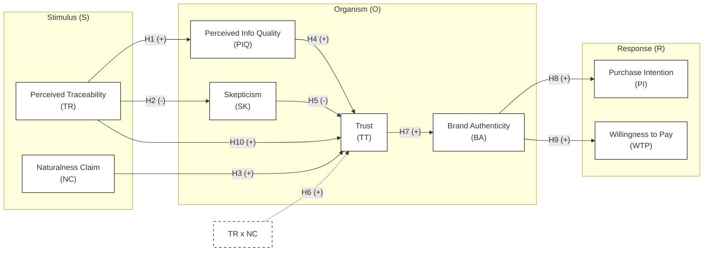

## 2. TÌNH HÌNH NGHIÊN CỨU TRONG VÀ NGOÀI NƯỚC
### 2.1. Bất cân xứng thông tin và hàng hóa dựa trên niềm tin
Trong các thị trường nơi người tiêu dùng khó có thể đánh giá chất lượng sản phẩm ngay cả sau khi tiêu dùng, hiện tượng bất cân xứng thông tin trở nên đặc biệt nghiêm trọng. Theo George Akerlof (1970), trong bối cảnh này, người bán nắm giữ thông tin vượt trội so với người mua, dẫn đến rủi ro lựa chọn bất lợi.

Các sản phẩm thực phẩm chức năng, đặc biệt là nhóm FMCG có thành phần khó kiểm chứng (ví dụ: nước yến chế biến sẵn), thường được xếp vào nhóm hàng hóa dựa trên niềm tin. Trong bối cảnh đó, người tiêu dùng đối mặt với ba hạn chế cốt lõi: thứ nhất là không thể xác minh tỷ lệ thành phần thật; thứ hai là không thể tự đánh giá quy trình sản xuất; và thứ ba là phải phụ thuộc hoàn toàn vào các tín hiệu truyền thông đơn phương từ nhà sản xuất.

Quan sát từ thị trường này, niềm tin trở thành yếu tố trung tâm quyết định hành vi tiêu dùng, nhưng đồng thời cũng dễ bị thao túng thông qua các thông điệp marketing thiếu kiểm chứng.

### 2.2. Hoài nghi đối với cam kết “tự nhiên” và giới hạn của marketing truyền thống
Sự gia tăng của các thông điệp “tự nhiên”, “nguyên chất” và “sạch” trong marketing (Ottman, 2011; Olsen et al., 2014) đã dẫn đến hiện tượng lạm dụng cam kết, làm suy giảm niềm tin của người tiêu dùng. Các nghiên cứu trước đây (Chen, 2012; Skarmeas & Leonidou, 2013) đã cho thấy sự đồng thuận rằng, sự không nhất quán giữa thông điệp truyền thông và bằng chứng thực tế là tác nhân cốt lõi làm gia tăng sự hoài nghi của khách hàng. Đồng thời, mặc dù niềm tin đóng vai trò trung gian sống còn kết nối nhận thức về thuộc tính tự nhiên với hành vi mua, trạng thái tâm lý này rất dễ bị đứt gãy nếu doanh nghiệp chỉ dựa vào các nỗ lực marketing truyền thống mà thiếu đi các cơ chế xác thực khách quan.

Trong các diễn đàn học thuật gần đây, có sự tranh luận sâu sắc về hiệu quả của các nỗ lực marketing truyền thống. Mặc dù Chen (2012) cho rằng niềm tin có thể hình thành qua truyền thông, lập luận này bộc lộ điểm yếu khi áp dụng vào bối cảnh sự suy giảm niềm tin hiện tại. Khi rủi ro cảm nhận quá cao, các nỗ lực marketing truyền thống mất đi hiệu lực. Do đó, nghiên cứu này lập luận rằng cần có sự can thiệp của các cơ chế xác thực kỹ thuật để vượt qua rào cản hoài nghi này.

### 2.3. Truy xuất nguồn gốc và vai trò của công nghệ số
Trong những năm gần đây, các công nghệ truy xuất nguồn gốc được đề xuất như một giải pháp nhằm giảm bất cân xứng thông tin trong chuỗi cung ứng thực phẩm (Francisco & Swanson, 2018; Saberi et al., 2019; Tian, 2017). Napolitano et al. (2010) đã chứng minh rằng việc cung cấp thông tin minh bạch về quy trình sản xuất có tác động tích cực đến sự sẵn lòng chi trả của người tiêu dùng.

Nghiên cứu của Francisco và Swanson (2018) cùng Saberi và các cộng sự (2019) đã chỉ ra rằng, tín hiệu truy xuất nguồn gốc có khả năng nâng cao tính minh bạch và độ tin cậy của chuỗi cung ứng, từ đó góp phần cải thiện đáng kể niềm tin của người tiêu dùng đối với các nhóm hàng hóa dựa trên niềm tin.

Tuy nhiên, trong ngành FMCG – nơi quyết định mua diễn ra nhanh, ít suy nghĩ – cơ chế chuyển hóa chi tiết từ nhận thức truy xuất sang niềm tin vẫn còn chưa được kiểm định đầy đủ, được tóm tắt tại Bảng 1.

**Bảng 1: Tổng hợp các nghiên cứu tiêu biểu về Truy xuất nguồn gốc và Khoảng trống nghiên cứu**
| Tác giả | Bối cảnh | Biến chính | Kết quả | Khoảng trống |
|---|---|---|---|---|
| Kendall et al. (2019) | Thực phẩm nhập khẩu, TQ | Food fraud → Integrity | Gian lận làm giảm niềm tin | Chưa có truy xuất số |
| Kamble et al. (2020) | Nông sản, Ấn Độ | Blockchain → Supply chain | Mô hình hóa chuỗi cung ứng | Thiếu góc người tiêu dùng |
| Luận án này | Nước yến RTD, VN | TR → PIQ → BA → TT → PI/WTP | Đang kiểm định | Giải quyết các khoảng trống đã nêu |

Ngoài ra, trong bối cảnh thực phẩm hữu cơ tại châu Âu, Naspetti và Zanoli (2009) đã chứng minh rằng nhận thức về chất lượng và nguồn gốc có tác động trực tiếp đến sự sẵn lòng trả giá cao hơn. Newman và Dhar (2014) cũng bổ sung rằng tính xác thực có tính "lây lan" – khi một yếu tố được xác thực, người tiêu dùng có xu hướng gán tính xác thực cho toàn bộ thương hiệu. Cả hai phát hiện này đều ủng hộ mạnh mẽ cho vai trò trung gian của Brand Authenticity trong mô hình đề xuất.

### 2.4. Lý thuyết tín hiệu và khoảng cách giữa tín hiệu kỹ thuật – nhận thức người tiêu dùng
Theo Michael Spence (1973), trong điều kiện bất cân xứng thông tin, các bên cung cấp sẽ gửi đi các tín hiệu để truyền tải thông tin về chất lượng. Hệ thống lý thuyết sau này của Connelly và các cộng sự (2011) đã phân loại chi tiết các tín hiệu thành hai nhóm chính: nhóm tín hiệu chi phí thấp vốn dễ phát đi và dễ giả mạo (ví dụ như slogan marketing), và nhóm tín hiệu chi phí cao đòi hỏi sự đầu tư lớn và rất khó giả mạo (ví dụ như hệ thống truy xuất nguồn gốc minh bạch).

Truy xuất nguồn gốc số được xem là một dạng dấu hiệu nhận biết. Khoảng cách quan trọng chưa được giải quyết là: Làm thế nào một tín hiệu kỹ thuật được chuyển hóa thành nhận thức tâm lý của người tiêu dùng? Phần lớn nghiên cứu hiện tại giả định người tiêu dùng tự động tin vào công nghệ, bỏ qua việc kiểm định quá trình chuyển hóa phức tạp từ một "Technical Signal" khô khan thành "Psychological Trust".

### 2.5. Tính xác thực thương hiệu như một cơ chế trung gian
Khái niệm Brand Authenticity được phát triển mạnh trong nghiên cứu hành vi tiêu dùng gần đây. Trong thị trường hàng hóa dựa trên niềm tin, người tiêu dùng không còn tin vào các hình ảnh thương hiệu được xây dựng đơn thuần bằng quảng cáo. Thay vào đó, họ tìm kiếm sự chân thật. Tính xác thực là cấp độ cao hơn của niềm tin, nó gắn kết cả lý trí và cảm xúc, đóng vai trò là cơ chế trung gian then chốt (Morhart et al., 2015). Trong môi trường kỹ thuật số, hướng nhân quả được lập luận đi từ Niềm tin (Trust) đến Tính xác thực (Authenticity). Cụ thể, khi người tiêu dùng xác lập được "niềm tin vào dữ liệu" (Trust in data) thông qua truy xuất nguồn gốc, niềm tin nền tảng này sẽ hoạt động như một bệ phóng tâm lý để họ quy gán sự liêm chính và tính chân thật toàn diện cho thương hiệu (Brand Authenticity). Theo Morhart et al. (2015), tính xác thực bao gồm: Credibility (đáng tin cậy), Integrity (liêm chính), Continuity (nhất quán), Symbolism (ý nghĩa biểu tượng).

Các nghiên cứu cho thấy Brand Authenticity có liên hệ mạnh với lòng trung thành và mức sẵn lòng chi trả (Newman & Dhar, 2014), nhưng thường được nghiên cứu trong bối cảnh thương hiệu cao cấp hoặc storytelling thương hiệu. Trong khi đó, vai trò của Brand Authenticity như một biến trung gian giữa tín hiệu kỹ thuật và hành vi tiêu dùng nhanh vẫn còn là một khoảng trống cần được làm rõ trong bối cảnh FMCG.

#### Sơ đồ Mô hình Nghiên cứu

*Hình 1. Mô hình nghiên cứu tích hợp S-O-R và Lý thuyết Tín hiệu.*

### 2.6. Khoảng trống nghiên cứu
Từ tổng quan tài liệu trên, nghiên cứu này xác định ba khoảng trống lý thuyết cốt lõi cần giải quyết:

**Gap 1 – Khoảng trống sơ khai về cơ chế trung gian:** Mặc dù Niềm tin đã được chứng minh là biến trung gian phổ biến (Chen, 2012), cơ chế nhận thức về vai trò của *Tính xác thực thương hiệu* như một biến trung gian cấp cao hơn kết nối tín hiệu kỹ thuật với hành vi tiêu dùng nhanh vẫn chưa được làm rõ.

**Gap 2 – Khoảng trống thiếu nhất quán về tích hợp lý thuyết:** Các dòng nghiên cứu hiện tại tồn tại sự đứt gãy lớn giữa góc độ quản trị chuỗi cung ứng (hệ thống truy xuất) và tâm lý hành vi (niềm tin, hoài nghi). Hiện vẫn thiếu các mô hình tích hợp giải quyết sự mâu thuẫn trong việc đánh giá liệu một "tín hiệu kỹ thuật" thuần túy có đủ sức thay thế hoàn toàn các "tín hiệu marketing" truyền thống hay không.

**Gap 3 – Khoảng trống bối cảnh:** Các nghiên cứu thực chứng chủ yếu được thực hiện ở các thị trường phát triển hoặc áp dụng cho nông sản thô. Việc áp dụng lý thuyết tín hiệu vào thị trường mới nổi (Việt Nam) đối với ngành FMCG chế biến công nghiệp có mức bất cân xứng thông tin cực cao (như nước yến RTD) vẫn là một khoảng trống nghiên cứu cần được làm rõ.

**Kết luận định vị nghiên cứu:** Trên cơ sở các khoảng trống lý thuyết trên, nghiên cứu này được thực hiện nhằm kiểm định thực chứng cơ chế tác động của truy xuất nguồn gốc số đến hành vi tiêu dùng, thông qua các biến tâm lý trung gian (PIQ, Trust, Brand Authenticity), trong bối cảnh cụ thể của thị trường nước yến RTD tại Việt Nam.
