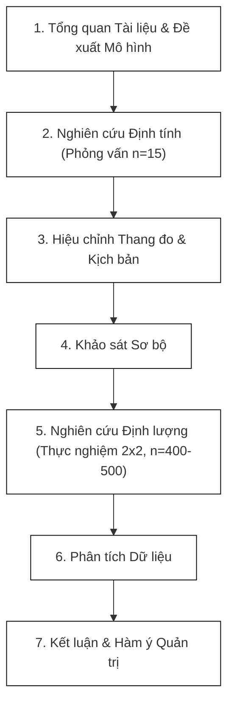
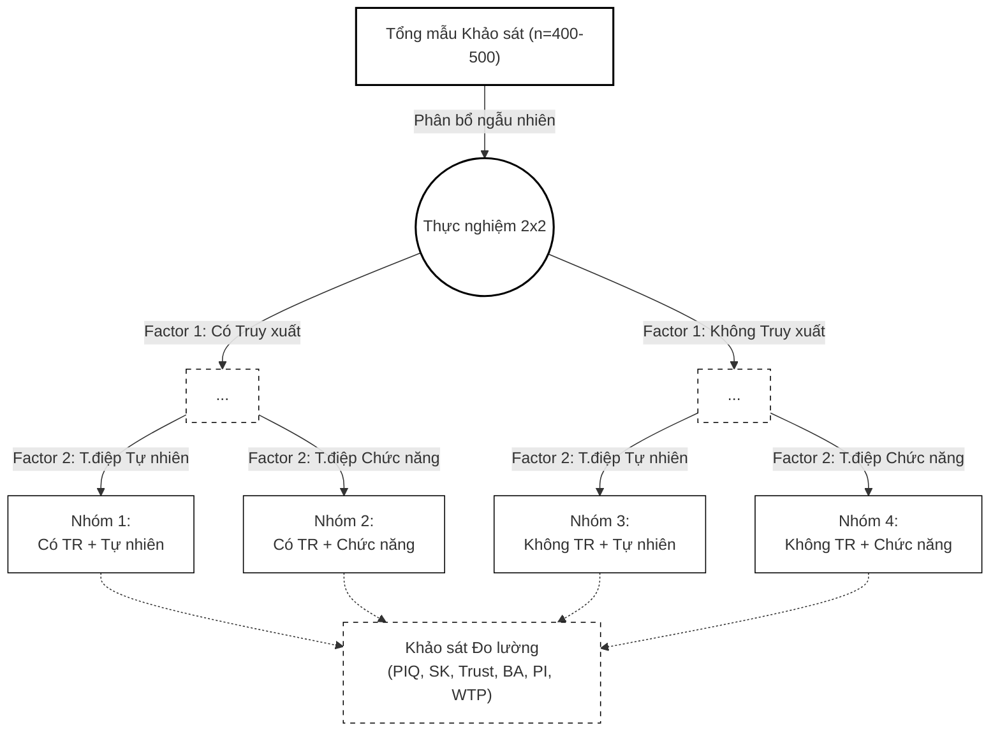

## 3. MỤC TIÊU NGHIÊN CỨU CỦA LUẬN ÁN
### 3.1. Mục tiêu tổng quát
Kiểm định cơ chế tác động của tín hiệu truy xuất nguồn gốc số đối với nhận thức, tính xác thực thương hiệu và hành vi tiêu dùng của khách hàng đối với sản phẩm nước yến chế biến sẵn.

### 3.2. Mục tiêu cụ thể
1.  **Hệ thống hóa cơ sở lý luận** về bất cân xứng thông tin, lý thuyết tín hiệu và niềm tin trong bối cảnh truy xuất nguồn gốc số.
2.  **Xây dựng và kiểm định mô hình** đánh giá tác động của nhận thức về truy xuất nguồn gốc đến hoài nghi, niềm tin và tính xác thực thương hiệu.
3.  **Đo lường tác động** của Tính xác thực thương hiệu lên Ý định mua hàng và Mức sẵn lòng chi trả thêm.
4.  **Đề xuất các hàm ý quản trị** giúp doanh nghiệp nước yến RTD tối ưu hóa chiến lược minh bạch nguồn gốc.

### 3.3. Câu hỏi nghiên cứu
1.  Tín hiệu truy xuất nguồn gốc số tác động như thế nào đến các biến tâm lý (hoài nghi, niềm tin)?
2.  Tính xác thực thương hiệu đóng vai trò trung gian như thế nào trong cơ chế hình thành ý định tiêu dùng?
3.  Cơ chế tác động tương tác giữa nội dung thông điệp tiếp thị và xác thực số diễn ra như thế nào?

## 4. NỘI DUNG NGHIÊN CỨU
Để giải quyết các mục tiêu trên, luận án sẽ triển khai 4 nội dung nghiên cứu chính:
1.  **Xây dựng khung lý thuyết và mô hình:** Phát triển mô hình nghiên cứu tích hợp dựa trên khung S-O-R và Lý thuyết Tín hiệu, từ đó thiết lập hệ thống giả thuyết khoa học.
2.  **Thực hiện nghiên cứu định tính:** Tiến hành phỏng vấn sâu chuyên gia để hiệu chỉnh thang đo và xác nhận tính chân thực, hợp lý của kịch bản thực nghiệm (mockup sản phẩm).
3.  **Thực hiện nghiên cứu định lượng:** Thiết kế thực nghiệm scenario-based 2x2, thu thập dữ liệu bằng bảng hỏi phân bổ ngẫu nhiên, và phân tích dữ liệu bằng mô hình cấu trúc PLS-SEM.
4.  **Thảo luận kết quả và đề xuất giải pháp:** Đối chiếu kết quả phân tích với các nghiên cứu trước đây và đề xuất các hàm ý quản trị thiết thực cho doanh nghiệp.

## 6. PHẠM VI NGHIÊN CỨU CỦA ĐỀ TÀI
1.  **Không gian nghiên cứu:** Dữ liệu thực chứng được thu thập tại khu vực Thành phố Hồ Chí Minh, một đô thị lớn có mức độ nhận thức và tiếp cận công nghệ tiêu dùng cao.
2.  **Thời gian thực hiện:** Tiến trình khảo sát và thu thập dữ liệu dự kiến được triển khai từ Quý 3 năm 2026 đến hết Quý 1 năm 2027.
3.  **Bối cảnh và nội dung:** Nghiên cứu giới hạn trong phạm vi ngành hàng nước yến chế biến sẵn và tập trung phân tích hành vi người tiêu dùng (phía cầu), không đánh giá năng lực công nghệ hạ tầng (phía cung).
4.  **Lý thuyết và biến số:** Mô hình nghiên cứu giới hạn trong khung tích hợp S-O-R và Lý thuyết Tín hiệu gồm 8 biến số chính (TR, NC, PIQ, SK, TT, BA, PI, WTP), không tích hợp các biến ngoại lai khác.

## 7. ĐỐI TƯỢNG NGHIÊN CỨU CỦA ĐỀ TÀI
**Đối tượng nghiên cứu:** Cơ chế tác động tâm lý và hành vi của người tiêu dùng trong việc phản ứng với các tín hiệu nhận thức về truy xuất nguồn gốc thông qua công nghệ số.

**Khách thể nghiên cứu:** Người tiêu dùng thế hệ Gen Z (18-27 tuổi) đang sinh sống tại khu vực đô thị (TP.HCM).

**Đối tượng khảo sát:** Người tiêu dùng Gen Z (18-27 tuổi) tại TP.HCM, có hành vi tiêu thụ nước giải khát dinh dưỡng, quan tâm đến sức khỏe, và được phân bổ ngẫu nhiên vào 1 trong 4 nhóm kịch bản thực nghiệm.

## 8. PHƯƠNG PHÁP NGHIÊN CỨU
### 8.1. Mô hình nghiên cứu và Giả thuyết
#### 8.1.1. Logic xây dựng mô hình
Mô hình nghiên cứu được xây dựng dựa trên sự tích hợp chặt chẽ giữa khung lý thuyết kích thích - cơ thể - phản hồi (Stimulus – Organism – Response - S-O-R) và Lý thuyết Tín hiệu.

Trong đó, các biến số được phân bổ cụ thể theo các cấu phần như sau:

**Nhân tố Kích thích:** Nhận thức về khả năng truy xuất nguồn gốc và Thông điệp truyền thông tiếp thị.

**Nhận thức Cơ thể:** Chất lượng thông tin cảm nhận, Hoài nghi thương hiệu, Niềm tin, và Tính xác thực thương hiệu.

**Phản hồi Hành vi:** Ý định mua hàng và Mức sẵn lòng chi trả thêm.

**Tính tinh gọn của mô hình:** Mặc dù "Rủi ro cảm nhận" là tiền đề nội tại, nghiên cứu không vẽ nó thành một biến riêng biệt. Thay vào đó, sự suy giảm rủi ro cảm nhận được bao hàm thông qua sự suy giảm của Hoài nghi và sự gia tăng của Niềm tin.

#### 8.1.2. Mô hình nghiên cứu đề xuất
**Cấu trúc tuyến chính:**
Tuyến nhận thức: TR ➔ PIQ / SK ➔ TT ➔ BA ➔ PI / WTP
Tuyến trực tiếp: TR ➔ SK ➔ TT và NC ➔ TT

**Tương tác:**
Tác động điều tiết: TR × NC ➔ TT

#### 8.1.3. Giả thuyết nghiên cứu
Nghiên cứu đề xuất 9 giả thuyết cốt lõi (xem Hình 1):

**Tuyến hình thành Nhận thức:**
**Giả thuyết H1 (+):** Nhận thức về khả năng truy xuất nguồn gốc tác động tích cực đến Chất lượng thông tin cảm nhận.
**Giả thuyết H2 (-):** Nhận thức về khả năng truy xuất nguồn gốc tác động tiêu cực (làm giảm) sự Hoài nghi của người tiêu dùng.

**Tuyến hình thành Niềm tin:**
**Giả thuyết H3 (+):** Thông điệp truyền thông tiếp thị tác động tích cực đến Niềm tin thương hiệu.
**Giả thuyết H4 (+):** Chất lượng thông tin cảm nhận tác động tích cực đến Niềm tin thương hiệu.
**Giả thuyết H5 (-):** Hoài nghi thương hiệu tác động tiêu cực đến Niềm tin thương hiệu.
**Giả thuyết H10 (+):** Nhận thức về khả năng truy xuất nguồn gốc tác động trực tiếp và tích cực đến Niềm tin thương hiệu.
**Giả thuyết H6 (+):** Tín hiệu truy xuất nguồn gốc đóng vai trò điều tiết, làm khuếch đại tác động tích cực của thông điệp tiếp thị lên Niềm tin thương hiệu.

**Tuyến chuyển hóa Giá trị và Hành vi:**
**Giả thuyết H7 (+):** Niềm tin thương hiệu tác động tích cực đến Tính xác thực thương hiệu.
**Giả thuyết H8 (+):** Tính xác thực thương hiệu tác động tích cực đến Ý định mua hàng.
**Giả thuyết H9 (+):** Tính xác thực thương hiệu tác động tích cực đến Mức sẵn lòng chi trả thêm.

#### 8.1.4. Định vị khoa học
Định vị cốt lõi: *"Nghiên cứu này không đánh giá công nghệ dưới góc độ kỹ thuật lõi, mà xem xét cách thức nhận thức về truy xuất nguồn gốc đóng vai trò như một tín hiệu niềm tin giúp định hình nhận thức, tính xác thực và ý định hành vi của người tiêu dùng."*

### 8.2. Thiết kế và quy trình nghiên cứu
#### 8.2.1. Cách tiếp cận nghiên cứu
Nghiên cứu được thiết kế theo phương pháp hỗn hợp, thực hiện qua hai giai đoạn:

**Giai đoạn 1: Nghiên cứu định tính**
- **Phương pháp:** Phỏng vấn sâu với hội đồng chuyên gia.
- **Mẫu chuyên gia (n = 15):** Nhóm 1 (08 người) quản lý phân phối ngành FMCG; Nhóm 2 (07 người) chuyên gia CNTT về truy xuất nguồn gốc.
- **Kết quả đầu ra:** Hiệu chỉnh hệ thống thang đo và thẩm định tính thực tế của kịch bản thực nghiệm.

**Giai đoạn 2: Nghiên cứu thực nghiệm định lượng**
- **Thực nghiệm:** Sử dụng thiết kế kịch bản thực nghiệm để kiểm soát các tác động. Các biến thao tác (TR và NC) được ánh xạ vào mô hình SEM dưới dạng các biến giả (Dummy variables) với giá trị 0-1 để tuân thủ nguyên tắc đo lường của thiết kế thực nghiệm.
- **Khảo sát:** Đo lường hành vi và phản ứng tâm lý thông qua mô hình cấu trúc phương trình bình phương bé nhất (PLS-SEM). Nhằm đảm bảo độ chặt chẽ của việc so sánh các kịch bản, Phân tích đa nhóm (Multi-Group Analysis - MGA) cũng được sử dụng bổ trợ.

*Hình 2. Sơ đồ Quy trình Nghiên cứu.*

*Hình 3. Sơ đồ Thiết kế Thực nghiệm.*

**Lưu ý về ranh giới nghiên cứu:** Nghiên cứu này không đánh giá hiệu năng của hệ thống công nghệ thực tế, mà tập trung đo lường "nhận thức về truy xuất nguồn gốc" của người tiêu dùng.

#### 8.2.3. Vật liệu thực nghiệm
Vật liệu thực nghiệm được thiết kế và chế bản chi tiết dưới dạng Mockup sản phẩm thực tế, bao gồm: thứ nhất là bao bì sản phẩm với một thương hiệu giả định nhằm loại bỏ nhiễu ngoại lai từ lòng trung thành thương hiệu cũ; thứ hai là mã QR code giả lập có khả năng tương tác; và thứ ba là giao diện truy xuất nguồn gốc hiển thị chi tiết vòng đời của sản phẩm nước yến sào.

#### 8.2.4. Đối tượng và Phương pháp thu thập dữ liệu
**Đối tượng khảo sát:** Người tiêu dùng thế hệ Gen Z (18–27 tuổi) hiện đang sinh sống tại khu vực đô thị (TP.HCM).

**Phương pháp lấy mẫu:** Lấy mẫu phi xác suất có mục đích kết hợp lấy mẫu quả cầu tuyết. Bộ câu hỏi sử dụng màng lọc sàng lọc gắt gao: chỉ chấp nhận các đáp viên có hành vi tiêu dùng nước giải khát dinh dưỡng và quan tâm đến sức khỏe.

**Kích thước mẫu dự kiến:** n = 400 – 500 đáp viên. Kích thước mẫu tối thiểu được tính toán khoa học thông qua phần mềm G*Power 3.1 (mức ý nghĩa 5%, power 80%, effect size trung bình) đảm bảo thỏa mãn và vượt xa yêu cầu thống kê của Hair et al. (2022).

#### 8.2.5. Thang đo và Xây dựng bảng hỏi
Toàn bộ biến tiềm ẩn được đo lường bằng thang đo Likert 7 điểm. Thang đo 7 điểm cung cấp độ nhạy cao hơn cho mô hình PLS-SEM (Hair et al., 2022).
*   *Quy trình chuẩn hóa:* Dịch xuôi - dịch ngược.
*   *Pilot test:* n ≈ 30 trước khi khảo sát diện rộng.

#### 8.2.6. Phân tích dữ liệu
Phương pháp phân tích cốt lõi là PLS-SEM (SmartPLS 4). Quy trình 4 bước:
1.  **Mô hình đo lường:** Cronbach's Alpha, ρ_A, Composite Reliability, AVE ≥ 0.5.
2.  **Giá trị phân biệt:** Fornell-Larcker criterion và HTMT.
3.  **Mô hình cấu trúc:** Path coefficients β, R², f², PLSpredict (Q² predict).
4.  **Kiểm định trung gian nối tiếp và Phân tích đa nhóm:** Bootstrapping 5.000 mẫu lặp. Phân tích đa nhóm theo giới tính / kinh nghiệm mua yến.

#### 8.2.7. Kiểm soát sai lệch
1.  **Common Method Bias:** Hoán đổi thứ tự câu hỏi, biến đánh dấu, Full collinearity VIF < 3.3.
2.  **Manipulation Check:** Câu hỏi kiểm tra thao tác thực nghiệm.
3.  **Data Cleaning:** Loại bỏ "Speeders" và "Straight-liners".

#### 8.2.8. Đạo đức nghiên cứu
Nghiên cứu cam kết tuân thủ nghiêm ngặt các quy định về đạo đức khoa học: đáp viên tham gia hoàn toàn trên tinh thần tự nguyện; toàn bộ dữ liệu cá nhân được mã hóa ẩn danh tuyệt đối; và quy trình nghiên cứu tuân thủ các hướng dẫn của Hội đồng Đạo đức Trường Đại học Nha Trang.

### 8.4. Cấu trúc dự kiến của Luận án
Cấu trúc dự kiến của luận án bao gồm 5 chương, được phân bổ như trình bày tại Bảng 3.

**Bảng 3: Cấu trúc dự kiến của luận án**
| Chương | Nội dung | Ước lượng |
|---|---|---|
| Chương 1 | Giới thiệu: Bối cảnh, Mục tiêu, Câu hỏi nghiên cứu, Phạm vi | 15-20 trang |
| Chương 2 | Tổng quan Lý thuyết và Mô hình nghiên cứu | 40-50 trang |
| Chương 3 | Phương pháp Nghiên cứu (Thiết kế thực nghiệm, Thang đo, PLS-SEM) | 25-30 trang |
| Chương 4 | Kết quả Nghiên cứu (Thống kê mô tả, Mô hình đo lường, Mô hình cấu trúc) | 30-40 trang |
| Chương 5 | Thảo luận, Kết luận, Hàm ý quản trị và Hạn chế | 20-25 trang |
