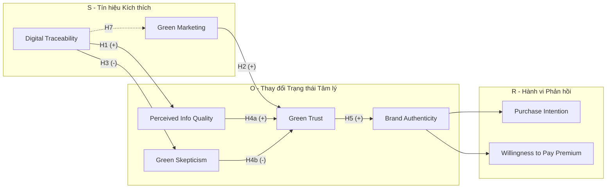

# ĐỀ CƯƠNG DỰ TUYỂN TRÌNH ĐỘ TIẾN SĨ

**Tên định hướng nghiên cứu:** Truy xuất nguồn gốc số như một tín hiệu niềm tin: Vai trò trung gian của tính xác thực thương hiệu đối với hành vi mua sản phẩm nông sản đặc hữu chế biến (Cà phê đặc sản và Trà Actiso)
**Chuyên ngành:** Quản trị Kinh doanh
**Mã số:** 9340101
**Tên người dự tuyển:** Lê Phúc Hải
**Cơ quan công tác:** ...

---

## 1. ĐẶT VẤN ĐỀ
### 1.1. Bất cân xứng thông tin và Khủng hoảng niềm tin trong ngành hàng nông sản đặc hữu chế biến
1.  **Giá trị kinh tế và Dấu ấn bản địa của Nông sản Lâm Đồng:** Lâm Đồng được mệnh danh là trung tâm nông nghiệp công nghệ cao hàng đầu của cả nước. Trong đó, các nông sản đặc hữu như Cà phê Arabica Cầu Đất và Trà Actiso Đà Lạt không chỉ mang lại giá trị xuất khẩu và kinh tế khổng lồ, mà còn đóng vai trò như "đại sứ thương hiệu" mang bản sắc văn hóa của địa phương. Theo số liệu của Sở Nông nghiệp và Phát triển Nông thôn tỉnh Lâm Đồng, ngành cà phê và dược liệu đóng góp phần lớn vào tỷ trọng GRDP nông nghiệp, đồng thời giải quyết sinh kế ổn định cho hàng chục ngàn nông hộ. Các sản phẩm này đã được cơ quan quản lý nhà nước cấp giấy chứng nhận bảo hộ Chỉ dẫn địa lý và là các sản phẩm chủ lực trong chương trình trọng điểm OCOP (Mỗi xã một sản phẩm). Việc bảo vệ, duy trì và nâng tầm giá trị các sản phẩm này mang tính sống còn đối với chiến lược phát triển kinh tế - xã hội bền vững của tỉnh.
2.  **Thực trạng đứt gãy thông tin trong chuỗi cung ứng:** Mặc dù đạt được những thành tựu nhất định về mặt sản lượng, chuỗi cung ứng nông sản Lâm Đồng hiện nay vẫn mang nặng tính phân tán và thiếu tính liên kết chặt chẽ. Hầu hết các khâu từ thu mua nguyên liệu thô tại vườn, sơ chế, tinh chế đến rang xay và đóng gói thành phẩm đều bị cắt khúc qua nhiều khâu trung gian. Điều này tạo ra những điểm mù thông tin khổng lồ trên chuỗi giá trị, khiến cho việc truy xuất nguồn gốc ngược dòng gặp nhiều trở ngại lớn.
3.  **Đặc tính hàng hóa và Bất cân xứng thông tin:** Khi các loại nông sản thô này được chuyển đổi thành các sản phẩm đóng gói chế biến sâu (chẳng hạn như cà phê rang xay nguyên chất đóng gói, trà Actiso túi lọc, hay cao Actiso), chúng lập tức bị phân loại vào nhóm hàng hóa dựa trên niềm tin. Theo lý thuyết kinh điển của George Akerlof (1970), credence goods là nhóm sản phẩm mà người tiêu dùng không thể đánh giá chính xác chất lượng thực tế (như tỷ lệ pha trộn, nguồn gốc vùng trồng, quy trình canh tác hữu cơ hay dư lượng thuốc bảo vệ thực vật) ngay cả sau khi đã thanh toán và tiêu dùng sản phẩm. Điều này dẫn đến sự bất cân xứng thông tin vô cùng sâu sắc giữa nhà sản xuất (người nắm rõ thực trạng) và người mua (người chịu rủi ro).
4.  **Vấn nạn "Hàng nhái Đà Lạt" và Khủng hoảng niềm tin:** Chính vì giá trị thương hiệu và giá bán sinh lời cao trên thị trường, cà phê đặc sản và Actiso Đà Lạt thường xuyên trở thành nạn nhân của tình trạng gian lận thương mại quy mô lớn. Các cơ sở kinh doanh cơ hội thường nhập lậu hoặc pha trộn các loại cà phê/dược liệu kém chất lượng từ vùng khác và tinh vi gắn mác "Arabica Cầu Đất" hay "Actiso Đà Lạt chính gốc". Thực trạng nhức nhối này đẩy người tiêu dùng vào trạng thái đối mặt với rủi ro cảm nhận cực kỳ cao. Khi thị trường tràn ngập hàng giả mạo danh Chỉ dẫn địa lý, niềm tin của người tiêu dùng sụp đổ, dẫn đến hiện tượng "thị trường quả chanh" – một nghịch lý nơi các sản phẩm chân chính, chất lượng cao bị chèn ép về giá, không thể cạnh tranh và dần bị đào thải khỏi thị trường.
5.  **Tác động tiêu cực từ vấn nạn "Tẩy xanh":** Nhằm cố gắng lấy lại niềm tin, nhiều nhãn hàng hiện nay lạm dụng các chiến dịch truyền thông với các từ khóa "mỹ miều" như "Organic", "100% Cầu Đất", "Nguyên chất", "Sạch" nhưng lại hoàn toàn thiếu các minh chứng xác đáng và độc lập. Hiện tượng này được giới học thuật gọi là "Tẩy xanh". Thay vì tạo ra niềm tin, Greenwashing làm cho người tiêu dùng ngày càng trở nên hoài nghi và phản kháng mạnh mẽ hơn đối với mọi thông điệp marketing truyền thống.
6.  **Sự cấp thiết của một cơ chế xác thực minh bạch thông qua Công nghệ số:** Việc giải quyết khủng hoảng niềm tin đối với nông sản đặc hữu Lâm Đồng không thể chỉ tiếp tục dựa vào các nỗ lực truyền thông tĩnh hay các loại tem nhãn giấy vốn rất dễ bị in giả. Trong bối cảnh công nghiệp 4.0, Blockchain (chuỗi khối) và các công nghệ truy xuất nguồn gốc số được kỳ vọng mang lại tiềm năng to lớn, tạo ra một "tấm khiên" bảo vệ thương hiệu địa phương nhờ đặc tính bất biến và minh bạch. Tuy nhiên, một khoảng trống lớn hiện nay là thay vì tiếp cận Blockchain như một hạ tầng kỹ thuật máy tính thuần túy, việc nghiên cứu sâu sắc cách thức công nghệ này chuyển hóa thành "tín hiệu niềm tin" để tác động trực tiếp vào hộp đen tâm lý người tiêu dùng là một vấn đề là một yêu cầu cần thiết cả về mặt học thuật lẫn thực tiễn quản trị.

### 1.2. Phạm vi và Đối tượng nghiên cứu
**Phạm vi nghiên cứu:**
*   **Về không gian:** Khảo sát và thực nghiệm được tiến hành tại TP. Hồ Chí Minh.
*   **Về thời gian:** Dữ liệu dự kiến được thu thập và xử lý trong giai đoạn năm 2026 - 2027.
*   **Về nội dung:** Nghiên cứu cơ chế tác động của nhận thức về truy xuất nguồn gốc đến tính xác thực thương hiệu và hành vi mua đối với nhóm sản phẩm Cà phê đặc sản và Trà Actiso Lâm Đồng.

**Đối tượng và Khách thể nghiên cứu:**
*   **Đối tượng nghiên cứu:** Các yếu tố tâm lý và hành vi tiêu dùng (Hoài nghi xanh, Niềm tin xanh, Tính xác thực thương hiệu, Ý định mua) khi tương tác với hệ thống truy xuất nguồn gốc số.
*   **Khách thể nghiên cứu:** Người tiêu dùng thuộc thế hệ Gen Z (18-27 tuổi), sinh sống tại TP. Hồ Chí Minh.
## 2. TỔNG QUAN VẤN ĐỀ NGHIÊN CỨU
### 2.1. Tổng quan các nghiên cứu trước đây
#### 2.1.1. Bất cân xứng thông tin và hàng hóa dựa trên niềm tin
Trong các thị trường nơi người tiêu dùng khó có thể đánh giá chất lượng sản phẩm ngay cả sau khi tiêu dùng, hiện tượng bất cân xứng thông tin trở nên đặc biệt nghiêm trọng. Theo George Akerlof (1970), trong bối cảnh này, người bán nắm giữ thông tin vượt trội so với người mua, dẫn đến rủi ro lựa chọn bất lợi.

Các sản phẩm thực phẩm chức năng, đặc biệt là nhóm FMCG có thành phần khó kiểm chứng (ví dụ: nông sản đặc hữu chế biến (Cà phê đặc sản và Trà Actiso)), thường được xếp vào nhóm hàng hóa dựa trên niềm tin, nơi người tiêu dùng:
* Không thể xác minh tỷ lệ thành phần thật.
* Không thể đánh giá quy trình sản xuất.
* Và phải phụ thuộc vào tín hiệu từ nhà sản xuất.

Quan sát từ thị trường này, niềm tin trở thành yếu tố trung tâm quyết định hành vi tiêu dùng, nhưng đồng thời cũng dễ bị thao túng thông qua các thông điệp marketing thiếu kiểm chứng.

**Bảng 2.1: Ma trận tổng hợp các nghiên cứu trọng điểm có liên quan**

| Tác giả (Năm) | Khung lý thuyết/Phương pháp | Bối cảnh nghiên cứu | Kết quả chính đóng góp | Khoảng trống/Hạn chế |
|---|---|---|---|---|
| **Chen (2012)** | PLS-SEM | Sản phẩm xanh (Đài Loan) | Xác định "Green Trust" là biến trung gian cốt lõi; định nghĩa khái niệm Hoài nghi xanh. | Chưa xem xét vai trò của công nghệ xác thực số trong việc hỗ trợ niềm tin. |
| **Morhart et al. (2015)** | CB-SEM, Thực nghiệm | Hàng hóa tiêu dùng (Mỹ) | Phát triển thang đo Brand Authenticity 4 chiều cực kỳ chi tiết. | Chỉ thử nghiệm trên thương hiệu truyền thống, chưa tích hợp với Traceability. |
| **Francisco & Swanson (2018)** | Nghiên cứu định tính | Chuỗi cung ứng thực phẩm toàn cầu | Khẳng định Blockchain giúp minh bạch hóa dòng luân chuyển hàng hóa. | Góc nhìn thuần về Quản trị chuỗi cung ứng, thiếu góc nhìn Hành vi người tiêu dùng. |
| **Wang & Li (2023)** | Thực nghiệm 2x2, PLS-SEM | Sản phẩm nông sản (Trung Quốc) | Phát hiện Blockchain tác động tích cực đến niềm tin và giảm rủi ro cảm nhận. | Chưa đưa biến Brand Authenticity làm cơ chế chuyển hóa giá trị. |

*(Việc phân tích chi tiết ma trận này đóng vai trò nền tảng vững chắc để phát triển mô hình nghiên cứu ở các phần tiếp theo).*

#### 2.1.2. Hoài nghi xanh và giới hạn của marketing truyền thống
Sự gia tăng của các thông điệp “xanh”, “tự nhiên” và “bền vững” trong marketing đã dẫn đến hiện tượng greenwashing, làm suy giảm niềm tin của người tiêu dùng. Nghiên cứu của Nikolaos Skarmeas và Constantinos Leonidou (2013) cho thấy rằng:
* Hoài nghi xanh gia tăng khi người tiêu dùng nhận thấy sự không nhất quán giữa thông điệp và bằng chứng.
* Hoài nghi này tác động tiêu cực đến niềm tin và ý định mua.

Tương tự, Yu-Shan Chen (2012) chỉ ra rằng:
* Green trust đóng vai trò trung gian quan trọng giữa nhận thức về tính “xanh” và hành vi tiêu dùng.
* Nhưng trust này dễ bị suy yếu nếu thiếu cơ chế xác thực đáng tin cậy.

Trong các diễn đàn học thuật gần đây, có một sự tranh luận sâu sắc về hiệu quả của các nỗ lực marketing xanh. Mặc dù Chen (2012) và nhiều nghiên cứu trước đây (Spence, 1973) cho rằng niềm tin có thể hình thành qua truyền thông, nhưng lập luận này bộc lộ điểm yếu khi áp dụng vào bối cảnh khủng hoảng niềm tin hiện tại. Nó bỏ qua sự gia tăng cực độ của rủi ro cảm nhận trong thị trường hiện đại. Khi rủi ro cảm nhận quá cao, các nỗ lực marketing xanh truyền thống mất đi hiệu lực. Do đó, nghiên cứu này lập luận rằng cần có sự can thiệp của các cơ chế xác thực kỹ thuật để vượt qua rào cản hoài nghi này.

#### 2.1.3. Truy xuất nguồn gốc và vai trò của công nghệ số
Trong những năm gần đây, các công nghệ truy xuất nguồn gốc, đặc biệt là công nghệ sổ cái phân tán như Blockchain, được đề xuất như một giải pháp đáng kể nhằm giảm bất cân xứng thông tin trong chuỗi cung ứng nông sản thực phẩm. Theo định nghĩa của tổ chức GS1, truy xuất nguồn gốc là khả năng theo dõi chuyển động tịnh tiến của thực phẩm qua các công đoạn xác định của chuỗi cung ứng (từ sản xuất, chế biến đến phân phối).

Các nghiên cứu ứng dụng như Karen Francisco & Swanson (2018) và Andreas Eggert (2018) cho thấy rằng:
* Truy xuất nguồn gốc cung cấp cho người tiêu dùng một công cụ mạnh mẽ để "kiểm chứng" các tuyên bố về nguồn gốc, quy trình hữu cơ và tính hợp pháp của sản phẩm.
* Việc áp dụng IoT kết hợp với Blockchain giúp dữ liệu không thể bị thao túng bởi con người, từ đó nâng cao niềm tin của người tiêu dùng đối với thông tin được hiển thị.
* Hệ thống này đặc biệt hữu ích trong việc bảo vệ các chỉ dẫn địa lý (như Cà phê Cầu Đất, Actiso Đà Lạt) khỏi nguy cơ bị trà trộn bởi các nguyên liệu giá rẻ.

Tuy nhiên, các nghiên cứu này chủ yếu:
* Tập trung vào cấp độ quản trị chuỗi cung ứng và hiệu quả vận hành.
* Thường giả định tự động rằng "có truy xuất đồng nghĩa với việc người tiêu dùng sẽ tin tưởng", và đo lường niềm tin một cách trực tiếp mà bỏ qua quá trình đánh giá nhận thức.
* Ít đi sâu vào cơ chế tâm lý trung gian (như Hoài nghi xanh hay Tính xác thực thương hiệu) trong bối cảnh tiêu dùng thực tế.

Đặc biệt, trong ngành hàng tiêu dùng nhanh – nơi quyết định mua diễn ra nhanh, dựa trên thói quen và ít suy nghĩ sâu – vai trò của truy xuất nguồn gốc số trong việc thực sự thay đổi nhận thức, cảm xúc và hành vi vẫn chưa được làm rõ đầy đủ bằng các bằng chứng thực nghiệm. Sự vắng bóng của các nghiên cứu kết hợp giữa công nghệ và hành vi tâm lý tạo ra một khoảng trống nghiên cứu cần được giải quyết.

#### 2.1.4. Lý thuyết tín hiệu và khoảng cách giữa tín hiệu kỹ thuật – nhận thức người tiêu dùng
Theo Michael Spence (1973), trong điều kiện bất cân xứng thông tin, các bên cung cấp sẽ gửi đi tín hiệu để truyền tải thông tin về chất lượng. Các nghiên cứu sau này (Connelly et al., 2011) phân biệt:
* Cheap signals: dễ phát đi, dễ giả mạo (ví dụ: slogan marketing).
* Costly signals: tốn kém, khó giả mạo (ví dụ: hệ thống truy xuất minh bạch).

Blockchain được xem là một dạng tín hiệu tốn kém. Khoảng cách quan trọng chưa được giải quyết là: Làm thế nào một tín hiệu kỹ thuật được chuyển hóa thành nhận thức tâm lý của người tiêu dùng? Thay vì chỉ đơn thuần coi Blockchain là một tín hiệu tốn kém, dưới lăng kính chi phí tín hiệu và đánh giá độ khả tín của người nhận (Receiver's credibility assessment), tín hiệu kỹ thuật chỉ phát huy tác dụng khi người tiêu dùng cảm nhận được tính xác thực của thông tin được giải mã. Phần lớn nghiên cứu hiện tại giả định người tiêu dùng tự động tin vào công nghệ Blockchain, bỏ qua việc kiểm định quá trình chuyển hóa phức tạp từ một "Technical Signal" khô khan thành "Psychological Trust".

#### 2.1.5. Tính xác thực thương hiệu như một cơ chế trung gian
Khái niệm Brand Authenticity được phát triển mạnh trong nghiên cứu hành vi tiêu dùng gần đây. Trong thị trường hàng hóa dựa trên niềm tin và bối cảnh lạm dụng greenwashing, người tiêu dùng không còn tin vào các hình ảnh thương hiệu được xây dựng đơn thuần bằng quảng cáo. Thay vào đó, họ tìm kiếm sự chân thật. Tính xác thực là cấp độ cao hơn của niềm tin, nó gắn kết cả lý trí và cảm xúc, đóng vai trò là cơ chế trung gian then chốt. Theo Felix Morhart et al. (2015), tính xác thực bao gồm: Credibility (đáng tin cậy), Integrity (liêm chính), Continuity (nhất quán), Symbolism (ý nghĩa biểu tượng).

Các nghiên cứu cho thấy Brand Authenticity có liên hệ mạnh với lòng trung thành và mức sẵn lòng chi trả, nhưng thường được nghiên cứu trong bối cảnh thương hiệu cao cấp hoặc storytelling thương hiệu. Trong khi đó, vai trò của Brand Authenticity như một biến trung gian giữa tín hiệu kỹ thuật và hành vi tiêu dùng vẫn chưa được kiểm định rõ ràng trong bối cảnh FMCG.

#### Sơ đồ Mô hình Nghiên cứu

*Hình 1. Mô hình nghiên cứu tích hợp và các mối quan hệ giả thuyết.*

### 2.2. Khoảng trống nghiên cứu
Từ tổng quan trên, nghiên cứu xác định ba khoảng trống chính:

* **Gap 1 – Khoảng trống về cơ chế trung gian:** Các nghiên cứu trước đây chủ yếu xem xét Niềm tin xanh như biến trung gian chính giữa minh bạch và hành vi tiêu dùng (Chen, 2012; Skarmeas & Leonidou, 2013). Tuy nhiên, vai trò của Brand Authenticity như một cơ chế trung gian cấp cao hơn đặc biệt trong bối cảnh kết hợp giữa tín hiệu kỹ thuật và tiêu dùng nhanh vẫn còn hạn chế và chưa được kiểm định thực nghiệm đầy đủ.

* **Gap 2 – Khoảng trống về tích hợp lý thuyết:** Các dòng nghiên cứu hiện tại thường tách biệt nghiên cứu về traceability / blockchain (supply chain, information systems) và nghiên cứu về consumer behavior (trust, skepticism, intention). Do đó, thiếu các mô hình tích hợp giải thích toàn bộ chuỗi: Tín hiệu kỹ thuật → Nhận thức thông tin → Trạng thái tâm lý → Hành vi tiêu dùng. Đặc biệt, việc kết hợp S-O-R framework với Signaling Theory trong bối cảnh này vẫn còn hạn chế.

* **Gap 3 – Khoảng trống về bối cảnh nghiên cứu:** Phần lớn các nghiên cứu về truy xuất nguồn gốc, niềm tin tiêu dùng được thực hiện tại các thị trường phát triển (EU, Mỹ), hoặc trong bối cảnh nông sản tươi sống. Trong khi đó, các nghiên cứu thực chứng tại thị trường mới nổi như Việt Nam, đặc biệt trong ngành hàng FMCG có mức độ bất cân xứng thông tin cao (như nông sản đặc hữu chế biến (Cà phê đặc sản và Trà Actiso)) vẫn còn rất hạn chế.

**Kết luận định vị nghiên cứu:** Trên cơ sở các khoảng trống trên, nghiên cứu này được thực hiện nhằm kiểm định cơ chế tác động của truy xuất nguồn gốc số đến hành vi tiêu dùng, thông qua các biến tâm lý trung gian (PIQ, Trust, Brand Authenticity), trong bối cảnh cụ thể của thị trường FMCG tại Việt Nam.

---

### 2.3. Cơ sở lý thuyết của phương pháp nghiên cứu
**2.3.1. Lịch sử và sự tiến hóa của Lý thuyết Tín hiệu**
Lý thuyết Tín hiệu, ban đầu được phát triển bởi nhà kinh tế học đoạt giải Nobel Michael Spence (1973) để giải thích sự bất cân xứng thông tin trong thị trường lao động. Theo thời gian, lý thuyết này đã có sự tiến hóa vượt bậc và trở thành một trong những nền tảng lý luận quan trọng nhất trong nghiên cứu Marketing và Hành vi người tiêu dùng (Connelly et al., 2011). 

Trọng tâm cốt lõi của lý thuyết này là khái niệm "Tín hiệu tốn kém" và "Chi phí tín hiệu". Trong một thị trường ngập tràn thông tin giả và hiện tượng "Greenwashing" phổ biến, các tín hiệu dễ dàng phát ra bằng văn bản hoặc hình ảnh (như quảng cáo truyền thống trên bao bì) được gọi là "Cheap signals". Do không có rào cản chi phí để làm giả, các cheap signals này hoàn toàn mất đi khả năng thuyết phục khách hàng. 

Ngược lại, việc đầu tư vào hệ thống truy xuất nguồn gốc số (Digital Traceability / Blockchain) đòi hỏi doanh nghiệp phải tái cấu trúc toàn bộ chuỗi cung ứng, chuẩn hóa dữ liệu, áp dụng thiết bị IoT và minh bạch hóa toàn bộ sổ cái dữ liệu. Đây chính là một "Tín hiệu tốn kém" mà các doanh nghiệp làm ăn gian dối, không có năng lực lõi không thể (hoặc không dám) bắt chước. Do đó, Blockchain hoạt động như một cơ chế "sàng lọc" hoàn hảo, giúp người tiêu dùng dễ dàng nhận diện tính xác thực của sản phẩm. Việc ứng dụng Signaling Theory giúp luận án giải thích cơ chế chuyển đổi từ một công cụ kỹ thuật khô khan thành một lợi thế cạnh tranh tâm lý vô giá.

**2.3.2. Khung phân tích Kích thích - Tổ chức - Phản hồi**
Mô hình S-O-R (Mehrabian & Russell, 1974) cung cấp một lăng kính toàn diện và có hệ thống để hiểu cách môi trường bên ngoài tác động đến trạng thái tâm lý nội tại và từ đó dẫn dắt hành vi con người. Khác với mô hình hộp đen của chủ nghĩa hành vi truyền thống vốn chỉ quan tâm đến Kích thích và Phản hồi, mô hình S-O-R cho phép khám phá sâu vào diễn biến tâm lý của đối tượng. Trong nghiên cứu này, các thành tố được khái niệm hóa như sau:
*   **Stimulus (Kích thích - S):** Là các điểm chạm công nghệ và thông điệp mà người tiêu dùng tương tác. Trong mô hình này, "Kích thích" bao gồm hai yếu tố cốt lõi: Tín hiệu công nghệ (Tính năng Truy xuất nguồn gốc qua Mã QR) và Tín hiệu nội dung (Thông điệp Green Marketing). Đây là những tín hiệu ngoại sinh được doanh nghiệp chủ động phát ra.
*   **Organism (Tổ chức nội tại - O):** Là hộp đen tâm lý, nơi diễn ra các phản ứng nhận thức và cảm xúc phức tạp. Khi tiếp nhận tín hiệu "S", người tiêu dùng không ngay lập tức phản ứng "R". Đầu tiên, họ đánh giá nhận thức: *Chất lượng thông tin cảm nhận*. Nếu thông tin tốt, họ sẽ trải qua biến đổi cảm xúc: *Giảm Hoài nghi xanh* và *Tăng Niềm tin xanh*. Sự kết tinh cao nhất của quá trình này là việc hình thành cảm nhận chân thực, nguyên bản về thương hiệu: *Tính xác thực thương hiệu*.
*   **Response (Phản hồi - R):** Là các quyết định hành vi cuối cùng có giá trị kinh tế. Sau khi đã thiết lập được Brand Authenticity vững chắc, khách hàng sẽ đưa ra phản hồi: *Ý định mua hàng* và đặc biệt là *Mức sẵn lòng trả giá cao hơn* cho các loại nông sản đặc hữu.

Việc tích hợp tinh tế giữa mô hình S-O-R với Lý thuyết Tín hiệu cho phép luận án này vượt qua các hạn chế của các nghiên cứu trước đây vốn chỉ xem xét công nghệ số dưới góc độ cơ khí, máy móc của Chuỗi cung ứng mà bỏ qua yếu tố cảm xúc phức tạp của Hành vi con người. Sự tích hợp này chính là điểm nhấn học thuật quan trọng nhất của luận án.

### 2.4. Phương pháp nghiên cứu và Thiết kế
Để lấp đầy các khoảng trống nghiên cứu, đề cương đề xuất phương pháp luận và mô hình đánh giá như sau:
#### 2.4.1. Mô hình nghiên cứu đề xuất
**Cấu trúc tuyến chính:**
* TR → PIQ → GT → BA → PI / WTP
* TR → GS → GT
* GM → GT

**Tương tác:**
* TR × GM → GT

Mô hình này loại bớt sự phức tạp và các đường dẫn trực tiếp chồng chéo, tập trung vào một chuỗi logic chính.

#### 2.4.2. Giả thuyết nghiên cứu

**(1) Traceability → Information Perception**
* **H1:** Nhận thức về truy xuất nguồn gốc có tác động dương đến Perceived Information Quality.
  *(Khi người tiêu dùng nhận thấy khả năng truy xuất cao, họ đánh giá thông tin minh bạch và đáng tin hơn).*

**(2) Traceability → Skepticism**
* **H2:** Nhận thức về truy xuất nguồn gốc có tác động âm đến Green Skepticism.
  *(Truy xuất nguồn gốc giúp giảm hoài nghi về các tuyên bố môi trường, tự nhiên).*

**(3) Information & Skepticism → Trust**
* **H3a:** Perceived Information Quality có tác động dương đến Green Trust.
* **H3b:** Green Skepticism có tác động âm đến Green Trust.
  *(Niềm tin hình thành từ thông tin chất lượng cao và việc giảm bớt sự hoài nghi).*

**(4) Green Marketing → Trust**
* **H4:** Green Marketing Content có tác động dương đến Green Trust.
  *(Đóng vai trò hỗ trợ củng cố niềm tin).*

**(5) Trust → Brand Authenticity **
* **H5:** Green Trust có tác động dương đến Brand Authenticity.
  *(Niềm tin vững chắc là tiền đề tạo nên cảm nhận về một thương hiệu đích thực).*

**(6) Brand Authenticity → Behavioral Outcomes**
* **H6a:** Brand Authenticity có tác động dương đến Purchase Intention.
* **H6b:** Brand Authenticity có tác động dương đến Sẵn lòng chi trả thêm.

**(7) Hiệu ứng tương tác**
* **H7:** Green Marketing Content làm tăng cường (khuếch đại) tác động của Traceability lên Green Trust.

#### 2.4.3. Định vị khoa học
Định vị cốt lõi của nghiên cứu: *"Nghiên cứu này không đánh giá Blockchain dưới góc độ một công nghệ kỹ thuật lõi, mà xem xét cách thức nhận thức về truy xuất nguồn gốc đóng vai trò như một tín hiệu niềm tin giúp định hình nhận thức, tính xác thực và ý định hành vi của người tiêu dùng."*

Việc khẳng định định vị này giúp xác định rõ ranh giới nghiên cứu, tập trung chuyên sâu vào lĩnh vực hành vi người tiêu dùng và tránh các rủi ro phản biện về công nghệ kỹ thuật lõi.

---

#### 2.4.4. Thiết kế và quy trình nghiên cứu
##### 2.4.4.1. Cách tiếp cận nghiên cứu
Nghiên cứu được thiết kế theo phương pháp **hỗn hợp**, thực hiện qua hai giai đoạn kế tiếp nhau để đảm bảo tính chặt chẽ và giá trị thực tiễn cao nhất:

* **Giai đoạn 1: Nghiên cứu định tính**
Mục tiêu của giai đoạn này là thăm dò thực tế thị trường và thẩm định mô hình nghiên cứu lý thuyết.
*   **Phương pháp:** Phỏng vấn sâu với hội đồng chuyên gia.
*   **Mẫu chuyên gia (n = 15):** 
    *   **Nhóm 1 (08 người):** Các quản lý phân phối cấp cao, Sales Managers thuộc ngành hàng tiêu dùng nhanh với ít nhất 10 năm kinh nghiệm trong ngành nước giải khát/cà phê và Actiso.
    *   **Nhóm 2 (07 người):** Các chuyên gia giải pháp CNTT, chuyên sâu về ứng dụng Blockchain trong chuỗi cung ứng và truy xuất nguồn gốc.
*   **Kết quả đầu ra:** Hiệu chỉnh thang đo phù hợp với bối cảnh Việt Nam và thẩm định tính thực tế của các kịch bản thực nghiệm.

* **Giai đoạn 2: Nghiên cứu thực nghiệm định lượng**
Đây là giai đoạn trọng tâm nhằm kiểm định các giả thuyết thông qua dữ liệu thực chứng.
*   **Thực nghiệm:** Sử dụng thiết kế kịch bản để kiểm soát tác động của các tín hiệu.
*   **Khảo sát:** Đo lường các biến tâm lý và hành vi của người tham gia thông qua mô hình cấu trúc.

Sự kết hợp này giúp nghiên cứu không chỉ có chiều sâu về mặt lý luận mà còn bám sát hơi thở của thực tiễn quản trị và công nghệ hiện đại.

##### 2.4.4.2. Thiết kế nghiên cứu
Nghiên cứu áp dụng thiết kế thực nghiệm 2 × 2 factorial design.

| Yếu tố | Mức 1 | Mức 2 |
|---|---|---|
| **Traceability** | Có truy xuất | Không truy xuất |
| **Green Marketing** | Thông điệp xanh | Thông điệp chức năng |

Tổng cộng có 4 nhóm kịch bản thực nghiệm. Người tham gia sẽ:
1.  Xem 1 kịch bản sản phẩm cà phê và Actiso (được thể hiện dưới dạng mockup). Kịch bản này được phân bổ ngẫu nhiên dựa trên 4 điều kiện (Có/Không có TR; Nội dung xanh/chức năng).
2.  Tiến hành trả lời bảng hỏi đo lường các biến quan sát.

**Lưu ý quan trọng về ranh giới nghiên cứu:** Nghiên cứu này không đánh giá hay kiểm định hiệu năng của hệ thống blockchain thực tế trên chuỗi cung ứng, mà tập trung đo lường "nhận thức về truy xuất nguồn gốc" của người tiêu dùng khi họ tiếp xúc với tín hiệu công nghệ.

##### 2.4.4.3. Vật liệu thực nghiệm
Vật liệu thực nghiệm được phát triển dưới dạng Bản sao số / Mockup sản phẩm. Thiết kế hình ảnh sản phẩm sẽ bao gồm:
*   Bao bì sản phẩm với một thương hiệu giả định. Việc sử dụng thương hiệu hoàn toàn mới là bắt buộc nhằm loại bỏ nhiễu ngoại lai từ Lòng trung thành thương hiệu hay Hình ảnh thương hiệu đã có sẵn trên thị trường.
*   QR code giả lập có khả năng tương tác.
*   Giao diện truy xuất nguồn gốc hiển thị chi tiết vòng đời sản phẩm từ khâu nguyên liệu đến thành phẩm.

Mục tiêu của việc sử dụng mockup bao gồm:
*   Kiểm soát chặt chẽ các yếu tố ngoại lai (như thương hiệu sẵn có, hiệu ứng hào quang).
*   Tạo ra trải nghiệm mua sắm gần với thực tế nhất có thể.
*   Đảm bảo sự khác biệt rõ rệt giữa 4 điều kiện thực nghiệm.

##### 2.4.4.4. Đối tượng và Phương pháp thu thập dữ liệu (Sampling & Data Collection)
*   **Đối tượng nghiên cứu:** Người tiêu dùng thế hệ Gen Z (18–27 tuổi), đang sinh sống và làm việc tại TP.HCM. Lý do chọn phân khúc này là vì Gen Z đặc biệt nhạy cảm với các thông điệp "xanh", có hành vi tiêu dùng FMCG rõ ràng và là thế hệ bản địa số dễ dàng tiếp cận với các công nghệ truy xuất.
*   **Phương pháp lấy mẫu:** Lấy mẫu phi xác suất có mục đích kết hợp với kỹ thuật phát triển mầm thông qua các hội nhóm Gen Z tại TP.HCM. Việc thu thập dữ liệu đi kèm với bộ lọc gắt gao để đảm bảo mẫu phản ánh đúng phân khúc khách hàng mục tiêu: có mức thu nhập trung bình khá trở lên, có hành vi tiêu thụ nước giải khát và đặc biệt quan tâm đến các vấn đề sức khỏe.
*   **Kích thước mẫu dự kiến:** n = 400 – 500. Quy mô mẫu này hoàn toàn đáp ứng vượt mức yêu cầu cho phân tích PLS-SEM và tạo không gian dự phòng cho phân tích đa nhóm nếu cần thiết.

##### 2.4.4.5. Thang đo và Xây dựng bảng hỏi
Toàn bộ các biến tiềm ẩn trong mô hình được đo lường bằng thang đo Likert 7 điểm (từ "Hoàn toàn không đồng ý" đến "Hoàn toàn đồng ý"). Các thang đo đều được kế thừa từ các nghiên cứu quốc tế uy tín.
**Lý luận về việc sử dụng thang đo 7 điểm thay vì 5 điểm:** Đối với mô hình PLS-SEM nghiên cứu về hành vi và niềm tin (vốn là những biến số tâm lý rất vi tế), thang đo 7 điểm cung cấp độ nhạy cao hơn, tạo ra phương sai rộng hơn cho dữ liệu. Điều này giúp nắm bắt chính xác sự khác biệt nhỏ trong mức độ hoài nghi hoặc tính xác thực cảm nhận được, đồng thời giúp phân phối dữ liệu chuẩn hơn và tối ưu hóa hệ số tin cậy Cronbach's Alpha (Hair et al., 2022).
*   **Quy trình chuẩn hóa thang đo:** Toàn bộ thang đo gốc bằng tiếng Anh sẽ được dịch thuật theo quy trình dịch xuôi - dịch ngược để đảm bảo độ tương đương ngữ nghĩa.
*   **Pilot test:** Trước khi khảo sát diện rộng, nghiên cứu sẽ thực hiện khảo sát thử nghiệm với khoảng 30 người tham gia để tinh chỉnh từ vựng và đánh giá độ rõ ràng của các kịch bản.

##### 2.4.4.5b. Chi tiết Thang đo các biến nghiên cứu
Nhằm đảm bảo tính minh bạch và giá trị nội dung cho đề cương, dưới đây là chi tiết các thang đo dự kiến (được chuyển ngữ từ tiếng Anh sang tiếng Việt):

**1. Nhận thức về truy xuất nguồn gốc** **
*   TR1: Tôi có thể dễ dàng truy xuất nguồn gốc của sản phẩm Cà phê/Actiso này.
*   TR2: Thông tin về vùng trồng nguyên liệu (Lâm Đồng) được trình bày rõ ràng.
*   TR3: Tôi tin rằng dữ liệu truy xuất được cung cấp là minh bạch và không thể bị sửa đổi.
*   TR4: Tôi có thể kiểm tra được toàn bộ quy trình từ nông trại đến khi đóng gói.
*   TR5: Hệ thống truy xuất qua mã QR giúp tôi hiểu rõ sản phẩm hơn rất nhiều.

**2. Chất lượng thông tin cảm nhận** *(Adapted from Nelson et al., 2005)*
*   PIQ1: Thông tin về sản phẩm cung cấp qua hệ thống là hoàn toàn chính xác.
*   PIQ2: Nguồn cung cấp thông tin này là khách quan và đáng tin cậy.
*   PIQ3: Lượng thông tin cung cấp đáp ứng đầy đủ nhu cầu tìm hiểu của tôi.
*   PIQ4: Thông tin được trình bày một cách trực quan, rõ ràng và dễ hiểu.

**3. Hoài nghi xanh** *(Adapted from Skarmeas & Leonidou, 2013)*
*   GS1: Tôi thường nghi ngờ các tuyên bố "100% tự nhiên" hay "Đặc sản" của các sản phẩm này.
*   GS2: Tôi cho rằng các thông điệp "sạch" và "hữu cơ" thường bị phóng đại để bán giá cao.
*   GS3: Tôi không hoàn toàn tin các cam kết về môi trường từ nhà sản xuất.
*   GS4: Tôi nghĩ rằng nhiều sản phẩm tự xưng là "đặc sản Đà Lạt" chỉ là chiêu trò marketing.
*   GS5: Tôi hoài nghi về tính trung thực của các giấy chứng nhận thông thường.

**4. Niềm tin xanh** *(Adapted from Chen, 2012)*
*   GT1: Tôi tin rằng sản phẩm này thực sự thân thiện với sức khỏe và môi trường.
*   GT2: Tôi tin rằng sản phẩm này được làm từ 100% nguyên liệu tự nhiên tại Lâm Đồng.
*   GT3: Tôi đặt niềm tin vào các thông tin mà nhãn hàng này cung cấp trên nền tảng số.
*   GT4: Tôi cảm thấy an tâm tuyệt đối khi quyết định sử dụng sản phẩm này.
*   GT5: Tôi đánh giá nhãn hàng này là một thương hiệu đáng tin cậy.

**5. Tính xác thực thương hiệu** *(Adapted from Morhart et al., 2015)*
*   BA1: Thương hiệu này mang lại cảm giác vô cùng chân thật.
*   BA2: Thương hiệu này giữ đúng lời hứa và cam kết của họ.
*   BA3: Thương hiệu này thể hiện sự minh bạch trong mọi hoạt động sản xuất.
*   BA4: Thương hiệu này nhất quán giữa những gì họ truyền thông và chất lượng thực tế.
*   BA5: Tôi cảm thấy thương hiệu này "thật" chứ không hề giả tạo hay cường điệu.
*   BA6: Thương hiệu này mang một giá trị cốt lõi rõ ràng.
*   BA7: Tôi cảm thấy thương hiệu này có tính chính trực cao.

**6. Ý định mua** *(Adapted from Spears & Singh, 2004)*
*   PI1: Tôi có khả năng rất cao sẽ mua sản phẩm này trong tương lai gần.
*   PI2: Tôi có khả năng đưa sản phẩm này vào danh sách cân nhắc khi mua sắm.
*   PI3: Tôi có ý định dùng thử sản phẩm này ngay khi có cơ hội.
*   PI4: Tôi sẵn sàng ưu tiên chọn sản phẩm này so với các nhãn hiệu khác trên kệ hàng.

**7. Sẵn lòng chi trả thêm** **
*   Đo lường bằng tỷ lệ % giá sẵn sàng trả cao hơn so với sản phẩm không có hệ thống truy xuất (Ví dụ: +0%, +10%, +20%, +30%...).

##### 2.4.4.6. Phân tích dữ liệu
Phương pháp phân tích cốt lõi là **PLS-SEM** (thực hiện hoàn toàn trên phần mềm **SmartPLS 4**). Phương pháp này đặc biệt phù hợp vì mô hình nghiên cứu có chứa nhiều biến trung gian, không yêu cầu phân phối dữ liệu chuẩn một cách khắt khe, và định hướng mạnh vào việc dự báo hành vi.
Quy trình phân tích bao gồm 4 bước:
1.  **Đánh giá mô hình đo lường:** Kiểm tra độ tin cậy thông qua Cronbach’s Alpha, chỉ số rho_A, và Composite Reliability; đánh giá độ giá trị hội tụ thông qua phương sai trích (AVE ≥ 0.5).
2.  **Đánh giá độ giá trị phân biệt:** Đánh giá chéo qua Fornell-Larcker criterion và chỉ số HTMT.
3.  **Đánh giá mô hình cấu trúc:** Đánh giá các hệ số đường dẫn (Path coefficients β), hệ số xác định (R²), kích thước tác động (f²), và năng lực dự báo ngoài mẫu thông qua thuật toán PLSpredict (Q² predict).
4.  **Kiểm định trung gian và đa nhóm:** Sử dụng kỹ thuật Bootstrapping với ít nhất 5.000 mẫu lặp để kiểm định ý nghĩa thống kê của các mối quan hệ trung gian và phân tích đa nhóm để so sánh sức mạnh tác động giữa 4 nhóm kịch bản.

##### 2.4.4.7. Kiểm soát sai lệch
Để đảm bảo tính khách quan và khoa học, nghiên cứu áp dụng các cơ chế kiểm soát sai lệch nghiêm ngặt:
1.  **Common Method Bias:** Ngay từ khâu thiết kế, nghiên cứu áp dụng các biện pháp kiểm soát thủ tục như hoán đổi thứ tự câu hỏi và sử dụng biến đánh dấu. Trong khâu phân tích dữ liệu bằng phần mềm SmartPLS, phương sai phương pháp chung được kiểm tra hoàn toàn bằng kỹ thuật Full collinearity VIF (đảm bảo các hệ số VIF nội sinh đều < 3.3 theo tiêu chuẩn của Kock, 2015).
2.  **Manipulation Check:** Lồng ghép các câu hỏi kiểm tra thao tác thực nghiệm để xác nhận rằng người tham gia thực sự nhận diện được sự hiện diện của tính năng truy xuất nguồn gốc và nhận thức đúng về nội dung thông điệp marketing (xanh/chức năng).
3.  **Data Cleaning:** Thực hiện sàng lọc dữ liệu thô, loại bỏ các phản hồi không hợp lệ như "Speeders" (những người trả lời quá nhanh) và "Straight-liners" (những người chọn cùng một mức độ cho toàn bộ bảng hỏi).

##### 2.4.4.8. Đạo đức nghiên cứu
*   Sự tham gia của người khảo sát là hoàn toàn tự nguyện.
*   Dữ liệu thu thập được ẩn danh hoàn toàn và không yêu cầu thông tin định danh nhạy cảm.
*   Nghiên cứu tuân thủ chặt chẽ các quy định của Hội đồng Đạo đức thuộc Đại học Đà Lạt cũng như các quy định về bảo vệ dữ liệu cá nhân hiện hành.

##### 2.4.4.9. Định vị sức mạnh của phương pháp nghiên cứu
Thiết kế nghiên cứu này mang lại 3 ưu điểm vượt trội:
1.  **Khả năng kiểm soát tốt :** Nhờ vào cấu trúc thiết kế thực nghiệm 2x2.
2.  **Tính thực tế cao :** Nhờ vào việc sử dụng vật liệu mockup mô phỏng bối cảnh mua sắm thực.
3.  **Bám sát bản chất hành vi tiêu dùng :** Trọng tâm nghiên cứu là đo lường sự thay đổi trong nhận thức dựa trên tín hiệu phát ra, hoàn toàn thoát khỏi những tranh cãi về mặt kỹ thuật phần mềm.

---

## 3. MỤC TIÊU VÀ NỘI DUNG CỦA LUẬN ÁN
### 3.1. Mục tiêu tổng quát
Đánh giá cơ chế tác động của tín hiệu truy xuất nguồn gốc số đối với nhận thức, tính xác thực thương hiệu và hành vi tiêu dùng của khách hàng đối với các sản phẩm hàng hóa dựa trên niềm tin trong ngành hàng tiêu dùng nhanh.

### 3.2. Mục tiêu cụ thể
1.  **Mục tiêu 1:** Hệ thống hóa cơ sở lý luận về bất cân xứng thông tin, lý thuyết tín hiệu và niềm tin trong bối cảnh truy xuất nguồn gốc số.
2.  **Mục tiêu 2:** Xây dựng và kiểm định mô hình đánh giá tác động của nhận thức về truy xuất nguồn gốc đến Hoài nghi xanh, Niềm tin xanh và Tính xác thực thương hiệu.
3.  **Mục tiêu 3:** Đo lường tác động của Tính xác thực thương hiệu lên Ý định mua hàng và Mức sẵn lòng chi trả thêm.
4.  **Mục tiêu 4:** Đề xuất các hàm ý quản trị giúp doanh nghiệp Nông sản đặc hữu Lâm Đồng tối ưu hóa chiến lược chuyển đổi số.

### 3.3. Câu hỏi nghiên cứu
1.  Làm thế nào tín hiệu truy xuất nguồn gốc số có thể tác động đến các biến tâm lý như Hoài nghi xanh và Niềm tin xanh?
2.  Liệu việc người tiêu dùng nhận thức được tín hiệu này có thực sự giúp nâng cao Tính xác thực thương hiệu và từ đó thúc đẩy Ý định mua hàng cũng như Mức sẵn lòng chi trả thêm hay không?
3.  Cơ chế tác động tương tác giữa nội dung Marketing xanh (thông điệp cảm xúc) và Xác thực số (bằng chứng kỹ thuật) diễn ra như thế nào để tối ưu hóa hiệu quả truyền thông?

### 3.4. Nội dung nghiên cứu
Để giải quyết các mục tiêu trên, luận án sẽ triển khai 4 nội dung nghiên cứu chính:
1.  **Nội dung 1: Khung lý thuyết và mô hình.** Xây dựng mô hình nghiên cứu tích hợp dựa trên khung S-O-R và Lý thuyết Tín hiệu. Thiết lập hệ thống giả thuyết nghiên cứu.
2.  **Nội dung 2: Nghiên cứu định tính.** Phỏng vấn chuyên gia để hiệu chỉnh thang đo và xác nhận tính hợp lý của kịch bản thực nghiệm (mockup sản phẩm).
3.  **Nội dung 3: Nghiên cứu định lượng.** Thiết kế thực nghiệm 2x2, thu thập dữ liệu bằng bảng hỏi phân bổ ngẫu nhiên theo kịch bản, và phân tích dữ liệu bằng mô hình phương trình cấu trúc.
4.  **Nội dung 4: Thảo luận và đề xuất.** Thảo luận kết quả phân tích, so sánh với các nghiên cứu trước đây và đề xuất hàm ý quản trị, chính sách.

*(Ghi chú: Mô hình nghiên cứu chi tiết và các giả thuyết được trình bày cụ thể ở phần Phương pháp nghiên cứu bên dưới)*

### 3.5. Cấu trúc dự kiến của luận án
Dự kiến luận án được kết cấu thành 5 chương:
*   **Chương 1: Tổng quan tình hình nghiên cứu và Cơ sở lý luận.** 
*   **Chương 2: Thiết kế và Phương pháp nghiên cứu.** 
*   **Chương 3: Bối cảnh và Thực trạng.** 
*   **Chương 4: Phân tích kết quả thực nghiệm và Thảo luận.** 
*   **Chương 5: Kết luận và Hàm ý quản trị.**

## 4. TIẾN ĐỘ THỰC HIỆN ĐỀ TÀI
Kế hoạch học tập và nghiên cứu toàn khóa được thiết kế trong thời gian chuẩn 3 năm (36 tháng):

| STT | Nội dung / Nhiệm vụ | Thời gian | Kết quả dự kiến | Nơi thực hiện |
|---|---|---|---|---|
| 1 | Học kỳ 1: Học phần trình độ TS (Tổng quan NCKH, Các công cụ trong NCKH, Tự chọn) | Tháng 1 - Tháng 6 | Hoàn thành 8 Tín chỉ | ĐH Đà Lạt |
| 2 | Học kỳ 2: Viết và bảo vệ Tiểu luận tổng quan | Tháng 7 - Tháng 12 | Hoàn thành 4 Tín chỉ | ĐH Đà Lạt |
| 3 | Học kỳ 3: Chuyên đề Tiến sĩ 1 & 2, Bắt đầu làm Luận án | Tháng 13 - Tháng 18 | Hoàn thành 8 Tín chỉ chuyên đề | ĐH Đà Lạt / TP.HCM |
| 4 | Học kỳ 4: Nghiên cứu định lượng & Xử lý dữ liệu | Tháng 19 - Tháng 24 | Báo cáo kết quả định lượng | TP.HCM |
| 5 | Học kỳ 5: Viết báo khoa học (Seminar chuyên đề) | Tháng 25 - Tháng 30 | Đăng ít nhất 02 bài tạp chí HĐGS | Các Tạp chí |
| 6 | Học kỳ 6: Hoàn thiện toàn văn, Nộp luận án cấp cơ sở & Cấp trường | Tháng 31 - Tháng 36 | Bảo vệ thành công, Đạt học vị Tiến sĩ | ĐH Đà Lạt |

## 5. DỰ KIẾN KẾT QUẢ ĐẠT ĐƯỢC
### 5.1. Kết quả khoa học kỳ vọng
Khác với các mục tiêu thống kê mang tính kỹ thuật (như đạt R² cao), nghiên cứu kỳ vọng đạt được các kết quả mang tính kiểm định lý thuyết sau:
*   **Sức mạnh của tín hiệu kỹ thuật:** Dự đoán rằng tín hiệu truy xuất có sức mạnh làm giảm Hoài nghi xanh mạnh mẽ và ý nghĩa thống kê cao hơn so với tín hiệu truyền thông marketing.
*   **Nút thắt của tính xác thực:** Kỳ vọng chứng minh Tính xác thực thương hiệu không chỉ là một biến trung gian thông thường, mà là "điều kiện bắt buộc" để chuyển hóa niềm tin thành mức sẵn lòng chi trả thêm.

### 5.2. Lộ trình công bố

| Giai đoạn | Hoạt động | Đầu ra | Đánh giá |
|---|---|---|---|
| **Tháng 6-7/2027** | Trình bày kết quả thí nghiệm tại Hội thảo khoa học quốc gia/quốc tế trong nước. | Kỷ yếu hội thảo có mã số ISBN | Phản hồi từ các chuyên gia phản biện |
| **Tháng 10/2027** | Viết báo cáo trung gian cho Hội đồng Khoa học Trường Đại học Đà Lạt | Báo cáo tiến độ, đề xuất điều chỉnh | Đánh giá nội bộ đạt yêu cầu |
| **Tháng 3/2028** | Nộp bài báo vào các tạp chí thuộc danh mục điểm cao của Hội đồng Giáo sư ngành/liên ngành. | 03 bài báo được chấp nhận đăng | Đảm bảo đủ điểm công trình theo quy định |
| **Tháng 9/2028** | Thuyết trình kết quả tại các workshop chuyên đề về Chuyển đổi số. | Slide và báo cáo ứng dụng thực tế | Ghi nhận từ các doanh nghiệp nông sản đặc hữu |
| **Tháng 12/2028** | Hoàn thiện và bảo vệ luận án Tiến sĩ. | Luận án hoàn chỉnh | Hội đồng thông qua, đạt học vị Tiến sĩ |
### 5.3. Đóng góp học thuật
Nghiên cứu này kỳ vọng tạo ra các đóng góp cốt lõi ở mức mở rộng lý thuyết, cụ thể:
*   **Cung cấp bằng chứng thực nghiệm cho Lý thuyết Tín hiệu:** Thay vì tuyên bố mở rộng lý thuyết một cách quá mức, nghiên cứu cung cấp dữ liệu thực chứng để giải thích cách thức các đặc tính bất biến của dữ liệu được giải mã thành giá trị tự thân của thương hiệu trong bối cảnh sản phẩm credence goods.
*   **Kiểm định điều kiện biên:** Luận án xác định các điều kiện giới hạn của lý thuyết truyền thông xanh truyền thống, chứng minh rằng khi rủi ro cảm nhận quá cao, các tín hiệu marketing sẽ mất tác dụng nếu không có sự can thiệp của tín hiệu xác thực kỹ thuật.
*   **Xác lập vai trò trung gian cấp cao của Brand Authenticity:** Đóng góp này chứng minh rằng, trong thị trường hàng hóa dựa trên niềm tin bị bão hòa bởi greenwashing, các hình ảnh thương hiệu không còn đủ sức nặng. Chỉ có sự chân thật mới là cơ sở vững chắc nhất để kết nối lý trí (thông tin truy xuất minh bạch) và cảm xúc (niềm tin xanh), từ đó thúc đẩy hành vi mua.
*   **Bổ sung bằng chứng thực nghiệm tại thị trường mới nổi:** Giải quyết khoảng trống bối cảnh bằng cách cung cấp dữ liệu thực chứng từ Việt Nam, đặc biệt là nhóm người tiêu dùng Gen Z đối với ngành hàng tiêu dùng nhanh.

### 5.4. Đóng góp thực tiễn
*   **Gợi ý cho doanh nghiệp** về vai trò của thông tin truy xuất nguồn gốc trong việc nâng cao nhận thức và niềm tin của người tiêu dùng.
*   **Cung cấp cơ sở tham khảo ban đầu** cho việc thiết kế giao diện truy xuất phù hợp với hành vi người tiêu dùng trẻ.

Nghiên cứu kỳ vọng sẽ có những đóng góp quan trọng, hỗ trợ chuyển dịch ngành nông sản đặc hữu từ mô hình kinh doanh dựa trên danh tiếng truyền thống sang mô hình kinh doanh dựa trên sự xác thực số minh bạch. Điều này góp phần đảm bảo sự phát triển bền vững.

---

## 6. DANH MỤC CÁC TÀI LIỆU THAM KHẢO
1. Akerlof, G. A. (1970). The market for "lemons": Quality uncertainty and the market mechanism. *The Quarterly Journal of Economics, 84*(3), 488–500.
2. Chen, Y. S. (2012). The drivers of green brand equity: Green brand image, green satisfaction, and green trust. *Journal of Business Ethics, 110*(4), 505–519.
3. Connelly, B. L., Certo, S. T., Ireland, R. D., & Reutzel, C. R. (2011). Signaling theory: A review and assessment. *Journal of Management, 37*(1), 39–67.
4. Eggert, A. (2018). Blockchain in the food supply chain: A review.
5. Francisco, K., & Swanson, D. (2018). The supply chain has no clothes: Technology adoption of blockchain for supply chain transparency. *Logistics, 2*(1), 2.
6. Homburg, C., Hoyer, W. D., & Koschate, N. (2005). Customers’ reactions to price increases: Do customer satisfaction and equipment matter? *Journal of Marketing Research, 42*(1), 84–96.
7. Mehrabian, A., & Russell, J. A. (1974). *An approach to environmental psychology*. MIT Press.
8. Morhart, F., Malär, L., Guèvremont, A., Girardin, F., & Grohmann, B. (2015). Brand authenticity: An integrative framework and measurement scale. *Journal of Consumer Psychology, 25*(2), 200–218.
9. Nelson, R. R., Todd, P. A., & Wixom, B. H. (2005). Antecedents of information and system quality: Theoretical and empirical basis in the context of information system success. *Journal of Management Information Systems, 21*(4), 199–235.
10. Ottman, J. A. (2011). *The new rules of green marketing: Strategies, tools, and inspiration for sustainable branding*. Berrett-Koehler Publishers.
11. Saberi, S., Kouhizadeh, M., Sarkis, J., & Shen, L. (2019). Blockchain technology and its relationships to sustainable supply chain management. *International Journal of Production Economics, 208*, 211-227.
12. Skarmeas, N., & Leonidou, C. N. (2013). When consumers doubt, watch out! The role of green skepticism in consumer responses to greenwashing. *Journal of Business Research, 66*(10), 1946–1954.
13. Spears, N., & Singh, S. N. (2004). Measuring attitude toward the brand and purchase intentions. *Journal of Advertising, 33*(2), 53–66.
14. Spence, M. (1973). Job market signaling. *The Quarterly Journal of Economics, 87*(3), 355–374.
15. Treiblmaier, H. (2018). The impact of the blockchain on the supply chain: A theory-based research framework and a call for action. *Supply Chain Management: An International Journal*.
16. Kshetri, N. (2024). Artificial intelligence and blockchain in marketing: Enhancing consumer trust in credence goods. *Journal of Business Research, 164*, 113968.
17. Wang, Y., & Li, X. (2023). Trusting the chain: The impact of blockchain traceability on brand authenticity and consumer behavior. *Psychology & Marketing, 40*(8), 1540-1555.

## 7. CÁN BỘ HƯỚNG DẪN DỰ KIẾN
*   **Hướng dẫn 1:** (Họ và tên, Cơ quan công tác)
*   **Hướng dẫn 2:** (Họ và tên, Cơ quan công tác)
