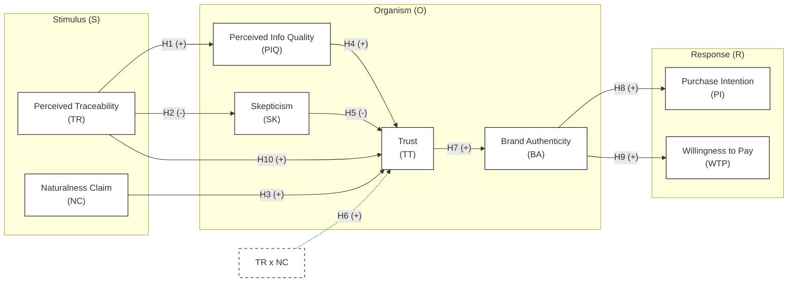
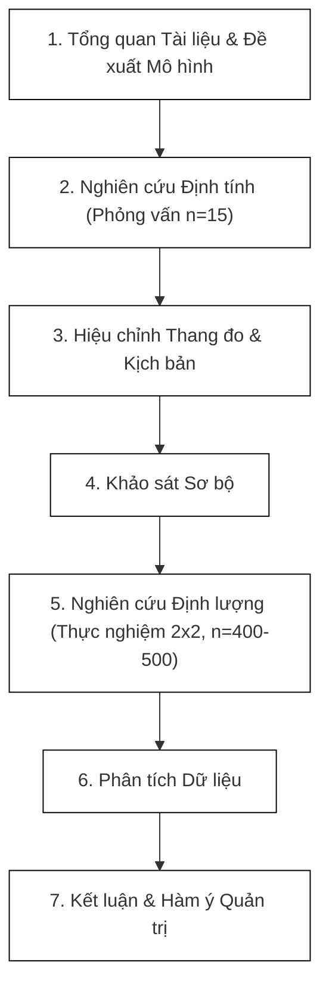
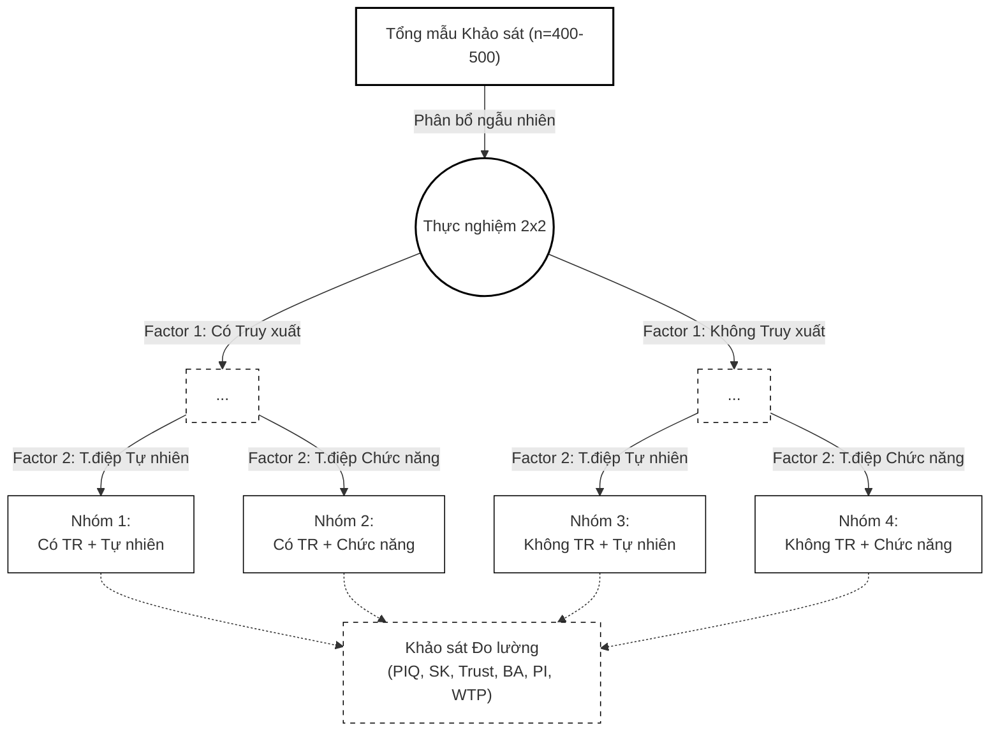

# ĐỀ CƯƠNG NGHIÊN CỨU LUẬN ÁN TIẾN SĨ

**Tên đề tài:** Cơ chế tác động của truy xuất nguồn gốc số đến ý định mua sản phẩm nước yến chế biến sẵn: Vai trò của Tính xác thực thương hiệu và Niềm tin.

**Chuyên ngành đào tạo:** Quản trị Kinh doanh

**Mã chuyên ngành:** 9340101

**Nghiên cứu sinh:** Lê Phúc Hải

**Cơ sở đào tạo:** Trường Đại học Nha Trang

---

**DANH MỤC CÁC CHỮ VIẾT TẮT**
* **BA:** Tính xác thực thương hiệu
* **FMCG:** Ngành hàng tiêu dùng nhanh
* **NC:** Tuyên bố/Thông điệp tự nhiên
* **PI:** Ý định mua hàng
* **PIQ:** Chất lượng thông tin cảm nhận
* **PLS-SEM:** Mô hình phương trình cấu trúc bình phương tối thiểu riêng phần
* **RTD:** Sản phẩm chế biến sẵn/uống liền
* **SK:** Hoài nghi
* **TR:** Nhận thức về truy xuất nguồn gốc
* **TT:** Niềm tin
* **WTP:** Mức sẵn lòng chi trả thêm

---

## 1. LÝ DO CHỌN ĐỀ TÀI CỦA LUẬN ÁN

### 1.1. Bất cân xứng thông tin và Khủng hoảng niềm tin trong ngành hàng thực phẩm chức năng
1.  **Đặc tính hàng hóa và Bất cân xứng thông tin:** Các sản phẩm thực phẩm chức năng, đặc biệt là nhóm nước yến chế biến sẵn, được phân loại vào nhóm hàng hóa dựa trên niềm tin. Theo Akerlof (1970), đây là nhóm sản phẩm mà người tiêu dùng không thể đánh giá chính xác chất lượng thực tế ngay cả sau khi đã sử dụng. Điều này dẫn đến sự bất cân xứng thông tin sâu sắc giữa nhà sản xuất và người mua.
2.  **Rủi ro cảm nhận và Khủng hoảng niềm tin:** Ngành hàng sản phẩm RTD đang đối mặt với thử thách nghiêm trọng về niềm tin (Nielsen, 2022). Theo Euromonitor (2023), thị trường nước yến và thức uống dinh dưỡng Việt Nam đạt quy mô khoảng 8.500 tỷ VNĐ, tăng trưởng trung bình 12%/năm. Tuy nhiên, báo cáo của Cục Quản lý Thị trường (2022) ghi nhận hơn 1.200 vụ vi phạm liên quan đến hàng giả, hàng nhái trong ngành thực phẩm chức năng chỉ riêng trong năm 2021, trong đó sản phẩm yến sào chiếm tỷ trọng đáng kể. Về tệp khách hàng, người tiêu dùng hiện đại, đặc biệt là thế hệ Gen Z, đang dẫn dắt xu hướng trẻ hóa trong ngành thực phẩm bổ dưỡng. Dữ liệu từ Kantar (2023) cho thấy Gen Z sẵn sàng chi trả cao cho các sản phẩm sức khỏe nhưng lại đòi hỏi rất khắt khe về minh bạch thông tin. Mặc dù là tệp khách hàng tiềm năng lớn, họ lại đối mặt với rủi ro cảm nhận cực kỳ cao đối với các sản phẩm chế biến công nghiệp. Sự mập mờ trong các thông điệp truyền thống khiến niềm tin đối với các cam kết “tự nhiên” có xu hướng giảm sút (Skarmeas & Leonidou, 2013).
3.  **Tính cấp thiết đối với nền kinh tế địa phương (Đặc thù Yến sào Khánh Hòa):** Ngành yến sào Khánh Hòa đóng vai trò trụ cột kinh tế biển của tỉnh. Đặc biệt, "Yến sào Khánh Hòa" đã được công nhận là Chỉ dẫn địa lý quốc gia theo quyết định của Cục Sở hữu trí tuệ Việt Nam. Tuy nhiên, chính quy mô kinh tế lớn này đã biến các sản phẩm yến (nhất là dòng yến chế biến sẵn) thành mục tiêu bị làm giả nghiêm trọng. Do đó, việc nghiên cứu truy xuất nguồn gốc số nhằm giải quyết vấn đề suy giảm niềm tin không chỉ có giá trị học thuật mà còn mang ý nghĩa chiến lược trong việc bảo vệ Chỉ dẫn địa lý và duy trì sức cạnh tranh của ngành yến sào Khánh Hòa.

### 1.2. Giới hạn của marketing truyền thống và nhu cầu minh bạch số
Vấn đề nghiên cứu trọng tâm xuất phát từ sự thất bại của các phương thức truyền thông truyền thống trong việc thuyết phục người tiêu dùng về tính xác thực của sản phẩm:
1.  **Bất cân xứng thông tin:** Áp dụng lý thuyết của Akerlof (1970), dòng sản phẩm nước yến chế biến sẵn được xếp vào nhóm hàng hóa dựa trên niềm tin. Người tiêu dùng gần như không thể phân biệt được tỷ lệ yến thật hay chất lượng quy trình tiệt trùng chỉ bằng quan sát thông thường.
2.  **Hoài nghi đối với cam kết “tự nhiên”:** Khi mọi doanh nghiệp đều tuyên bố sản phẩm của mình là “tự nhiên 100%” mà không có bằng chứng kiểm chứng độc lập, người tiêu dùng rơi vào trạng thái hoài nghi.
3.  **Sự vô hiệu của các chứng nhận tĩnh:** Các tem nhãn hay giấy chứng nhận bằng giấy truyền thống dễ dàng bị làm giả hoặc sao chép, không còn đủ sức nặng để đóng vai trò là "tín hiệu tin cậy" trong kỷ nguyên số.

### 1.3. Truy xuất nguồn gốc số như một tín hiệu niềm tin
Để giải quyết căn bản vấn đề niềm tin, nghiên cứu đề xuất cách tiếp cận: Chuyển dịch từ Marketing dựa trên lời hứa sang Marketing dựa trên tín hiệu minh bạch số:
1.  **Truy xuất nguồn gốc số như hạ tầng tin cậy:** Hệ thống truy xuất nguồn gốc số cung cấp các đặc tính: *Bất biến, Minh bạch và Truy xuất thời gian thực*.
2.  **Lý thuyết Tín hiệu:** Theo Spence (1973), một tín hiệu hiệu quả phải có chi phí cao hoặc khó giả mạo. Hệ thống truy xuất nguồn gốc đóng vai trò là một dấu hiệu nhận biết. Chỉ những doanh nghiệp có quy trình minh bạch thật sự mới dám công khai dữ liệu.
3.  **Tính xác thực thương hiệu:** Trong tâm lý học hành vi, tính xác thực là nhân tố cốt lõi dẫn đến lòng trung thành và mức sẵn lòng chi trả cao. Tuy nhiên, làm thế nào để chuyển hóa một công cụ kỹ thuật thành một trải nghiệm xác thực trong tâm trí khách hàng vẫn là một câu hỏi cần được làm rõ bằng thực chứng. Mặc dù Niềm tin (Trust) là nền tảng cốt lõi, nhưng trong môi trường công nghệ số, Tính xác thực thương hiệu (Brand Authenticity) mới là đích đến cuối cùng và là "ngôi sao" của quá trình ra quyết định. Khi khách hàng xác lập được niềm tin vào dữ liệu số (Trust in data), sự tin tưởng đó sẽ là bệ phóng để họ quy gán sự liêm chính và tính chân thật toàn diện cho thương hiệu. Do đó, đề tài đặt Tính xác thực thương hiệu làm trọng tâm phân tích ở cấp độ cao nhất.

### 1.4. Vấn đề nghiên cứu
Mặc dù công nghệ truy xuất nguồn gốc số được kỳ vọng nâng cao tính minh bạch, mức độ ứng dụng thực tế tại Việt Nam, đặc biệt trong ngành yến sào, vẫn còn rất hạn chế và chưa hình thành các bằng chứng thực nghiệm rõ ràng. Vấn đề cốt lõi mà nghiên cứu này cần giải quyết là sự thiếu vắng nền tảng học thuật về cách thức người tiêu dùng diễn giải và phản ứng với các tín hiệu công nghệ này.

Điều này đặt ra một khoảng trống lớn về tri thức và thực tiễn, được cụ thể hóa qua các câu hỏi nghiên cứu sau:
1.  Làm thế nào tín hiệu truy xuất nguồn gốc số có thể tác động đến các biến tâm lý như hoài nghi và niềm tin của người tiêu dùng?
2.  Liệu việc người tiêu dùng nhận thức được tín hiệu này có thực sự giúp nâng cao Tính xác thực thương hiệu và từ đó thúc đẩy Ý định mua hàng cũng như Mức sẵn lòng chi trả thêm hay không?
3.  Cơ chế tác động tương tác giữa nội dung thông điệp tiếp thị (thông điệp cảm xúc) và xác thực số (bằng chứng kỹ thuật) diễn ra như thế nào?

Nghiên cứu này được thực hiện nhằm giải quyết các câu hỏi trên, góp phần cung cấp các bằng chứng thực nghiệm giúp các doanh nghiệp (đặc biệt là ngành yến sào Khánh Hòa) có thêm cơ sở tham chiếu khi đầu tư vào hệ thống truy xuất số dựa trên bằng chứng về hành vi người tiêu dùng.

## 2. TÌNH HÌNH NGHIÊN CỨU TRONG VÀ NGOÀI NƯỚC
### 2.1. Bất cân xứng thông tin và hàng hóa dựa trên niềm tin
Trong các thị trường nơi người tiêu dùng khó có thể đánh giá chất lượng sản phẩm ngay cả sau khi tiêu dùng, hiện tượng bất cân xứng thông tin trở nên đặc biệt nghiêm trọng. Theo George Akerlof (1970), trong bối cảnh này, người bán nắm giữ thông tin vượt trội so với người mua, dẫn đến rủi ro lựa chọn bất lợi.

Các sản phẩm thực phẩm chức năng, đặc biệt là nhóm FMCG có thành phần khó kiểm chứng (ví dụ: nước yến chế biến sẵn), thường được xếp vào nhóm hàng hóa dựa trên niềm tin. Trong bối cảnh đó, người tiêu dùng đối mặt với ba hạn chế cốt lõi: thứ nhất là không thể xác minh tỷ lệ thành phần thật; thứ hai là không thể tự đánh giá quy trình sản xuất; và thứ ba là phải phụ thuộc hoàn toàn vào các tín hiệu truyền thông đơn phương từ nhà sản xuất.

Quan sát từ thị trường này, niềm tin trở thành yếu tố trung tâm quyết định hành vi tiêu dùng, nhưng đồng thời cũng dễ bị thao túng thông qua các thông điệp marketing thiếu kiểm chứng.

### 2.2. Hoài nghi đối với cam kết “tự nhiên” và giới hạn của marketing truyền thống
Sự gia tăng của các thông điệp “tự nhiên”, “nguyên chất” và “sạch” trong marketing (Ottman, 2011; Olsen et al., 2014) đã dẫn đến hiện tượng lạm dụng cam kết, làm suy giảm niềm tin của người tiêu dùng. Các nghiên cứu trước đây (Chen, 2012; Skarmeas & Leonidou, 2013) đã cho thấy sự đồng thuận rằng, sự không nhất quán giữa thông điệp truyền thông và bằng chứng thực tế là tác nhân cốt lõi làm gia tăng sự hoài nghi của khách hàng. Đồng thời, mặc dù niềm tin đóng vai trò trung gian sống còn kết nối nhận thức về thuộc tính tự nhiên với hành vi mua, trạng thái tâm lý này rất dễ bị đứt gãy nếu doanh nghiệp chỉ dựa vào các nỗ lực marketing truyền thống mà thiếu đi các cơ chế xác thực khách quan.

Trong các diễn đàn học thuật gần đây, có sự tranh luận sâu sắc về hiệu quả của các nỗ lực marketing truyền thống. Mặc dù Chen (2012) cho rằng niềm tin có thể hình thành qua truyền thông, lập luận này bộc lộ điểm yếu khi áp dụng vào bối cảnh sự suy giảm niềm tin hiện tại. Khi rủi ro cảm nhận quá cao, các nỗ lực marketing truyền thống mất đi hiệu lực. Do đó, nghiên cứu này lập luận rằng cần có sự can thiệp của các cơ chế xác thực kỹ thuật để vượt qua rào cản hoài nghi này.

### 2.3. Truy xuất nguồn gốc và vai trò của công nghệ số
Trong những năm gần đây, các công nghệ truy xuất nguồn gốc được đề xuất như một giải pháp nhằm giảm bất cân xứng thông tin trong chuỗi cung ứng thực phẩm (Francisco & Swanson, 2018; Saberi et al., 2019; Tian, 2017). Napolitano et al. (2010) đã chứng minh rằng việc cung cấp thông tin minh bạch về quy trình sản xuất có tác động tích cực đến sự sẵn lòng chi trả của người tiêu dùng.

Nghiên cứu của Francisco và Swanson (2018) cùng Saberi và các cộng sự (2019) đã chỉ ra rằng, tín hiệu truy xuất nguồn gốc có khả năng nâng cao tính minh bạch và độ tin cậy của chuỗi cung ứng, từ đó góp phần cải thiện đáng kể niềm tin của người tiêu dùng đối với các nhóm hàng hóa dựa trên niềm tin.

Tuy nhiên, trong ngành FMCG – nơi quyết định mua diễn ra nhanh, ít suy nghĩ – cơ chế chuyển hóa chi tiết từ nhận thức truy xuất sang niềm tin vẫn còn chưa được kiểm định đầy đủ, được tóm tắt tại Bảng 1.

**Bảng 1: Tổng hợp các nghiên cứu tiêu biểu về Truy xuất nguồn gốc và Khoảng trống nghiên cứu**
| Tác giả | Bối cảnh | Biến chính | Kết quả | Khoảng trống |
|---|---|---|---|---|
| Kendall et al. (2019) | Thực phẩm nhập khẩu, TQ | Food fraud → Integrity | Gian lận làm giảm niềm tin | Chưa có truy xuất số |
| Kamble et al. (2020) | Nông sản, Ấn Độ | Blockchain → Supply chain | Mô hình hóa chuỗi cung ứng | Thiếu góc người tiêu dùng |
| Luận án này | Nước yến RTD, VN | TR → PIQ → BA → TT → PI/WTP | Đang kiểm định | Giải quyết các khoảng trống đã nêu |

Ngoài ra, trong bối cảnh thực phẩm hữu cơ tại châu Âu, Naspetti và Zanoli (2009) đã chứng minh rằng nhận thức về chất lượng và nguồn gốc có tác động trực tiếp đến sự sẵn lòng trả giá cao hơn. Newman và Dhar (2014) cũng bổ sung rằng tính xác thực có tính "lây lan" – khi một yếu tố được xác thực, người tiêu dùng có xu hướng gán tính xác thực cho toàn bộ thương hiệu. Cả hai phát hiện này đều ủng hộ mạnh mẽ cho vai trò trung gian của Brand Authenticity trong mô hình đề xuất.

### 2.4. Lý thuyết tín hiệu và khoảng cách giữa tín hiệu kỹ thuật – nhận thức người tiêu dùng
Theo Michael Spence (1973), trong điều kiện bất cân xứng thông tin, các bên cung cấp sẽ gửi đi các tín hiệu để truyền tải thông tin về chất lượng. Hệ thống lý thuyết sau này của Connelly và các cộng sự (2011) đã phân loại chi tiết các tín hiệu thành hai nhóm chính: nhóm tín hiệu chi phí thấp vốn dễ phát đi và dễ giả mạo (ví dụ như slogan marketing), và nhóm tín hiệu chi phí cao đòi hỏi sự đầu tư lớn và rất khó giả mạo (ví dụ như hệ thống truy xuất nguồn gốc minh bạch).

Truy xuất nguồn gốc số được xem là một dạng dấu hiệu nhận biết. Khoảng cách quan trọng chưa được giải quyết là: Làm thế nào một tín hiệu kỹ thuật được chuyển hóa thành nhận thức tâm lý của người tiêu dùng? Phần lớn nghiên cứu hiện tại giả định người tiêu dùng tự động tin vào công nghệ, bỏ qua việc kiểm định quá trình chuyển hóa phức tạp từ một "Technical Signal" khô khan thành "Psychological Trust".

### 2.5. Tính xác thực thương hiệu như một cơ chế trung gian
Khái niệm Brand Authenticity được phát triển mạnh trong nghiên cứu hành vi tiêu dùng gần đây. Trong thị trường hàng hóa dựa trên niềm tin, người tiêu dùng không còn tin vào các hình ảnh thương hiệu được xây dựng đơn thuần bằng quảng cáo. Thay vào đó, họ tìm kiếm sự chân thật. Tính xác thực là cấp độ cao hơn của niềm tin, nó gắn kết cả lý trí và cảm xúc, đóng vai trò là cơ chế trung gian then chốt (Morhart et al., 2015). Trong môi trường kỹ thuật số, hướng nhân quả được lập luận đi từ Niềm tin (Trust) đến Tính xác thực (Authenticity). Cụ thể, khi người tiêu dùng xác lập được "niềm tin vào dữ liệu" (Trust in data) thông qua truy xuất nguồn gốc, niềm tin nền tảng này sẽ hoạt động như một bệ phóng tâm lý để họ quy gán sự liêm chính và tính chân thật toàn diện cho thương hiệu (Brand Authenticity). Theo Morhart et al. (2015), tính xác thực bao gồm: Credibility (đáng tin cậy), Integrity (liêm chính), Continuity (nhất quán), Symbolism (ý nghĩa biểu tượng).

Các nghiên cứu cho thấy Brand Authenticity có liên hệ mạnh với lòng trung thành và mức sẵn lòng chi trả (Newman & Dhar, 2014), nhưng thường được nghiên cứu trong bối cảnh thương hiệu cao cấp hoặc storytelling thương hiệu. Trong khi đó, vai trò của Brand Authenticity như một biến trung gian giữa tín hiệu kỹ thuật và hành vi tiêu dùng nhanh vẫn còn là một khoảng trống cần được làm rõ trong bối cảnh FMCG.

#### Sơ đồ Mô hình Nghiên cứu

*Hình 1. Mô hình nghiên cứu tích hợp S-O-R và Lý thuyết Tín hiệu.*

### 2.6. Khoảng trống nghiên cứu
Từ tổng quan tài liệu trên, nghiên cứu này xác định ba khoảng trống lý thuyết cốt lõi cần giải quyết:

**Gap 1 – Khoảng trống sơ khai về cơ chế trung gian:** Mặc dù Niềm tin đã được chứng minh là biến trung gian phổ biến (Chen, 2012), cơ chế nhận thức về vai trò của *Tính xác thực thương hiệu* như một biến trung gian cấp cao hơn kết nối tín hiệu kỹ thuật với hành vi tiêu dùng nhanh vẫn chưa được làm rõ.

**Gap 2 – Khoảng trống thiếu nhất quán về tích hợp lý thuyết:** Các dòng nghiên cứu hiện tại tồn tại sự đứt gãy lớn giữa góc độ quản trị chuỗi cung ứng (hệ thống truy xuất) và tâm lý hành vi (niềm tin, hoài nghi). Hiện vẫn thiếu các mô hình tích hợp giải quyết sự mâu thuẫn trong việc đánh giá liệu một "tín hiệu kỹ thuật" thuần túy có đủ sức thay thế hoàn toàn các "tín hiệu marketing" truyền thống hay không.

**Gap 3 – Khoảng trống bối cảnh:** Các nghiên cứu thực chứng chủ yếu được thực hiện ở các thị trường phát triển hoặc áp dụng cho nông sản thô. Việc áp dụng lý thuyết tín hiệu vào thị trường mới nổi (Việt Nam) đối với ngành FMCG chế biến công nghiệp có mức bất cân xứng thông tin cực cao (như nước yến RTD) vẫn là một khoảng trống nghiên cứu cần được làm rõ.

**Kết luận định vị nghiên cứu:** Trên cơ sở các khoảng trống lý thuyết trên, nghiên cứu này được thực hiện nhằm kiểm định thực chứng cơ chế tác động của truy xuất nguồn gốc số đến hành vi tiêu dùng, thông qua các biến tâm lý trung gian (PIQ, Trust, Brand Authenticity), trong bối cảnh cụ thể của thị trường nước yến RTD tại Việt Nam.

## 3. MỤC TIÊU NGHIÊN CỨU CỦA LUẬN ÁN
### 3.1. Mục tiêu tổng quát
Kiểm định cơ chế tác động của tín hiệu truy xuất nguồn gốc số đối với nhận thức, tính xác thực thương hiệu và hành vi tiêu dùng của khách hàng đối với sản phẩm nước yến chế biến sẵn.

### 3.2. Mục tiêu cụ thể
1.  **Hệ thống hóa cơ sở lý luận** về bất cân xứng thông tin, lý thuyết tín hiệu và niềm tin trong bối cảnh truy xuất nguồn gốc số.
2.  **Xây dựng và kiểm định mô hình** đánh giá tác động của nhận thức về truy xuất nguồn gốc đến hoài nghi, niềm tin và tính xác thực thương hiệu.
3.  **Đo lường tác động** của Tính xác thực thương hiệu lên Ý định mua hàng và Mức sẵn lòng chi trả thêm.
4.  **Đề xuất các hàm ý quản trị** giúp doanh nghiệp nước yến RTD tối ưu hóa chiến lược minh bạch nguồn gốc.

### 3.3. Câu hỏi nghiên cứu
1.  Tín hiệu truy xuất nguồn gốc số tác động như thế nào đến các biến tâm lý (hoài nghi, niềm tin)?
2.  Tính xác thực thương hiệu đóng vai trò trung gian như thế nào trong cơ chế hình thành ý định tiêu dùng?
3.  Cơ chế tác động tương tác giữa nội dung thông điệp tiếp thị và xác thực số diễn ra như thế nào?

## 4. NỘI DUNG NGHIÊN CỨU
Để giải quyết các mục tiêu trên, luận án sẽ triển khai 4 nội dung nghiên cứu chính:
1.  **Xây dựng khung lý thuyết và mô hình:** Phát triển mô hình nghiên cứu tích hợp dựa trên khung S-O-R và Lý thuyết Tín hiệu, từ đó thiết lập hệ thống giả thuyết khoa học.
2.  **Thực hiện nghiên cứu định tính:** Tiến hành phỏng vấn sâu chuyên gia để hiệu chỉnh thang đo và xác nhận tính chân thực, hợp lý của kịch bản thực nghiệm (mockup sản phẩm).
3.  **Thực hiện nghiên cứu định lượng:** Thiết kế thực nghiệm scenario-based 2x2, thu thập dữ liệu bằng bảng hỏi phân bổ ngẫu nhiên, và phân tích dữ liệu bằng mô hình cấu trúc PLS-SEM.
4.  **Thảo luận kết quả và đề xuất giải pháp:** Đối chiếu kết quả phân tích với các nghiên cứu trước đây và đề xuất các hàm ý quản trị thiết thực cho doanh nghiệp.

## 6. PHẠM VI NGHIÊN CỨU CỦA ĐỀ TÀI
1.  **Không gian nghiên cứu:** Dữ liệu thực chứng được thu thập tại khu vực Thành phố Hồ Chí Minh, một đô thị lớn có mức độ nhận thức và tiếp cận công nghệ tiêu dùng cao.
2.  **Thời gian thực hiện:** Tiến trình khảo sát và thu thập dữ liệu dự kiến được triển khai từ Quý 3 năm 2026 đến hết Quý 1 năm 2027.
3.  **Bối cảnh và nội dung:** Nghiên cứu giới hạn trong phạm vi ngành hàng nước yến chế biến sẵn và tập trung phân tích hành vi người tiêu dùng (phía cầu), không đánh giá năng lực công nghệ hạ tầng (phía cung).
4.  **Lý thuyết và biến số:** Mô hình nghiên cứu giới hạn trong khung tích hợp S-O-R và Lý thuyết Tín hiệu gồm 8 biến số chính (TR, NC, PIQ, SK, TT, BA, PI, WTP), không tích hợp các biến ngoại lai khác.

## 7. ĐỐI TƯỢNG NGHIÊN CỨU CỦA ĐỀ TÀI
**Đối tượng nghiên cứu:** Cơ chế tác động tâm lý và hành vi của người tiêu dùng trong việc phản ứng với các tín hiệu nhận thức về truy xuất nguồn gốc thông qua công nghệ số.

**Khách thể nghiên cứu:** Người tiêu dùng thế hệ Gen Z (18-27 tuổi) đang sinh sống tại khu vực đô thị (TP.HCM).

**Đối tượng khảo sát:** Người tiêu dùng Gen Z (18-27 tuổi) tại TP.HCM, có hành vi tiêu thụ nước giải khát dinh dưỡng, quan tâm đến sức khỏe, và được phân bổ ngẫu nhiên vào 1 trong 4 nhóm kịch bản thực nghiệm.

## 8. PHƯƠNG PHÁP NGHIÊN CỨU
### 8.1. Mô hình nghiên cứu và Giả thuyết
#### 8.1.1. Logic xây dựng mô hình
Mô hình nghiên cứu được xây dựng dựa trên sự tích hợp chặt chẽ giữa khung lý thuyết kích thích - cơ thể - phản hồi (Stimulus – Organism – Response - S-O-R) và Lý thuyết Tín hiệu.

Trong đó, các biến số được phân bổ cụ thể theo các cấu phần như sau:

**Nhân tố Kích thích:** Nhận thức về khả năng truy xuất nguồn gốc và Thông điệp truyền thông tiếp thị.

**Nhận thức Cơ thể:** Chất lượng thông tin cảm nhận, Hoài nghi thương hiệu, Niềm tin, và Tính xác thực thương hiệu.

**Phản hồi Hành vi:** Ý định mua hàng và Mức sẵn lòng chi trả thêm.

**Tính tinh gọn của mô hình:** Mặc dù "Rủi ro cảm nhận" là tiền đề nội tại, nghiên cứu không vẽ nó thành một biến riêng biệt. Thay vào đó, sự suy giảm rủi ro cảm nhận được bao hàm thông qua sự suy giảm của Hoài nghi và sự gia tăng của Niềm tin.

#### 8.1.2. Mô hình nghiên cứu đề xuất
**Cấu trúc tuyến chính:**
Tuyến nhận thức: TR ➔ PIQ / SK ➔ TT ➔ BA ➔ PI / WTP
Tuyến trực tiếp: TR ➔ SK ➔ TT và NC ➔ TT

**Tương tác:**
Tác động điều tiết: TR × NC ➔ TT

#### 8.1.3. Giả thuyết nghiên cứu
Nghiên cứu đề xuất 9 giả thuyết cốt lõi (xem Hình 1):

**Tuyến hình thành Nhận thức:**
**Giả thuyết H1 (+):** Nhận thức về khả năng truy xuất nguồn gốc tác động tích cực đến Chất lượng thông tin cảm nhận.
**Giả thuyết H2 (-):** Nhận thức về khả năng truy xuất nguồn gốc tác động tiêu cực (làm giảm) sự Hoài nghi của người tiêu dùng.

**Tuyến hình thành Niềm tin:**
**Giả thuyết H3 (+):** Thông điệp truyền thông tiếp thị tác động tích cực đến Niềm tin thương hiệu.
**Giả thuyết H4 (+):** Chất lượng thông tin cảm nhận tác động tích cực đến Niềm tin thương hiệu.
**Giả thuyết H5 (-):** Hoài nghi thương hiệu tác động tiêu cực đến Niềm tin thương hiệu.
**Giả thuyết H10 (+):** Nhận thức về khả năng truy xuất nguồn gốc tác động trực tiếp và tích cực đến Niềm tin thương hiệu.
**Giả thuyết H6 (+):** Tín hiệu truy xuất nguồn gốc đóng vai trò điều tiết, làm khuếch đại tác động tích cực của thông điệp tiếp thị lên Niềm tin thương hiệu.

**Tuyến chuyển hóa Giá trị và Hành vi:**
**Giả thuyết H7 (+):** Niềm tin thương hiệu tác động tích cực đến Tính xác thực thương hiệu.
**Giả thuyết H8 (+):** Tính xác thực thương hiệu tác động tích cực đến Ý định mua hàng.
**Giả thuyết H9 (+):** Tính xác thực thương hiệu tác động tích cực đến Mức sẵn lòng chi trả thêm.

#### 8.1.4. Định vị khoa học
Định vị cốt lõi: *"Nghiên cứu này không đánh giá công nghệ dưới góc độ kỹ thuật lõi, mà xem xét cách thức nhận thức về truy xuất nguồn gốc đóng vai trò như một tín hiệu niềm tin giúp định hình nhận thức, tính xác thực và ý định hành vi của người tiêu dùng."*

### 8.2. Thiết kế và quy trình nghiên cứu
#### 8.2.1. Cách tiếp cận nghiên cứu
Nghiên cứu được thiết kế theo phương pháp hỗn hợp, thực hiện qua hai giai đoạn:

**Giai đoạn 1: Nghiên cứu định tính**
- **Phương pháp:** Phỏng vấn sâu với hội đồng chuyên gia.
- **Mẫu chuyên gia (n = 15):** Nhóm 1 (08 người) quản lý phân phối ngành FMCG; Nhóm 2 (07 người) chuyên gia CNTT về truy xuất nguồn gốc.
- **Kết quả đầu ra:** Hiệu chỉnh hệ thống thang đo và thẩm định tính thực tế của kịch bản thực nghiệm.

**Giai đoạn 2: Nghiên cứu thực nghiệm định lượng**
- **Thực nghiệm:** Sử dụng thiết kế kịch bản thực nghiệm để kiểm soát các tác động. Các biến thao tác (TR và NC) được ánh xạ vào mô hình SEM dưới dạng các biến giả (Dummy variables) với giá trị 0-1 để tuân thủ nguyên tắc đo lường của thiết kế thực nghiệm.
- **Khảo sát:** Đo lường hành vi và phản ứng tâm lý thông qua mô hình cấu trúc phương trình bình phương bé nhất (PLS-SEM). Nhằm đảm bảo độ chặt chẽ của việc so sánh các kịch bản, Phân tích đa nhóm (Multi-Group Analysis - MGA) cũng được sử dụng bổ trợ.

*Hình 2. Sơ đồ Quy trình Nghiên cứu.*

*Hình 3. Sơ đồ Thiết kế Thực nghiệm.*

**Lưu ý về ranh giới nghiên cứu:** Nghiên cứu này không đánh giá hiệu năng của hệ thống công nghệ thực tế, mà tập trung đo lường "nhận thức về truy xuất nguồn gốc" của người tiêu dùng.

#### 8.2.3. Vật liệu thực nghiệm
Vật liệu thực nghiệm được thiết kế và chế bản chi tiết dưới dạng Mockup sản phẩm thực tế, bao gồm: thứ nhất là bao bì sản phẩm với một thương hiệu giả định nhằm loại bỏ nhiễu ngoại lai từ lòng trung thành thương hiệu cũ; thứ hai là mã QR code giả lập có khả năng tương tác; và thứ ba là giao diện truy xuất nguồn gốc hiển thị chi tiết vòng đời của sản phẩm nước yến sào.

#### 8.2.4. Đối tượng và Phương pháp thu thập dữ liệu
**Đối tượng khảo sát:** Người tiêu dùng thế hệ Gen Z (18–27 tuổi) hiện đang sinh sống tại khu vực đô thị (TP.HCM).

**Phương pháp lấy mẫu:** Lấy mẫu phi xác suất có mục đích kết hợp lấy mẫu quả cầu tuyết. Bộ câu hỏi sử dụng màng lọc sàng lọc gắt gao: chỉ chấp nhận các đáp viên có hành vi tiêu dùng nước giải khát dinh dưỡng và quan tâm đến sức khỏe.

**Kích thước mẫu dự kiến:** n = 400 – 500 đáp viên. Kích thước mẫu tối thiểu được tính toán khoa học thông qua phần mềm G*Power 3.1 (mức ý nghĩa 5%, power 80%, effect size trung bình) đảm bảo thỏa mãn và vượt xa yêu cầu thống kê của Hair et al. (2022).

#### 8.2.5. Thang đo và Xây dựng bảng hỏi
Toàn bộ biến tiềm ẩn được đo lường bằng thang đo Likert 7 điểm. Thang đo 7 điểm cung cấp độ nhạy cao hơn cho mô hình PLS-SEM (Hair et al., 2022).
*   *Quy trình chuẩn hóa:* Dịch xuôi - dịch ngược.
*   *Pilot test:* n ≈ 30 trước khi khảo sát diện rộng.

#### 8.2.6. Phân tích dữ liệu
Phương pháp phân tích cốt lõi là PLS-SEM (SmartPLS 4). Quy trình 4 bước:
1.  **Mô hình đo lường:** Cronbach's Alpha, ρ_A, Composite Reliability, AVE ≥ 0.5.
2.  **Giá trị phân biệt:** Fornell-Larcker criterion và HTMT.
3.  **Mô hình cấu trúc:** Path coefficients β, R², f², PLSpredict (Q² predict).
4.  **Kiểm định trung gian nối tiếp và Phân tích đa nhóm:** Bootstrapping 5.000 mẫu lặp. Phân tích đa nhóm theo giới tính / kinh nghiệm mua yến.

#### 8.2.7. Kiểm soát sai lệch
1.  **Common Method Bias:** Hoán đổi thứ tự câu hỏi, biến đánh dấu, Full collinearity VIF < 3.3.
2.  **Manipulation Check:** Câu hỏi kiểm tra thao tác thực nghiệm.
3.  **Data Cleaning:** Loại bỏ "Speeders" và "Straight-liners".

#### 8.2.8. Đạo đức nghiên cứu
Nghiên cứu cam kết tuân thủ nghiêm ngặt các quy định về đạo đức khoa học: đáp viên tham gia hoàn toàn trên tinh thần tự nguyện; toàn bộ dữ liệu cá nhân được mã hóa ẩn danh tuyệt đối; và quy trình nghiên cứu tuân thủ các hướng dẫn của Hội đồng Đạo đức Trường Đại học Nha Trang.

### 8.4. Cấu trúc dự kiến của Luận án
Cấu trúc dự kiến của luận án bao gồm 5 chương, được phân bổ như trình bày tại Bảng 3.

**Bảng 3: Cấu trúc dự kiến của luận án**
| Chương | Nội dung | Ước lượng |
|---|---|---|
| Chương 1 | Giới thiệu: Bối cảnh, Mục tiêu, Câu hỏi nghiên cứu, Phạm vi | 15-20 trang |
| Chương 2 | Tổng quan Lý thuyết và Mô hình nghiên cứu | 40-50 trang |
| Chương 3 | Phương pháp Nghiên cứu (Thiết kế thực nghiệm, Thang đo, PLS-SEM) | 25-30 trang |
| Chương 4 | Kết quả Nghiên cứu (Thống kê mô tả, Mô hình đo lường, Mô hình cấu trúc) | 30-40 trang |
| Chương 5 | Thảo luận, Kết luận, Hàm ý quản trị và Hạn chế | 20-25 trang |

## 11. DỰ KIẾN KẾ HOẠCH HỌC TẬP, NGHIÊN CỨU TOÀN KHÓA
Kế hoạch học tập và nghiên cứu toàn khóa được thiết kế trong thời gian chuẩn 3 năm (36 tháng) như trình bày tại Bảng 5:

**Bảng 5: Dự kiến kế hoạch học tập và nghiên cứu toàn khóa**
| STT | Nội dung / Nhiệm vụ | Thời gian | Kết quả dự kiến | Nơi thực hiện |
|---|---|---|---|---|
| 1 | Học các học phần trình độ Tiến sĩ | Tháng 1 - Tháng 6 | Hoàn thành 8 Tín chỉ | ĐH Nha Trang |
| 2 | Viết và bảo vệ Tiểu luận tổng quan | Tháng 7 - Tháng 12 | Hoàn thành 4 Tín chỉ | ĐH Nha Trang |
| 3 | Chuyên đề Tiến sĩ 1 & 2 | Tháng 13 - Tháng 18 | Hoàn thành 8 Tín chỉ | ĐH Nha Trang / TP.HCM |
| 4 | Nghiên cứu định tính + Pilot test | Tháng 16 - Tháng 18 | Thang đo hoàn chỉnh, Mockup | TP.HCM |
| 5 | Nghiên cứu thực nghiệm định lượng (2x2) | Tháng 19 - Tháng 24 | Bộ dữ liệu n=400-500 | TP.HCM |
| 6 | Phân tích PLS-SEM & Viết kết quả | Tháng 22 - Tháng 24 | Báo cáo kết quả phân tích | TP.HCM |
| 7 | Seminar chuyên đề | Tháng 25 | Trình bày kết quả trước khoa | ĐH Nha Trang |
| 8 | Viết báo, đăng báo khoa học | Tháng 25 - Tháng 30 | ≥ 02 bài tạp chí HĐGS | Các Tạp chí |
| 9 | Nộp luận án cấp cơ sở | Tháng 31 | Luận án bản thảo hoàn chỉnh | ĐH Nha Trang |
| 10 | Chỉnh sửa theo góp ý cấp cơ sở | Tháng 32 - Tháng 33 | Luận án chỉnh sửa | ĐH Nha Trang |
| 11 | Nộp luận án cấp trường | Tháng 34 | Luận án chính thức | ĐH Nha Trang |
| 12 | Bảo vệ luận án Tiến sĩ | Tháng 35 - Tháng 36 | Đạt học vị Tiến sĩ | ĐH Nha Trang |

## 5. Ý NGHĨA KHOA HỌC VÀ THỰC TIỄN CỦA ĐỀ TÀI
### 5.1. Những đóng góp mới dự kiến của luận án (Đóng góp học thuật)
Nghiên cứu kỳ vọng sẽ mang lại bốn đóng góp học thuật cốt lõi cho hệ thống y văn hiện hữu:

**Cung cấp bằng chứng thực nghiệm cho Lý thuyết Tín hiệu:** Nghiên cứu cung cấp dữ liệu thực chứng giá trị để giải thích cơ chế giải mã các đặc tính bất biến của dữ liệu số thành giá trị nhận thức của thương hiệu trong bối cảnh các sản phẩm credence goods.

**Kiểm định các điều kiện biên của lý thuyết:** Luận án xác định các điều kiện giới hạn của lý thuyết truyền thông truyền thống, gợi mở rằng khi rủi ro cảm nhận của khách hàng ở mức cao, hiệu quả của các tín hiệu marketing thông thường sẽ bị suy giảm đáng kể nếu thiếu đi sự bổ trợ từ các tín hiệu xác thực kỹ thuật số.

**Xác lập vai trò trung gian quan trọng của Tính xác thực thương hiệu:** Nghiên cứu cung cấp bằng chứng thực nghiệm khẳng định Tính xác thực thương hiệu đóng vai trò then chốt trong việc kết nối lý trí và cảm xúc, từ đó thúc đẩy mạnh mẽ hành vi tiêu dùng trong bối cảnh hàng hóa dựa trên niềm tin.

**Bổ sung bằng chứng thực nghiệm tại thị trường mới nổi:** Nghiên cứu bổ sung nguồn dữ liệu thực chứng phong phú và đáng tin cậy từ thị trường Việt Nam, đặc biệt tập trung sâu vào hành vi của thế hệ tiêu dùng trẻ đối với ngành hàng nước yến chế biến sẵn.

### 5.2. Đóng góp thực tiễn
Về mặt thực tiễn, luận án cung cấp các gợi ý chiến lược quan trọng cho doanh nghiệp nước yến RTD trong việc khai thác tối ưu thông tin truy xuất nguồn gốc số để nâng cao nhận thức, giảm thiểu sự hoài nghi và củng cố niềm tin vững chắc của người tiêu dùng. Đồng thời, nghiên cứu cũng cung cấp hệ thống cơ sở dữ liệu tham khảo giá trị giúp các nhà thiết kế tối ưu hóa giao diện truy xuất phù hợp nhất với thói quen và hành vi tương tác số của nhóm khách hàng trẻ.

## 9. KẾT QUẢ MONG ĐỢI
### 9.1. Kết quả khoa học kỳ vọng
Nghiên cứu kỳ vọng sẽ làm sáng tỏ hai kết quả khoa học chính:

**Sức mạnh của tín hiệu kỹ thuật số:** Kiểm chứng và làm rõ năng lực thực tế của tín hiệu truy xuất nguồn gốc trong việc kiểm soát và làm giảm sự hoài nghi của người tiêu dùng; trong trường hợp tác động này ở mức yếu, nghiên cứu sẽ đi sâu phân tích các rào cản nhận thức nội tại của khách hàng.

**Vai trò trung gian của tính xác thực:** Phân tích và làm nổi bật vai trò của Tính xác thực thương hiệu như một cơ chế trung gian quan trọng giúp chuyển hóa niềm tin khoa học thành mức sẵn lòng chi trả thêm của người tiêu dùng.

### 9.2. Lộ trình công bố
Lộ trình công bố khoa học dự kiến được trình bày tại Bảng 4.

**Bảng 4: Lộ trình công bố khoa học dự kiến**
| Giai đoạn | Hoạt động | Đầu ra |
|---|---|---|
| Tháng 6-7/2027 | Hội thảo khoa học quốc gia/quốc tế | Kỷ yếu hội thảo ISBN |
| Tháng 10/2027 | Báo cáo trung gian ĐHQG Nha Trang | Báo cáo tiến độ |
| Tháng 3/2028 | Nộp bài tạp chí HĐGS | 02-03 bài báo |
| Tháng 12/2028 | Bảo vệ luận án Tiến sĩ | Luận án hoàn chỉnh |

## 12. TÀI LIỆU THAM KHẢO
*Trích dẫn theo kiểu Harvard (tác giả, năm) trong thân bài. Danh mục sắp xếp theo thứ tự ABC theo QĐ 1263/QĐ-ĐHNT.*
1. Akerlof, G. A. (1970). The market for "lemons": Quality uncertainty and the market mechanism. *The Quarterly Journal of Economics, 84*(3), 488–500. https://doi.org/10.2307/1879431
2. Chen, Y. S. (2012). Enhance green purchase intentions: The roles of green perceived value, green perceived risk, and green trust. *Management Decision, 50*(3), 502–520. https://doi.org/10.1108/00251741211216250
3. Connelly, B. L., Certo, S. T., Ireland, R. D., & Reutzel, C. R. (2011). Signaling theory: A review and assessment. *Journal of Management, 37*(1), 39–67. https://doi.org/10.1177/0149206310388419
4. Francisco, K., & Swanson, D. (2018). The supply chain has no clothes: Technology adoption of blockchain for supply chain transparency. *Logistics, 2*(1), 2.
5. Homburg, C., Hoyer, W. D., & Koschate, N. (2005). Customers' reactions to price increases: Do customer satisfaction and perceived motive fairness matter? *Journal of the Academy of Marketing Science, 33*(1), 36–49. https://doi.org/10.1177/0092070304269953
6. Mehrabian, A., & Russell, J. A. (1974). *An approach to environmental psychology*. MIT Press.
7. Morhart, F., Malär, L., Guèvremont, A., Girardin, F., & Grohmann, B. (2015). Brand authenticity: An integrative framework and measurement scale. *Journal of Consumer Psychology, 25*(2), 200–218. https://doi.org/10.1016/j.jcps.2014.07.002
8. Nelson, R. R., Todd, P. A., & Wixom, B. H. (2005). Antecedents of information and system quality. *Journal of Management Information Systems, 21*(4), 199–235. https://doi.org/10.1080/07421222.2005.11045823
9. Newman, G. E., & Dhar, R. (2014). Authenticity is contagious: Brand essence and the original source of production. *Journal of Marketing Research, 51*(3), 371-386.
10. Saberi, S., Kouhizadeh, M., Sarkis, J., & Shen, L. (2019). Blockchain technology and its relationships to sustainable supply chain management. *International Journal of Production Economics, 208*, 211-227. https://doi.org/10.1016/j.ijpe.2018.12.004
11. Skarmeas, N., & Leonidou, C. N. (2013). When consumers doubt, watch out! The role of CSR skepticism. *Journal of Business Research, 66*(10), 1946–1954. https://doi.org/10.1016/j.jbusres.2012.11.013
12. Spears, N., & Singh, S. N. (2004). Measuring attitude toward the brand and purchase intentions. *Journal of Advertising, 33*(2), 53–66. https://doi.org/10.1080/00913367.2004.10639164
13. Spence, M. (1973). Job market signaling. *The Quarterly Journal of Economics, 87*(3), 355–374. https://doi.org/10.2307/1882010
14. Kantar. (2023). *Vietnam FMCG Monitor: Consumer trends and behavior shifting*.
15. McKinsey & Company. (2022). *What is Gen Z?*.
16. Nielsen. (2022). *Consumer Trust in the Food and Beverage Industry*.
17. Hair, J. F., Hult, G. T. M., Ringle, C. M., & Sarstedt, M. (2022). *A Primer on Partial Least Squares Structural Equation Modeling* (3rd ed.). Sage.
18. Kock, N. (2015). Common method bias in PLS-SEM: A full collinearity assessment approach. *International Journal of e-Collaboration, 11*(4), 1–10.
19. Euromonitor International. (2023). *Health and Wellness Drinks in Vietnam: Market Size and Forecast*.
20. Cục Quản lý Thị trường Việt Nam. (2022). *Báo cáo tổng kết công tác kiểm tra, xử lý vi phạm năm 2021*.
21. Naspetti, S., & Zanoli, R. (2009). Organic food quality and safety perception throughout Europe. *Journal of Food Products Marketing, 15*(3), 249–266.
22. Olsen, M. C., Slotegraaf, R. J., & Chandukala, S. R. (2014). Green claims and message frames: How green new products change brand attitude. *Journal of Marketing, 78*(5), 119–137.
23. Napolitano, F., Braghieri, A., Piasentier, E., Favotto, S., Naspetti, S., & Zanoli, R. (2010). Effect of information about organic production on beef liking and consumer willingness to pay. *Food Quality and Preference, 21*(2), 207–212.
24. Kendall, H., Naughton, P., Kuznesof, S., Raley, M., Dean, M., Clark, B., Stolz, H., Home, R., Chan, M. Y., Zhong, Q., & Frewer, L. J. (2019). Food fraud and the perceived integrity of European food imports into China. *PLOS ONE, 14*(5), e0195817.
25. Kamble, S. S., Gunasekaran, A., & Sharma, R. (2020). Modeling the blockchain enabled traceability in agriculture supply chain. *International Journal of Information Management, 52*, 101967.
26. Tian, F. (2017). A supply chain traceability system for food safety based on HACCP, blockchain & Internet of things. *14th International Conference on Services Systems and Services Management*.
27. Ottman, J. A. (2011). *The new rules of green marketing: Strategies, tools, and inspiration for sustainable branding*. Berrett-Koehler Publishers.
28. Thanh Niên. (2025, ngày 15 tháng 1). Yến sào Khánh Hòa đạt doanh thu 3.595 tỷ đồng năm 2024. *Báo Thanh Niên*.
29. Lao Động. (2024, ngày 20 tháng 3). Yến sào Khánh Hòa mở rộng hệ thống hơn 1.000 đại lý toàn quốc. *Báo Lao Động*.
30. Dân Việt. (2024, ngày 5 tháng 1). Yến sào Khánh Hòa – đơn vị đầu tiên xuất khẩu chính ngạch tổ yến sang Trung Quốc. *Báo Dân Việt*.
31. DNSE. (2025, ngày 28 tháng 2). SKV: Doanh thu giảm hơn 600 tỷ do hàng giả, hàng nhái. *DNSE Securities*.

**CÁN BỘ HƯỚNG DẪN KHOA HỌC:**
1. **Người hướng dẫn khoa học 1:** [Họ và tên, Học hàm, Học vị, Cơ quan công tác]
2. **Người hướng dẫn khoa học 2 (nếu có):** [Họ và tên, Học hàm, Học vị, Cơ quan công tác]

*(Lưu ý: Nghiên cứu sinh điền đầy đủ thông tin về Cán bộ hướng dẫn khoa học vào trang bìa hoặc đầu đề cương trước khi nộp cho Hội đồng).*

## 13. PHỤ LỤC: MÔ PHỎNG LUỒNG VẬN HÀNH AGRICHAIN

### 13.1. Mục tiêu mô phỏng

Phần phụ lục này trình bày chi tiết luồng vận hành của hệ thống AgriChain, mô phỏng lại cách thức hoạt động của một mạng lưới Blockchain thực thụ (như Ethereum). Mục tiêu là giúp người tiêu dùng và nhà quản lý hiểu được con đường đi của dữ liệu từ nông trại đến tay người dùng cuối một cách minh bạch nhất.

* **Địa chỉ truy cập hệ thống:** [https://agrichain.lephuchai.com/](https://agrichain.lephuchai.com/)

### 13.2. Luồng dữ liệu sản phẩm

Hệ thống mô phỏng trọn vẹn 4 giai đoạn cốt lõi của một sản phẩm nông sản sạch:

* **Giai đoạn 1: Ghi nhận tại Nông trại**
  * Mọi thông tin về giống, ngày thu hoạch, tọa độ GPS được "ký số" xác thực.
  * Dữ liệu được đóng gói và gửi lên chuỗi khối dưới dạng một giao dịch không thể sửa đổi.
  * *Công cụ hỗ trợ:* [Trình tạo mã QR & Ghi nhận dữ liệu](https://agrichain.lephuchai.com/tools/qr) (Link: https://agrichain.lephuchai.com/tools/qr)
* **Giai đoạn 2: Kiểm định Chất lượng**
  * Phòng thí nghiệm thực hiện phân tích các chỉ số hóa lý (độ đạm, độ sạch, vi sinh).
  * Kết quả kiểm định kèm hồ sơ gốc được gắn chặt vào mã định danh của sản phẩm trên Blockchain.
* **Giai đoạn 3: Vận chuyển & Phân phối (Logistics & Distribution)**
  * Các thông số về nhiệt độ bảo quản, độ ẩm trong quá trình di chuyển được ghi nhận liên tục qua hệ thống cảm biến.
  * Mỗi điểm dừng của sản phẩm đều được ghi lại dấu vết.
* **Giai đoạn 4: Xác thực tại Showroom**
  * Sản phẩm có mặt tại điểm bán với mã QR định danh duy nhất.
  * Người tiêu dùng quét mã để thực hiện quy trình "đối soát ngược" về nguồn gốc.

### 13.3. Trải nghiệm "Niềm tin số" cho Người tiêu dùng

Điểm nhấn của mô hình là biến các khái niệm kỹ thuật phức tạp thành trải nghiệm an tâm:

1. **Hành trình xuyên suốt:** Hiển thị trực quan toàn bộ lịch sử sản phẩm qua các "Nút". Người dùng có thể thấy ai đã làm gì, ở đâu và vào lúc nào.
2.

**Đối soát tự động:** Khi quét mã, hệ thống mô phỏng việc kiểm tra chéo dữ liệu trên hàng trăm máy chủ để đảm bảo thông tin chưa từng bị can thiệp.
   * *Xem mạng lưới xác thực:* [Global Node Network](https://agrichain.lephuchai.com/explorer/nodes) (Link: https://agrichain.lephuchai.com/explorer/nodes)
3. **Hồ sơ định danh dữ liệu:** Sản phẩm được cấp một hồ sơ điện tử bao gồm điểm minh bạch, phân tích từ hệ thống và các bằng chứng thực tế (ảnh chụp, chứng từ).
4. **Kiểm chứng sổ cái:** Mô phỏng lại trình khám phá Blockchain, cho phép những người am hiểu kiểm tra các mã giao dịch thô để đảm bảo tính khách quan.
   * *Trình khám phá chuỗi khối:* [AgriChain Explorer](https://agrichain.lephuchai.com/explorer) (Link: https://agrichain.lephuchai.com/explorer)

### 13.4. Các liên kết trải nghiệm thực tế

Bạn có thể trực tiếp trải nghiệm luồng xác thực này qua 2 dòng sản phẩm tiêu biểu:

* 💎 **Sản phẩm Yến Sào:** https://agrichain.lephuchai.com/verify/YEN-001
* 🍃 **Sản phẩm Trà Atisô:** https://agrichain.lephuchai.com/verify/TRA-003

---

*Mô hình AgriChain minh họa khả năng ứng dụng của Blockchain trong việc tăng cường minh bạch thông tin và hỗ trợ bảo vệ quyền lợi người tiêu dùng trong chuỗi giá trị nông sản.*

## 10. NGUỒN KINH PHÍ VÀ CÁC GIẢI THÍCH BỔ SUNG

### 10.1. Nguồn kinh phí
Nghiên cứu sinh tự túc nguồn kinh phí, bao gồm:
- Chi phí khảo sát thị trường và thu thập dữ liệu (n = 400 - 500).
- Chi phí xây dựng hệ thống Mockup thực nghiệm.
- Lệ phí công bố bài báo khoa học quốc tế (nếu có) và hội thảo trong nước.

### 10.2. Các giải thích bổ sung (Nếu cần)
- *Về việc lựa chọn G*Power:* Đề cương chủ động áp dụng phương pháp ước lượng G*Power (Hair et al., 2022) thay cho quy tắc cũ (như quy tắc 10 lần) nhằm đáp ứng yêu cầu khắt khe của các tạp chí chuẩn Q1/Q2 hiện hành, đảm bảo độ mạnh thống kê trong phân tích SEM.
- *Về kiểm định thao túng:* Đề cương ưu tiên sử dụng phân nhóm ngẫu nhiên kết hợp kiểm định thao túng trên Qualtrics/Google Forms nhằm tối đa hóa giá trị nội tại của thiết kế thực nghiệm 2x2.

### 8.3. Thang đo & Bảng câu hỏi (Measurement Model & Questionnaire)
#### 8.3.1. Nguyên tắc xây dựng thang đo
*   Sử dụng thang đo Likert 7 điểm.
*   Kế thừa từ các nghiên cứu đã kiểm định.
*   Dịch thuật ngược (Back-translation: Anh ↔ Việt).
*   Pilot test (n ≈ 30).

#### 8.3.2. Cấu trúc bảng hỏi
**PHẦN A – KỊCH BẢN**
Người tham gia xem 1 trong 4 mockup sản phẩm (phân bổ ngẫu nhiên).

**PHẦN B – THANG ĐO CÁC BIẾN NGHIÊN CỨU**

**1. Nhận thức về truy xuất nguồn gốc** **
*   TR1: Tôi có thể dễ dàng truy xuất nguồn gốc của sản phẩm này.
*   TR2: Thông tin về nguồn gốc sản phẩm được trình bày rõ ràng.
*   TR3: Tôi tin rằng thông tin truy xuất là minh bạch.
*   TR4: Tôi có thể kiểm tra được quy trình sản xuất của sản phẩm.
*   TR5: Hệ thống truy xuất giúp tôi hiểu rõ sản phẩm hơn.

**2. Perceived Information Quality** *(Adapted from Nelson et al., 2005)*
*   PIQ1: Thông tin về sản phẩm là chính xác.
*   PIQ2: Thông tin được cung cấp là đáng tin cậy.
*   PIQ3: Thông tin là đầy đủ.
*   PIQ4: Thông tin được trình bày rõ ràng và dễ hiểu.

**3. Skepticism** *(Adapted from Skarmeas & Leonidou, 2013)*
*   SK1: Tôi nghi ngờ các tuyên bố "tự nhiên" của sản phẩm này.
*   SK2: Tôi cho rằng thông điệp "nguyên chất" thường bị phóng đại.
*   SK3: Tôi không hoàn toàn tin các cam kết về thành phần.
*   SK4: Tôi nghĩ rằng nhiều sản phẩm "tự nhiên" chỉ là marketing.
*   SK5: Tôi hoài nghi về tính trung thực của các tuyên bố này.

**4. Trust** *(Adapted from Chen, 2012)*
*   TT1: Sản phẩm này đáng tin cậy.
*   TT2: Tôi cảm thấy an toàn khi sử dụng sản phẩm này.
*   TT3: Sản phẩm này có thể tin được.
*   TT4: Tôi tin tưởng vào cam kết chất lượng của sản phẩm này.

**5. Brand Authenticity** *(Adapted from Morhart et al., 2015)*
*   BA1: Thương hiệu này mang lại cảm giác "thật".
*   BA2: Thương hiệu này rất chân thành.
*   BA3: Thương hiệu này không giả tạo.
*   BA4: Thương hiệu này gợi lên những giá trị mà tôi coi trọng.

**6. Purchase Intention** *(Adapted from Spears & Singh, 2004)*
*   PI1: Tôi có khả năng sẽ mua sản phẩm này.
*   PI2: Tôi sẽ cân nhắc mua sản phẩm này.
*   PI3: Tôi có ý định thử sản phẩm này.
*   PI4: Tôi sẵn sàng chọn sản phẩm này khi mua.

**7. Willingness to Pay Premium** *(Gabor-Granger đã đơn giản hóa)*
Phương pháp Gabor-Granger được chọn vì phù hợp với bối cảnh FMCG giá thấp (Homburg et al., 2005), nơi mức WTP tuyệt đối nhỏ và câu hỏi mở có nguy cơ tạo ra phương sai quá lớn hoặc giá trị phi thực tế.

**Kiểm tra thao tác kích thích & Phân nhóm:**
Để đảm bảo tính giá trị nội tại của thiết kế thực nghiệm 2x2, một câu hỏi kiểm tra thao tác được sử dụng nhằm xác nhận đáp viên thực sự nhận thức được sự hiện diện của mã QR và loại thông điệp. Đồng thời, tính năng phân nhóm ngẫu nhiên của công cụ khảo sát được kích hoạt để loại trừ thiên kiến chọn mẫu, dù sử dụng phương pháp lấy mẫu thuận tiện.
*   **Câu hỏi:** "Nếu sản phẩm này có giá cao hơn sản phẩm thông thường, bạn sẵn sàng trả thêm tối đa bao nhiêu?"
    - [ ] Không trả thêm
    - [ ] +2.000 VNĐ
    - [ ] +5.000 VNĐ
    - [ ] +8.000 VNĐ
    - [ ] +10.000 VNĐ

#### 8.3.3. Biến kiểm tra thao tác
*   MC_TR1: Sản phẩm này có cung cấp thông tin truy xuất nguồn gốc.
*   MC_TR2: Tôi có thể kiểm tra thông tin sản phẩm.
*   MC_NC1: Sản phẩm này nhấn mạnh yếu tố "tự nhiên".
*   MC_NC2: Nội dung marketing tập trung vào sức khỏe.

#### 8.3.4. Biến kiểm soát
*   Giới tính, Độ tuổi, Tần suất sử dụng nước giải khát.
*   Mức độ quan tâm đến sức khỏe (1–7 điểm).
*   Mức độ quan tâm đến môi trường (1–7 điểm).

#### 8.3.5. Kiểm định thang đo
*   Cronbach's Alpha ≥ 0.7; CR ≥ 0.7.
*   AVE ≥ 0.5.
*   HTMT < 0.85.
