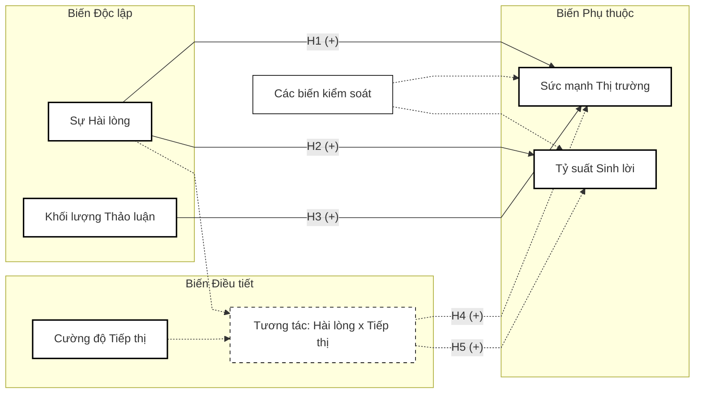

## 2. CƠ SỞ LÝ THUYẾT VÀ TỔNG QUAN TÀI LIỆU

### 2.1. Nền tảng triết học: Trách nhiệm giải trình tiếp thị và Giá trị doanh nghiệp
Nền tảng triết học trung tâm của luận án xoay quanh nguyên lý "Trách nhiệm giải trình tiếp thị". Khái niệm này xuất hiện như một sự phản kháng lại tư duy truyền thống xem tiếp thị thuần túy là chi phí. Theo nguyên lý này, các tài sản vô hình do tiếp thị tạo ra—điển hình là sự hài lòng của khách hàng, tài sản thương hiệu, và lòng trung thành—phải được gắn kết chặt chẽ với các thước đo tài chính hữu hình (Rust et al., 2004). Cơ chế hình thành sự hài lòng ban đầu được lý giải qua Mô hình kỳ vọng - xác nhận (Oliver, 1980), trong đó sự hài lòng được xác định bằng khoảng cách giữa hiệu năng cảm nhận thực tế và kỳ vọng ban đầu của người tiêu dùng trước khi mua hàng.

Khi sự hài lòng được duy trì ở mức cao và ổn định, theo Lý thuyết Tín hiệu (Spence, 1973), nó sẽ lan tỏa thông qua truyền miệng tích cực trên thị trường, tạo ra một "tín hiệu tốn kém" mà đối thủ cạnh tranh khó lòng bắt chước. Tín hiệu này đóng vai trò kép vô cùng quan trọng: một mặt, nó làm giảm thiểu rủi ro cảm nhận và chi phí tìm kiếm thông tin của nhóm khách hàng tiềm năng mới; mặt khác, nó cung cấp sự bảo chứng vững chắc cho các nhà đầu tư trên thị trường chứng khoán về tính ổn định của dòng tiền trong tương lai. Sự ổn định này làm giảm chi phí vốn của doanh nghiệp, từ đó làm gia tăng sức mạnh thị trường và giá trị vốn hóa.

### 2.2. Tranh luận học thuật về tác động của Sự hài lòng đến Hiệu quả tài chính
Tác động của chỉ số hài lòng lên hiệu năng doanh nghiệp (bao gồm cả thị phần và lợi nhuận kế toán) không phải là một tiên đề tuyệt đối. Ngược lại, đây đang là tâm điểm của nhiều tranh luận học thuật gay gắt chia thành hai trường phái chính:

- **Trường phái sinh lời:** Điển hình là các công trình của Anderson và cộng sự (2004) cũng như Fornell (2006, 2016). Trường phái này cung cấp bằng chứng thực nghiệm cho thấy chỉ số hài lòng có tương quan dương với dòng tiền vượt mức kỳ vọng và làm giảm biến động dòng tiền. Khách hàng hài lòng ít nhạy cảm hơn về giá, sẵn sàng chi trả mức giá cao hơn, giúp doanh nghiệp duy trì biên lợi nhuận bất chấp sự biến động của giá nguyên liệu đầu vào.
- **Trường phái giới hạn sinh lời:** Ở thái cực ngược lại, Tuli và Bharadwaj (2009) lập luận rằng việc liên tục bơm nguồn lực tài chính để đẩy sự hài lòng lên mức cực đại (delight) sẽ đối mặt với quy luật lợi ích biên giảm dần. Chi phí duy trì hệ thống quản trị chất lượng và dịch vụ chăm sóc khách hàng có thể tăng theo hàm mũ. Hệ quả là, nỗ lực này làm xói mòn lợi nhuận kế toán (như tỷ suất sinh lời trên tài sản, tỷ suất sinh lời trên vốn chủ sở hữu) trong ngắn và trung hạn. Đặc biệt trong ngành hàng tiêu dùng nhanh, nơi rào cản chuyển đổi thương hiệu cực kỳ thấp, khách hàng có thể rất hài lòng nhưng vẫn dễ dàng chuyển sang dùng sản phẩm của đối thủ cạnh tranh chỉ vì một chương trình khuyến mãi nhỏ.

**Bảng 1: Tổng hợp các nghiên cứu thực nghiệm tiêu biểu về Sự hài lòng và Hiệu quả tài chính**

| Tác giả (Năm) | Thị trường nghiên cứu | Phương pháp đo lường CSI | Kết quả kiểm định | Hạn chế & Khoảng trống |
| :--- | :--- | :--- | :--- | :--- |
| **Anderson et al. (2004)** | Hoa Kỳ (Đa ngành) | Khảo sát quốc gia (ACSI) | Tương quan dương với Giá trị cổ đông | Không xét đến vai trò điều tiết của chi phí Marketing |
| **Tuli & Bharadwaj (2009)** | Hoa Kỳ | Khảo sát quốc gia (ACSI) | Tác động âm đến rủi ro sụt giảm cổ phiếu | Chỉ tập trung vào rủi ro, bỏ qua yếu tố thị phần |
| **Edeling & Fischer (2016)** | Châu Âu | Khảo sát mẫu lớn | Tương tác giữa CSI và Cường độ tiếp thị tạo ra giá trị | Phương pháp khảo sát chéo dễ gây sai số ngụy biện sinh thái |
| **Tirunillai & Tellis (2012)** | Hoa Kỳ (Đa ngành) | Khai phá văn bản cơ bản | UGC có tác động đến hiệu suất cổ phiếu | Thuật toán phân tích cảm xúc tĩnh, đếm từ vựng đơn giản |
| **Nghiên cứu này** | Việt Nam (Ngành FMCG) | Mô hình Học sâu (PhoBERT) | Phân tích System-GMM chuỗi thời gian | Giải quyết triệt để nội sinh bằng phương pháp sai phân |

*(Nguồn: Đề xuất của Nghiên cứu sinh)*

### 2.3. Vai trò điều tiết của Cường độ tiếp thị
Sự hài lòng của khách hàng tự thân chỉ là một dạng tài sản tiềm năng ở trạng thái tĩnh. Theo Edeling và Fischer (2016), để chuyển hóa sự hài lòng này thành hành vi mua sắm lặp lại và gia tăng thị phần, doanh nghiệp cần một chất xúc tác từ các nỗ lực truyền thông và mạng lưới phân phối. Cường độ tiếp thị—được đo lường bằng tỷ trọng chi phí bán hàng và quảng cáo trên tổng doanh thu—đóng vai trò là biến điều tiết (moderator). Luận án lập luận rằng khi mức độ hài lòng của khách hàng cao và được kết hợp với cường độ tiếp thị phù hợp, tác động tương tác giữa hai yếu tố này có thể làm gia tăng đáng kể sức mạnh thị trường và củng cố rào cản gia nhập ngành.

### 2.4. Khai phá Dữ liệu lớn như một công cụ đo lường thế hệ mới
Để giải quyết bài toán đo lường vốn đang gặp bế tắc bởi phương pháp khảo sát quy mô nhỏ mang tính chủ quan, luận án sử dụng kỹ thuật trích xuất văn bản trên dữ liệu phản hồi tự nhiên của người tiêu dùng ở quy mô lớn. Khác với phương pháp “đếm từ khóa” truyền thống thường gặp sai lệch nghiêm trọng trước hiện tượng đa nghĩa và ngữ pháp phức tạp của tiếng Việt, nghiên cứu áp dụng các công cụ học sâu (như thuật toán mô hình hóa chủ đề BERTopic của Grootendorst (2022) và mạng nơ-ron biến áp PhoBERT của Nguyen và cộng sự (2020)). 

Tuy nhiên, cần lưu ý rằng trí tuệ nhân tạo và dữ liệu lớn trong nghiên cứu này không phải là mục tiêu tự thân của một luận án Quản trị Kinh doanh. Các công cụ này hoàn toàn đóng vai trò là công cụ phương pháp luận nhằm kiến tạo một thước đo chỉ số hài lòng khách quan, có tính liên tục theo chuỗi thời gian. Từ biến đại diện này, luận án mới có đủ cơ sở dữ liệu vĩ mô để kiểm định các mô hình nhân quả giữa Sự hài lòng và Giá trị doanh nghiệp.

### 2.5. Mô hình nghiên cứu đề xuất

*Hình 1: Mô hình khái niệm và Cơ chế nhân quả đề xuất*

**Nền tảng phát triển mô hình:**
Mô hình nghiên cứu đề xuất không phải là một sự lắp ghép tự do, mà được kế thừa và mở rộng chặt chẽ từ các khung lý thuyết cốt lõi đã được kiểm chứng trên thế giới. Cụ thể, cấu trúc tác động nền tảng của Sự hài lòng khách hàng đến hiệu năng doanh nghiệp (giả thuyết H1, H2, H3) được kế thừa trực tiếp từ các công trình kinh điển của Fornell (2006) và Anderson và cộng sự (2004). Cơ chế tác động tương tác của Cường độ tiếp thị (giả thuyết H4, H5) được phát triển dựa trên khung lý thuyết của Edeling và Fischer (2016). Điểm đóng góp mới (Novelty) cốt lõi của mô hình luận án so với các tác giả tiền nhiệm nằm ở thao tác hóa biến số: thay vì dùng dữ liệu khảo sát dễ bị độ chệch để đo lường biến độc lập, nghiên cứu đề xuất sử dụng công nghệ dữ liệu lớn (Big Data) để kiến tạo thước đo vĩ mô, qua đó mở khóa khả năng phân tích chuỗi thời gian bằng các mô hình kinh tế lượng tiên tiến để giải quyết triệt để hiện tượng nội sinh.

Hệ thống giả thuyết trọng tâm của luận án bao gồm:
- **Giả thuyết H1 (+):** Sự hài lòng khách hàng có tác động tích cực đến sức mạnh thị trường (Thị phần) của doanh nghiệp tiêu dùng nhanh.
- **Giả thuyết H2 (+):** Sự hài lòng khách hàng có tác động tích cực đến tỷ suất sinh lời kế toán của doanh nghiệp.
- **Giả thuyết H3 (+):** Khối lượng truyền miệng trên không gian mạng có tác động tích cực đến sức mạnh thị trường của doanh nghiệp.
- **Giả thuyết H4 (+):** Cường độ tiếp thị đóng vai trò điều tiết thuận chiều, cấu thành hàm khuếch đại lên tác động của sự hài lòng đối với sức mạnh thị trường.
- **Giả thuyết H5 (+):** Cường độ tiếp thị đóng vai trò điều tiết thuận chiều, cấu thành hàm khuếch đại lên tác động của sự hài lòng đối với tỷ suất sinh lời kế toán.