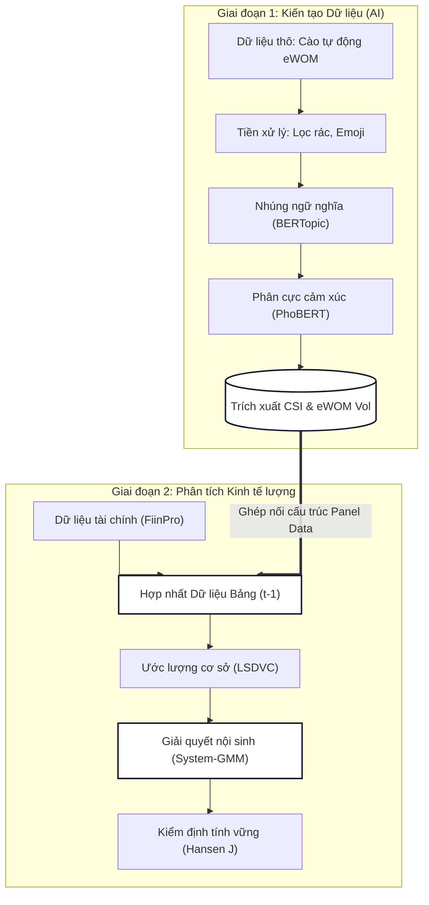

## 5. PHƯƠNG PHÁP NGHIÊN CỨU

Nghiên cứu sử dụng phương pháp định lượng thực chứng, được thực hiện qua hai giai đoạn liên tiếp nhằm giải quyết hai bài toán cốt lõi: đo lường và suy luận nhân quả.

### 5.1. Sơ đồ Quy trình Nghiên cứu Tổng thể

*Hình 2: Kiến trúc Quy trình Nghiên cứu Đa giai đoạn (Nguồn: Nghiên cứu sinh tự thiết kế)*

### 5.2. Giai đoạn 1: Khai phá dữ liệu văn bản và Kiến tạo biến số
**Bước 1: Thu thập và làm sạch khối lượng lớn văn bản**
- Lập trình thuật toán thu thập dữ liệu tự động để trích xuất kho văn bản công khai từ các nền tảng phân phối và bán lẻ trực tuyến. Tập dữ liệu dự kiến quét qua toàn bộ các mặt hàng của 20 tập đoàn tiêu dùng nhanh trong khoảng thời gian 9 năm (2016–2024).
- Chuẩn hóa chuỗi văn bản: Xử lý nhiễu bằng biểu thức chính quy, chuẩn hóa bảng mã Unicode, và áp dụng bộ lọc kinh nghiệm nhằm triệt tiêu các văn bản rác được sinh ra tự động bởi hệ thống máy tính.

**Bước 2: Mô hình hóa chủ đề thông qua độ nhúng ngữ nghĩa**
Để giải quyết bài toán gom cụm phi logic của các phương pháp thống kê từ vựng đơn giản, nghiên cứu áp dụng kỹ thuật mô hình hóa chủ đề dựa trên thuật toán BERTopic (Grootendorst, 2022). Thuật toán này sử dụng độ nhúng câu để biểu diễn văn bản dưới dạng các véc-tơ trong không gian nhiều chiều, sau đó áp dụng cơ chế giảm chiều dữ liệu trước khi phân cụm mật độ. Mô hình được tinh chỉnh theo phương pháp bán giám sát nhằm ép ma trận từ vựng hội tụ về ba véc-tơ riêng đại diện cho ba chiều kích tiền đề của mô hình sự hài lòng: kỳ vọng, chất lượng cảm nhận, và giá trị cảm nhận. 

**Bước 3: Phân cực cảm xúc bằng kiến trúc Transformer**
Đối với từng cụm chủ đề đã được xác định, kiến trúc mạng nơ-ron biến áp PhoBERT (Nguyen và cộng sự, 2020) với cơ chế chú ý tự thân đa đầu được sử dụng để giải quyết bài toán phụ thuộc xa trong ngữ pháp tiếng Việt (ví dụ: các câu sử dụng cấu trúc phủ định kép). Mô hình sẽ xuất ra một phân phối xác suất gán nhãn cực tính tích cực, tiêu cực hoặc trung tính cho từng bình luận cụ thể.

Công thức kiến tạo hàm đại diện cho sự hài lòng của doanh nghiệp $i$ vào năm $t$ được định nghĩa:
$$CSI\_Proxy_{i,t} = \sum_{k=1}^{3} W_k \left( \frac{N_{pos, k, i, t} - N_{neg, k, i, t}}{N_{total, k, i, t}} \right)$$
*Trong đó: $W_k$ là trọng số mức độ quan trọng của chủ đề $k$, được tính toán nghịch đảo dựa trên độ đo entropy phân phối nhằm tối ưu hóa lượng thông tin.* Biến khối lượng truyền miệng được biến đổi qua hàm logarit tự nhiên để kiểm soát hiện tượng phương sai thay đổi và độ lệch chuẩn quá lớn.

### 5.3. Giai đoạn 2: Mô hình hóa Kinh tế lượng (Dữ liệu bảng động)
Dữ liệu chỉ số hài lòng được tổng hợp theo năm và tích hợp (merge) vào bộ dữ liệu tài chính cấp doanh nghiệp (trích xuất từ cơ sở dữ liệu độc lập FiinPro). 

**Thiết lập phương trình mô hình cấu trúc động:**
Nhằm kiểm soát thuộc tính tự hồi quy (quán tính) của các thước đo tài chính như doanh thu hay thị phần, phương trình cơ sở được thiết lập với biến phụ thuộc trễ:
$$Y_{i,t} = \alpha + \gamma Y_{i,t-1} + \beta_1 CSI_{i,t-1} + \beta_2 Vol_{i,t-1} + \beta_3 MI_{i,t} + \beta_4 (CSI_{i,t-1} \times MI_{i,t}) + \sum_{j} \theta_j X_{j,i,t} + \mu_i + \epsilon_{i,t}$$
*Việc đưa biến sự hài lòng vào phương trình dưới dạng độ trễ một năm nhằm thiết lập cấu trúc trật tự thời gian, thỏa mãn điều kiện tiên quyết của suy luận nhân quả học thuật.*

**Giải quyết bài toán nội sinh và Độ chệch Nickell:**
- **Bài toán nhân quả đồng thời:** Trong thị trường tiêu dùng, một chiến dịch đẩy doanh số cao có thể là nguyên nhân dẫn đến khối lượng truyền miệng tăng vọt ngay sau đó, tạo ra hiện tượng nhân quả đồng thời. Việc ước lượng bằng phương pháp bình phương tối thiểu thông thường hoặc mô hình tác động cố định truyền thống sẽ gây ra độ chệch Nickell do sự tương quan hữu thủy giữa biến phụ thuộc trễ $Y_{i,t-1}$ và sai số đặc trưng không quan sát được của từng công ty $\mu_i$.
- **Giải pháp ma trận biến công cụ:** Nghiên cứu áp dụng phương pháp Moment tổng quát hệ thống theo chuẩn Arellano-Bover/Blundell-Bond. Phương pháp này tận dụng sự khác biệt bậc hai để thiết lập các phương trình moment, tự động sử dụng các độ trễ sâu của chuỗi biến nội sinh (từ độ trễ t-2 trở đi) làm ma trận biến công cụ trong cả phương trình sai phân và phương trình mức.
- **Xử lý giới hạn không gian mẫu:** Do số lượng các tập đoàn tiêu dùng nhanh niêm yết trên sàn chứng khoán Việt Nam có giới hạn, hiện tượng tăng sinh quá mức biến công cụ có thể làm suy yếu toàn bộ sức mạnh của kiểm định Hansen J về tính quá xác định. Để ngăn chặn rủi ro kỹ thuật này, thuật toán gộp biến công cụ (collapse instruments) được áp dụng bắt buộc. Đồng thời, mô hình tác động cố định sửa chệch Kiviet sẽ được ước lượng song song và sử dụng độc lập để thực hiện thủ tục kiểm tra tính vững của các hệ số. Mọi kết luận nhân quả chỉ được xác nhận khi cả hai mô hình này cho ra kết quả đồng nhất về chiều hướng tác động thống kê.