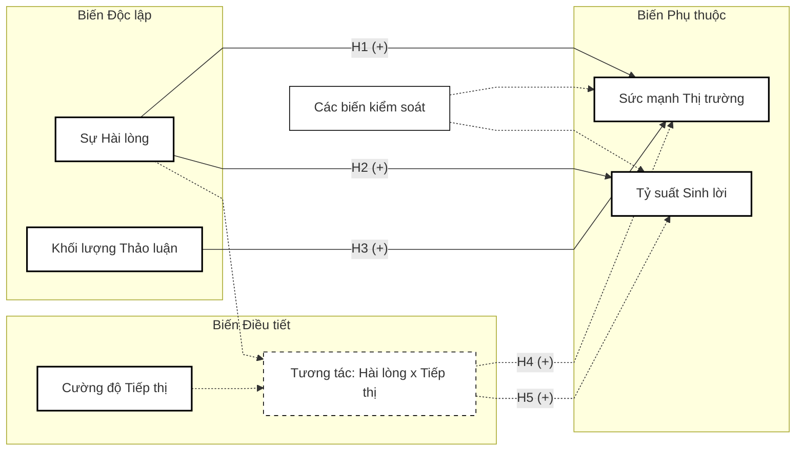
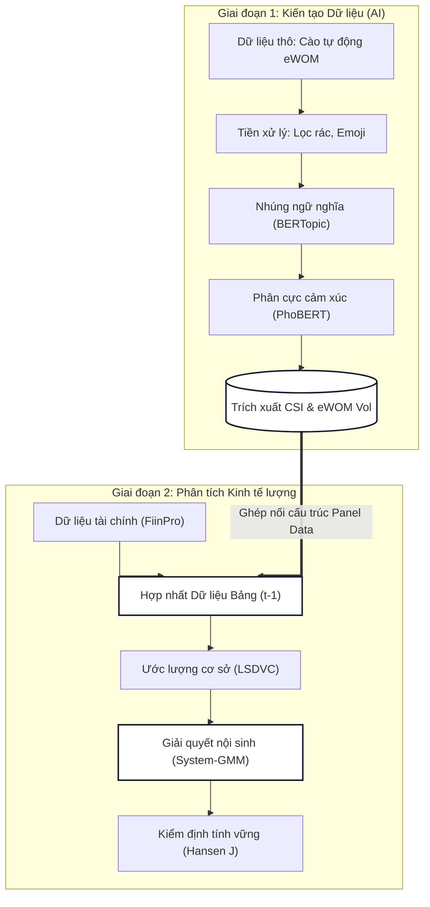

# ĐỀ CƯƠNG NGHIÊN CỨU LUẬN ÁN TIẾN SĨ

**Tên đề tài dự kiến:** 
- **Tiếng Việt:** Tác động của sự hài lòng khách hàng đến hiệu quả kinh doanh: Tiếp cận trách nhiệm giải trình tiếp thị và dữ liệu lớn trong ngành hàng tiêu dùng nhanh tại Việt Nam.
- **Tiếng Anh:** The Impact of Customer Satisfaction on Firm Performance: An Approach to Marketing Accountability and Big Data in the Fast-Moving Consumer Goods Industry in Vietnam.

**Chuyên ngành đào tạo:** Quản trị Kinh doanh
**Mã chuyên ngành:** 9340101
**Nghiên cứu sinh:** Lê Phúc Hải
**Cơ sở đào tạo:** Trường Đại học Tôn Đức Thắng

---

## LỜI CẢM ƠN
*(Dành cho phiên bản hoàn thiện sau khi trúng tuyển)*

## LỜI CAM ĐOAN
*(Dành cho phiên bản hoàn thiện sau khi trúng tuyển)*

## TÓM TẮT NGHIÊN CỨU
Trong ngành hàng tiêu dùng nhanh với đặc thù chi phí chuyển đổi thấp, sự hài lòng của khách hàng và truyền miệng điện tử có tác động ngay lập tức đến thị phần và doanh thu. Tuy nhiên, việc thiếu hụt cơ sở dữ liệu quốc gia về Chỉ số hài lòng khách hàng tại Việt Nam khiến các nghiên cứu về Trách nhiệm giải trình tiếp thị gặp khó khăn, thường vướng phải lỗi ngụy biện sinh thái do sử dụng các mẫu khảo sát cá nhân nhỏ lẻ.

Nghiên cứu này góp phần bổ khuyết vào khoảng trống trên bằng cách ứng dụng khoa học Dữ liệu lớn. Thông qua phương pháp thu thập tự động từ các nền tảng mạng xã hội và thương mại điện tử của 20 doanh nghiệp trong giai đoạn 2016-2024, nghiên cứu thu thập hàng trăm ngàn bình luận truyền miệng điện tử. Thuật toán Trí tuệ nhân tạo kết hợp phân tích cảm xúc và mô hình hóa chủ đề được sử dụng để bóc tách và lượng hóa các bình luận thành một chỉ số hài lòng đa chiều cấp doanh nghiệp. Dữ liệu này sau đó được tích hợp vào mô hình dữ liệu bảng động để kiểm định tác động nhân quả của sự hài lòng lên thị phần, tăng trưởng doanh thu và tỷ suất lợi nhuận, với sự điều tiết của cường độ tiếp thị. Nghiên cứu cung cấp bằng chứng thực nghiệm cho lý thuyết tỷ suất hoàn vốn tiếp thị, khẳng định trải nghiệm khách hàng là tài sản đóng góp vào chuỗi giá trị của doanh nghiệp.

## DANH MỤC CÁC CHỮ VIẾT TẮT
* **ACSI:** American Customer Satisfaction Index (Chỉ số hài lòng khách hàng Mỹ)
* **CSI:** Customer Satisfaction Index (Chỉ số hài lòng khách hàng)
* **eWOM:** Electronic Word-of-Mouth (Truyền miệng điện tử)
* **FMCG:** Fast-Moving Consumer Goods (Hàng tiêu dùng nhanh)
* **NLP:** Natural Language Processing (Xử lý ngôn ngữ tự nhiên)
* **ROA:** Return on Assets (Tỷ suất lợi nhuận trên tổng tài sản)
* **ROE:** Return on Equity (Tỷ suất lợi nhuận trên vốn chủ sở hữu)
* **ROMI:** Return on Marketing Investment (Tỷ suất hoàn vốn Marketing)
* **System-GMM:** System Generalized Method of Moments (Phương pháp Moment tổng quát hệ thống)

## DANH MỤC CÁC BẢNG BIỂU
* Bảng 1: Tổng hợp các nghiên cứu thực nghiệm tiêu biểu về Sự hài lòng và Hiệu quả tài chính (Chương 2)
* Bảng 2: Dự kiến kế hoạch học tập và nghiên cứu toàn khóa (Chương 6)

## DANH MỤC CÁC HÌNH VẼ
* Hình 1: Mô hình khái niệm và Cơ chế nhân quả đề xuất (Chương 2)
* Hình 2: Kiến trúc Quy trình Nghiên cứu Đa giai đoạn — Nguồn: Nghiên cứu sinh tự thiết kế (Chương 5)

## 1. TÍNH CẤP THIẾT VÀ BỐI CẢNH NHẬN THỨC CỦA ĐỀ TÀI

### 1.1. Trách nhiệm giải trình tiếp thị và Nỗ lực định lượng hóa Sự hài lòng
Trong hai thập kỷ qua, thực tiễn quản trị tiếp thị toàn cầu đã trải qua một cuộc chuyển dịch hệ hình sâu sắc: từ việc chỉ tập trung tối đa hóa doanh thu bằng các nghiệp vụ bán hàng ngắn hạn sang chiến lược xây dựng các tài sản vô hình dài hạn dựa trên nền tảng khách hàng. Trọng tâm của cuộc chuyển dịch nhận thức này là sự trỗi dậy của khái niệm Trách nhiệm giải trình tiếp thị. Các hội đồng quản trị tại các tập đoàn tiêu dùng nhanh ngày càng trở nên khắt khe và yêu cầu các báo cáo giải trình minh bạch, mang tính định lượng đối với các khoản chi phí khổng lồ dành cho truyền thông, quảng cáo và dịch vụ khách hàng. Họ đòi hỏi bằng chứng thực chứng, dựa trên dữ liệu, về khả năng chuyển hóa các nỗ lực tiếp thị này thành dòng tiền, lợi nhuận ròng, hoặc ít nhất là gia tăng thị phần cốt lõi của doanh nghiệp (Rust et al., 2004).

Trong hệ thống đánh giá đó, sự hài lòng của khách hàng được xem là biến số trung tâm mang tính sống còn trong toàn bộ chuỗi giá trị. Về mặt lý thuyết hành vi, một tập khách hàng có mức độ hài lòng cao sẽ dẫn đến những thay đổi có lợi cho cấu trúc chi phí của doanh nghiệp: làm giảm độ nhạy cảm về giá của người tiêu dùng, tăng cường lòng trung thành thương hiệu, giảm chi phí thu hút khách hàng mới, và lan tỏa hiệu ứng truyền miệng tích cực. Thông qua các cơ chế này, doanh nghiệp có thể củng cố năng lực cạnh tranh cốt lõi và thiết lập rào cản phòng thủ đối với các mối đe dọa thâm nhập thị trường mới. Tuy nhiên, bất chấp tầm quan trọng không thể phủ nhận của nó về mặt khái niệm, việc lượng hóa chính xác mức độ hài lòng của khách hàng để đưa vào các mô hình định giá tài chính, từ đó chứng minh được tỷ suất hoàn vốn, lại là một thách thức dai dẳng đối với cả giới hàn lâm thống kê và các nhà thực hành quản trị.

### 1.2. Khoảng trống phương pháp luận: Giới hạn của khảo sát và Ngụy biện sinh thái
Tại các thị trường kinh tế phát triển mạnh mẽ như Hoa Kỳ hoặc một số quốc gia châu Âu, sự ra đời của các bộ Chỉ số Hài lòng Khách hàng Quốc gia (ví dụ như ACSI) đã cung cấp nguồn dữ liệu vĩ mô định kỳ và có cấu trúc. Nền tảng dữ liệu đồ sộ này cho phép các nhà nghiên cứu tài chính như Fornell (2006, 2016) xây dựng được các mô hình hồi quy đa biến phức tạp, qua đó chứng minh được tác động thuận chiều mạnh mẽ của chỉ số hài lòng lên giá trị tăng thêm của cổ đông. 

Tuy nhiên, bức tranh thực tế hoàn toàn trái ngược ở các thị trường mới nổi như Việt Nam. Do sự vắng bóng hoàn toàn của các hệ thống đo lường rủi ro kinh doanh hay các bộ chỉ số quy mô quốc gia về thái độ người tiêu dùng, phần lớn các nghiên cứu kinh tế lượng buộc phải thỏa hiệp về mặt phương pháp luận. Các nghiên cứu hiện hành tại Việt Nam chủ yếu sử dụng dữ liệu khảo sát cá nhân (thông qua thang đo Likert cắt ngang với cỡ mẫu trung bình chỉ vài trăm người) để đại diện cho mức độ hài lòng đối với một toàn bộ thương hiệu hoặc một tập đoàn kinh tế đa quốc gia.

Tuy nhiên, giới hạn phương pháp luận của cách tiếp cận này nằm ở chỗ: việc lấy quan điểm chủ quan của một nhóm nhỏ người tiêu dùng bị giới hạn về mặt địa lý trong một thời điểm cắt ngang không thể phản ánh chính xác sức khỏe tài chính và thị phần của một tập đoàn quy mô lớn. Hơn thế nữa, phương pháp sử dụng bảng hỏi truyền thống đang ngày càng bị ảnh hưởng bởi hiện tượng kiệt quệ khảo sát của người trả lời, làm giảm độ tin cậy của kết quả. Quan trọng hơn, các phương pháp khảo sát không có khả năng tái tạo lại dòng chảy dữ liệu trong quá khứ, khiến việc xây dựng các mô hình nhân quả theo chuỗi thời gian để giải quyết các vấn đề nội sinh gặp nhiều khó khăn.

### 1.3. Dữ liệu lớn (Big Data) như một thước đo mới và lời giải cho độ chệch
Nhằm khắc phục hoàn toàn sự đứt gãy về phương pháp đo lường vô cùng nghiêm trọng nêu trên, nghiên cứu này lập luận rằng dữ liệu lớn, cụ thể là kho tàng hàng triệu bình luận tự nhiên của người tiêu dùng trên không gian mạng xã hội và các sàn thương mại điện tử, có thể và cần được sử dụng như một thước đo mới, trung thực hơn để phản ánh sự hài lòng ở cấp độ vĩ mô. Khác với người điền khảo sát, người tiêu dùng để lại bình luận trên không gian mạng ở một trạng thái tự nhiên, không bị áp lực thao túng bởi người phỏng vấn.

Thay vì phụ thuộc vào những câu trả lời khảo sát chủ quan và đứt gãy, luận án ứng dụng công nghệ dữ liệu lớn thông qua các công cụ trí tuệ nhân tạo hiện đại để bóc tách, chuẩn hóa và kiến tạo một chỉ số đại diện sự hài lòng cấp doanh nghiệp. Cần khẳng định rõ, trí tuệ nhân tạo không phải là mục tiêu nghiên cứu của luận án, mà đóng vai trò là công cụ phương pháp luận nhằm lượng hóa hàng triệu phản hồi phi cấu trúc thành dạng dữ liệu bảng có cấu trúc, liên tục theo chuỗi thời gian. Từ nền tảng đo lường khách quan này, luận án tiếp tục kiểm định thực chứng tác động nhân quả của sự hài lòng khách hàng đến hiệu quả tài chính và thị phần của doanh nghiệp.

### 1.4. Lĩnh vực nghiên cứu
Đề tài thuộc chuyên ngành Quản trị Kinh doanh, với trọng tâm lý thuyết tập trung vào hai khái niệm cốt lõi: **Trách nhiệm giải trình tiếp thị (Marketing Accountability)** và **Hiệu quả tài chính (Firm Performance)**. Mặc dù luận án ứng dụng các thuật toán khai phá văn bản tiên tiến, công cụ này phục vụ duy nhất cho việc cung cấp bằng chứng thực nghiệm nhằm kiểm định mối quan hệ giữa sự hài lòng khách hàng và hiệu quả tài chính doanh nghiệp.

## 2. CƠ SỞ LÝ THUYẾT VÀ TỔNG QUAN TÀI LIỆU

### 2.1. Nền tảng triết học: Trách nhiệm giải trình tiếp thị và Giá trị doanh nghiệp
Nền tảng triết học trung tâm của luận án xoay quanh nguyên lý "Trách nhiệm giải trình tiếp thị". Khái niệm này xuất hiện như một sự phản kháng lại tư duy truyền thống xem tiếp thị thuần túy là chi phí. Theo nguyên lý này, các tài sản vô hình do tiếp thị tạo ra—điển hình là sự hài lòng của khách hàng, tài sản thương hiệu, và lòng trung thành—phải được gắn kết chặt chẽ với các thước đo tài chính hữu hình (Rust et al., 2004). Cơ chế hình thành sự hài lòng ban đầu được lý giải qua Mô hình kỳ vọng - xác nhận (Oliver, 1980), trong đó sự hài lòng được xác định bằng khoảng cách giữa hiệu năng cảm nhận thực tế và kỳ vọng ban đầu của người tiêu dùng trước khi mua hàng.

Khi sự hài lòng được duy trì ở mức cao và ổn định, theo Lý thuyết Tín hiệu (Spence, 1973), nó sẽ lan tỏa thông qua truyền miệng tích cực trên thị trường, tạo ra một "tín hiệu tốn kém" mà đối thủ cạnh tranh khó lòng bắt chước. Tín hiệu này đóng vai trò kép vô cùng quan trọng: một mặt, nó làm giảm thiểu rủi ro cảm nhận và chi phí tìm kiếm thông tin của nhóm khách hàng tiềm năng mới; mặt khác, nó cung cấp sự bảo chứng vững chắc cho các nhà đầu tư trên thị trường chứng khoán về tính ổn định của dòng tiền trong tương lai. Sự ổn định này làm giảm chi phí vốn của doanh nghiệp, từ đó làm gia tăng sức mạnh thị trường và giá trị vốn hóa.

### 2.2. Tranh luận học thuật về tác động của Sự hài lòng đến Hiệu quả tài chính
Tác động của chỉ số hài lòng lên hiệu năng doanh nghiệp (bao gồm cả thị phần và lợi nhuận kế toán) không phải là một tiên đề tuyệt đối. Ngược lại, đây đang là tâm điểm của nhiều tranh luận học thuật gay gắt chia thành hai trường phái chính:

- **Trường phái sinh lời:** Điển hình là các công trình của Anderson và cộng sự (2004) cũng như Fornell (2006, 2016). Trường phái này cung cấp bằng chứng thực nghiệm cho thấy chỉ số hài lòng có tương quan dương với dòng tiền vượt mức kỳ vọng và làm giảm biến động dòng tiền. Khách hàng hài lòng ít nhạy cảm hơn về giá, sẵn sàng chi trả mức giá cao hơn, giúp doanh nghiệp duy trì biên lợi nhuận bất chấp sự biến động của giá nguyên liệu đầu vào.
- **Trường phái giới hạn sinh lời:** Ở thái cực ngược lại, Tuli và Bharadwaj (2009) lập luận rằng việc liên tục bơm nguồn lực tài chính để đẩy sự hài lòng lên mức cực đại (delight) sẽ đối mặt với quy luật lợi ích biên giảm dần. Chi phí duy trì hệ thống quản trị chất lượng và dịch vụ chăm sóc khách hàng có thể tăng theo hàm mũ. Hệ quả là, nỗ lực này làm xói mòn lợi nhuận kế toán (như tỷ suất sinh lời trên tài sản, tỷ suất sinh lời trên vốn chủ sở hữu) trong ngắn và trung hạn. Đặc biệt trong ngành hàng tiêu dùng nhanh, nơi rào cản chuyển đổi thương hiệu cực kỳ thấp, khách hàng có thể rất hài lòng nhưng vẫn dễ dàng chuyển sang dùng sản phẩm của đối thủ cạnh tranh chỉ vì một chương trình khuyến mãi nhỏ.

**Bảng 1: Tổng hợp các nghiên cứu thực nghiệm tiêu biểu về Sự hài lòng và Hiệu quả tài chính**

| Tác giả (Năm) | Thị trường nghiên cứu | Phương pháp đo lường CSI | Kết quả kiểm định | Hạn chế & Khoảng trống |
| :--- | :--- | :--- | :--- | :--- |
| **Anderson et al. (2004)** | Hoa Kỳ (Đa ngành) | Khảo sát quốc gia (ACSI) | Tương quan dương với Giá trị cổ đông | Không xét đến vai trò điều tiết của chi phí Marketing |
| **Tuli & Bharadwaj (2009)** | Hoa Kỳ | Khảo sát quốc gia (ACSI) | Tác động âm đến rủi ro sụt giảm cổ phiếu | Chỉ tập trung vào rủi ro, bỏ qua yếu tố thị phần |
| **Edeling & Fischer (2016)** | Châu Âu | Khảo sát mẫu lớn | Tương tác giữa CSI và Cường độ tiếp thị tạo ra giá trị | Phương pháp khảo sát chéo dễ gây sai số ngụy biện sinh thái |
| **Tirunillai & Tellis (2012)** | Hoa Kỳ (Đa ngành) | Khai phá văn bản cơ bản | UGC có tác động đến hiệu suất cổ phiếu | Thuật toán phân tích cảm xúc tĩnh, đếm từ vựng đơn giản |
| **Nghiên cứu này** | Việt Nam (Ngành FMCG) | Mô hình Học sâu (PhoBERT) | Phân tích System-GMM chuỗi thời gian | Giải quyết triệt để nội sinh bằng phương pháp sai phân |

*(Nguồn: Đề xuất của Nghiên cứu sinh)*

### 2.3. Vai trò điều tiết của Cường độ tiếp thị
Sự hài lòng của khách hàng tự thân chỉ là một dạng tài sản tiềm năng ở trạng thái tĩnh. Theo Edeling và Fischer (2016), để chuyển hóa sự hài lòng này thành hành vi mua sắm lặp lại và gia tăng thị phần, doanh nghiệp cần một chất xúc tác từ các nỗ lực truyền thông và mạng lưới phân phối. Cường độ tiếp thị—được đo lường bằng tỷ trọng chi phí bán hàng và quảng cáo trên tổng doanh thu—đóng vai trò là biến điều tiết (moderator). Luận án lập luận rằng khi mức độ hài lòng của khách hàng cao và được kết hợp với cường độ tiếp thị phù hợp, tác động tương tác giữa hai yếu tố này có thể làm gia tăng đáng kể sức mạnh thị trường và củng cố rào cản gia nhập ngành.

### 2.4. Khai phá Dữ liệu lớn như một công cụ đo lường thế hệ mới
Để giải quyết bài toán đo lường vốn đang gặp bế tắc bởi phương pháp khảo sát quy mô nhỏ mang tính chủ quan, luận án sử dụng kỹ thuật trích xuất văn bản trên dữ liệu phản hồi tự nhiên của người tiêu dùng ở quy mô lớn. Khác với phương pháp “đếm từ khóa” truyền thống thường gặp sai lệch nghiêm trọng trước hiện tượng đa nghĩa và ngữ pháp phức tạp của tiếng Việt, nghiên cứu áp dụng các công cụ học sâu (như thuật toán mô hình hóa chủ đề BERTopic của Grootendorst (2022) và mạng nơ-ron biến áp PhoBERT của Nguyen và cộng sự (2020)). 

Tuy nhiên, cần lưu ý rằng trí tuệ nhân tạo và dữ liệu lớn trong nghiên cứu này không phải là mục tiêu tự thân của một luận án Quản trị Kinh doanh. Các công cụ này hoàn toàn đóng vai trò là công cụ phương pháp luận nhằm kiến tạo một thước đo chỉ số hài lòng khách quan, có tính liên tục theo chuỗi thời gian. Từ biến đại diện này, luận án mới có đủ cơ sở dữ liệu vĩ mô để kiểm định các mô hình nhân quả giữa Sự hài lòng và Giá trị doanh nghiệp.

### 2.5. Mô hình nghiên cứu đề xuất

*Hình 1: Mô hình khái niệm và Cơ chế nhân quả đề xuất*

**Nền tảng phát triển mô hình:**
Mô hình nghiên cứu đề xuất không phải là một sự lắp ghép tự do, mà được kế thừa và mở rộng chặt chẽ từ các khung lý thuyết cốt lõi đã được kiểm chứng trên thế giới. Cụ thể, cấu trúc tác động nền tảng của Sự hài lòng khách hàng đến hiệu năng doanh nghiệp (giả thuyết H1, H2, H3) được kế thừa trực tiếp từ các công trình kinh điển của Fornell (2006) và Anderson và cộng sự (2004). Cơ chế tác động tương tác của Cường độ tiếp thị (giả thuyết H4, H5) được phát triển dựa trên khung lý thuyết của Edeling và Fischer (2016). Điểm đóng góp mới (Novelty) cốt lõi của mô hình luận án so với các tác giả tiền nhiệm nằm ở thao tác hóa biến số: thay vì dùng dữ liệu khảo sát dễ bị độ chệch để đo lường biến độc lập, nghiên cứu đề xuất sử dụng công nghệ dữ liệu lớn (Big Data) để kiến tạo thước đo vĩ mô, qua đó mở khóa khả năng phân tích chuỗi thời gian bằng các mô hình kinh tế lượng tiên tiến để giải quyết triệt để hiện tượng nội sinh.

Hệ thống giả thuyết trọng tâm của luận án bao gồm:
- **Giả thuyết H1 (+):** Sự hài lòng khách hàng có tác động tích cực đến sức mạnh thị trường (Thị phần) của doanh nghiệp tiêu dùng nhanh.
- **Giả thuyết H2 (+):** Sự hài lòng khách hàng có tác động tích cực đến tỷ suất sinh lời kế toán của doanh nghiệp.
- **Giả thuyết H3 (+):** Khối lượng truyền miệng trên không gian mạng có tác động tích cực đến sức mạnh thị trường của doanh nghiệp.
- **Giả thuyết H4 (+):** Cường độ tiếp thị đóng vai trò điều tiết thuận chiều, cấu thành hàm khuếch đại lên tác động của sự hài lòng đối với sức mạnh thị trường.
- **Giả thuyết H5 (+):** Cường độ tiếp thị đóng vai trò điều tiết thuận chiều, cấu thành hàm khuếch đại lên tác động của sự hài lòng đối với tỷ suất sinh lời kế toán.

## 3. MỤC TIÊU VÀ CÂU HỎI NGHIÊN CỨU

### 3.1. Mục tiêu tổng quát
Mục tiêu tổng quát của luận án là kiểm định thực chứng tác động nhân quả của sự hài lòng khách hàng đến sức mạnh thị trường và hiệu suất tài chính của các doanh nghiệp hoạt động trong ngành hàng tiêu dùng nhanh (FMCG) tại Việt Nam, dưới sự điều tiết của cấu trúc chi phí tiếp thị. Để vượt qua những rào cản về sự thiếu hụt dữ liệu đo lường cấp vĩ mô tại các thị trường mới nổi, nghiên cứu ứng dụng phương pháp khai phá dữ liệu lớn như một công cụ phương pháp luận bổ sung nhằm xây dựng một chỉ số đại diện khách quan cho sự hài lòng của khách hàng ở quy mô toàn doanh nghiệp. Luận án kỳ vọng đóng góp những bằng chứng định lượng nhằm làm sáng tỏ cuộc tranh luận học thuật về vai trò thực sự của việc nâng cao trải nghiệm khách hàng: đó là một khoản đầu tư sinh lời hay chỉ đơn thuần là gánh nặng chi phí đối với doanh nghiệp.

### 3.2. Mục tiêu cụ thể
Để hiện thực hóa mục tiêu tổng quát nêu trên, luận án chia nhỏ quá trình nghiên cứu thành ba mục tiêu cụ thể có liên kết chặt chẽ với nhau:

1. **Kiểm định tác động trực tiếp của sự hài lòng:** Định lượng chiều hướng và biên độ tác động của chỉ số hài lòng khách hàng và khối lượng truyền miệng điện tử đến các thước đo thị trường (thị phần) và các thước đo lợi nhuận kế toán (tỷ suất sinh lời trên tài sản, tỷ suất sinh lời trên vốn chủ sở hữu) của doanh nghiệp. Mục tiêu này được thực hiện thông qua hệ thống mô hình kinh tế lượng tài chính có kiểm soát nghiêm ngặt các biến nội sinh và hiệu ứng tự hồi quy.
2. **Kiểm định cơ chế điều tiết của cường độ tiếp thị:** Đo lường vai trò xúc tác của biến cường độ tiếp thị (chi phí bán hàng và quảng cáo) trong phương trình chuyển hóa sự hài lòng thành dòng tiền và doanh thu thực tế. Việc trả lời được mục tiêu này sẽ cung cấp hàm ý chiến lược sâu sắc cho các nhà quản trị về điểm cân bằng tối ưu trong việc phân bổ ngân sách giữa cải thiện chất lượng cốt lõi và đẩy mạnh truyền thông quảng cáo.
3. **Mục tiêu phương pháp luận (Khía cạnh kỹ thuật phụ trợ):** Xây dựng một quy trình công cụ xử lý dữ liệu lớn bằng trí tuệ nhân tạo (kết hợp mô hình hóa chủ đề và phân tích cực tính cảm xúc) để khắc phục triệt để hiện tượng "ngụy biện sinh thái" của phương pháp khảo sát cắt ngang truyền thống. Thông qua đó, trích xuất thành công và đáng tin cậy biến số đại diện cho sự hài lòng từ hàng triệu phản hồi tự nhiên trên không gian số thành chuỗi dữ liệu bảng theo thời gian.

### 3.3. Câu hỏi nghiên cứu
Dựa trên các mục tiêu cụ thể đã xác định, luận án thiết lập ba câu hỏi nghiên cứu cốt lõi cần phải được giải đáp thông qua mô hình thực nghiệm:

1. Dưới các ràng buộc kiểm soát biến nội sinh nghiêm ngặt trong mô hình dữ liệu bảng động, sự gia tăng của Chỉ số hài lòng khách hàng (được đo lường thông qua mạng xã hội) có thực sự tạo ra tác động biên dương làm gia tăng thị phần và lợi nhuận của doanh nghiệp tiêu dùng nhanh tại Việt Nam, hay nỗ lực này chỉ đơn thuần cấu thành các khoản chi phí chìm làm xói mòn lợi nhuận kế toán trong ngắn hạn?
2. Việc gia tăng cường độ tiếp thị (tăng chi ngân sách cho quảng cáo và xúc tiến bán) có thực sự đóng vai trò như một bộ khuếch đại, làm thay đổi sức mạnh và biên độ tác động của sự hài lòng lên các thước đo hiệu năng tài chính của doanh nghiệp hay không?
3. Về mặt phương pháp luận đo lường, việc ứng dụng thuật toán học sâu trên kho dữ liệu lớn có khả năng giải quyết được độ chệch nghiêm trọng của các phương pháp khảo sát truyền thống trong việc kiến tạo biến số Sự hài lòng cấp doanh nghiệp hay không? Việc đo lường bằng khai phá văn bản này có tạo ra chuỗi dữ liệu đủ tiêu chuẩn để áp dụng trong các mô hình kinh tế lượng phức tạp hay không?

### 3.4. Ý nghĩa khoa học và Hàm ý quản trị

**Về mặt khoa học:** 
Luận án đóng góp một hướng tiếp cận phương pháp luận mới trong nghiên cứu Quản trị Kinh doanh. Việc ứng dụng Dữ liệu lớn và Trí tuệ nhân tạo như một công cụ đo lường thế hệ mới giúp giảm thiểu đáng kể lỗi ngụy biện sinh thái của phương pháp khảo sát truyền thống. Khung lý thuyết của luận án bổ sung bằng chứng thực nghiệm cho nguyên lý “Trách nhiệm giải trình tiếp thị”, qua đó đưa sự hài lòng của khách hàng ra khỏi vùng tranh luận trừng tượng để trở thành một cấu trúc tài chính có thể đo lường và định giá.

**Về hàm ý quản trị (Thực tiễn):**
Nghiên cứu mang lại giá trị định hướng trực tiếp cho các Giám đốc Điều hành (CEO) và Giám đốc Tiếp thị (CMO) tại các tập đoàn FMCG:
- **Tối ưu hóa phân bổ ngân sách tiếp thị:** Kết quả hồi quy cung cấp cơ sở thực nghiệm để doanh nghiệp FMCG đưa ra các quyết định phân bổ ngân sách tiếp thị có căn cứ định lượng. Việc xác định được ngưỡng tác động của chi phí quảng cáo giúp hỗ trợ doanh nghiệp tối ưu hóa tỷ suất sinh lời trên tài sản (ROA) và tỷ suất sinh lời trên vốn chủ sở hữu (ROE).
- **Chiến lược đầu tư vào Trải nghiệm khách hàng:** Bằng chứng thực nghiệm từ luận án sẽ giúp các nhà quản lý bảo vệ thành công các khoản ngân sách dành cho việc cải thiện chất lượng dịch vụ trước Hội đồng quản trị, chứng minh rằng đây là khoản đầu tư tạo ra lợi thế cạnh tranh dài hạn và rào cản phòng thủ vững chắc thay vì chỉ là chi phí chìm.

## 4. ĐỐI TƯỢNG VÀ PHẠM VI NGHIÊN CỨU

- **Đối tượng nghiên cứu chính:** Cơ chế tác động của mức độ hài lòng khách hàng và truyền miệng điện tử đến kết quả kinh doanh, cũng như vai trò điều tiết của cường độ tiếp thị.
- **Khách thể nghiên cứu:** Khoảng 20 đến 30 doanh nghiệp thuộc nhóm ngành hàng tiêu dùng nhanh đang niêm yết trên các sàn giao dịch chứng khoán tại Việt Nam. Danh sách chọn mẫu bám sát tiêu chuẩn phân ngành chuẩn, bao gồm các mã chứng khoán tiêu biểu như VNM, MCH, SAB, BHN, KDC, QNS, PAN, SCD.
- **Phạm vi dữ liệu:** 
  - *Dữ liệu văn bản:* Toàn bộ bình luận, đánh giá công khai trên trang chủ chính thức của doanh nghiệp trên mạng xã hội và các gian hàng phân phối trực tuyến chính hãng.
  - *Dữ liệu tài chính:* Số liệu từ báo cáo tài chính đã kiểm toán, trích xuất từ các nền tảng cung cấp dữ liệu tài chính chuyên nghiệp.
- **Phạm vi thời gian:** Bộ dữ liệu bảng được thiết lập bao phủ chuỗi 9 năm tài chính, từ năm 2016 đến năm 2024. Đây là khoảng thời gian đủ độ dài để quan sát sự biến thiên của các chỉ số tài chính và hành vi tiêu dùng trực tuyến.
- **Giới hạn nghiên cứu:** Nghiên cứu chỉ đánh giá truyền miệng điện tử trên nền tảng văn bản công khai, không thu thập và phân tích dữ liệu hình ảnh hoặc video âm thanh do giới hạn về phương pháp luận và tài nguyên tính toán. Mọi kết luận từ nghiên cứu này là ngoại suy có điều kiện, áp dụng chủ yếu cho nhóm doanh nghiệp niêm yết có quy mô lớn.

## 5. PHƯƠNG PHÁP NGHIÊN CỨU

Nghiên cứu sử dụng phương pháp định lượng thực chứng, được thực hiện qua hai giai đoạn liên tiếp nhằm giải quyết hai bài toán cốt lõi: đo lường và suy luận nhân quả.

### 5.1. Sơ đồ Quy trình Nghiên cứu Tổng thể

*Hình 2: Kiến trúc Quy trình Nghiên cứu Đa giai đoạn (Nguồn: Nghiên cứu sinh tự thiết kế)*

### 5.2. Giai đoạn 1: Khai phá dữ liệu văn bản và Kiến tạo biến số
**Bước 1: Thu thập và làm sạch khối lượng lớn văn bản**
- Lập trình thuật toán thu thập dữ liệu tự động để trích xuất kho văn bản công khai từ các nền tảng phân phối và bán lẻ trực tuyến. Tập dữ liệu dự kiến quét qua toàn bộ các mặt hàng của 20 tập đoàn tiêu dùng nhanh trong khoảng thời gian 9 năm (2016–2024).
- Chuẩn hóa chuỗi văn bản: Xử lý nhiễu bằng biểu thức chính quy, chuẩn hóa bảng mã Unicode, và áp dụng bộ lọc kinh nghiệm nhằm triệt tiêu các văn bản rác được sinh ra tự động bởi hệ thống máy tính.

**Bước 2: Mô hình hóa chủ đề thông qua độ nhúng ngữ nghĩa**
Để giải quyết bài toán gom cụm phi logic của các phương pháp thống kê từ vựng đơn giản, nghiên cứu áp dụng kỹ thuật mô hình hóa chủ đề dựa trên thuật toán BERTopic (Grootendorst, 2022). Thuật toán này sử dụng độ nhúng câu để biểu diễn văn bản dưới dạng các véc-tơ trong không gian nhiều chiều, sau đó áp dụng cơ chế giảm chiều dữ liệu trước khi phân cụm mật độ. Mô hình được tinh chỉnh theo phương pháp bán giám sát nhằm ép ma trận từ vựng hội tụ về ba véc-tơ riêng đại diện cho ba chiều kích tiền đề của mô hình sự hài lòng: kỳ vọng, chất lượng cảm nhận, và giá trị cảm nhận. 

**Bước 3: Phân cực cảm xúc bằng kiến trúc Transformer**
Đối với từng cụm chủ đề đã được xác định, kiến trúc mạng nơ-ron biến áp PhoBERT (Nguyen và cộng sự, 2020) với cơ chế chú ý tự thân đa đầu được sử dụng để giải quyết bài toán phụ thuộc xa trong ngữ pháp tiếng Việt (ví dụ: các câu sử dụng cấu trúc phủ định kép). Mô hình sẽ xuất ra một phân phối xác suất gán nhãn cực tính tích cực, tiêu cực hoặc trung tính cho từng bình luận cụ thể.

Công thức kiến tạo hàm đại diện cho sự hài lòng của doanh nghiệp $i$ vào năm $t$ được định nghĩa:
$$CSI\_Proxy_{i,t} = \sum_{k=1}^{3} W_k \left( \frac{N_{pos, k, i, t} - N_{neg, k, i, t}}{N_{total, k, i, t}} \right)$$
*Trong đó: $W_k$ là trọng số mức độ quan trọng của chủ đề $k$, được tính toán nghịch đảo dựa trên độ đo entropy phân phối nhằm tối ưu hóa lượng thông tin.* Biến khối lượng truyền miệng được biến đổi qua hàm logarit tự nhiên để kiểm soát hiện tượng phương sai thay đổi và độ lệch chuẩn quá lớn.

### 5.3. Giai đoạn 2: Mô hình hóa Kinh tế lượng (Dữ liệu bảng động)
Dữ liệu chỉ số hài lòng được tổng hợp theo năm và tích hợp (merge) vào bộ dữ liệu tài chính cấp doanh nghiệp (trích xuất từ cơ sở dữ liệu độc lập FiinPro). 

**Thiết lập phương trình mô hình cấu trúc động:**
Nhằm kiểm soát thuộc tính tự hồi quy (quán tính) của các thước đo tài chính như doanh thu hay thị phần, phương trình cơ sở được thiết lập với biến phụ thuộc trễ:
$$Y_{i,t} = \alpha + \gamma Y_{i,t-1} + \beta_1 CSI_{i,t-1} + \beta_2 Vol_{i,t-1} + \beta_3 MI_{i,t} + \beta_4 (CSI_{i,t-1} \times MI_{i,t}) + \sum_{j} \theta_j X_{j,i,t} + \mu_i + \epsilon_{i,t}$$
*Việc đưa biến sự hài lòng vào phương trình dưới dạng độ trễ một năm nhằm thiết lập cấu trúc trật tự thời gian, thỏa mãn điều kiện tiên quyết của suy luận nhân quả học thuật.*

**Giải quyết bài toán nội sinh và Độ chệch Nickell:**
- **Bài toán nhân quả đồng thời:** Trong thị trường tiêu dùng, một chiến dịch đẩy doanh số cao có thể là nguyên nhân dẫn đến khối lượng truyền miệng tăng vọt ngay sau đó, tạo ra hiện tượng nhân quả đồng thời. Việc ước lượng bằng phương pháp bình phương tối thiểu thông thường hoặc mô hình tác động cố định truyền thống sẽ gây ra độ chệch Nickell do sự tương quan hữu thủy giữa biến phụ thuộc trễ $Y_{i,t-1}$ và sai số đặc trưng không quan sát được của từng công ty $\mu_i$.
- **Giải pháp ma trận biến công cụ:** Nghiên cứu áp dụng phương pháp Moment tổng quát hệ thống theo chuẩn Arellano-Bover/Blundell-Bond. Phương pháp này tận dụng sự khác biệt bậc hai để thiết lập các phương trình moment, tự động sử dụng các độ trễ sâu của chuỗi biến nội sinh (từ độ trễ t-2 trở đi) làm ma trận biến công cụ trong cả phương trình sai phân và phương trình mức.
- **Xử lý giới hạn không gian mẫu:** Do số lượng các tập đoàn tiêu dùng nhanh niêm yết trên sàn chứng khoán Việt Nam có giới hạn, hiện tượng tăng sinh quá mức biến công cụ có thể làm suy yếu toàn bộ sức mạnh của kiểm định Hansen J về tính quá xác định. Để ngăn chặn rủi ro kỹ thuật này, thuật toán gộp biến công cụ (collapse instruments) được áp dụng bắt buộc. Đồng thời, mô hình tác động cố định sửa chệch Kiviet sẽ được ước lượng song song và sử dụng độc lập để thực hiện thủ tục kiểm tra tính vững của các hệ số. Mọi kết luận nhân quả chỉ được xác nhận khi cả hai mô hình này cho ra kết quả đồng nhất về chiều hướng tác động thống kê.

## 6. KẾ HOẠCH NGHIÊN CỨU (CỤ THỂ MỖI 06 THÁNG)
Toàn bộ tiến trình được thiết kế trong 36 tháng, lồng ghép chặt chẽ giữa học tập lý thuyết, xử lý Big Data và công bố khoa học.

**Bảng 2: Dự kiến kế hoạch học tập và nghiên cứu toàn khóa**
| STT | Nội dung công việc và Nhiệm vụ | Thời gian thực hiện | Kết quả dự kiến |
|---|---|---|---|
| 1 | Học các học phần Tiến sĩ; Hoàn thiện Tổng quan tài liệu ROMI; Xây dựng script Web Scraping. | Tháng 1 - Tháng 6 | Hoàn thành tín chỉ bắt buộc; Đề cương chi tiết được duyệt. |
| 2 | Cào dữ liệu eWOM; Khai thác và Tinh chỉnh (Fine-tune) mô hình BERTopic & PhoBERT; Chạy thử nghiệm trích xuất điểm CSI. | Tháng 7 - Tháng 12 | Tập dữ liệu ~200.000 text. Viết 01 bài báo Hội thảo Khoa học Quốc tế/Quốc gia. |
| 3 | Thu thập dữ liệu tài chính từ FiinPro; Hoàn thiện bộ Panel Data; Chạy mô hình System-GMM bằng thư viện kinh tế lượng trên Python (linearmodels). | Tháng 13 - Tháng 18 | Bảng kết quả hồi quy hoàn chỉnh. Nộp 01 bài báo quốc tế thuộc danh mục ISI/Scopus. |
| 4 | Báo cáo Chuyên đề Tiến sĩ 1 & 2; Seminar Khoa; Xử lý phản biện của tạp chí quốc tế. | Tháng 19 - Tháng 24 | Đạt 2 Chuyên đề. Có thư chấp nhận đăng bài. |
| 5 | Gửi bài báo số 2 (Tạp chí HĐGS hoặc quốc tế); Báo cáo Chuyên đề Tiến sĩ 3; Chắp bút 80% bản thảo Luận án. | Tháng 25 - Tháng 30 | Hoàn thiện Chuyên đề 3. Bản thảo luận án thành hình. |
| 6 | Trình bày trước hội đồng góp ý; Hoàn thiện các thủ tục; Bảo vệ luận án cấp Cơ sở và cấp ĐHQG/Trường. | Tháng 31 - Tháng 36 | Đạt học vị Tiến sĩ. |

## 7. MỤC TIÊU VÀ MONG MUỐN ĐẠT ĐƯỢC KHI ĐĂNG KÝ TUYỂN SINH
- **Nâng tầm năng lực nghiên cứu liên ngành:** Vượt qua ranh giới của một nhà nghiên cứu Marketing truyền thống để trở thành một chuyên gia phân tích dữ liệu ứng dụng.
- **Giải quyết bài toán thực tiễn:** Cung cấp cho các doanh nghiệp FMCG Việt Nam một bộ tiêu chuẩn khoa học về cách thức eWOM định giá doanh nghiệp, giúp các nhà quản trị Marketing tự tin giải trình ngân sách trước cổ đông.
- **Đóng góp y văn toàn cầu:** Đưa dữ liệu thị trường Việt Nam và đặc tính ngôn ngữ tiếng Việt vào bản đồ các nghiên cứu về trách nhiệm giải trình tiếp thị và khai phá văn bản trên các tạp chí quốc tế ISI/Scopus.

## 8. LÝ DO CHỌN ĐẠI HỌC TÔN ĐỨC THẮNG LÀM CƠ SỞ ĐÀO TẠO
- **Hệ sinh thái liên ngành xuất sắc:** TDTU là trường đại học chú trọng sự giao thoa giữa Kinh tế học và Khoa học Dữ liệu. Sự hỗ trợ từ cơ sở hạ tầng điện toán và các chuyên gia CNTT tại trường là nền tảng phù hợp cho việc xử lý hàng trăm ngàn dòng dữ liệu Text của đề án.
- **Tiêu chuẩn học thuật quốc tế minh bạch:** Môi trường nghiên cứu liêm chính, khắt khe và hệ thống tài nguyên thư viện chuẩn mực quốc tế của TDTU cung cấp nguồn cảm hứng và động lực lớn lao để hoàn thành luận án với chất lượng cao nhất, đủ điều kiện công bố tại các tạp chí thuộc danh mục ISI/Scopus.

## 9. KINH NGHIỆM VỀ NGHIÊN CỨU, THỰC TẾ, HOẠT ĐỘNG XÃ HỘI VÀ NGOẠI KHÓA

Nghiên cứu sinh có nền tảng đào tạo liên ngành giữa Công nghệ Thông tin và Quản trị Kinh doanh, cùng với 15 năm kinh nghiệm làm việc trong lĩnh vực quản trị dữ liệu và chuyển đổi số. Những kinh nghiệm này cung cấp cơ sở kỹ năng cần thiết để thực hiện đề tài luận án kết hợp giữa Dữ liệu lớn và Kinh tế lượng. Cụ thể:

**9.1. Nền tảng học vấn**
- **Cử nhân Công nghệ Thông tin (2012):** Cung cấp kiến thức nền tảng về cấu trúc dữ liệu, thuật toán và năng lực lập trình. Đây là kỹ năng cốt lõi phục vụ cho việc vận hành các mô hình máy học, xử lý ngôn ngữ tự nhiên và trích xuất dữ liệu tự động (eWOM) trong luận án.
- **Cử nhân Quản trị Kinh doanh (2015):** Cung cấp kiến thức cơ sở về các nguyên lý quản trị doanh nghiệp, chuỗi cung ứng và hành vi tổ chức.
- **Thạc sĩ Quản trị Kinh doanh - MBA (2020):** Cung cấp kiến thức chuyên sâu về quản trị chiến lược, phân tích tài chính và quy trình ra quyết định dựa trên dữ liệu.

**9.2. Kinh nghiệm thực tiễn (15 năm)**
- **Kinh nghiệm chuyên môn tại các doanh nghiệp FMCG và Công nghệ:** Đảm nhiệm các vị trí quản trị hệ thống và phân tích dữ liệu kinh doanh tại FPT, Coca-Cola và Mondelez Kinh Đô. Quá trình làm việc trực tiếp trong ngành Hàng tiêu dùng nhanh (FMCG) cung cấp sự hiểu biết thực tế về cấu trúc kênh phân phối, quản trị bán lẻ và vòng đời sản phẩm.
- **Kinh nghiệm tư vấn giải pháp số:** Tư vấn và triển khai các hệ thống chuyển đổi số cho các doanh nghiệp trong lĩnh vực dược phẩm và y tế, bao gồm Ladophar, Mega We Care và An Minh Group.
- **Quản lý dữ liệu doanh nghiệp:** Hiện đảm nhiệm vị trí Head of Engineering tại Tập đoàn CJ Việt Nam, chịu trách nhiệm quản lý phòng Dữ liệu Kinh doanh Thông minh (Business Intelligence) và Chuyển đổi số. Công việc trực tiếp xử lý các hệ thống dữ liệu lớn (Big Data) để thiết lập các chỉ số đo lường hiệu quả hoạt động (KPIs).
- **Phát triển công cụ phân tích định lượng:** Là nhà sáng lập (Founder) của hệ thống ncskit.org, một nền tảng phần mềm phân tích khoa học định lượng được xây dựng trên lõi ngôn ngữ lập trình R. Nền tảng này hỗ trợ tính toán các mô hình kinh tế lượng học thuật (như dữ liệu bảng Panel Data), cung cấp kinh nghiệm lập trình thống kê cần thiết cho Giai đoạn 2 của luận án.

**9.3. Đánh giá sự phù hợp với phương pháp luận của đề tài**
Kinh nghiệm lập trình phần mềm kết hợp với kiến thức quản trị kinh doanh và kỹ năng phân tích dữ liệu tạo ra sự tương thích với phương pháp nghiên cứu Đa giai đoạn. Nghiên cứu sinh có đủ năng lực kỹ thuật để tự triển khai các thuật toán khai phá văn bản (PhoBERT, BERTopic) ở Giai đoạn 1, đồng thời có khả năng áp dụng các công cụ kinh tế lượng (System-GMM) để phân tích dữ liệu tài chính ở Giai đoạn 2.

## 10. DỰ KIẾN VIỆC LÀM VÀ CÁC NGHIÊN CỨU TIẾP THEO SAU KHI TỐT NGHIỆP
- **Định hướng nghề nghiệp:** Tiếp tục con đường giảng dạy và nghiên cứu tại các trường Đại học trọng điểm; đồng thời tham gia thị trường công nghiệp với vai trò Cố vấn Cấp cao về Trách nhiệm giải trình tiếp thị và Trải nghiệm khách hàng cho các tập đoàn bán lẻ.
- **Định hướng mở rộng nghiên cứu (Post-doc):**
  1. Khai thác sức mạnh của khai phá văn bản ở mức độ thời gian thực. Phân tích sự biến động của giá cổ phiếu theo từng giờ dưới tác động của một cuộc khủng hoảng truyền thông trên mạng xã hội.
  2. Mở rộng mô hình nghiên cứu chéo sang các ngành có chi phí chuyển đổi cao hơn như Ngân hàng thương mại và Bảo hiểm nhân thọ để so sánh sự khác biệt của cơ chế truyền miệng.

## 11. ĐỀ XUẤT NGƯỜI HƯỚNG DẪN
Nghiên cứu mang tính liên ngành cao, do đó NCS đề xuất mô hình 02 giáo viên hướng dẫn:
1. **Người hướng dẫn khoa học 1 (Chuyên môn Marketing / Phân tích Tài chính định lượng):** PGS. TS. [Tên Thầy/Cô tại TDTU] (Phụ trách thiết lập mô hình System-GMM và bảo chứng lý thuyết Marketing).
2. **Người hướng dẫn khoa học 2 (Chuyên môn Data Science / Trí tuệ nhân tạo):** TS. [Tên Thầy/Cô chuyên ngành Khoa học máy tính hoặc Hệ thống thông tin quản lý] (Hỗ trợ định hướng và thẩm định thuật toán BERTopic, PhoBERT).

## 12. TÀI LIỆU THAM KHẢO
*(Trình bày theo chuẩn APA 7th Edition)*

1. Anderson, E. W., Fornell, C., & Mazvancheryl, S. K. (2004). Customer satisfaction and shareholder value. *Journal of Marketing*, 68(4), 172-185. https://doi.org/10.1509/jmkg.68.4.172.42723
2. Arellano, M., & Bond, S. (1991). Some tests of specification for panel data: Monte Carlo evidence and an application to employment equations. *The Review of Economic Studies*, 58(2), 277-297. https://doi.org/10.2307/2297968
3. Blundell, R., & Bond, S. (1998). Initial conditions and moment restrictions in dynamic panel data models. *Journal of Econometrics*, 87(1), 115-143. https://doi.org/10.1016/S0304-4076(98)00009-8
4. Büschken, J., & Allenby, G. M. (2016). Sentence-based text analysis for customer reviews. *Marketing Science*, 35(6), 953-975. https://doi.org/10.1287/mksc.2016.0993
5. Culotta, A., & Cutler, J. (2016). Mining brand perceptions from Twitter social networks. *Marketing Science*, 35(3), 343-362. https://doi.org/10.1287/mksc.2015.0945
6. Edeling, A., & Fischer, M. (2016). Marketing's impact on firm value: Generalizations from a meta-analysis. *Journal of Marketing Research*, 53(4), 515-534. https://doi.org/10.1509/jmr.14.0205
7. Fornell, C., Mithas, S., Morgeson III, F. V., & Krishnan, M. S. (2006). Customer satisfaction and stock prices: High returns, low risk. *Journal of Marketing*, 70(1), 3-14. https://doi.org/10.1509/jmkg.70.1.003
8. Fornell, C., Morgeson III, F. V., & Hult, G. T. M. (2016). Stock returns on customer satisfaction do beat the market: Gauging the effect of a marketing intangible. *Journal of Marketing*, 80(5), 92-107. https://doi.org/10.1509/jm.15.0226
9. Grootendorst, M. (2022). BERTopic: Neural topic modeling with a class-based TF-IDF procedure. *arXiv preprint arXiv:2203.05794*. https://doi.org/10.48550/arXiv.2203.05794
10. Kantar Worldpanel. (2024). *Vietnam FMCG Monitor FY 2023*. Kantar.
11. Ken Research. (2023). *Vietnam Food and Beverage Market Outlook to 2027*. Ken Research Publications.
12. Kiviet, J. F. (1995). On bias, inconsistency, and efficiency of various estimators in dynamic panel data models. *Journal of Econometrics*, 68(1), 53-78. https://doi.org/10.1016/0304-4076(94)01643-E
13. Liu, Y. (2006). Word of mouth for movies: Its dynamics and impact on box office revenue. *Journal of Marketing*, 70(3), 74-89. https://doi.org/10.1509/jmkg.70.3.074
14. Nguyen, D. Q., Vu, T. N., & Nguyen, A. T. (2020). PhoBERT: Pre-trained language models for Vietnamese. *Findings of the Association for Computational Linguistics: EMNLP 2020*, 1037-1042. https://doi.org/10.18653/v1/2020.findings-emnlp.92
15. Oliver, R. L. (1980). A cognitive model of the antecedents and consequences of satisfaction decisions. *Journal of Marketing Research*, 17(4), 460-469. https://doi.org/10.1177/002224378001700405
16. Pauwels, K., Aksehirli, Z., & Lackman, A. (2016). Like the chatter: Metrics for everyday e-word-of-mouth and their impact on firm performance. *Journal of Interactive Marketing*, 36, 42-52. https://doi.org/10.1016/j.intmar.2016.01.001
17. Roodman, D. (2009). A note on the theme of too many instruments. *Oxford Bulletin of Economics and Statistics*, 71(1), 135-158. https://doi.org/10.1111/j.1468-0084.2008.00542.x
18. Roodman, D. (2009). How to do xtabond2: An introduction to difference and system GMM in Stata. *The Stata Journal*, 9(1), 86-136. https://doi.org/10.1177/1536867X0900900106
19. Rust, R. T., Ambler, T., Carpenter, G. S., Kumar, V., & Srivastava, R. K. (2004). Measuring marketing productivity: Current knowledge and future directions. *Journal of Marketing*, 68(4), 76-89. https://doi.org/10.1509/jmkg.68.4.76.42721
20. Spence, M. (1973). Job market signaling. *The Quarterly Journal of Economics*, 87(3), 355-374. https://doi.org/10.2307/1882010
21. Tirunillai, S., & Tellis, G. J. (2012). Does chatter really matter? Dynamics of user-generated content and stock performance. *Marketing Science*, 31(2), 198-215. https://doi.org/10.1287/mksc.1110.0694
22. Tuli, K. R., & Bharadwaj, S. G. (2009). Customer satisfaction and stock returns risk. *Journal of Marketing*, 73(6), 184-197. https://doi.org/10.1509/jmkg.73.6.184
23. Wang, X., Feng, F., Chen, H., & Fan, W. (2020). Predicting stock market movements using sentiment analysis of microblogging data. *Information Systems Frontiers*, 22(4), 863-875. https://doi.org/10.1007/s10796-019-09941-6
