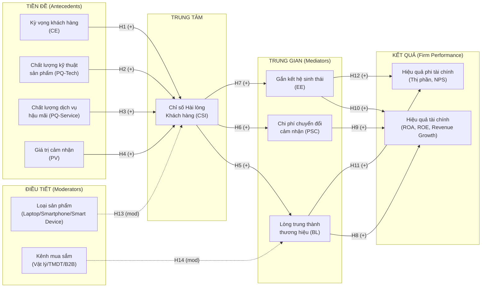

## 5. Phương pháp nghiên cứu sẽ được sử dụng

### 5.1. Thiết kế nghiên cứu tổng thể

Nghiên cứu sử dụng phương pháp hỗn hợp tuần tự theo tiến trình: Khám phá định tính -- Xây dựng thang đo -- Xác nhận định lượng. Giai đoạn định tính nhằm điều chỉnh thang đo ACSI cho phù hợp với đặc thù ngành điện tử và thị trường Việt Nam, đặc biệt là xây dựng thang đo cho hai biến mới: chi phí chuyển đổi cảm nhận và mức độ gắn kết hệ sinh thái.

Giai đoạn định tính tiến hành phỏng vấn sâu bán cấu trúc với ba nhóm: 8-10 chuyên gia thương hiệu và quản lý kênh tại các doanh nghiệp điện tử (Brand Manager, Channel Manager, After-sales Director); 8-10 khách hàng doanh nghiệp B2B (IT Manager, Procurement Officer); và 10-15 người tiêu dùng cá nhân B2C đại diện theo nhóm sản phẩm và độ tuổi. Mục đích là xác định các chiều kích đặc thù của trải nghiệm khách hàng điện tử tại Việt Nam chưa được phản ánh trong thang đo ACSI gốc.

Giai đoạn định lượng sử dụng khảo sát diện rộng kết hợp phân tích dữ liệu tài chính thứ cấp từ báo cáo doanh nghiệp.

### 5.2. Mô hình nghiên cứu đề xuất

Mô hình được xây dựng theo cấu trúc bốn tầng, phản ánh đặc thù của ngành điện tử so với FMCG.

Tầng tiền đề bao gồm bốn cấu trúc: kỳ vọng khách hàng (CE), chất lượng kỹ thuật sản phẩm cảm nhận (PQ-Tech), chất lượng dịch vụ hậu mãi cảm nhận (PQ-Service), và giá trị cảm nhận (PV). Việc phân tách PQ thành hai thành phần là đóng góp cấu trúc chính của đề tài so với mô hình ACSI gốc.

Tầng trung tâm là Chỉ số Hài lòng Khách hàng tổng thể (CSI), được tổng hợp từ bốn biến tiền đề thông qua PLS-SEM.

Tầng trung gian gồm ba biến: lòng trung thành thương hiệu (BL), chi phí chuyển đổi cảm nhận (PSC) và mức độ gắn kết hệ sinh thái (EE). Ba biến này tạo thành ba kênh truyền dẫn tác động từ CSI sang hiệu quả doanh nghiệp với cơ chế tâm lý và hành vi khác nhau.

Tầng kết quả gồm hiệu quả tài chính (FP-Financial: ROA, ROE, tăng trưởng doanh thu) và hiệu quả phi tài chính (FP-NonFinancial: thị phần, Net Promoter Score). Xuyên suốt mô hình là hai biến điều tiết: loại sản phẩm (W1: laptop/smartphone/smart device) và kênh mua sắm (W2: cửa hàng vật lý/thương mại điện tử/kênh B2B doanh nghiệp).

#### Sơ đồ mô hình nghiên cứu

*Hình 1. Mô hình nghiên cứu CSI mở rộng cho ngành điện tử tiêu dùng Việt Nam (tác giả đề xuất, 2026).*

#### Bảng tổng hợp biến và thang đo

| Ký hiệu | Tên biến | Vai trò | Biến quan sát | Nguồn thang đo |
|---------|----------|---------|--------------|----------------|
| CE | Kỳ vọng khách hàng | Tiền đề | 3 biến | Fornell et al. (1996) |
| PQ-Tech | Chất lượng kỹ thuật sản phẩm | Tiền đề | 4 biến | Eshghi et al. (2008); ACSI |
| PQ-Service | Chất lượng dịch vụ hậu mãi | Tiền đề (MỚI) | 4 biến | Zeithaml et al. (1996); Brady & Cronin (2001) |
| PV | Giá trị cảm nhận | Tiền đề | 3 biến | Fornell et al. (1996) |
| CSI | Chỉ số hài lòng tổng thể | Biến trung tâm | 3 biến | Oliver (1980); ACSI |
| BL | Lòng trung thành thương hiệu | Trung gian | 4 biến | Zeithaml et al. (1996) |
| PSC | Chi phí chuyển đổi cảm nhận | Trung gian (MỚI) | 4 biến | Burnham et al. (2003); Klemperer (1987) |
| EE | Mức độ gắn kết hệ sinh thái | Trung gian (MỚI) | 3 biến | Parker et al. (2016); Chae & Kim (2014) |
| FP-Financial | Hiệu quả tài chính | Kết quả | Thứ cấp | FiinPro; Vietstock |
| FP-NonFinancial | Hiệu quả phi tài chính | Kết quả | Thứ cấp + 2 biến khảo sát | Euromonitor; NPS survey |
| W1 | Loại sản phẩm | Điều tiết | Phân loại (3 nhóm) | Phân loại ngành |
| W2 | Kênh mua sắm | Điều tiết | Phân loại (3 nhóm) | GfK Vietnam (2024) |

#### Hệ thống giả thuyết nghiên cứu

Mười bốn giả thuyết được phát triển theo bốn tuyến nhân quả.

Tuyến 1, Hình thành CSI (H1-H4): Bốn biến tiền đề đều có tác động dương đến CSI. Trong bối cảnh điện tử tiêu dùng, chất lượng dịch vụ hậu mãi (H3) được kỳ vọng có trọng số tác động cao hơn chất lượng kỹ thuật sản phẩm (H2) do đặc tính của thị trường mới nổi nơi khoảng cách kỹ thuật giữa các thương hiệu đang thu hẹp nhanh nhưng khoảng cách dịch vụ vẫn còn lớn (Anderson & Mittal, 2000; Eshghi et al., 2008).

Tuyến 2, CSI đến ba biến trung gian (H5-H7): CSI tác động dương đến lòng trung thành thương hiệu (H5), tăng chi phí chuyển đổi cảm nhận (H6) và thúc đẩy đầu tư sâu hơn vào hệ sinh thái thương hiệu (H7). Ba tuyến này không loại trừ nhau mà bổ sung cho nhau: người dùng hài lòng vừa muốn ở lại (H5), vừa khó rời đi (H6), vừa chủ động đầu tư thêm vào hệ sinh thái (H7).

Tuyến 3, Trung gian đến Firm Performance (H8-H12): Lòng trung thành (H8, H11), chi phí chuyển đổi (H9) và gắn kết hệ sinh thái (H10, H12) đều tác động dương đến hiệu quả doanh nghiệp. Chi phí chuyển đổi tác động chủ yếu đến hiệu quả tài chính thông qua cơ chế giảm tỷ lệ rời bỏ và ổn định dòng doanh thu, trong khi gắn kết hệ sinh thái tạo thêm doanh thu từ sản phẩm và dịch vụ bổ sung trong cùng hệ sinh thái.

Tuyến 4, Điều tiết (H13-H14): Loại sản phẩm điều tiết mối quan hệ tiền đề -- CSI (H13), cụ thể là trọng số tương đối của PQ-Tech và PQ-Service thay đổi theo danh mục sản phẩm. Kênh mua sắm điều tiết mối quan hệ CSI -- lòng trung thành (H14), vì hành vi sau mua và cơ hội tiếp xúc dịch vụ khác nhau đáng kể giữa kênh vật lý, thương mại điện tử và B2B.

### 5.3. Thu thập và phân tích dữ liệu

Dữ liệu sơ cấp: bảng khảo sát với cỡ mẫu tối thiểu n = 550 người tiêu dùng B2C và 100 đại diện doanh nghiệp B2B (tổng n >= 650, đủ điều kiện phân tích đa nhóm). Thang đo Likert 7 điểm để tăng độ nhạy phân biệt, phù hợp với đặc tính người dùng điện tử có hiểu biết kỹ thuật cao.

Dữ liệu thứ cấp: báo cáo tài chính kiểm toán từ FiinPro và Vietstock cho FRT, MWG, DGW; dữ liệu thị phần từ GfK Vietnam và IDC; báo cáo NPS từ khảo sát thường niên của các hãng (nếu có thể tiếp cận qua quan hệ ngành).

Phân tích: PLS-SEM (SmartPLS 4) cho mô hình đo lường và cấu trúc; bootstrapping 5.000 lần lặp để kiểm định hiệu ứng trung gian bậc cao (sequential mediation); phân tích đa nhóm (MGA) theo loại sản phẩm và kênh mua sắm; phân tích dữ liệu bảng (FEM/GMM) cho phần dữ liệu tài chính thứ cấp theo thời gian.
