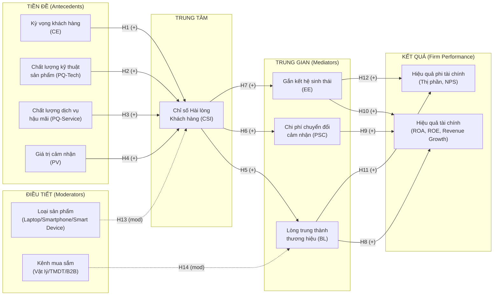

# ĐỀ CƯƠNG NGHIÊN CỨU
**(Dự tuyển Nghiên cứu sinh, Đại học Tôn Đức Thắng)**

---

**Tên đề tài dự kiến:**
Chỉ số Hài lòng Khách hàng (CSI) và Hiệu quả Hoạt động Doanh nghiệp: Bằng chứng từ Ngành Điện tử Tiêu dùng tại Việt Nam

*(Customer Satisfaction Index and Firm Performance: Evidence from the Consumer Electronics Industry in Vietnam)*

---

**Họ và tên thí sinh:** Nguyễn Cường Thịnh
**Ngày sinh:** *(bổ sung)*
**Email:** *(bổ sung)* | **Điện thoại:** *(bổ sung)*
**Địa chỉ:** TP. Hồ Chí Minh

**Lĩnh vực nghiên cứu:** Quản trị Kinh doanh
**Chuyên ngành dự kiến:** Quản trị Kinh doanh
**Cơ sở đào tạo:** Đại học Tôn Đức Thắng (TDTU)

---

## 1. Tính cấp thiết, lý do chọn đề tài, lĩnh vực nghiên cứu

### 1.1. Bối cảnh và tính cấp thiết

Ngành điện tử tiêu dùng toàn cầu đang trải qua giai đoạn cạnh tranh cấu trúc lại sâu sắc: chu kỳ đổi mới sản phẩm rút ngắn, ranh giới giữa phần cứng và dịch vụ ngày càng mờ nhạt, và người tiêu dùng chuyển từ việc mua một thiết bị sang tham gia vào một hệ sinh thái số. Trong bối cảnh đó, sự hài lòng khách hàng không còn là chỉ số hậu kỳ mà trở thành yếu tố tiên đoán trung tâm cho tỷ lệ giữ chân, hành vi tái mua, và giá trị vòng đời khách hàng -- ba cấu phần trực tiếp của hiệu quả tài chính dài hạn.

Tại Việt Nam, thị trường điện tử tiêu dùng đạt quy mô khoảng 11,44 tỷ USD năm 2025 và được dự báo tăng trưởng với tốc độ CAGR 8,2% giai đoạn 2026-2035 (Expert Market Research, 2025). Thị trường điện thoại thông minh riêng lẻ đạt 6,71 tỷ USD năm 2024 với CAGR 9,4% đến 2030 (TechSci Research, 2024). Các thương hiệu quốc tế lớn như Dell, Samsung, Apple, Lenovo, HP đang cạnh tranh gay gắt không chỉ về thông số kỹ thuật mà còn về chất lượng dịch vụ hậu mãi, trải nghiệm mua sắm và mức độ tích hợp hệ sinh thái.

Điểm khác biệt căn bản của ngành điện tử so với hàng tiêu dùng nhanh nằm ở ba đặc điểm: thứ nhất, đây là nhóm sản phẩm mua có mức độ tham gia cao (high-involvement purchase) với chu kỳ thay thế trung bình 2-4 năm, khiến mỗi quyết định mua mang nặng rủi ro tài chính và tâm lý; thứ hai, chi phí chuyển đổi thương hiệu là thực chất và đa chiều, bao gồm chi phí học tập, mất dữ liệu và phụ kiện tích lũy, cùng sự gắn kết với hệ sinh thái phần mềm; thứ ba, dịch vụ kỹ thuật hậu mãi (after-sales technical service) đóng vai trò tiền đề CSI quan trọng không kém chất lượng sản phẩm, đặc biệt đối với khách hàng doanh nghiệp và chuyên gia.

Tuy nhiên, phần lớn nghiên cứu về CSI hiện tại được thực hiện trong bối cảnh dịch vụ hoặc hàng tiêu dùng nhanh, với mô hình ACSI gốc được thiết kế chủ yếu cho thị trường Hoa Kỳ. Việc áp dụng trực tiếp mô hình này cho ngành điện tử tiêu dùng tại thị trường mới nổi như Việt Nam, nơi người tiêu dùng có hành vi mua sắm khác biệt và cơ sở hạ tầng dịch vụ hậu mãi phân tán, là ngoại suy có điều kiện và cần được kiểm định bằng dữ liệu thực địa.

Khoảng cách giữa quy mô đầu tư vào trải nghiệm khách hàng của các hãng điện tử và cơ sở bằng chứng thực nghiệm về tác động của CSI đến hiệu quả doanh nghiệp trong bối cảnh Việt Nam là động lực trực tiếp cho nghiên cứu này.

### 1.2. Lý do chọn đề tài

Về lý luận, ngành điện tử tiêu dùng tạo ra một bối cảnh kiểm định đặc thù cho lý thuyết CSI vì ba lý do. Một là, mức độ tham gia cao của người mua làm cho cơ chế hình thành kỳ vọng và đánh giá chất lượng cảm nhận phức tạp hơn đáng kể so với hàng tiêu dùng nhanh -- người mua laptop hay smartphone tích lũy thông tin kỹ lưỡng trước khi mua và tiếp tục cập nhật đánh giá trong suốt vòng đời sử dụng. Hai là, hiệu ứng hệ sinh thái (ecosystem lock-in) tạo ra một cơ chế điều tiết mới chưa được tích hợp đầy đủ vào các mô hình CSI hiện có. Ba là, dịch vụ hậu mãi là một chiều kích của chất lượng cảm nhận có trọng số đặc biệt trong ngành này, và sự khác biệt về chất lượng dịch vụ hậu mãi giữa các thương hiệu tại Việt Nam là đáng kể.

Về thực tiễn, với vai trò Giám đốc Thương hiệu trong ngành điện tử tiêu dùng tại Việt Nam, nghiên cứu sinh có điều kiện tiếp cận dữ liệu thực tiễn về hành vi khách hàng, chỉ số hài lòng theo điểm bán và sau bán, cùng kết quả kinh doanh của doanh nghiệp. Bằng chứng thực nghiệm từ nghiên cứu này có thể được ứng dụng trực tiếp để tối ưu hóa chiến lược trải nghiệm khách hàng trong một thị trường đang tăng trưởng nhanh và cạnh tranh cao.

Về định vị học thuật, đề tài bổ sung vào dòng nghiên cứu CSI một trường hợp ngành hàng chưa được nghiên cứu đầy đủ tại thị trường Việt Nam, đồng thời kiểm định vai trò của hai biến mới: chi phí chuyển đổi cảm nhận và mức độ gắn kết hệ sinh thái trong chuỗi CSI -- hiệu quả doanh nghiệp.

### 1.3. Lĩnh vực nghiên cứu

Đề tài thuộc lĩnh vực Quản trị Kinh doanh, giao thoa với Marketing chiến lược, Quản trị Thương hiệu và Hành vi người tiêu dùng công nghệ. Đây là giao điểm của ba dòng nghiên cứu: đo lường và quản lý trải nghiệm khách hàng trong ngành công nghệ, phân tích hiệu quả hoạt động doanh nghiệp, và nghiên cứu hành vi chuyển đổi thương hiệu trong thị trường điện tử.

---

## 2. Tình hình nghiên cứu

### 2.1. Lý thuyết nền tảng

Bốn lý thuyết tạo thành khung lý thuyết tích hợp, trong đó hai lý thuyết đầu là nền tảng chung với dòng nghiên cứu CSI, còn hai lý thuyết sau đặc thù cho bối cảnh điện tử tiêu dùng.

Lý thuyết xác nhận kỳ vọng của Oliver (1980) giải thích cơ chế hình thành sự hài lòng qua so sánh giữa cảm nhận thực tế và kỳ vọng trước mua. Trong ngành điện tử, cơ chế này phức tạp hơn do kỳ vọng được hình thành qua quá trình tìm kiếm thông tin kỹ lưỡng và tiếp tục cập nhật trong suốt vòng đời sử dụng thiết bị -- không chỉ tại thời điểm mua như trong FMCG.

Lý thuyết nguồn lực của Barney (1991) cung cấp cơ sở lý luận cho việc coi năng lực tạo ra trải nghiệm khách hàng vượt trội là nguồn lực chiến lược khó sao chép. Trong ngành điện tử, năng lực này thể hiện cụ thể qua chất lượng hệ sinh thái phần mềm, mạng lưới dịch vụ hậu mãi và khả năng cập nhật sản phẩm liên tục -- những yếu tố mà đối thủ không thể bắt chước nhanh chóng.

Lý thuyết chi phí chuyển đổi của Klemperer (1987) và Burnham et al. (2003) lý giải tại sao lòng trung thành trong ngành điện tử có tính bền vững khác biệt so với FMCG. Chi phí chuyển đổi bao gồm ba thành phần: chi phí thủ tục (mất dữ liệu, học thao tác mới), chi phí tài chính (mất giá trị phụ kiện, chi phí mua mới) và chi phí tâm lý (rủi ro không chắc chắn với sản phẩm mới). Khi CSI cao, người dùng không chỉ hài lòng mà còn không có lý do đủ mạnh để chịu đựng các chi phí chuyển đổi này -- tạo ra barrier-to-exit thực chất.

Lý thuyết hệ sinh thái kỹ thuật số của Parker, Van Alstyne & Choudary (2016) bổ sung chiều kích mới: trong thị trường điện tử hiện đại, giá trị không đến từ sản phẩm đơn lẻ mà từ toàn bộ hệ sinh thái mà thiết bị là cổng vào. Mức độ gắn kết hệ sinh thái (ecosystem engagement) -- đo bằng số lượng dịch vụ và thiết bị đồng bộ mà người dùng sử dụng trong một hệ sinh thái thương hiệu -- là biến trung gian tiềm năng quan trọng chưa được tích hợp vào mô hình CSI truyền thống.

### 2.2. Mô hình CSI trong ngành điện tử: đặc thù và mở rộng

Mô hình ACSI gốc (Fornell et al., 1996) xác định ba tiền đề của CSI là kỳ vọng khách hàng, chất lượng cảm nhận và giá trị cảm nhận. Trong bối cảnh điện tử tiêu dùng, cấu trúc này cần được mở rộng theo hai hướng.

Hướng thứ nhất là phân tách chất lượng cảm nhận thành hai thành phần phân biệt: chất lượng kỹ thuật sản phẩm (hiệu năng phần cứng, độ bền, tính năng) và chất lượng dịch vụ hậu mãi (tốc độ xử lý bảo hành, năng lực kỹ thuật viên, tính sẵn có của linh kiện). Nghiên cứu của Eshghi, Roy & Ganguli (2008) trên thị trường điện tử di động xác nhận rằng chất lượng dịch vụ hậu mãi có trọng số tác động đến CSI cao hơn đáng kể so với chất lượng sản phẩm thuần túy trong bối cảnh thị trường mới nổi -- ngược lại với kết quả từ thị trường phát triển.

Hướng thứ hai là bổ sung hai biến trung gian mới giữa CSI và hiệu quả doanh nghiệp: chi phí chuyển đổi cảm nhận (perceived switching cost) và mức độ gắn kết hệ sinh thái. Lập luận cơ chế là: CSI cao làm giảm động lực chuyển đổi của người dùng và tăng mức độ đầu tư vào hệ sinh thái thương hiệu; hai yếu tố này cùng tạo ra dòng doanh thu bền vững và ổn định hơn, từ đó cải thiện hiệu quả tài chính theo cơ chế mà Gruca & Rego (2005) mô tả là "giảm biến động dòng tiền."

Việc phân biệt thao tác hóa giữa chi phí chuyển đổi cảm nhận và lòng trung thành thương hiệu là cần thiết: lòng trung thành phản ánh thái độ tích cực chủ động (muốn ở lại), trong khi chi phí chuyển đổi cảm nhận phản ánh rào cản thoát thụ động (khó rời đi). Cả hai đều tác động đến hành vi giữ chân nhưng thông qua cơ chế tâm lý và hàm ý quản trị khác nhau.

### 2.3. Bằng chứng thực nghiệm từ ngành điện tử

Dữ liệu ACSI 2026 ghi nhận Samsung đạt điểm hài lòng 81 và Apple đạt 80 trong danh mục điện thoại di động, cho thấy sự hội tụ của hai thương hiệu dẫn đầu ở mức cao và cạnh tranh ngày càng chuyển sang chiều kích dịch vụ và hệ sinh thái thay vì thông số kỹ thuật thuần túy. Đây là xu hướng có liên quan trực tiếp đến thị trường Việt Nam khi người tiêu dùng đô thị ngày càng tinh tế hơn trong đánh giá trải nghiệm.

Anderson & Mittal (2000) phát hiện mối quan hệ phi tuyến giữa cải thiện chất lượng và tăng mức độ hài lòng trong ngành sản phẩm kỹ thuật cao: ở ngưỡng chất lượng thấp, cải thiện kỹ thuật tạo ra tăng trưởng CSI mạnh; nhưng khi đã đạt ngưỡng chất lượng cao, người tiêu dùng chuyển sự chú ý sang chất lượng dịch vụ và trải nghiệm hậu mãi. Phát hiện này hàm ý rằng đối với thị trường Việt Nam, khoảng cách giữa các thương hiệu trong nhận thức chất lượng kỹ thuật đang thu hẹp, trong khi khoảng cách về dịch vụ hậu mãi vẫn còn rộng và là yếu tố phân biệt CSI quan trọng hơn.

Trong lĩnh vực thiết bị thông minh và IoT, nghiên cứu về CSI cho smart services của Chae & Kim (2014) xác nhận rằng giá trị cảm nhận và mức độ hài lòng đóng vai trò trung gian then chốt giữa chất lượng dịch vụ số và lòng trung thành -- cơ chế này ngày càng quan trọng khi ranh giới giữa phần cứng và dịch vụ số trong ngành điện tử tiêu dùng ngày càng mờ nhạt.

Tại Việt Nam, phần lớn nghiên cứu về hành vi người tiêu dùng điện tử tập trung vào ý định mua và các yếu tố ảnh hưởng đến lựa chọn thương hiệu, nhưng chưa xây dựng được mô hình CSI có cấu trúc đầy đủ kết nối với dữ liệu hiệu quả tài chính thực tế của doanh nghiệp. Đây là khoảng trống phương pháp luận và bối cảnh cần được lấp đầy.

### 2.4. Khoảng trống nghiên cứu

Ba khoảng trống được xác định rõ và tạo cơ sở định vị cho đề tài này.

Khoảng trống 1 về cấu trúc đo lường: Mô hình CSI hiện tại chưa phân tách chất lượng cảm nhận thành chất lượng kỹ thuật sản phẩm và chất lượng dịch vụ hậu mãi trong bối cảnh ngành điện tử. Sự phân tách này có ý nghĩa thực tiễn quan trọng vì chiến lược cải thiện CSI qua hai kênh này đòi hỏi nguồn lực và năng lực tổ chức hoàn toàn khác nhau.

Khoảng trống 2 về cơ chế truyền dẫn: Vai trò trung gian của chi phí chuyển đổi cảm nhận và mức độ gắn kết hệ sinh thái trong chuỗi CSI -- hiệu quả doanh nghiệp chưa được kiểm định trong bối cảnh điện tử tiêu dùng tại thị trường mới nổi. Hai biến này là đặc thù của ngành và không có trong mô hình CSI cho FMCG.

Khoảng trống 3 về bối cảnh: Chưa có nghiên cứu kết nối dữ liệu CSI khảo sát người tiêu dùng với dữ liệu tài chính thực tế của doanh nghiệp điện tử tại Việt Nam, đặc biệt trong bối cảnh thị trường đang chuyển dịch mạnh sang thương mại điện tử và dịch vụ số đi kèm phần cứng.

---

## 3. Mục đích nghiên cứu

### 3.1. Mục đích tổng quát

Nghiên cứu nhằm xây dựng và kiểm định mô hình CSI mở rộng phù hợp với đặc thù ngành điện tử tiêu dùng, phân tích tác động của CSI đến hiệu quả hoạt động doanh nghiệp thông qua các biến trung gian đặc thù ngành, và kiểm định vai trò điều tiết của loại sản phẩm cùng kênh mua sắm trong bối cảnh thị trường điện tử Việt Nam.

### 3.2. Mục tiêu cụ thể

Mục tiêu 1 là xây dựng và kiểm định cấu trúc đo lường CSI mở rộng cho ngành điện tử tiêu dùng, trong đó phân tách chất lượng cảm nhận thành hai thành phần phân biệt: chất lượng kỹ thuật sản phẩm và chất lượng dịch vụ hậu mãi.

Mục tiêu 2 là đánh giá mức độ và cấu trúc hài lòng của người tiêu dùng điện tử tại Việt Nam theo từng nhóm sản phẩm (laptop, smartphone, thiết bị thông minh) và theo từng thương hiệu đại diện.

Mục tiêu 3 là phân tích tác động trực tiếp và gián tiếp của CSI đến hiệu quả tài chính (ROA, ROE, tốc độ tăng trưởng doanh thu) và phi tài chính (thị phần, Net Promoter Score) của doanh nghiệp điện tử.

Mục tiêu 4 là kiểm định vai trò trung gian của chi phí chuyển đổi cảm nhận, lòng trung thành thương hiệu và mức độ gắn kết hệ sinh thái trong chuỗi nhân quả CSI -- hiệu quả doanh nghiệp.

Mục tiêu 5 là kiểm định vai trò điều tiết của loại sản phẩm và kênh mua sắm (truyền thống, thương mại điện tử, kênh doanh nghiệp B2B) trong mối quan hệ trên.

Mục tiêu 6 là đề xuất hàm ý quản trị thương hiệu và chiến lược trải nghiệm khách hàng cho các doanh nghiệp điện tử hoạt động tại Việt Nam.

### 3.3. Câu hỏi nghiên cứu

Q1: Cấu trúc đo lường CSI trong ngành điện tử tiêu dùng tại Việt Nam có khác biệt so với mô hình ACSI gốc như thế nào, cụ thể là vai trò tương đối của chất lượng kỹ thuật sản phẩm và chất lượng dịch vụ hậu mãi?

Q2: CSI tác động như thế nào đến hiệu quả tài chính và phi tài chính của doanh nghiệp điện tử niêm yết tại Việt Nam?

Q3: Chi phí chuyển đổi cảm nhận, lòng trung thành thương hiệu và mức độ gắn kết hệ sinh thái có vai trò trung gian như thế nào trong chuỗi CSI -- hiệu quả doanh nghiệp?

Q4: Loại sản phẩm (laptop vs. smartphone vs. thiết bị thông minh) và kênh mua sắm có điều tiết mối quan hệ CSI -- hiệu quả doanh nghiệp như thế nào?

Q5: Hàm ý quản trị nào phù hợp cho các doanh nghiệp điện tử nhằm tối ưu hóa CSI trong điều kiện nguồn lực có giới hạn, khi phải lựa chọn ưu tiên giữa đầu tư vào chất lượng sản phẩm và nâng cấp hệ thống dịch vụ hậu mãi?

---

## 4. Đối tượng và phạm vi dự định nghiên cứu

### 4.1. Đối tượng nghiên cứu

Mối quan hệ giữa Chỉ số Hài lòng Khách hàng (CSI) và Hiệu quả Hoạt động Doanh nghiệp trong ngành điện tử tiêu dùng, với sự tham gia của ba biến trung gian -- chi phí chuyển đổi cảm nhận, lòng trung thành thương hiệu, mức độ gắn kết hệ sinh thái -- và hai biến điều tiết: loại sản phẩm và kênh mua sắm.

### 4.2. Khách thể nghiên cứu

Phía cầu: Người tiêu dùng cá nhân từ 18 tuổi trở lên đang sở hữu và sử dụng ít nhất một sản phẩm điện tử thuộc danh mục laptop, smartphone hoặc thiết bị thông minh (smart TV, tablet, smartwatch) tại Việt Nam; và khách hàng doanh nghiệp (B2B) -- bộ phận IT/mua sắm tại các doanh nghiệp vừa và lớn có sử dụng thiết bị điện tử số lượng từ 20 máy trở lên.

Phía cung: Các doanh nghiệp điện tử tiêu dùng có thị phần đáng kể tại Việt Nam, bao gồm doanh nghiệp niêm yết (để có thể thu thập dữ liệu tài chính) và đại diện thương hiệu quốc tế có báo cáo tài chính riêng cho thị trường Việt Nam hoặc khu vực. Danh sách dự kiến: FPT Retail (FRT), Mobile World Group (MWG), Digiworld (DGW), cùng các công ty đại lý chính thức của Dell, HP, Lenovo, Apple, Samsung tại Việt Nam.

### 4.3. Phạm vi nghiên cứu

Phạm vi không gian: Việt Nam, tập trung tại TP. Hồ Chí Minh, Hà Nội và Đà Nẵng cho dữ liệu khảo sát người tiêu dùng; phạm vi toàn quốc cho dữ liệu tài chính doanh nghiệp.

Phạm vi sản phẩm: Ba nhóm sản phẩm cốt lõi của ngành điện tử tiêu dùng -- laptop và máy tính xách tay, điện thoại thông minh, và thiết bị thông minh gia đình (smart TV, tablet, smartwatch). Không bao gồm thiết bị điện gia dụng truyền thống (tủ lạnh, máy giặt) và linh kiện điện tử do đặc điểm mua sắm và cơ chế hài lòng khác biệt.

Phạm vi thời gian: Dữ liệu sơ cấp khảo sát người tiêu dùng thu thập trong năm thứ hai của chương trình đào tạo (dự kiến 2027). Dữ liệu thứ cấp tài chính doanh nghiệp trong giai đoạn 2020-2026, bao gồm giai đoạn dịch chuyển mạnh sang thương mại điện tử và làm việc từ xa hậu COVID-19.

Phạm vi phân tích: Nghiên cứu tiếp cận cả hai phân khúc B2C và B2B, nhằm so sánh cơ chế hình thành CSI và tác động đến hiệu quả doanh nghiệp giữa hai phân khúc -- một điểm phân biệt quan trọng trong ngành điện tử mà phần lớn nghiên cứu hiện tại bỏ qua.

---

## 5. Phương pháp nghiên cứu sẽ được sử dụng

### 5.1. Thiết kế nghiên cứu tổng thể

Nghiên cứu sử dụng phương pháp hỗn hợp tuần tự theo tiến trình: Khám phá định tính -- Xây dựng thang đo -- Xác nhận định lượng. Giai đoạn định tính nhằm điều chỉnh thang đo ACSI cho phù hợp với đặc thù ngành điện tử và thị trường Việt Nam, đặc biệt là xây dựng thang đo cho hai biến mới: chi phí chuyển đổi cảm nhận và mức độ gắn kết hệ sinh thái.

Giai đoạn định tính tiến hành phỏng vấn sâu bán cấu trúc với ba nhóm: 8-10 chuyên gia thương hiệu và quản lý kênh tại các doanh nghiệp điện tử (Brand Manager, Channel Manager, After-sales Director); 8-10 khách hàng doanh nghiệp B2B (IT Manager, Procurement Officer); và 10-15 người tiêu dùng cá nhân B2C đại diện theo nhóm sản phẩm và độ tuổi. Mục đích là xác định các chiều kích đặc thù của trải nghiệm khách hàng điện tử tại Việt Nam chưa được phản ánh trong thang đo ACSI gốc.

Giai đoạn định lượng sử dụng khảo sát diện rộng kết hợp phân tích dữ liệu tài chính thứ cấp từ báo cáo doanh nghiệp.

### 5.2. Mô hình nghiên cứu đề xuất

Mô hình được xây dựng theo cấu trúc bốn tầng, phản ánh đặc thù của ngành điện tử so với FMCG.

Tầng tiền đề bao gồm bốn cấu trúc: kỳ vọng khách hàng (CE), chất lượng kỹ thuật sản phẩm cảm nhận (PQ-Tech), chất lượng dịch vụ hậu mãi cảm nhận (PQ-Service), và giá trị cảm nhận (PV). Việc phân tách PQ thành hai thành phần là đóng góp cấu trúc chính của đề tài so với mô hình ACSI gốc.

Tầng trung tâm là Chỉ số Hài lòng Khách hàng tổng thể (CSI), được tổng hợp từ bốn biến tiền đề thông qua PLS-SEM.

Tầng trung gian gồm ba biến: lòng trung thành thương hiệu (BL), chi phí chuyển đổi cảm nhận (PSC) và mức độ gắn kết hệ sinh thái (EE). Ba biến này tạo thành ba kênh truyền dẫn tác động từ CSI sang hiệu quả doanh nghiệp với cơ chế tâm lý và hành vi khác nhau.

Tầng kết quả gồm hiệu quả tài chính (FP-Financial: ROA, ROE, tăng trưởng doanh thu) và hiệu quả phi tài chính (FP-NonFinancial: thị phần, Net Promoter Score). Xuyên suốt mô hình là hai biến điều tiết: loại sản phẩm (W1: laptop/smartphone/smart device) và kênh mua sắm (W2: cửa hàng vật lý/thương mại điện tử/kênh B2B doanh nghiệp).

#### Sơ đồ mô hình nghiên cứu

*Hình 1. Mô hình nghiên cứu CSI mở rộng cho ngành điện tử tiêu dùng Việt Nam (tác giả đề xuất, 2026).*

#### Bảng tổng hợp biến và thang đo

| Ký hiệu | Tên biến | Vai trò | Biến quan sát | Nguồn thang đo |
|---------|----------|---------|--------------|----------------|
| CE | Kỳ vọng khách hàng | Tiền đề | 3 biến | Fornell et al. (1996) |
| PQ-Tech | Chất lượng kỹ thuật sản phẩm | Tiền đề | 4 biến | Eshghi et al. (2008); ACSI |
| PQ-Service | Chất lượng dịch vụ hậu mãi | Tiền đề (MỚI) | 4 biến | Zeithaml et al. (1996); Brady & Cronin (2001) |
| PV | Giá trị cảm nhận | Tiền đề | 3 biến | Fornell et al. (1996) |
| CSI | Chỉ số hài lòng tổng thể | Biến trung tâm | 3 biến | Oliver (1980); ACSI |
| BL | Lòng trung thành thương hiệu | Trung gian | 4 biến | Zeithaml et al. (1996) |
| PSC | Chi phí chuyển đổi cảm nhận | Trung gian (MỚI) | 4 biến | Burnham et al. (2003); Klemperer (1987) |
| EE | Mức độ gắn kết hệ sinh thái | Trung gian (MỚI) | 3 biến | Parker et al. (2016); Chae & Kim (2014) |
| FP-Financial | Hiệu quả tài chính | Kết quả | Thứ cấp | FiinPro; Vietstock |
| FP-NonFinancial | Hiệu quả phi tài chính | Kết quả | Thứ cấp + 2 biến khảo sát | Euromonitor; NPS survey |
| W1 | Loại sản phẩm | Điều tiết | Phân loại (3 nhóm) | Phân loại ngành |
| W2 | Kênh mua sắm | Điều tiết | Phân loại (3 nhóm) | GfK Vietnam (2024) |

#### Hệ thống giả thuyết nghiên cứu

Mười bốn giả thuyết được phát triển theo bốn tuyến nhân quả.

Tuyến 1, Hình thành CSI (H1-H4): Bốn biến tiền đề đều có tác động dương đến CSI. Trong bối cảnh điện tử tiêu dùng, chất lượng dịch vụ hậu mãi (H3) được kỳ vọng có trọng số tác động cao hơn chất lượng kỹ thuật sản phẩm (H2) do đặc tính của thị trường mới nổi nơi khoảng cách kỹ thuật giữa các thương hiệu đang thu hẹp nhanh nhưng khoảng cách dịch vụ vẫn còn lớn (Anderson & Mittal, 2000; Eshghi et al., 2008).

Tuyến 2, CSI đến ba biến trung gian (H5-H7): CSI tác động dương đến lòng trung thành thương hiệu (H5), tăng chi phí chuyển đổi cảm nhận (H6) và thúc đẩy đầu tư sâu hơn vào hệ sinh thái thương hiệu (H7). Ba tuyến này không loại trừ nhau mà bổ sung cho nhau: người dùng hài lòng vừa muốn ở lại (H5), vừa khó rời đi (H6), vừa chủ động đầu tư thêm vào hệ sinh thái (H7).

Tuyến 3, Trung gian đến Firm Performance (H8-H12): Lòng trung thành (H8, H11), chi phí chuyển đổi (H9) và gắn kết hệ sinh thái (H10, H12) đều tác động dương đến hiệu quả doanh nghiệp. Chi phí chuyển đổi tác động chủ yếu đến hiệu quả tài chính thông qua cơ chế giảm tỷ lệ rời bỏ và ổn định dòng doanh thu, trong khi gắn kết hệ sinh thái tạo thêm doanh thu từ sản phẩm và dịch vụ bổ sung trong cùng hệ sinh thái.

Tuyến 4, Điều tiết (H13-H14): Loại sản phẩm điều tiết mối quan hệ tiền đề -- CSI (H13), cụ thể là trọng số tương đối của PQ-Tech và PQ-Service thay đổi theo danh mục sản phẩm. Kênh mua sắm điều tiết mối quan hệ CSI -- lòng trung thành (H14), vì hành vi sau mua và cơ hội tiếp xúc dịch vụ khác nhau đáng kể giữa kênh vật lý, thương mại điện tử và B2B.

### 5.3. Thu thập và phân tích dữ liệu

Dữ liệu sơ cấp: bảng khảo sát với cỡ mẫu tối thiểu n = 550 người tiêu dùng B2C và 100 đại diện doanh nghiệp B2B (tổng n >= 650, đủ điều kiện phân tích đa nhóm). Thang đo Likert 7 điểm để tăng độ nhạy phân biệt, phù hợp với đặc tính người dùng điện tử có hiểu biết kỹ thuật cao.

Dữ liệu thứ cấp: báo cáo tài chính kiểm toán từ FiinPro và Vietstock cho FRT, MWG, DGW; dữ liệu thị phần từ GfK Vietnam và IDC; báo cáo NPS từ khảo sát thường niên của các hãng (nếu có thể tiếp cận qua quan hệ ngành).

Phân tích: PLS-SEM (SmartPLS 4) cho mô hình đo lường và cấu trúc; bootstrapping 5.000 lần lặp để kiểm định hiệu ứng trung gian bậc cao (sequential mediation); phân tích đa nhóm (MGA) theo loại sản phẩm và kênh mua sắm; phân tích dữ liệu bảng (FEM/GMM) cho phần dữ liệu tài chính thứ cấp theo thời gian.

---

## 6. Kế hoạch nghiên cứu (cụ thể mỗi 06 tháng)

Thời gian đào tạo dự kiến: 3 năm (36 tháng)

**Giai đoạn 1 (Tháng 1-6): Xây dựng nền tảng lý thuyết và đề cương chi tiết**
Hoàn thành các học phần bắt buộc của chương trình tiến sĩ tại TDTU. Tổng quan tài liệu chuyên sâu về CSI, ngành điện tử tiêu dùng, chi phí chuyển đổi và lý thuyết hệ sinh thái số (tối thiểu 80 tài liệu). Xây dựng khung lý thuyết mở rộng và hệ thống giả thuyết H1-H14. Viết và bảo vệ đề cương nghiên cứu chi tiết trước Hội đồng Cơ sở tại TDTU.

**Giai đoạn 2 (Tháng 7-12): Nghiên cứu định tính và phát triển thang đo**
Phỏng vấn sâu với 26-35 đối tượng (chuyên gia ngành, khách hàng B2B và B2C). Phân tích nội dung bằng NVivo để xác định chiều kích đặc thù của PQ-Service, PSC và EE trong ngành điện tử Việt Nam. Xây dựng và kiểm định sơ bộ thang đo 7 điểm (pilot study n = 60-80). Đánh giá Cronbach's Alpha và EFA. Nộp bài báo số 1 cho hội thảo khoa học quốc gia hoặc tạp chí trong nước.

**Giai đoạn 3 (Tháng 13-18): Thu thập và phân tích dữ liệu chính**
Khảo sát diện rộng (n >= 650 bao gồm B2C và B2B). Thu thập dữ liệu tài chính thứ cấp của FRT, MWG, DGW và các đại lý lớn (2020-2025). Phân tích PLS-SEM đánh giá mô hình đo lường (reliability, validity, AVE, HTMT) và mô hình cấu trúc (path coefficients, R², f², PLSpredict). Báo cáo chuyên đề tiến sĩ số 1. Nộp bài báo quốc tế Scopus/ISI số 1 về cấu trúc đo lường CSI ngành điện tử.

**Giai đoạn 4 (Tháng 19-24): Phân tích nâng cao và công bố quốc tế**
Kiểm định trung gian bậc cao (sequential mediation: CSI -- PSC/EE -- Firm Performance) bằng bootstrapping. Phân tích đa nhóm (MGA) theo loại sản phẩm và kênh mua sắm. Phân tích dữ liệu bảng kết hợp CSI khảo sát và tài chính thứ cấp. Báo cáo chuyên đề tiến sĩ số 2. Nộp bài báo quốc tế Scopus/ISI số 2 về cơ chế truyền dẫn và vai trò điều tiết.

**Giai đoạn 5 (Tháng 25-30): Hoàn thiện công bố và bắt đầu viết luận án**
Phản hồi bài báo theo phản biện. Viết bản thảo luận án các chương 1-3. Báo cáo chuyên đề tiến sĩ số 3. Trình bày kết quả tại hội thảo quốc tế (ưu tiên ICSB, AMS hoặc hội thảo chuyên ngành tiêu dùng Đông Nam Á). Nộp thêm bài báo số 3 nếu có điều kiện.

**Giai đoạn 6 (Tháng 31-36): Hoàn thiện và bảo vệ luận án**
Hoàn thiện toàn bộ bản thảo luận án theo góp ý người hướng dẫn. Bảo vệ cấp Cơ sở. Chỉnh sửa theo Hội đồng. Bảo vệ cấp Trường và hoàn tất thủ tục cấp bằng tiến sĩ.

---

## 7. Mục tiêu và mong muốn đạt được khi đăng ký tuyển sinh đào tạo trình độ tiến sĩ

Quyết định đăng ký chương trình tiến sĩ tại Đại học Tôn Đức Thắng xuất phát từ bốn mục tiêu có liên kết chặt chẽ với nhau.

Về năng lực học thuật, nghiên cứu sinh mong muốn xây dựng năng lực nghiên cứu định lượng ở trình độ quốc tế, cụ thể là khả năng thiết kế và kiểm định các mô hình cấu trúc phức tạp (PLS-SEM, phân tích đa nhóm, trung gian bậc cao) đủ tiêu chuẩn công bố trong các tạp chí ISI/Scopus chuyên ngành quản trị và marketing. Mục tiêu cụ thể là ít nhất 02 bài báo quốc tế trong thời gian đào tạo.

Về đóng góp thực tiễn, nghiên cứu sinh có vị trí thực tiễn trực tiếp trong ngành điện tử tiêu dùng và nhận thấy khoảng cách rõ ràng giữa những quyết định đầu tư vào trải nghiệm khách hàng đang được đưa ra hằng ngày và cơ sở bằng chứng thực nghiệm hỗ trợ các quyết định đó. Kết quả nghiên cứu dự kiến chuyển hóa thành bộ công cụ đo lường và theo dõi CSI có thể ứng dụng thực tế trong doanh nghiệp, giúp các nhà quản lý thương hiệu có cơ sở định lượng để ưu tiên đầu tư giữa nâng cấp sản phẩm và cải thiện dịch vụ hậu mãi.

Về định hướng nghề nghiệp, bằng tiến sĩ là nền tảng để kết hợp đồng thời giữa hoạt động quản lý ngành và giảng dạy tại bậc sau đại học trong lĩnh vực quản trị thương hiệu và marketing kỹ thuật số. Đây là mô hình practitioner-researcher có giá trị cao trong bối cảnh đào tạo MBA và thạc sĩ quản trị tại Việt Nam đang cần đội ngũ giảng viên có kinh nghiệm thực tiễn sâu kết hợp với nền tảng nghiên cứu vững.

Về đóng góp phát triển ngành, thị trường điện tử tiêu dùng Việt Nam đang ở giai đoạn chuyển đổi quan trọng: từ cạnh tranh về giá và thông số kỹ thuật sang cạnh tranh về trải nghiệm và hệ sinh thái. Bằng chứng thực nghiệm từ nghiên cứu này sẽ cung cấp dữ liệu định lượng để hỗ trợ quá trình chuyển đổi này, thay vì chỉ dựa trên quan sát kinh nghiệm và chuẩn mực ngành quốc tế không được kiểm định trong bối cảnh địa phương.

---

## 8. Lý do lựa chọn cơ sở đào tạo (Đại học Tôn Đức Thắng)

Đại học Tôn Đức Thắng là lựa chọn phù hợp nhất cho hướng nghiên cứu này vì năm lý do cụ thể.

Uy tín quốc tế được xác nhận: TDTU liên tục có mặt trong Times Higher Education World University Rankings và QS Asia Rankings, là một trong số ít trường đại học Việt Nam có bằng tiến sĩ được công nhận rộng rãi trong cộng đồng học thuật khu vực và quốc tế. Đây là yếu tố quan trọng cho một nghiên cứu sinh có định hướng kết hợp học thuật với thực tiễn nghề nghiệp.

Văn hóa xuất bản mạnh: TDTU có chính sách hỗ trợ tài chính rõ ràng cho nghiên cứu sinh công bố bài báo ISI/Scopus, cùng hạ tầng thư viện truy cập đầy đủ Web of Science, Scopus, ScienceDirect và Emerald. Điều này thiết yếu cho một đề tài yêu cầu tổng quan tài liệu quốc tế chuyên sâu về CSI, hành vi tiêu dùng điện tử và mô hình phương trình cấu trúc.

Chuyên môn phù hợp: Khoa Quản trị Kinh doanh TDTU có đội ngũ giảng viên với công bố quốc tế trong lĩnh vực marketing, hành vi người tiêu dùng và phương pháp nghiên cứu định lượng, đáp ứng yêu cầu hướng dẫn cho đề tài này.

Vị trí địa lý và kết nối ngành: TP. Hồ Chí Minh là trung tâm thương mại và công nghệ lớn nhất Việt Nam, nơi tập trung văn phòng đại diện và đại lý chính thức của hầu hết các hãng điện tử lớn. Điều này tạo điều kiện thuận lợi để tiếp cận dữ liệu doanh nghiệp, phỏng vấn chuyên gia ngành và thu thập dữ liệu khảo sát người tiêu dùng trên thị trường đại diện nhất cả nước.

Tính linh hoạt với nghiên cứu sinh đang đi làm: TDTU có kinh nghiệm đào tạo nghiên cứu sinh kết hợp công tác thực tiễn với nghiên cứu, là lợi thế quan trọng với một Giám đốc Thương hiệu cần duy trì song song vai trò chuyên môn trong ngành trong suốt quá trình đào tạo.

---

## 9. Kinh nghiệm về nghiên cứu, thực tế, hoạt động xã hội và ngoại khóa

**Kinh nghiệm nghiên cứu:**
Đã hoàn thành luận văn Thạc sĩ Quản trị Kinh doanh với đề tài liên quan đến *(tên đề tài -- đề nghị bổ sung)*. Quá trình thực hiện luận văn đã tạo nền tảng về phương pháp nghiên cứu định lượng và sử dụng SPSS để phân tích dữ liệu khảo sát. Có kinh nghiệm đọc và phân tích tài liệu học thuật quốc tế trong lĩnh vực marketing và quản trị thương hiệu. Hiện đang nâng cao kỹ năng phân tích PLS-SEM với SmartPLS để chuẩn bị cho nghiên cứu tiến sĩ.

**Kinh nghiệm thực tiễn:**
Với vai trò Giám đốc Thương hiệu trong ngành điện tử tiêu dùng tại Việt Nam, nghiên cứu sinh tích lũy được kinh nghiệm trực tiếp trong quản lý thương hiệu B2B và B2C, xây dựng và triển khai chiến lược trải nghiệm khách hàng, phối hợp với hệ thống kênh phân phối đa cấp và giám sát các chỉ số hiệu quả thương hiệu theo thời gian thực. Kinh nghiệm làm việc trực tiếp với dữ liệu hài lòng khách hàng, báo cáo NPS và các chỉ số kênh phân phối tạo ra lợi thế đặc biệt trong việc thiết kế và thực hiện nghiên cứu này, đặc biệt là trong việc tiếp cận nguồn dữ liệu thực tiễn.

**Hoạt động xã hội và ngoại khóa:**
Tham gia các diễn đàn chuyên môn về marketing và thương hiệu trong ngành công nghệ thông tin và điện tử tại Việt Nam *(đề nghị bổ sung chi tiết)*. Thành viên các mạng lưới chuyên gia ngành công nghệ và quản trị *(đề nghị bổ sung)*.

---

## 10. Dự kiến việc làm và các nghiên cứu tiếp theo sau khi tốt nghiệp

**Dự kiến việc làm:**
Sau khi hoàn thành chương trình tiến sĩ, nghiên cứu sinh dự kiến phát triển theo hai hướng song song. Hướng thứ nhất là tiếp tục đóng vai trò lãnh đạo chiến lược thương hiệu trong ngành điện tử tiêu dùng, với nền tảng nghiên cứu giúp đưa ra các quyết định dựa trên bằng chứng định lượng thay vì kinh nghiệm đơn thuần. Hướng thứ hai là tham gia giảng dạy các học phần Quản trị Thương hiệu, Marketing Chiến lược và Hành vi Người tiêu dùng tại các chương trình MBA và thạc sĩ quản trị, đóng vai trò practitioner-researcher có giá trị đặc thù.

**Các hướng nghiên cứu tiếp theo:**

Hướng 1 -- CSI trong bối cảnh AI và cá nhân hóa: Khi các hãng điện tử tích hợp ngày càng nhiều dịch vụ AI vào thiết bị (AI assistant, predictive maintenance, personalized UX), cơ chế hình thành sự hài lòng sẽ thay đổi căn bản. Nghiên cứu tiếp theo có thể khám phá vai trò của trải nghiệm AI trong cấu trúc CSI và tác động đến hành vi giữ chân khách hàng trong giai đoạn AI-native devices.

Hướng 2 -- So sánh liên thị trường ASEAN: Mở rộng nghiên cứu sang Thái Lan, Indonesia và Philippines để so sánh cấu trúc CSI và cơ chế truyền dẫn sang hiệu quả doanh nghiệp giữa các thị trường có mức độ phát triển và đặc điểm văn hóa tiêu dùng công nghệ khác nhau.

Hướng 3 -- Tác động của hệ sinh thái số đến doanh thu dài hạn: Nghiên cứu định lượng sâu hơn về mối quan hệ giữa mức độ gắn kết hệ sinh thái và Customer Lifetime Value, tập trung vào cơ chế upsell và cross-sell trong hệ sinh thái thương hiệu điện tử.

---

## 11. Đề xuất người hướng dẫn

**Người hướng dẫn đề xuất 1:**
PGS. TS. *(Họ tên, Khoa Quản trị Kinh doanh, TDTU)*
Chuyên môn phù hợp: Marketing chiến lược, quản trị thương hiệu, hành vi người tiêu dùng số, có công bố quốc tế ISI/Scopus trong lĩnh vực này.

**Người hướng dẫn đề xuất 2:**
TS. *(Họ tên)*
Chuyên môn phù hợp: Phương pháp nghiên cứu định lượng, PLS-SEM, kinh tế lượng ứng dụng trong nghiên cứu quản trị.

> Nghiên cứu sinh cam kết chủ động liên hệ và xác nhận sự đồng ý của người hướng dẫn trước khi nộp hồ sơ chính thức.

---

## TÀI LIỆU THAM KHẢO

*(Trình bày theo chuẩn APA 7th edition)*

1. Anderson, E. W., & Mittal, V. (2000). Strengthening the satisfaction-profit chain. *Journal of Service Research*, *3*(2), 107-120. https://doi.org/10.1177/109467050032001

2. Anderson, E. W., Fornell, C., & Lehmann, D. R. (1994). Customer satisfaction, market share, and profitability: Findings from Sweden. *Journal of Marketing*, *58*(3), 53-66.

3. Barney, J. (1991). Firm resources and sustained competitive advantage. *Journal of Management*, *17*(1), 99-120.

4. Brady, M. K., & Cronin, J. J. (2001). Some new thoughts on conceptualizing perceived service quality: A hierarchical approach. *Journal of Marketing*, *65*(3), 34-49.

5. Burnham, T. A., Frels, J. K., & Mahajan, V. (2003). Consumer switching costs: A typology, antecedents, and consequences. *Journal of the Academy of Marketing Science*, *31*(2), 109-126.

6. Chae, M., & Kim, J. (2014). Development of a customer satisfaction index for smart services. *International Journal of Mobile Communications*, *12*(5), 438-456.

7. Eshghi, A., Roy, S. K., & Ganguli, S. (2008). Service quality and customer satisfaction: An empirical investigation in Indian mobile telecommunications services. *Marketing Management Journal*, *18*(2), 119-144.

8. Expert Market Research. (2025). *Vietnam Consumer Electronics Market Size and Report 2034*. EMR.

9. Fornell, C., Johnson, M. D., Anderson, E. W., Cha, J., & Bryant, B. E. (1996). The American Customer Satisfaction Index: Nature, purpose, and findings. *Journal of Marketing*, *60*(4), 7-18.

10. Fornell, C., Morgeson, F. V., Hult, G. T. M., & VanAmburg, D. (2023). Customer satisfaction, loyalty behaviors, and firm financial performance: What 40 years of research tells us. *Marketing Letters*, *34*, 171-178.

11. Freeman, R. E. (1984). *Strategic management: A stakeholder approach*. Pitman Publishing.

12. GfK Vietnam. (2024). *Consumer Electronics Market Monitor Vietnam 2024*. GfK.

13. Gruca, T. S., & Rego, L. L. (2005). Customer satisfaction, cash flow, and shareholder value. *Journal of Marketing*, *69*(3), 115-130.

14. Klemperer, P. (1987). Markets with consumer switching costs. *The Quarterly Journal of Economics*, *102*(2), 375-394.

15. Morgeson, F. V., Hult, G. T. M., Sharma, U., & Fornell, C. (2023). The American Customer Satisfaction Index (ACSI): A sample dataset and description. *Data in Brief*, *48*, 109123.

16. Oliver, R. L. (1980). A cognitive model of the antecedents and consequences of satisfaction decisions. *Journal of Marketing Research*, *17*(4), 460-469.

17. Parker, G., Van Alstyne, M., & Choudary, S. P. (2016). *Platform revolution: How networked markets are transforming the economy and how to make them work for you*. W. W. Norton & Company.

18. TechSci Research. (2024). *Vietnam Smartphone Market Size, Share, Growth and Forecast 2030*. TechSci.

19. Tuli, K. R., & Bharadwaj, S. G. (2009). Customer satisfaction and stock returns risk. *Journal of Marketing*, *73*(6), 184-197.

20. Zeithaml, V. A., Berry, L. L., & Parasuraman, A. (1996). The behavioral consequences of service quality. *Journal of Marketing*, *60*(2), 31-46.